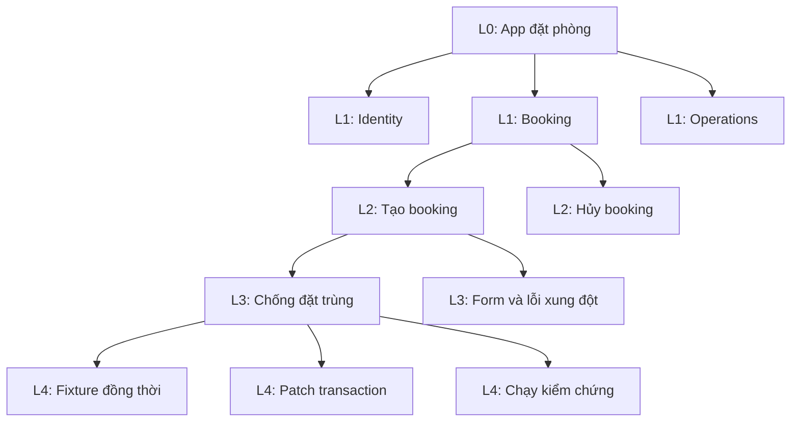
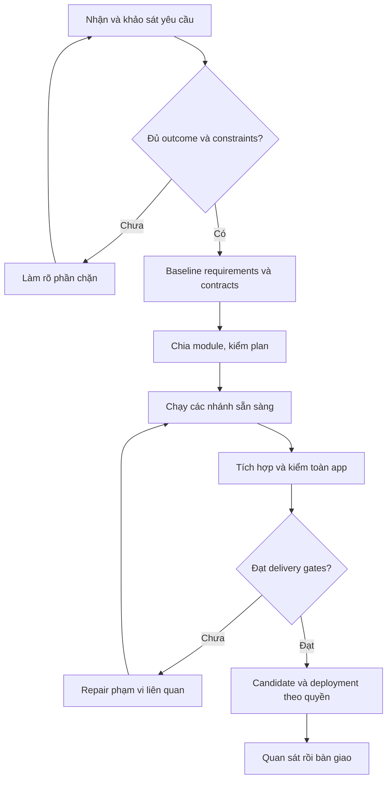
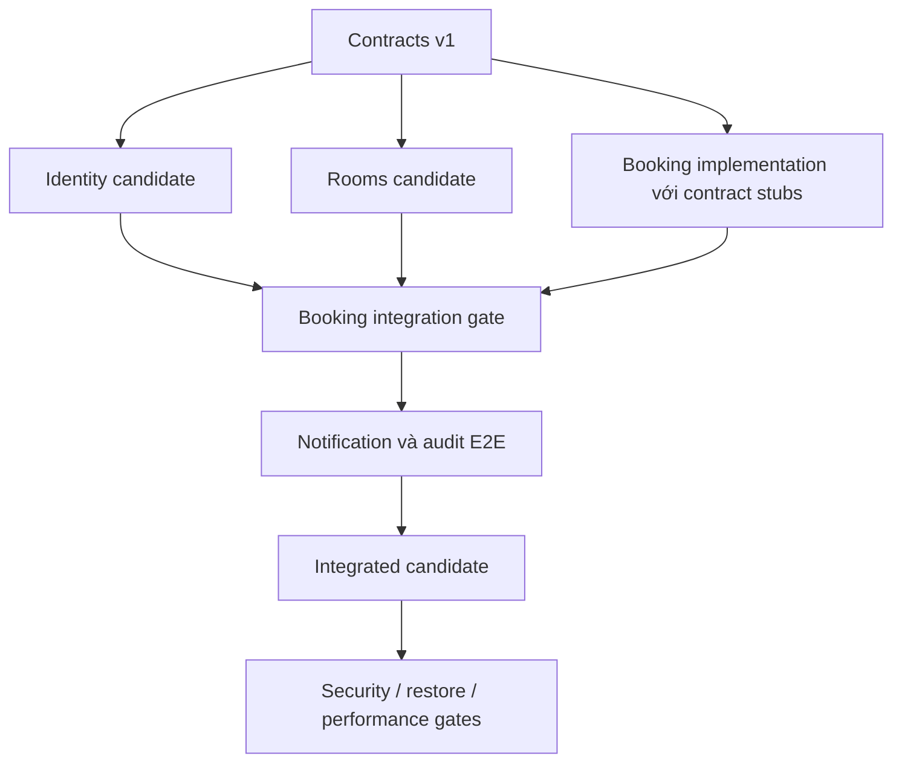
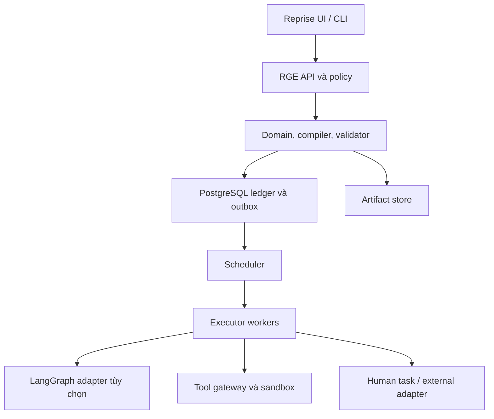

# REPRISE GRAPH ENGINE
## PRD v1.0 — Full cycle xử lý yêu cầu bằng graph phân cấp

**Ngày:** 12/09/2026. **Chủ sản phẩm đề xuất:** rhein. **Tên viết tắt:** RGE. **Tình trạng:** đặc tả để triển khai, chưa phải engine đã chạy. **Mức đích:** product-grade cho một owner/nhóm nhỏ, với thực thi có giới hạn và bằng chứng nghiệm thu.

> **Yêu cầu lớn được chia thành những hợp đồng nhỏ có thể hoàn thành, kiểm chứng và ghép lại.**
> Graph mẹ giữ lời hứa với người dùng. Graph con chịu trách nhiệm giao một phần lời hứa ấy.

- **Giải quyết:** nhận yêu cầu từ một bug đến cả một app, lập kế hoạch và thực thi qua nhiều phiên mà không mất state, không nhân vô hạn agent, không nhầm “các module chạy riêng” với “sản phẩm dùng được”.
- **Luồng đi:** intake → làm rõ → tiêu chí nghiệm thu → kiến trúc/contracts → chia graph → chạy các nhánh đủ điều kiện → nghiệm thu module → tích hợp → hardening → release candidate → triển khai nếu có quyền → quan sát → bàn giao.
- **Nội dung ra:** PRD đầy đủ, thuật toán phân rã, graph mẹ/cấp 1/cấp 2/cấp n, schema state và hợp đồng kết quả, ví dụ app đặt phòng, recovery/replan, API, backlog và release gates.

**Đọc nhanh:** §1–5 trả lời graph mẹ/con hoạt động ra sao; §6 là ví dụ app hoàn chỉnh; §7–14 là hợp đồng kỹ thuật; §15–17 là yêu cầu, chất lượng và vận hành; §18 là ticket; §19–21 là lịch triển khai, walkthrough và nguồn.

Mọi ngưỡng/quota/ước lượng dưới đây là **đề xuất thiết kế cần đo**, không phải benchmark hoặc tính năng đã được chứng minh. Không giả định có thể hoàn thành mọi ứng dụng chỉ vì người dùng viết “product-grade”.

## 1. Reprise có làm state của graph engine được không?

**Có, ở lớp ngữ cảnh công việc và bằng chứng; cần bổ sung một execution ledger có thẩm quyền.** Checkpoint của Reprise trả lời “đang làm gì, đã biết gì, nguồn nào còn đúng, bước tiếp theo là gì”. Graph engine còn phải trả lời “node nào được chạy, đang do ai giữ lease, phụ thuộc gì, đã gây effect nào, khi nào parent đủ điều kiện hoàn tất”.

| Cấu trúc giải thích | Quyết định |
|---|---|
| Tên gọi | Reprise Graph Engine: engine phân rã và thực thi công việc có trạng thái |
| Nguồn gốc | Phát triển từ checkpoint/evidence/receipt của Reprise và nhu cầu giao việc đủ rõ cho fresher hoặc executor |
| Lý do tồn tại | Một yêu cầu lớn vượt một context window, một phiên chạy và một người thực hiện; hoàn thành từng phần cần được tổng hợp thành kết quả kiểm được |
| Cơ chế | Graph specification bất biến theo version; scheduler chạy các node có đủ input/quyền/budget; child trả result envelope; validator và gates quyết định kết quả |
| Trade-off | Thêm contracts, storage, validation và vận hành; đổi lại có thể resume, quan sát, giới hạn và giải thích vì sao công việc chưa xong |
| Giới hạn | Engine không tự tạo quyền, hiểu đúng mọi yêu cầu, bảo đảm code không lỗi hoặc tự giải bài toán chưa có tiêu chí kiểm; gặp bất định phải khảo sát hoặc hỏi đúng chỗ |
| Vị trí hệ thống | Reprise là giao diện tiếp việc và projection; RGE là thẩm quyền điều phối; harness/runner thực thi; Git/CI/runtime là nguồn bằng chứng về code/build/deployment |

### 1.1. Tái sử dụng gì, bổ sung gì?

| Từ Reprise | Vai trò trong RGE | Bổ sung bắt buộc |
|---|---|---|
| Thread / intention | Ý định và liên kết request | Request version, outcome contract, delivery target |
| Checkpoint / source manifest | Context packet đầu vào có phiên bản | Execution checkpoint: scheduler frontier, pending approvals, child run IDs |
| Evidence / valid_for | Căn cứ về code, tests, nguồn | Evidence coverage theo requirement và exact integrated revision |
| Wait | Chờ CI/người dùng/hệ thống ngoài | Durable timer, dependency wait, join và cascade cancellation |
| Recipe / policy | Hành động đã cho phép | Capability grants ràng buộc node, path, effect, target và epoch |
| Receipt | Biên nhận tác vụ | Effect ledger, attempt identity, result acceptance, compensation link |
| Resume Pack | Tóm tắt cho owner quay lại | “Nhánh nào đang chặn app”, quyết định cần đưa ra và ngân sách còn lại |

**Không dùng một `messages[]` khổng lồ làm toàn bộ state.** Hội thoại là một loại dữ liệu nguồn. Execution state, requirements, contracts và effects là dữ liệu có schema, ownership và phiên bản riêng.

### 1.2. Một thẩm quyền cho mỗi loại state

RGE lưu execution state trong PostgreSQL. Reprise giữ local cache/projection qua API/event receipts; không ghi trực tiếp bảng scheduler hoặc gọi cùng một node song song bằng scheduler riêng. Khi RGE offline, Reprise cho viết note/proposal cục bộ nhưng không giả rằng execution đã đổi. Đồng bộ proposal phải dùng expected version và có conflict response.

Graph con đọc context được chiếu xuống, không nhận toàn bộ private state của cha. Child chỉ nộp đề xuất/kết quả; cha hoặc reducer server-side mới cập nhật state cha. Khái niệm này mở rộng các bất biến đã có trong [PRD Reprise](https://chatgpt.com/api/library/files/libfile_ee7ba61df7d8819183fedfdf7d83477c/download).

## 2. Phạm vi sản phẩm và người sử dụng

### 2.1. Người dùng và công việc cần làm

Owner/Tech Lead nhập outcome, constraints, repo/nguồn được phép và delivery target. Fresher hoặc AI executor nhận work package có input/output/steps/AC. Reviewer kiểm artifact và evidence. Operator xử lý incident của engine. Một người có thể kiêm vai trò, nhưng actor và thao tác vẫn được ghi nhận riêng.

| Job | Kết quả cần giao |
|---|---|
| “Sửa bug API đang trả sai” | Reproduction → root-cause hypothesis → patch → regression proof → handoff |
| “Thêm chức năng đặt phòng” | Contract change → module work → integration proof → release candidate |
| “Làm cả app product-grade” | Requirement baseline → module graph → vertical slices → candidate được nghiệm thu xuyên hệ thống |
| “Phân tích rồi viết PRD, chưa code” | Graph kết thúc ở tài liệu đã review, không mở runner vì đoán người dùng muốn app |
| “Tiếp việc từ hôm qua” | Resume đúng run/version, chỉ chạy phần chưa đạt hoặc bị invalidation |

### 2.2. Release của engine khác release của app được tạo

| Engine release | Scope |
|---|---|
| E0 nội bộ | Graph IR, dry-run, decomposition và mock executor; dùng fixture, không cấp production credentials |
| E1 product-grade core | Phân cấp đến giới hạn, scheduler durable, thực thi sandbox, contracts/gates, Git integration queue, manual approval, export release candidate; staging deploy adapter được allowlist |
| E2 mở rộng | Production deployment adapters có reconciliation/rollback đã kiểm, nhiều worker hosts, identity doanh nghiệp và quotas phức tạp hơn |
| P2 | Marketplace templates, visual graph editor đầy đủ, đa tenant SaaS, tự tối ưu planner theo dữ liệu dài hạn |

E1 mô hình hóa **toàn bộ full cycle**, bao gồm release/observe, nhưng delivery target có thể là `release_candidate`, `staging_verified` hoặc `production_verified`. Target production trong E1 đi qua manual deployment handoff + import bằng chứng; chỉ gọi thành công khi đủ evidence. Không có adapter live thì trạng thái là chờ thao tác ngoài, không fake deploy.

Ngoài scope: quyền vô hạn từ prompt; tự provision tài khoản trả phí; tự gửi người ngoài; agent sửa policy của chính nó; chạy code chưa tin trực tiếp trên host; dùng graph node như ranh giới bảo mật; tự suy ra quyền production từ quyền sửa repo.

## 3. Ba cấu trúc khác nhau, đừng vẽ chung thành một búi

### 3.1. Cây chứa công việc — containment tree

Mỗi graph instance có đúng một parent, trừ root. Cây trả lời **“ai sở hữu và chịu trách nhiệm tổng hợp việc này?”**. Các node cùng cha có thể chạy song song hoặc tuần tự tùy dependency. Kết quả shared module được nhiều consumer tham chiếu; graph shared module vẫn chỉ có một owner, không copy instance cho mọi consumer.

### 3.2. Đồ thị phụ thuộc — dependency DAG

Cạnh trả lời **“cần artifact/contract/mốc nào trước khi được chạy?”**. DAG được kiểm trên các milestone có địa chỉ đầy đủ, kể cả cạnh xuyên subgraph. Tree không có cycle chưa đủ: hai sibling có thể chờ output cuối của nhau và deadlock.

### 3.3. Luồng thực thi — workflow state machine

Đây là luồng plan → execute → verify → repair. Nó có thể có vòng lặp có giới hạn. `retry`, `repair`, `replan` là ba việc khác nhau, không nhét vòng lặp vô hạn vào dependency DAG. Compiler mở mỗi vòng repair thành iteration có ID và budget; dependency của work items trong một plan version phải acyclic.

| Khái niệm | Định nghĩa | Không được suy ra |
|---|---|---|
| Graph specification | Mẫu/plan bất biến, input/output schema, nodes, edges, policies | Có specification không nghĩa đã chạy |
| Graph run | Một lần thực hiện một version với input cụ thể | Không đồng nhất với graph template |
| Node | Một đơn vị orchestration: action, gate, wait hoặc child reference | Không phải node nào cũng cần LLM |
| Subgraph | Một graph được gọi như một node có hợp đồng | Không mặc định là agent mới hoặc service mới |
| Agent | Executor dùng model để suy luận/chọn hành động trong scope | Không sở hữu policy, kết quả cần kiểm |
| Module sản phẩm | Năng lực nghiệp vụ hoặc nền tảng có owner/contracts | Không tự trở thành microservice hay container riêng |
| Worker | Process nhận lease rồi chạy executor | Có thể chạy nhiều node nối tiếp |
| Artifact | Code patch, schema, test report, tài liệu hoặc binary có hash | Text “đã test” không phải test artifact |

## 4. Graph mẹ → cấp 1 → cấp 2 → cấp n

### 4.1. Cấp là độ sâu chứa việc, không phải số lượng prompt

| Cấp | Trách nhiệm điển hình | Input | Output bắt buộc | Điều không nên làm |
|---|---|---|---|---|
| L0 — Product/request root | Giữ outcome, scope, budgets, delivery target và gates toàn app | Yêu cầu người dùng, constraints, hiện trạng | Accepted delivery hoặc lý do chưa giao được | Đọc mọi log chi tiết hay trực tiếp sửa mọi file |
| L1 — Domain/platform module | Sở hữu capability lớn và public contracts | Scope module, ADR, contracts upstream | Module candidate + contract conformance + evidence | Tự đổi API liên module mà không version/change request |
| L2 — Capability / vertical slice | Giao một hành vi xuyên UI/API/data đủ nhỏ để demo | Use case, acceptance, module constraints | Slice chạy được, tests và traceability | Chia chỉ theo FE/BE rồi để integration “tính sau” |
| L3 — Work package | Một thay đổi có phạm vi và cách kiểm rõ | Exact baseline, file scope, schema/test fixture | Patch/artifact + test receipt + unknowns | Tự mở rộng thành cả module khi gặp thiếu input |
| Ln — Leaf action | Hành động nguyên tử theo contract và runtime boundary | Typed command/tool input, capability | Typed result/effect receipt | Tiếp tục đẻ graph dù một function đã đủ |

Tên cấp chỉ là mẫu thường gặp. Bug nhỏ có L0 → leaf. Capability phức tạp có L0 → L1 → L2 → L3 → L4; không ép mọi nhánh có cùng độ sâu. Các pha inspect/implement/verify có thể là node trong cùng work graph, không cần biến mỗi pha thành thêm một cấp chứa.



Đây chỉ là một nhánh đại diện của containment tree. Cạnh trong hình là “chứa việc”, **không phải thứ tự chạy**; fixture/patch/verify có dependency riêng.

### 4.2. Root full cycle



Không block toàn app để hỏi một chi tiết trang trí có thể ghi assumption. Câu hỏi về dữ liệu nhạy cảm, auth, multi-tenant, payment, delivery target hoặc quyền tác động có thể làm đổi kiến trúc thì phải xử lý trước nhánh phụ thuộc. Các nhánh độc lập vẫn tiến hành khi được phép.

### 4.3. Graph module chuẩn

Mỗi module theo template: validate input contracts → khảo sát local context → phân rã nội bộ nếu cần → implement các slices → module tests/contract tests → publish module candidate → parent validation. Module bị lỗi không tự xóa kết quả tốt của siblings. Module thành công nghĩa đạt **module contract**, chưa chứng minh toàn app thành công.

### 4.4. Điều kiện dừng chia: leaf đủ tốt

Một leaf chỉ hợp lệ khi có đủ: một outcome; input refs có phiên bản; output schema; phạm vi ghi; allowed actions; estimate/quota; một phép kiểm quan sát được; error/fallback path. Hướng dẫn “code backend cho tốt” không phải leaf. “Thêm constraint chống khoảng giờ chồng nhau, fixture hai requests đồng thời, trả 409 theo contract v1” có thể là một work package; actual DB design phải được TL chốt.

Leaf không cần nhỏ đến mức “viết một dòng import”. Chia quá nhỏ làm tăng latency, coordination, context handoff và chi phí kiểm chứng. Nếu overhead orchestrating dự kiến vượt 30% effort và không tạo ranh giới kiểm/khôi phục hữu ích, gộp lại.

## 5. Thuật toán chia graph khi yêu cầu quá lớn

### 5.1. Decompose theo outcome và ownership

1. Trích required outcomes, actors, dữ liệu, business invariants, non-goals, delivery target và NFR. Mỗi requirement có ID và acceptance.
2. Khảo sát repo/nguồn đã cho phép. Ghi cái đã tồn tại, cái chưa biết và phần cần spike; không mặc định greenfield.
3. Gom use cases theo dữ liệu/invariant/owner thay vì theo số file. Tách capabilities shared có nhiều consumer và cross-cutting gates.
4. Đề xuất module contracts: API/schema/events/error semantics, ownership, versioning, consumer tests, migration boundaries.
5. Vẽ milestone dependency DAG. Tách “contract ready” khỏi “implementation accepted” để FE/BE hoặc modules có thể bắt đầu từ contract ổn định.
6. Chia mỗi module thành vertical slices nghiệm thu được. Sau đó mới tách work packages và leaf actions.
7. Kiểm coverage không thiếu/trùng ownership, DAG không cycle, schema tương thích, quyền/budget nằm trong giới hạn, mọi node có đường kết thúc.
8. Dry-run: giải thích wave nào chạy, wave nào chờ và chỗ nào cần người quyết định. Commit plan version bằng CAS rồi mới schedule.

Planner dùng LLM được, nhưng graph proposal là **dữ liệu chưa được tin**. Compiler/policy/validator deterministic quyết định được nhận hay không. Không execute Python/JavaScript do planner đưa trong graph JSON.

### 5.2. Khi nào bắt buộc chia hoặc khảo sát thêm?

| Dấu hiệu | Quyết định |
|---|---|
| Nhiều outcome không có chung một acceptance | Chia theo outcome |
| Có các owner/invariant/data lifecycle khác nhau | Tách module hoặc contract boundary |
| Node vượt 2 giờ runtime hoặc 8 model calls theo estimate mặc định | Chia work packages; số lần thực vẫn bị quota chặn |
| Context tối thiểu cần thiết vượt min(32k tokens, 40% usable context của model) | Tách theo source/contract; dùng artifact refs, không cắt mất yêu cầu âm thầm |
| Hơn 20 children trực tiếp trong một graph | Gom theo trách nhiệm; mục tiêu thường 5–12, không gom chỉ để đủ số |
| Một nhánh có quyền production hoặc secret khác | Tách gate và executor boundary trước effect |
| Không biết thiết kế nào có thể test đúng | Tạo bounded spike, chưa sinh implementation graph giả cụ thể |
| Hai modules đổi cùng invariant/transaction liên tục | Xem xét gộp ownership; không bọc cycle bằng thêm một coordinator vô nghĩa |
| Chỉ là hai function chung một input/output và cùng recovery boundary | Giữ trong một leaf hoặc module code |

Hard limits E1: root depth = 0, tối đa depth 6; tối đa 20 children trực tiếp; tối đa 2.000 node instances đã tạo/root qua mọi plan versions, gồm nodes bị superseded; tối đa 3 automatic repair rounds/work package và 2 automatic replans/root. Hết giới hạn → `blocked` với lý do và phương án giảm scope/chia campaign. Không tự reset root ID để lách ngân sách.

Depth là cấp cây. Workflow transitions, model calls, runtime attempts và total node count có quota riêng. Tăng recursion limit của framework không giải quyết decomposition kém. Planner expansion tối đa 10 phút/job, 4 model calls/job; root đếm mọi call thực kể cả repair/validator. Estimate vượt cap tạo split/spike proposal; không tự tăng giới hạn trong prompt.

### 5.3. Chống cycle xuyên module

Ví dụ Booking cần User identity còn Identity dashboard muốn thống kê Booking. Nếu hai graph đều chờ output cuối của nhau thì cycle. Cách xử lý: Identity publish `Principal` contract và verify-token capability trước; Booking dùng contract đó; dashboard statistics là capability phía sau consumer, hoặc module Reporting đọc event/API booking. Nếu invariant thực sự cần một transaction chung thì cân nhắc gộp module/data owner.

Compiler resolve toàn bộ milestone refs thành DAG trước dispatch. Khi cycle tồn tại, trả đường cycle cụ thể như `booking.accepted → identity.dashboard → booking.accepted`; không chỉ trả “graph invalid”. Dynamic expansion phải kiểm cycle đối với toàn plan, không chỉ subgraph mới.

### 5.4. Pseudocode thiết kế

```text
decompose(scope, parent_contract, limits):
    if missing_blocking_information(scope):
        return bounded_spike_or_question(scope)
    if satisfies_leaf_contract(scope) and fits_limits(scope):
        return leaf_spec(scope)
    if limits.depth_remaining == 0:
        return blocked("depth_limit", suggested_scope_reduction)
    proposal = planner.propose_outcome_partitions(scope, contracts_only_context)
    validate_coverage_ownership_and_scopes(proposal)
    children = map(decompose, proposal.children, narrowed_limits)
    graph = compose(children, typed_dependencies, acceptance_gates)
    validate_global_DAG_budget_and_terminal_paths(graph)
    return graph
```

Đây là logic thiết kế, không phải code chạy sẵn. Implementation expansion dùng durable jobs/transactions, không đệ quy bằng Python call stack giữ một process hàng giờ. Giới hạn root được kiểm trong DB mỗi lần thêm child; hai planners song song không được cùng tiêu phần quota cuối.

## 6. Worked example: “Làm app đặt phòng họp product-grade”

### 6.1. Request baseline của ví dụ

Đây là fixture sản phẩm giả định, không phải một hệ thống nội bộ đã được khảo sát. Chọn web app một tổ chức, 3 roles member/room-admin/admin; danh mục phòng, lịch theo timezone, đặt/hủy phòng, chống đặt trùng, audit, thông báo trong app và quản trị. Delivery target minh họa: `staging_verified`. Email, Microsoft 365 calendar sync, recurring bookings và đa tổ chức nằm ngoài scope v1. Owner có thể đổi các giả định bằng change request.

| Requirement của app mẫu | Acceptance |
|---|---|
| APP-01 Auth/RBAC | Member không sửa phòng; room-admin chỉ quản lý phòng thuộc phạm vi được cấp |
| APP-02 Room catalog | Room active/capacity/timezone có validation; phòng archived không nhận booking mới |
| APP-03 Availability | Kết quả theo khoảng thời gian, timezone và quyền; UI thống nhất API |
| APP-04 Create booking | Hai requests tranh cùng phòng/khung giờ: tối đa một confirmed, request kia nhận conflict |
| APP-05 Cancel | Chủ booking hoặc role có quyền được hủy; retry không tạo audit/notification trùng |
| APP-06 In-app notifications | Booking/cancel sinh thông báo đúng người và không lặp khi redelivery |
| APP-07 Audit | Có actor/time/action/target và phân quyền đọc, không log session secret |
| APP-08 Accessibility/UX | Keyboard hoàn thành đặt/hủy; pending/empty/error/conflict rõ |
| APP-09 Reliability | Restore DB có rehearsal; migrations có compatibility/rollback plan |
| APP-10 Performance | Giả định mục tiêu p95 create ≤1 giây ở tải 50 requests/giây trong staging reference; cần benchmark xác nhận |
| APP-11 Security | Auth bypass, IDOR, CSRF và injection matrix đạt yêu cầu trước staging nghiệm thu |
| APP-12 Delivery | Cài staging sạch, healthcheck, smoke, quan sát tối thiểu 30 phút trong fixture nghiệm thu; production cần kế hoạch vận hành riêng |

### 6.2. Graph cấp 1: phân theo trách nhiệm lớn

| ID module | Sở hữu | Input contracts | Output/milestones | Graph con cấp 2 |
|---|---|---|---|---|
| MOD-FND Foundation | Repo conventions, shared types, configuration, test harness | Requirement baseline và ADR | `contracts.v1`, `harness.ready` | App shell, API errors, time model, migration convention |
| MOD-ID Identity | Principal, session, role checks | Identity ADR, API error v1 | `principal.v1`, `identity.accepted` | Sign-in, authorization, session expiry |
| MOD-RM Rooms | Room data lifecycle và catalog | Principal v1, room schema | `rooms.v1`, `rooms.accepted` | List/detail, admin create/edit/archive |
| MOD-BK Booking | Reservation invariant và lifecycle | Principal/rooms/time contracts | `booking.v1`, `booking.accepted` | Availability, create, cancel |
| MOD-NT Notifications | In-app inbox và delivery dedup | Booking event v1, principal v1 | `notifications.accepted` | Event consumer, read/unread, dedup |
| MOD-AU Audit | Audit schema/store/read policy | Actor/action envelope v1 | `audit.accepted` | Append-only record, filtered viewer, redaction |
| MOD-OPS Operations | Packaging, config/secrets, migration execution, health/restore | Build/runtime contracts | `runtime.ready`, `ops.accepted` | Staging deploy, backup/restore, observability |
| MOD-INT Integration & quality | Cross-module user journeys và final acceptance | Module candidates và baseline | `candidate.accepted` | Merge/test queue, E2E/security/performance, release dossier |

Các module là ranh giới logic trong app mẫu, có thể cùng một modular monolith. App shell/design tokens ở Foundation; các slices UI nằm cùng capability nghiệp vụ để có ownership từ UI đến invariant. MOD-INT không viết lại business logic của tất cả module; defect được trả về owner và phối hợp khi chạm nhiều contracts.

### 6.3. Dependency milestones và waves

| Wave | Công việc có thể chạy | Điều kiện |
|---|---|---|
| W0 | Foundation contracts, identity/data ADR, deploy skeleton | Baseline requirements đã chốt |
| W1 | Identity, Rooms và mocks/stubs cho Booking; Audit schema; Ops packaging | Contract milestones cần thiết đã frozen; stub phải có nhãn |
| W2 | Booking create/cancel/availability; Notifications consumer; Audit integration | Schema/signatures ổn định; tests kết nối thật chạy khi implementations ready |
| W3 | Integration candidate, cross-module E2E, restore/performance/security | Required module candidates đã accepted |
| W4 | Staging deployment, smoke/observe, handoff | Candidate hash + release gates + quyền deploy đúng target |

Consumer có thể code bằng contract stub khi provider chưa xong, nhưng không thể pass integration gate chỉ bằng stub. Contract dependency và implementation dependency là hai edge types khác nhau.



### 6.4. Đi sâu nhánh Booking

| Graph path | Outcome | Phạm vi | Bằng chứng giao lên |
|---|---|---|---|
| root/booking | Lifecycle booking đúng các invariants | Booking module | Candidate + contract tests + coverage APP-03/04/05 |
| root/booking/create | User tạo một booking có kiểm quyền/xung đột | UI/API/storage của create | E2E happy/conflict/denied |
| root/booking/create/concurrency | Không double booking khi requests đồng thời | DB transaction/constraint và mapping conflict | Concurrent test report + migration/schema hash |
| root/booking/create/concurrency/reproduce | Có test đỏ tái hiện race trong baseline | Fixture/test files đã cho phép | Failing test, command, environment digest |
| root/booking/create/concurrency/patch | Sửa invariant ở tầng có thẩm quyền | Storage + service error mapping | Patch hash, diff scope, migration notes |
| root/booking/create/concurrency/verify | Test cùng fixture chuyển xanh và không regression | Test runner read-only source snapshot | Verified receipt cho candidate SHA |

L4 ở đây là leaf actions. Không cần thêm L5 “agent test”, L6 “agent đọc kết quả” nếu validator deterministic xử lý được. Chuỗi reproduce → patch → verify là execution order của work package này.

### 6.5. Hợp đồng graph con minh họa

```json
{
  "schema_version": "rge.child.v1",
  "graph_key": "booking.create.concurrency",
  "objective": "Không có hai confirmed bookings chồng thời gian trên cùng room.",
  "requirement_ids": ["APP-04"],
  "inputs": {
    "baseline_ref": "artifact:baseline-example",
    "contract_refs": ["booking-api@1", "time-model@1"],
    "fixture_ref": "artifact:concurrent-booking-fixture"
  },
  "output_schema_ref": "module-result@1",
  "allowed_path_refs": ["scope:booking-storage", "scope:booking-tests"],
  "required_gates": ["scope-check", "concurrency-test", "module-regression"],
  "limits": {"max_runtime_seconds": 7200, "max_model_calls": 8, "max_repair_rounds": 3},
  "on_blocked": "escalate_to_parent",
  "on_failure": "bounded_repair"
}
```

Các refs có hậu tố example và scope names là fixture ký hiệu. Runtime phải resolve thành IDs/hash/permissions thật; manifest trên không tự cấp quyền ghi source.

### 6.6. Khi nào graph mẹ thật sự xong?

Không dùng công thức `mọi agent nói done → app done`. Root chỉ accepted khi requirements baseline được cover, required module results hợp lệ, candidate đã tích hợp, mọi gate bắt buộc pass trên đúng candidate/environment và delivery target đạt. Một app có 8/8 module pass nhưng auth không hoạt động qua reverse proxy vẫn fail APP-12/integration gate.

Nếu UI đòi release candidate mà không deploy, output hợp lệ là bundle/source/manifest/tests/runbook được nghiệm thu; status là `completed` với `delivery_level=release_candidate`, không ghi `deployed`. Đặt tên đúng thành quả giúp tránh một dashboard xanh nhưng server vẫn nằm trên giấy.

## 7. State contracts và quyền sở hữu dữ liệu

### 7.1. Bốn lớp state

| Lớp | Ví dụ | Writer có thẩm quyền |
|---|---|---|
| Domain state | Requirements, constraints, decisions, contract versions | Intake/plan service theo owner authorization |
| Execution state | Run/node state, lease, attempt, frontier, join, plan epoch | Scheduler/transactional transition service |
| Evidence state | Artifacts, source versions, validity, test receipts | Artifact service và validators có provenance |
| Working context | Prompt messages, scratch notes, selected excerpts | Executor trong namespace riêng, không tự sửa các lớp trên |

Input xuống dưới được pin theo manifest. Cha truyền mục tiêu, contract, scope, budget allocation, source refs và unknowns liên quan. Không truyền toàn bộ transcript, mọi secret hoặc quyền cha. Child dùng read projection có giới hạn và yêu cầu thêm nguồn bằng typed request khi cần.

### 7.2. State mẫu và result envelope

```json
{
  "schema_version": "rge.run.v1",
  "run_id": "run-example",
  "root_run_id": "root-example",
  "parent_run_id": "parent-example",
  "graph_spec_ref": "spec:booking-create@3",
  "plan_version": 3,
  "requirement_baseline_ref": "requirements@2",
  "input_manifest_ref": "manifest:example",
  "lifecycle": "waiting_children",
  "control_epoch": 12,
  "revision": 41,
  "child_run_ids": ["child-a", "child-b"],
  "required_gate_ids": ["gate-concurrency"],
  "budget_allocation_ref": "budget:booking-create",
  "checkpoint_ref": "checkpoint:41",
  "unresolved_decision_ids": []
}
```

```json
{
  "schema_version": "rge.result.v1",
  "run_id": "child-a",
  "attempt_id": "attempt-example",
  "generation": 2,
  "plan_version": 3,
  "input_manifest_ref": "manifest:example",
  "outcome": "succeeded",
  "artifact_refs": ["artifact:patch-example", "artifact:test-report-example"],
  "evidence_refs": ["evidence:concurrency-example"],
  "contract_versions": {"booking-api": 1},
  "valid_for": {"candidate_ref": "candidate:example", "environment_ref": "env:example"},
  "unknowns": [],
  "proposed_parent_updates": {"completed_requirement_ids": ["APP-04"]},
  "effect_receipt_refs": ["effect:test-run-example"]
}
```

`outcome=succeeded` chỉ là claim của executor đến khi validator accepted. `completed_requirement_ids` là đề xuất; coverage reducer kiểm evidence và gate ownership trước ghi. Production IDs dùng UUID; timestamps API RFC 3339 UTC; hashes là SHA-256 của canonical content hoặc Git object ID ghi rõ thuật toán, không tráo hai loại.

### 7.3. Merge/reducer rules

| Trường | Luật cập nhật |
|---|---|
| Artifact/evidence refs | Set union theo stable ID; cùng ID khác hash là conflict |
| Child outcomes | Map theo child_run_id + generation + accepted plan version; reject stale result |
| Requirements/contract versions | CAS và explicit change request; không last-write-wins từ model |
| Budget/cost | Ledger transaction, dedup charge IDs; không cộng chi phí từ lời executor |
| Progress | Tính lại từ accepted milestones/requirements, không tăng theo số messages hoặc số children sinh thêm |
| Hypotheses/unknowns | Append có nguồn; resolve cần evidence/decision ID |
| Secrets/policy | Không nằm trong reducer payload của executor |

Reducer với kết quả song song cần deterministic và idempotent; set/map có khóa phù hợp hơn append list không dedup. Những trường không có phép merge an toàn phải single-writer/CAS, không cố thiết kế một reducer “gộp mọi thứ”.

## 8. Graph IR, compiler và scheduling semantics

### 8.1. Node và edge catalog

Node types E1: `action`, `subgraph`, `gate`, `wait`, `decision`, `integration`. `action` trỏ executor catalog + schema; `subgraph` trỏ graph spec version; `decision` trả typed route từ allowlist; node mới phải đăng ký adapter server-side. Model không được đưa function body vào IR.

Edge types: `requires_contract`, `requires_artifact`, `requires_acceptance`, `after_effect`, `on_decision`. Mọi edge ghi target milestone/schema/version predicate. `on_decision` có các branches đóng và default error route. Optional branches phải được mark `not_applicable` bằng decision receipt để join biết branch đã được xử lý, không treo mãi.

Child membership được freeze theo plan version trước join. Dynamic children qua expansion transaction tạo version mới và barrier riêng; parent không được completed trong lúc expansion đang pending. Một required node skipped/cancelled không được tính như passed. Optional skip cần policy + reason + không làm mất coverage bắt buộc.

### 8.2. Compiler kiểm gì?

Unique IDs; parent/depth/count; refs tồn tại và quyền đọc; schemas tương thích; all required requirements có owner/gate; terminal paths; global milestone DAG; duplicate writable ownership; permitted action catalog; narrowed grants; quotas; unsupported runtime; effect handling và join completeness. Structural success không chứng minh plan giải đúng bài toán, vì vậy TL/owner cần review semantic outcome/architecture ở baseline.

`dry-run` không có external effect. Nó trả proposed waves, critical blockers, projected resource/budget upper bounds, permissions cần thêm và scope chưa cover. Nếu cost không có giá đã pin thì estimate ghi unknown và paid admission bị chặn.

### 8.3. State machine của run và attempt

Run lifecycle: `draft → planned → ready → running`; từ running có thể `waiting_children`, `waiting_external`, `waiting_human`, `blocked`, `verifying`; từ verifying có thể `completed`, `failed` hoặc repair generation mới. Terminal: `completed`, `failed`, `cancelled`, `superseded`. Một run đã completed không bị sửa thành failed khi input mới xuất hiện: tạo run/version mới và đánh evidence cũ không phù hợp với target mới.

Control state riêng: `active`, `pause_requested`, `paused`, `cancel_requested`. Stop request khác việc workload đã dừng. `paused` chỉ khi không còn effect đang được phép tiếp tục; operator thấy còn gì phải reconcile. `cancellation_incomplete` là blocker/diagnostic khi không xác nhận được workload ngoài đã dừng.

Attempt state: `queued`, `leased`, `running`, `succeeded`, `failed`, `cancelled`, `unknown`. Unknown dùng khi effect có thể đã xảy ra mà receipt chưa có; không tự coi failed rồi retry. Kết quả accepted và run completed là hai bước khác nhau.

### 8.4. Scheduler durable, có fan-out và join

Scheduler chọn ready nodes bằng transactions/row locks, cấp lease 60 giây, heartbeat 15 giây, generation tăng khi reclaim. Reaper chạy mỗi 15 giây; thời gian lấy từ DB. Không giữ transaction trong model/tool call. Ready nghĩa: dependencies đạt theo plan version; input manifests resolve; grants còn hiệu lực; budgets/resource slots có thể reserve; chưa pause/cancel; executor capability available.

Parent đang `waiting_children` không giữ worker slot. Scheduler thực thi children như jobs độc lập; không giữ một Python stack treo chờ tất cả. Join dùng durable child result registry + membership version; CAS bảo đảm chỉ một join completion/publish cho cùng intent.

Default single-host E1: tối đa 2 roots active, 4 leaf workloads toàn host và tối đa 2 leaf/root; model concurrency tối đa 2 toàn host; sandbox concurrency tối đa 2, nằm trong tổng 4 leaf. Planner jobs tiêu slot riêng tối đa 1. Fair scheduling theo root với aging 5 phút; giới hạn này là đề xuất, cần load test.

Khi runtime slots/budget không đủ, node chờ với reason code; không fail business outcome. Fan-out thêm child phải reserve count/budget trước; không tạo 1.000 pending model calls rồi mới kiểm cap.

PostgreSQL `SKIP LOCKED` phù hợp để giảm tranh chấp khi consumers lấy hàng từ queue; nó không thay cho dependency validation, fencing và reconciliation của RGE. [PostgreSQL SELECT](https://www.postgresql.org/docs/current/sql-select.html)

### 8.5. Spawn và join không giữ một call stack xuyên cả cây

Pseudocode dưới mô tả transaction boundaries, không phải thư viện đã tồn tại:

```text
spawn_children(parent_run_id, expected_plan, child_specs):
    BEGIN
    lock root quota rows, then parent run
    verify current plan, control epochs, scopes, count and allocation limits
    create child runs + frozen membership + dispatch outbox, idempotently
    set parent.lifecycle = waiting_children
    append run event and COMMIT
    return child_run_ids  // worker cha nhả slot ngay

accept_child_result(envelope):
    validate schema, provenance, input binding, generation, scopes
    BEGIN
    lock child result slot + parent barrier
    insert accepted result once; update requirement contribution
    if all required members accepted and branch decisions resolved:
        enqueue parent verification once for this barrier version
    append result event and COMMIT
    // parent verification kiểm gates; join không tự đặt root completed
```

Trong code thật, validation cần dữ liệu mutable phải recheck trong transaction publish; phần kiểm artifact nặng làm ngoài transaction trên hashes bất biến. Lock order cố định: root quota → ancestor control/budget → run/barrier → attempt/effect; transaction helper enforce cùng thứ tự để giảm deadlock. Với unique conflict thì đọc kết quả đã commit và trả replay, không chạy thêm work.

Event notification có thể mất hoặc tới trễ; scheduler scan ledger/frontier định kỳ vẫn tìm ra việc cần tiếp tục. Durable joins không phụ thuộc một process còn đang `await` children. Đây là cơ chế dùng chung cho L0, L1, L2 và Ln; khác biệt nằm ở hợp đồng/scope, không cần viết scheduler riêng cho từng cấp.

## 9. Full cycle triển khai app và phối hợp nhiều người/agent

### 9.1. Executor contract

Một node có thể giao cho deterministic function, model, sandbox tool runner, human task hoặc adapter CI. Mọi executor nhận NodeInput và trả NodeResult cùng effect receipts. Human task có cùng requirement/AC/artifact contract; không cần fresher viết theo internal graph protocol, UI/CLI tạo envelope từ form và file họ nộp.

Agent được chọn theo capability/cost/availability, không hardcode “mỗi module một model đắt nhất”. Planner không tự nhận quyền reviewer độc lập; verifier chạy tests/schema/scope checks deterministic. Với acceptance cần judgement, human review được ghi rõ, không dùng hai lời model đồng ý như bằng chứng độc lập.

### 9.2. Phạm vi Git và tránh va chạm ghi file

Mỗi work package pin baseline commit và có `write_set` là path scope đã duyệt. Workload sửa bản clone/export riêng; không sửa checkout đang dùng của owner. Worktree là tiện ích tách checkout, không sandbox bảo mật; runner vẫn cần boundary riêng. [Git worktree](https://git-scm.com/docs/git-worktree)

Paths canonical hóa, kiểm symlink/submodule, forbidden paths và file mode. Hai tasks có write scopes giao nhau thì serialize hoặc TL tách contract rõ. Root lockfile, migration numbering, shared schema và public API definition có dedicated owner/integration lock; không “cứ merge rồi giải quyết”.

### 9.3. Integration queue

1. Child submit patch/artifacts + baseline + expected contract versions, không tự push vào main.
2. Validator kiểm scope, provenance, tests và policy. Candidate được đưa vào queue theo dependency order.
3. Integrator áp patch vào integration branch/snapshot riêng. Nếu baseline khác hiện tại, rebase/cherry-pick trong vùng được phép và kiểm lại; conflict tạo repair task có owner.
4. Sinh **integrated candidate hash mới**, chạy contract/regression/E2E tương ứng. Test pass của branch con không được tái gắn như test pass của candidate mới.
5. Candidate đạt mới advance integration head bằng CAS. Required gates toàn app chạy trên candidate này, build ra immutable release bundle.

Owner có thể cho phép update branch làm việc cụ thể; merge protected branch hoặc push repo ngoài là effect có target/scope riêng. Không có Git hosting adapter thì export patch/bundle và hướng dẫn apply; outcome report phản ánh đúng khả năng.

### 9.4. Các cổng chất lượng của app được tạo

| Gate | Từ đầu đã được lập kế hoạch | Bằng chứng trên candidate cuối |
|---|---|---|
| PG-01 Functional coverage | Map use case → acceptance → test owner | Required requirements pass, unknowns không bị giấu |
| PG-02 Data/invariants | Schema, transaction, migration strategy | Concurrency, data validation, migration/restore tests |
| PG-03 Security/privacy | Auth, trust boundaries, secrets, data scope | Threat cases, dependency review, permission matrix |
| PG-04 Cross-module UX | User journeys và error states | E2E/keyboard/manual UX review; không chỉ screenshot |
| PG-05 Performance/capacity | Load profile, dataset, latency/resource targets | Benchmark kết quả đầy đủ và supported envelope |
| PG-06 Operability | Logs/metrics, health, runbook, backup, update | Cài sạch, incident drill, restore rehearsal |
| PG-07 Delivery | Artifact/config/env/approval contract | Candidate digest, deploy receipt, health/smoke/observe phù hợp target |

Các gate có owner ngay từ plan đầu; không đợi “code xong rồi thêm product-grade”. Với app nhỏ, số graph giảm nhưng requirements/gates liên quan vẫn phải được xử lý hoặc đánh not-applicable có căn cứ.

## 10. Retry, repair, replan và yêu cầu đổi giữa chừng

| Tình huống | Cơ chế | Phạm vi chạy lại |
|---|---|---|
| Network timeout trước effect xác định | Retry cùng intent, attempt mới có giới hạn | Node đó |
| Tool có thể đã deploy nhưng mất response | Reconcile effect ledger với target | Không retry trước khi biết outcome |
| Test fail do code sai | Repair iteration với input gồm failure evidence | Work package và downstream bị ảnh hưởng |
| Contract sai / requirement thiếu | Change request + replan version mới | Impact closure theo contracts, artifacts và requirement refs |
| User đổi cả delivery target/scope | Rebaseline + graph diff + budget/permission review | Nhánh mới hoặc invalidated; reuse phần chứng minh được |
| Người dùng chỉ sửa cách diễn đạt report | Draft version mới | Không chạy lại build/test nếu inputs kỹ thuật không đổi |

### 10.1. Quy trình replan không phá run đang chạy

1. Lưu request revision và plan diff proposal; chỉ ra requirements thêm/bỏ/đổi, nodes thêm/giữ/supersede và ảnh hưởng cost/gates.
2. Tính transitive impact closure từ contract/input/requirement đã đổi. Nếu thiếu lineage, chọn invalidation bảo thủ; không giả mọi thứ còn dùng được.
3. Chặn admission nhánh impacted; tăng control epoch cần thiết; cancel/reconcile effects đang chạy trong nhánh đó. Nhánh độc lập có thể tiếp tục.
4. Validate global DAG/coverage/grants/quota cho plan mới. Với thay đổi nằm trong delegation đã có thì commit không hỏi lại; thay đổi vượt quyền/budget/required outcome cần decision của owner.
5. CAS active plan pointer. Kết quả đời cũ được lưu lịch sử, không publish vào plan mới trừ khi reuse validator chứng minh exact inputs/contracts/gates còn phù hợp.
6. Tạo các jobs mới, giữ operation/effect history. Không xóa attempt cũ để biến một lần thất bại thành timeline toàn xanh.

### 10.2. Ví dụ thay đổi giữa chừng

Trong app đặt phòng, owner thêm “hỗ trợ booking lặp hằng tuần”. Đây không phải một checkbox UI đơn giản: nó đổi time model, conflict rules, cancellation scope, notifications, storage và acceptance. Engine tạo impact proposal cho Booking/Notifications/Audit/Integration và các migrations liên quan; Identity giữ nguyên nếu principal contract không đổi. Nếu scope vượt budget, engine chuẩn bị lựa chọn cắt/tách release và đợi decision, không tự tiêu thêm.

### 10.3. Dừng sửa vòng tròn

Tối đa 3 automatic repair rounds/work package; tối đa 2 automatic replans/root. Ba lần cùng failure fingerprint hoặc không cải thiện required gates thì escalation sớm. Escalation artifact gồm repro, attempts đã thử, outputs, unknowns, quyền còn thiếu và 1–3 lựa chọn cụ thể. Người dùng không bị hỏi lại nguyên câu “bạn muốn gì?” sau vài giờ chạy.

## 11. Checkpoint, replay, crash và effect ledger

### 11.1. Ba nghĩa của checkpoint

| Loại | Để làm gì | Không thay thế |
|---|---|---|
| Context checkpoint | Giúp người/agent hiểu việc đang dở | Scheduler state |
| Execution checkpoint | Lưu plan version, node states/frontier, children/approvals/leases | External effect history |
| Source/artifact snapshot | Pin bytes/version đã dùng làm việc và kiểm chứng | Business result acceptance |

RGE checkpoint là trạng thái đã commit của transition quan trọng và snapshot tổng hợp mỗi 100 events hoặc 30 giây có thay đổi; event ledger là nguồn replay giữa các snapshots. Resume không phụ thuộc snapshot tổng hợp phải vừa được tạo. Checkpoint phải có schema/runtime version, input manifest, event sequence và created_at. Durable state cập nhật cùng event/outbox trong transaction; artifact bytes publish xong mới commit reference. Crash giữa hai bước để lại orphan có thể GC; không được để reference đã ack trỏ bytes chưa tồn tại.

### 11.2. Effect ledger và “exactly once”

DB transition có thể dedup bằng unique keys. External calls nhìn chung là at-least-once delivery hoặc unknown outcome; engine không hứa exactly-once cho mọi API. Mỗi effect có intent ID, idempotency key nếu target hỗ trợ, target ref, payload hash, authorization epoch, state và reconciliation strategy.

Effect lifecycle: `prepared → dispatched → confirmed | failed | unknown`; sau cancel có thể vẫn confirmed nếu side effect đã xảy ra, và phải ghi đúng. Revoke sau khi effect đã được dispatch không thu hồi được dữ liệu đã gửi hoặc tác động đã xảy ra; gateway chặn admission tiếp theo và kích hoạt cancel/compensation theo capability, không hứa đảo ngược mọi effect. Chỉ effect thuần/read hoặc side effect đã xác định idempotent mới automatic retry, tối đa 3 attempts với backoff 5/30 giây. Rate limit có Retry-After được adapter xử lý trong deadline/cap đã cấp; không giữ worker slot trong thời gian backoff. Non-idempotent effect unknown làm block node cho reconcile/human action.

Replay ở E1 là reconstruct state/dry-run hoặc resume cùng intent; không tự lặp deployment. “Time travel” không rollback thế giới ngoài. Test run mới trên snapshot mới phải có intent mới và evidence mới.

### 11.3. Recovery và chống stale worker

Admission cấp generation + lease + scoped capability token. Completion chỉ accepted khi generation/control epoch/active plan/input binding còn hợp lệ. Fencing phải được tool gateway/executor boundary kiểm trước mỗi effect; một giá trị epoch trong DB không tự ngăn process cũ gọi production API nếu nó vẫn giữ credential. Vì vậy secrets external effects nằm ở gateway, không ở prompt hoặc workload.

Sau restart: reconcile leases/effects/runtimes đang mở → đánh unknown những gì chưa biết → rebuild ready frontier → dispatch phần chắc chắn được phép. Không reset tất cả running thành ready. Lost heartbeat không chứng minh workload đã dừng.

### 11.4. Compensation không phải rollback thần kỳ

Plan deploy có compensation contract cho capability thật: rollback binary/config đã tương thích, stop staging workload, hoặc restore có kiểm. Xóa dữ liệu/đổi schema phá tương thích không tự có reverse operation; cần forward repair hoặc restore theo RPO/approval cụ thể. Compensation là effect mới, có scope/receipt/quota riêng; failure của compensation là incident phải nhìn thấy.

## 12. Ngân sách, quyền và isolation

### 12.1. Phân bổ từ root xuống leaf

Root có caps cho tiền, model calls, tokens, runtime, node count, repair rounds và concurrency. Child nhận allocation hẹp hơn; không tự gia hạn. Reserved + spent không vượt root cap. Phân bổ budget cho module là escrow/sub-allocation, không tính thành tiền đã tiêu; actual cost chỉ charge một lần bằng unique attempt/effect ID rồi aggregate lên tổ tiên.

Admission một effect reserve đồng thời root remaining và child allowance trong một transaction khóa theo thứ tự root→child để tránh deadlock. Sibling không thể cùng tiêu “10 cuối cùng”. Timeout model giữ reserve khi chưa biết phí; giá model không xác định thì paid call unavailable. Budget mặc định paid = 0 cho đến owner cấu hình. Không có giá dịch vụ cố định trong PRD.

Context caps không phải dữ liệu đúng: pruning phải giữ requirements, contracts, unknowns và refs bắt buộc. Nếu context tối thiểu không vừa thì split/spike hoặc block, không cắt mất acceptance. Tổng call/root đề xuất cap 500, child 8 cho một work package; planner calls và verifier model calls cũng tính vào root, không có ngân sách ẩn.

### 12.2. Permission inheritance

Quyền hữu hiệu là giao của organization/instance policy, owner grant, root scope, ancestor scopes và node capability. Child không thể rộng hơn ancestor. Read repo, sửa workspace, gọi model, đọc secret qua adapter, push branch, deploy staging và deploy production là quyền khác nhau.

Approval binds action/target/payload hash/candidate digest/policy epoch/expiry; sửa candidate hoặc target thì approval cũ không dùng lại. Thao tác trong scope đã cấp không hỏi lại mỗi node. Owner thấy decision packet có diff, rủi ro cụ thể, test evidence, effect dự kiến và phương án phục hồi trước khi duyệt effect mới.

### 12.3. Sandbox và dữ liệu

Sandbox không mount repo gốc, home, secrets, Docker socket hoặc host data tùy ý. Input snapshot read-only; scratch/output writable giới hạn; non-root, cap-drop, no privileged, PID/CPU/memory/time/output caps; egress mặc định none. Dependency images/cache đã duyệt theo digest; package install mạng là capability riêng, không tự mở mạng để test xanh.

Control plane và tool gateway không chạy project code. Executor credentials ngắn hạn và bound node/target; model chỉ nhận refs/excerpts đã cho phép. Repo/log/issue/model response là untrusted data, không được thay policy hoặc thao tác control API.

Default sandbox mỗi workload: 2 vCPU, 2 GiB RAM, 128 PIDs, 1 GiB scratch, 50 MiB output, 30 phút cho test action; work package tổng runtime cap 2 giờ. Targets này cần kiểm trên runtime được hỗ trợ. Runtime không enforce được thì capability unavailable; không fallback chạy native.

## 13. Kiến trúc triển khai và ánh xạ LangGraph

### 13.1. Baseline của RGE

Đề xuất Python cho domain/scheduler/worker adapter, HTTP API có typed validation, React UI, PostgreSQL cho ledger/state, artifact store content-addressed và một isolated runner. API/scheduler thuộc **một codebase modular monolith**, có thể chạy process riêng; workers tách để cách ly resource/execution. Không tạo HTTP service hay container cho từng graph node/module.

E1 self-host single host, reference 8 vCPU/16 GiB RAM/SSD, Linux containers trên amd64 hoặc arm64 sau test matrix. Compose là distribution target; K8s/HA/multiple hosts là E2. DB/runner management ports không public. UI chỉ qua authenticated local access hoặc reverse proxy có TLS và cấu hình origin chính xác.

Reprise UI local tiếp tục có ích; RGE service có DB riêng, không biến SQLite local của Reprise thành shared network DB. Protocol giữa hai bên là versioned API/events, không shared DB writes.



### 13.2. LangGraph ở đâu?

LangGraph có state, nodes, edges và reducers để mô hình hóa workflow. RGE có thể dùng nó bên trong một executor/work package. Containment hierarchy của RGE không bắt buộc được compile thành một LangGraph khổng lồ; RGE schedule child runs bằng durable references, giữ ownership/business gates bên ngoài local executor state. [LangGraph Graph API](https://docs.langchain.com/oss/python/langgraph/graph-api)

**Quyết định E1:** RGE ledger là thẩm quyền cho hierarchy, budgets, effects, acceptance và dispatch. LangGraph adapter sở hữu trạng thái nội bộ của đúng executor run. Không chạy thêm root scheduler trong LangGraph rồi để nó cũng dispatch cùng children. Checkpointer của adapter dùng namespace/tables riêng và không sửa business ledger bằng side channel.

| Bài toán | Cách map |
|---|---|
| Root/module graph dài nhiều ngày | RGE graph runs + durable jobs, không giữ process stack |
| Work package inspect→propose→verify có loop hẹp | LangGraph subworkflow có checkpoint tùy chọn |
| Khác state schemas parent/child | Explicit input projection và result adapter |
| Nhiều child calls song song | Unique run/thread namespace, không share stateful thread ngầm |
| HITL | RGE approval record có thẩm quyền; adapter interrupt chỉ biểu diễn trạng thái chờ |
| Runtime replay | Effect gateway dedup/reconcile; checkpoint không tự cấp phép gọi lại tool |

LangGraph phân biệt persistence theo invocation/thread và chế độ không checkpoint; subgraph stateful dùng chung namespace có giới hạn khi gọi song song. Adapter E1 dùng thread ID riêng cho mỗi executor run, không nhét `root_id` làm thread ID cho mọi children. Kiểm version cụ thể bằng compatibility test trước release. [LangGraph subgraphs](https://docs.langchain.com/oss/python/langgraph/use-subgraphs)

Interrupt có thể làm node chạy lại từ đầu khi resume; effect trước điểm interrupt cần idempotency hoặc tách node. Vì vậy approval validation và effect dispatch tách rõ, có ledger kiểm lại trước effect. [LangGraph interrupts](https://docs.langchain.com/oss/python/langgraph/interrupts)

Checkpointer lưu trạng thái của thread; store phục vụ dữ liệu bền vững ngoài thread. Memory checkpointer không tồn tại sau restart, nên adapter production dùng persistent backend và schema/runtime version pin. [LangGraph persistence](https://docs.langchain.com/oss/python/langgraph/persistence)

Độ sâu decomposition của RGE khác số execution steps/supersteps hoặc recursion limit của LangGraph. RGE có caps độc lập, adapter chỉ ánh xạ một phần budget thành runtime limit; không dựa vào một setting để khống chế cả cây.

### 13.3. Repository layout đề xuất

| Vùng code | Trách nhiệm |
|---|---|
| `apps/api` | Auth, request endpoints, commands, read projections |
| `apps/web` | Intake, tree/DAG views, node inspector, approvals, release dossier |
| `apps/worker` | Lease heartbeat, executor lifecycle, reconnect/reconcile |
| `packages/domain/requests` | Requirements, delivery targets, baseline/change requests |
| `packages/domain/graphs` | IR, compiler, decomposition, milestone DAG |
| `packages/domain/runs` | State machine, joins, cancellation, checkpoints |
| `packages/domain/policy` | Scope attenuation, approval, budget/resource admission |
| `packages/domain/evidence` | Artifacts, validators, lineage, coverage |
| `packages/domain/delivery` | Integration queue, release gates, deployment receipts |
| `packages/adapters` | Model, LangGraph, Git, CI, runner, Reprise và staging |
| `packages/storage` | Repositories, transactions, migrations, outbox, backup |
| `tests` / `docs/runbooks` | Fixtures, fault/security/eval suites và vận hành |

Đường dẫn là thiết kế mới. Tích hợp repo harness của người dùng cần khảo sát contract thật; tài liệu này không tuyên bố đã sửa hoặc xác minh code của harness đó.

## 14. Data model, API và sự kiện

### 14.1. Logical schema

Mọi bảng trong instance có tenant/owner boundary phù hợp; E1 một owner/instance, không claim multi-tenant isolation đã hoàn thiện. IDs UUID; created_at/updated_at UTC; mutable entities có revision. DB constraints khóa invariants, không chỉ Pydantic/UI validation.

| Table | Fields/keys chính | Invariant |
|---|---|---|
| requests | id, owner_id, current_revision, delivery_target | Revision CAS |
| request_versions | request_id, revision, source_ref, constraints_ref | Immutable, unique pair |
| requirements | id, baseline_id, acceptance_ref, priority, owner_graph_key | Required outcome có owner/gate |
| decisions | id, request_id, question_ref, response_ref, actor_id | Response có actor/version |
| graph_specs | id, version, schema_version, content_hash, manifest_ref | Immutable spec |
| plan_versions | id, root_run_id, version, baseline_id, status, hash | Một active version/root |
| graph_nodes | id, plan_id, graph_key, parent_id, node_type, contract_ref | Unique(plan_id,graph_key), depth/count validation |
| dependency_edges | plan_id, from_milestone, to_node, edge_type, predicate_ref | Global DAG được compiler certify theo plan hash |
| contracts | id, version, schema_hash, provider_key, consumers_ref | Change/version explicit |
| graph_runs | id, root_id, parent_id, spec_ref, plan_id, lifecycle, control_epoch, revision | Parent/root consistent |
| child_memberships | parent_run_id, plan_id, child_run_id, required, branch_decision_ref | Frozen membership theo barrier version |
| node_attempts | id, run_id, intent_id, generation, state, lease_until, worker_id, deadline_at | Unique(run_id,generation); current generation fence |
| checkpoints | run_id, seq, schema_version, runtime_version, event_seq, state_ref | Immutable; unique run/seq |
| effect_intents | id, intent_key, target_ref, payload_hash, policy_epoch, state, reconcile_ref | Unique intent_key; mismatch payload là conflict |
| effect_receipts | id, effect_id, external_ref, outcome, evidence_ref | Dedup external receipt, không mutate lịch sử |
| policy_grants | id, parent_grant_id, scopes_ref, epoch, expiry, revoked_at | Child subset; denied target không được executor tự sửa |
| approvals | id, action_hash, candidate_hash, policy_epoch, expiry, decision, actor_id | Approval chỉ dùng đúng binding |
| budget_allocations | id, root_id, parent_id, caps_json, revision | Child allowance không tăng root cap |
| budget_entries | id, charge_key, allocation_id, reserved, actual, state | Unique charge; integer units |
| artifacts | id, content_hash, size_bytes, media_type, storage_ref, schema_version | Bytes immutable, publish trước DB ref |
| evidence | id, artifact_id, producer_attempt_id, valid_for_ref, verification_state | Binding code/env/contracts |
| artifact_dependencies | derived_artifact_id, input_ref, relation | Lineage cho invalidation |
| gate_results | id, gate_key, plan_id, candidate_ref, result, evidence_refs, validator_version | Gate result không dùng cho candidate khác |
| integration_candidates | id, root_id, parent_candidate_id, source_ref, bundle_ref, state | Advance integration head bằng CAS |
| change_requests | id, root_id, expected_plan_id, diff_ref, impact_ref, state | Stale change request không overwrite |
| durable_waits | id, run_id, kind, target_ref, deadline_at, state | Timer/approval/external correlation rõ |
| run_events | root_id, sequence, event_id, type, payload_ref | Monotonic sequence/root; append-only |
| outbox / inbox | event_id, delivery_target, payload_hash, state, attempts | Redelivery idempotent; ID cùng payload khác bị quarantine |
| runtime_handles | attempt_id, external_runtime_id, status, last_seen_at | Reconcile workloads sau restart |

Draft root được tạo cùng request trước planning; plan_versions gắn root đó, chưa có workload effect. POST /runs bắt đầu draft root đã có bằng CAS. Lần thực thi mới từ cùng request phải tạo draft run mới rõ ràng, giữ linkage/cost history và có budget allocation riêng; không tự tạo run mới để lách caps hoặc quên effect cũ.

PostgreSQL cho transaction ledger; content-addressed artifacts có manifest/pins để GC không xóa input đang chạy. RGE execution tables và optional LangGraph checkpointer tables tách schema/ownership. Đây là logical design; từng migration phải đi với DDL constraints, index và recovery test ở ticket tương ứng.

### 14.2. API E1

Prefix `/api/v1`; authenticated owner hoặc executor token scoped. Cookie UI cần CSRF/Origin checks; executor token không có quyền gọi owner endpoints. Mutation hỗ trợ expected_revision/If-Match theo entity và Idempotency-Key cho create/effect intents. JSON body cap 256 KiB; graph manifest/artifacts lớn qua streaming upload có quota và schema validation.

| Method / path | Input và output chính |
|---|---|
| POST `/requests` | Text/source refs + constraints + delivery_target → 201 request + draft_root_run_id |
| POST `/requests/{id}/baselines` | Expected revision + requirements/non-goals → immutable baseline |
| POST `/requests/{id}/plans` | Baseline ref + decomposition constraints → 202 planning job |
| POST `/plans/{id}/validate` | Exact manifest hash → errors/warnings/coverage/cycle path |
| POST `/plans/{id}/dry-run` | Policy/budget refs → waves, blocked nodes, estimates; no effects |
| POST `/plans/{id}/activate` | Expected active plan + hash + grants → activated version hoặc 409 |
| POST `/runs` | draft_root_run_id + active plan + input manifest + budget allocation → bắt đầu root đã chuẩn bị, retry không tạo root mới |
| GET `/runs/{id}` | State/progress/blockers/budget/delivery level và revision |
| GET `/runs/{id}/children` | Cursor/limit≤100, depth=1; không trả cả cây vô hạn |
| GET `/runs/{id}/events` | After sequence + limit≤200 → ordered events, next cursor |
| POST `/runs/{id}/pause` | Expected epoch → pause_requested rồi poll actual state |
| POST `/runs/{id}/resume` | Expected epoch + checkpoint/input revalidation → accepted hoặc blocked |
| POST `/runs/{id}/cancel` | Expected epoch + subtree/all selection → cancel_requested |
| POST `/runs/{id}/changes` | Expected plan + new requirement/diff → impact proposal |
| POST `/changes/{id}/apply` | Validated diff + decision refs → new plan, supersede impacted work |
| POST `/approvals/{id}/resolve` | Actor + decision + expected binding → approved/rejected/stale |
| POST `/attempts/{id}/heartbeat` | Worker token + generation → lease renewal hoặc 409/403 |
| POST `/attempts/{id}/results` | Envelope + refs + generation → accepted/rejected/quarantined |
| POST `/effects/{id}/reconcile` | Adapter/human proof có scope → outcome mới cùng evidence |
| POST `/artifacts/uploads` | Streaming metadata/body → artifact ref sau hash/publish |
| GET `/artifacts/{id}/download` | Authenticated bytes, hash, Content-Disposition; 410 nếu đã xóa |
| GET `/runs/{id}/release-dossier` | Requirements/gates/candidate/known gaps/runbook refs |
| GET `/capabilities` / `/doctor` | Adapters/runtimes/schema/disk/queue, không secrets |

Errors có `{code,message,retryable,request_id,details}`. 401 session invalid, 403 scope denied, 404 invisible resource, 409 stale version/binding, 422 schema/cycle/missing contract, 429 quota, 503 unavailable capability, 507 store full. Retryable không nghĩa tự retry non-idempotent effect.

Wait mặc định có deadline rõ: CI wait tối đa 2 giờ hoặc theo job SLA owner cấu hình; human decision 7 ngày rồi chuyển overdue/blocked, không tự approve; clock occurrence grace 30 phút, ngoài grace ghi expired. Timer lưu instant UTC cùng timezone/source rule. Restore không chạy bù effects; owner chọn resume sau reconciliation. Notification chỉ nhắc theo policy đã bật, không spam từng heartbeat.

### 14.3. Events giữa RGE và Reprise

Events v1 gồm `run.started`, `node.blocked`, `child.result_accepted`, `gate.failed`, `approval.required`, `plan.superseded`, `candidate.ready`, `delivery.verified`, `run.completed`. Envelope có event_id, root_id, run_id, plan_version, sequence, occurred_at, payload_ref/hash. No credentials/raw private prompts.

E1 Reprise polling theo cursor; future push vẫn dùng cùng inbox/dedup/reconciliation. Cursor commit cùng projection update; cùng event ID khác hash quarantine. Khi mất đoạn events hoặc schema không hỗ trợ, fetch snapshot có last_event_sequence rồi tiếp tục; không đoán trạng thái bằng notification title.

## 15. Functional requirements có ID

Các ticket GF-* ở §18 xây **engine**. APP-* ở §6 là acceptance của **app mẫu**; không trộn hai backlog.

| FR | Hành vi cần giao |
|---|---|
| GE-01 | Intake text/artifact và delivery target có phiên bản |
| GE-02 | Requirements/non-goals/unknowns/acceptance baseline và câu hỏi chỉ cho phần chặn |
| GE-03 | Graph IR typed, immutable spec/version, schema validation |
| GE-04 | Decompose theo outcome/ownership và leaf criteria |
| GE-05 | Depth/width/total node/repair/replan caps enforce ở root |
| GE-06 | Global milestone DAG, cycle path và schema compatibility |
| GE-07 | Requirements coverage, single owner và dry-run waves |
| GE-08 | Parent→child input projection và scoped context |
| GE-09 | Typed result envelope, stale generation rejection, deterministic reducers |
| GE-10 | Durable scheduler, leases, heartbeats, fencing và ready frontier |
| GE-11 | Fan-out/join membership versioned, parent không giữ worker slot |
| GE-12 | Run/attempt/control state machine với unknown outcome |
| GE-13 | Durable checkpoints, restart/replay không lặp effects ngầm |
| GE-14 | Effect ledger, idempotency, reconciliation và compensation contract |
| GE-15 | Root/child budget reservation atomic, cost uncertainty rõ |
| GE-16 | Resource admission, fairness, bounded concurrency và backpressure |
| GE-17 | Scope inheritance chỉ thu hẹp, capability gateway kiểm trước effect |
| GE-18 | Approval bind action/target/candidate/epoch, không hỏi lại trong scope đã cấp |
| GE-19 | Sandbox isolation, caps, safe artifacts, no native fallback |
| GE-20 | Human/model/tool/CI executors qua cùng contract |
| GE-21 | LangGraph adapter có namespace/version/checkpoint mapping kiểm được |
| GE-22 | Git snapshot/write-set và ownership conflict detection |
| GE-23 | Integration queue, exact candidate hash và revalidation sau ghép |
| GE-24 | Evidence lineage/provenance/valid_for và requirement coverage |
| GE-25 | Product-grade gates toàn app; child pass không tự thành root pass |
| GE-26 | Bounded repair với failure evidence và escalation hữu ích |
| GE-27 | Change impact closure, replan CAS, reuse có kiểm và history preserved |
| GE-28 | Pause/cancel subtree, actual termination/reconcile và late-result fencing |
| GE-29 | Durable human/external waits, timers, expiry và offline resume |
| GE-30 | Context budgeting, summaries có nguồn, không cắt acceptance âm thầm |
| GE-31 | Export Markdown/JSON/patch/release dossier tải được, hash/auth đúng |
| GE-32 | Reprise projection/events adapter, cursor/dedup/snapshot reconciliation |
| GE-33 | Root/module/node inspector, blockers/critical path/progress trung thực |
| GE-34 | Owner/worker auth, secrets, redaction và audit actor/actions |
| GE-35 | Metrics/traces correlated theo root/run/node/attempt, diagnostics local |
| GE-36 | Database/artifact backup/restore, retention/pins và schema migration |
| GE-37 | Release candidate/staging/production target tách; unsupported adapter chờ manual |
| GE-38 | Staging deploy/readback/health/observe và rollback theo capability |
| GE-39 | CLI/API cùng domain rules, idempotency và error contract |
| GE-40 | Planner evaluation trên small task/full app/change/hostile inputs |
| GE-41 | Fault/security/concurrency tests chứng minh các invariants engine |
| GE-42 | Package/update/restore trên supported platform matrix |
| GE-43 | Golden end-to-end app graph từ request đến accepted staging |
| GE-44 | Pilot measurement về throughput, rework, owner interruptions và cost |

## 16. Product-grade của chính graph engine

### 16.1. Invariants không thương lượng

1. Không workload nào rộng quyền hơn ancestor grant; source text không cấp quyền.
2. Không publish result của stale generation/plan/input binding như kết quả hiện tại.
3. Không charge cùng attempt/effect hai lần; reservations không vượt root/child limits.
4. Required child/gate thiếu không được aggregate thành completed.
5. Cycle hoặc unknown required dependency không được dispatch như ready.
6. Checkpoint/result đã ack phải tồn tại sau crash trong supported durability envelope.
7. External effect unknown không được blind retry; replay không sửa thế giới ngoài tùy ý.
8. Branch tests không thay integrated candidate tests.
9. Parent chờ children không chiếm slot cần để children chạy.
10. Replan không xóa history và không tái dùng approval sai candidate.
11. Pause/cancel response phân biệt yêu cầu đã nhận và workload đã dừng.
12. Không cần LLM để kiểm quyền, DAG, budget, lifecycle hoặc bắt buộc gates.

### 16.2. Supported envelope và SLO đề xuất

E1 reference: single host 8 vCPU/16 GiB/SSD, PostgreSQL local service, 2 active roots, 2.000 node instances/root qua mọi versions, 100.000 run events đang giữ và 20 GiB artifact store. Model inference không chạy chung reference host khi benchmark control plane; inference/runner resources báo riêng. UI không tải toàn bộ tree/evidence cùng một lần. Artifact store chừa tối thiểu 2 GiB disk reserve; single upload cap 50 MiB ở E1, release bundle lớn hơn phải chia các blobs với manifest và tổng quota. Không cho upload chưa biết size dùng hết ổ; temp/log cũng tính quota.

| SLO | Target | Phép kiểm |
|---|---|---|
| SL-01 | API read p95 ≤500 ms, mutation ack p95 ≤1 giây | Local reference workload, network/model latency tách |
| SL-02 | Node ready đến leased p95 ≤2 giây khi còn slot | Controlled queue; resource wait báo riêng |
| SL-03 | Reclaim lease hết hạn ≤90 giây; no duplicate accepted effect | Crash/restart tests với timestamps DB |
| SL-04 | Pause/cancel chặn admission mới ≤2 giây; sandbox stop ≤10 giây sau request được xử lý | Container/runtime fault tests; external effect có giới hạn riêng |
| SL-05 | Không mất acknowledged state trong crash suite | Kill tại transaction/artifact/outbox boundaries |
| SL-06 | Validate plan 2.000 nodes p95 ≤3 giây; peak memory ≤1 GiB cho validator process | Synthetic deep/wide/cyclic DAG fixtures |
| SL-07 | 0 unauthorized effects/budget overshoot/stale acceptance trong matrix | Race, revoke, malicious node/result tests |
| SL-08 | UI mở root summary ≤2 giây và drill-down page ≤1 giây | Target graph lớn, pagination/virtualization |
| SL-09 | Backup metadata RPO ≤24 giờ khi backup job hoạt động; restore 20 GiB ≤60 phút | Restore sang instance sạch, DB+blob manifest kiểm thật |
| SL-10 | Offline model không làm mất state; static/deterministic/human graph vẫn tiếp tục được | Model/CI outage scenarios |
| SL-11 | Export/browser download đúng bytes/hash/Unicode | Browser và CLI trên artifact hoàn chỉnh |
| SL-12 | Golden staging fixture full cycle pass 10 lần liên tiếp, gồm crash/replan cases | Không dùng mock làm bằng chứng live integration |

Các gate quyền/dữ liệu/tính đúng không được giảm để vừa lịch. SLO performance không đạt thì sửa hoặc thu hẹp supported envelope trước công bố. Một benchmark chạy được không là lời hứa HA/zero downtime.

### 16.3. Planner/evaluator quality

Corpus đề xuất 60 requests: 15 small tasks, 15 module features, 15 full app requests, 10 requirement changes, 5 hostile/ambiguous inputs. Expected outputs gồm requirements cần giữ, leaf criteria, cycles/trust violations phải reject và permissible decompositions; không so một graph duy nhất theo exact node names.

Gates: 100% invalid structural graphs bị compiler reject trong adversarial fixtures; ≥95% required acceptance coverage trên reviewed plans; 0 missing critical security/data/delivery requirements trong full-app evaluation; ≥80% work packages được fresher reviewer đánh đủ input/AC để bắt đầu sau kickoff. Ghi rõ numerator/denominator và human judgement. Model quality không đạt thì giữ manual planner/template mode; không giả planner tốt chỉ vì JSON parse được.

### 16.4. Vận hành, backup và update

Daily consistent DB backup + immutable artifact manifest/pins; encryption key ngoài archive; 7 daily + 4 weekly là default đề xuất. Restore vào instance mới, disable scheduler/outbound, reconcile runtime/effects sau khi owner/operator chọn tiếp. Không restart toàn bộ effects từ checkpoint cũ. Keep active evidence pinned; orphan temp GC sau 24 giờ; logs mặc định 30 ngày, run/effect receipts 90 ngày, completed artifacts 90 ngày trừ pin/export policy. Delete có preview ảnh hưởng tới lineage và backups ngoài app.

Version graph IR, result envelope, migrations, executor/runtime và validators độc lập. Run đang hoạt động pin spec/runtime image; update không reinterpret checkpoint cũ bằng code mới chưa tương thích. Không tương thích thì drain/migrate với test hoặc giữ old executor image. Không rollback schema bằng cách xóa migration rows.

Runbooks bắt buộc: stuck lease; stale worker; budget uncertainty; queue starvation; DB unavailable; artifact missing/full; malicious input; approval expired; failed integration; deployment unknown; compensation failed; restore. Mỗi runbook có dấu hiệu, cách chặn effect mới, lệnh đọc trạng thái và proof đã phục hồi.

## 17. UX cho owner và fresher

Home trả lời ba câu: **Đang giao được gì? Đang chặn ở đâu? Tôi cần quyết định gì?** Tree view xem trách nhiệm; dependency view xem lý do chờ; timeline xem events. Không vẽ 2.000 node cùng một canvas rồi bắt owner tìm chấm đỏ.

| Màn hình | Thông tin chính | Hành động |
|---|---|---|
| Intake | Outcome, scope/non-goals, target, nguồn được phép | Tạo baseline / trả lời blocker |
| Plan preview | Module boundaries, contracts, waves, quyền/budget | Chốt plan hoặc sửa phạm vi |
| Root overview | Accepted requirement milestones, gates, candidate, cost | Tiếp việc / xem blocker / pause |
| Module inspector | Input contracts, children, owner, output evidence | Drill-down / xem contract change |
| Leaf task | Exact baseline/scope/steps/AC/fixture, unknowns | Nhận việc / submit result / báo blocked |
| Decision inbox | Một quyết định có diff và tác động, expiry/binding | Approve/reject/edit trong scope |
| Release dossier | Candidate hash, coverage, tests, risk/rollback, target | Tải bundle / deploy nếu có capability |

Progress dựa trên trọng số acceptance milestones frozen trong baseline, không chia “nodes done / nodes hiện tại”. Khi scope đổi, hiện progress của baseline cũ/mới và phần thêm; không báo tụt từ 90% xuống 15% mà không giải thích. Elapsed time/cost là measured; ETA là estimate có độ tin cậy, không giả chính xác phút.

Fresher nhận task không cần hiểu mọi cấp của cây. Họ thấy “vì sao việc này tồn tại”, input/output, paths được sửa, contract không được phá, lệnh kiểm và cách báo thiếu dữ liệu. Parent context đủ giúp định hướng nhưng không đổ toàn bộ PRD vào một prompt.

## 18. Backlog triển khai engine đến cấp ticket

Đường dẫn là đề xuất ở §13.3. Mỗi ticket 1–3 ngày công tập trung; vượt scope phải tách tiếp bằng chính leaf criteria ở §4.4. Fresher implement theo contract đã chốt; TL pair ở compiler, transaction, permissions, sandbox, integration và recovery. Không giao một fresher tự nghĩ ra distributed protocol từ tên ticket.

**Ready:** có input/output schema, fixture, dependencies, scope, acceptance và failure case. **Done:** code review, test evidence có build/fixture/environment, migrations/recovery nếu có, docs cập nhật; không chỉ có ảnh UI hoặc lời agent. Các QA-GF-* bên dưới là nhóm test, khác corpus 60 planner requests.

### GF-01 — Repo skeleton, ADR và fixtures nền

**Release / effort:** E1 · 2 ngày công. **Dependency:** Không.  
**Vùng code:** `apps/*, tests/fixtures, docs/adr`.

**Cách làm:**

1. Pin runtime/dependencies và tạo API/UI/worker skeleton

2. Chốt JSON schema convention, UTC/IDs/error shape

3. Tạo fixture request nhỏ, app đặt phòng và malicious source hoàn toàn giả.


**Nghiệm thu:** Clone sạch có lệnh dev/check; không cần production secret; mỗi ADR nêu default và compatibility gate, không để framework tự quyết business state.

**QA-GF-01:** Người mới làm theo README chạy được health và validate fixture; thiếu config bắt buộc trả lỗi cụ thể, không stack trace chứa secret.

### GF-02 — PostgreSQL ledger và transaction helpers

**Release / effort:** E1 · 3 ngày công. **Dependency:** GF-01.  
**Vùng code:** `packages/storage`.

**Cách làm:**

1. Tạo migrations cho requests/specs/runs/attempts/events/outbox

2. Implement CAS và unique intent keys

3. Thêm transaction helper cùng fault hooks, không giữ lock qua network.


**Nghiệm thu:** Event và state commit cùng transaction; request retry không tạo bản trùng; migration checksum sai dừng; DB role của worker không sửa policy tables trực tiếp.

**QA-GF-02:** Kill process trước/sau commit state+outbox; restart thấy cả hai hoặc không có cả hai. Hai writer CAS cùng revision chỉ một thành công.

### GF-03 — Auth owner/worker và quản lý secret refs

**Release / effort:** E1 · 3 ngày công. **Dependency:** GF-02.  
**Vùng code:** `apps/api/auth, packages/domain/policy`.

**Cách làm:**

1. Cấp session owner và worker token ngắn hạn bound attempt/scope

2. Implement Origin/CSRF/Host checks và secret provider interface

3. Audit actor/action, redact logs và token rotation.


**Nghiệm thu:** Worker chỉ heartbeat/submit đúng attempt của nó; không gọi owner approval/replan APIs; secrets không vào DB payload/export; rotate/revoke không để old token tiếp tục admission.

**QA-GF-03:** Token attempt A submit B hoặc resolve approval bị 403; website ngoài gọi local mutation bị chặn; scan outbound/log/export không có canary secret.

### GF-04 — Graph IR schema và immutable registry

**Release / effort:** E1 · 2 ngày công. **Dependency:** GF-02.  
**Vùng code:** `packages/domain/graphs/ir`.

**Cách làm:**

1. Định nghĩa node/edge/manifest schemas ở §8

2. Canonicalize và hash manifests, lưu version bất biến

3. Reject unknown executor/action và executable code trong proposal.


**Nghiệm thu:** Graph spec sửa tạo version mới; cùng version khác hash là conflict; JSON hợp lệ cú pháp nhưng sai node type không được activate.

**QA-GF-04:** Import spec thiếu output schema, chứa code body và ref không tồn tại: validator báo field/error path rõ; spec hợp lệ round-trip giữ hash.

### GF-05 — Intake, requirements baseline và quyết định

**Release / effort:** E1 · 2 ngày công. **Dependency:** GF-03, GF-04.  
**Vùng code:** `packages/domain/requests`.

**Cách làm:**

1. Tạo request versions và delivery target

2. Lưu requirements/non-goals/acceptance/unknowns

3. Phân biệt blocker với assumption có thể tiếp tục và route human decision.


**Nghiệm thu:** Request “chỉ viết PRD” không sinh code/deploy node; sửa scope cần baseline mới; required acceptance chưa có owner được đánh missing.

**QA-GF-05:** Dùng fixture app mơ hồ về multi-tenant và màu nút: auth/data decision chặn nhánh liên quan, màu nút ghi assumption; không hỏi lại toàn yêu cầu.

### GF-06 — Planner phân rã theo outcome

**Release / effort:** E1 · 3 ngày công. **Dependency:** GF-04, GF-05.  
**Vùng code:** `packages/domain/graphs/decompose`.

**Cách làm:**

1. Implement template planner trước model adapter

2. Tạo module/capability/work-package proposals theo §5

3. Leaf checker yêu cầu outcome/input/output/scope/quota/AC/failure path.


**Nghiệm thu:** Bug nhỏ không bị ép qua sáu tầng; yêu cầu cả app có integration/ops gates; thiếu cơ sở thiết kế sinh bounded spike thay implementation giả cụ thể.

**QA-GF-06:** Đưa small bug, booking app và unknown API fixture: graph có độ sâu khác nhau; “code backend cho tốt” bị leaf checker reject.

### GF-07 — Giới hạn đệ quy, expansion và plan versions

**Release / effort:** E1 · 2 ngày công. **Dependency:** GF-04, GF-06.  
**Vùng code:** `packages/domain/graphs/expansion`.

**Cách làm:**

1. Kiểm depth/width/total count tại DB transaction trước thêm child

2. Lưu expansion pending và candidate plan version

3. Chặn root completion khi membership chưa frozen.


**Nghiệm thu:** Depth ≤6, children ≤20, tổng nodes qua versions ≤2.000; superseded nodes vẫn tính quota; hai expansions không cùng tiêu count cuối.

**QA-GF-07:** Hai planners đồng thời thêm child thứ 2.000/2.001: chỉ thao tác nằm trong cap thành công. Chạm depth cap trả blocked có scope-reduction suggestion.

### GF-08 — Compiler milestone DAG và cycle diagnosis

**Release / effort:** E1 · 3 ngày công. **Dependency:** GF-04, GF-07.  
**Vùng code:** `packages/domain/graphs/compiler`.

**Cách làm:**

1. Resolve qualified milestone refs xuyên subgraph

2. Dùng topological validation và trả cycle path

3. Kiểm orphan/terminal paths, typed edges, optional branch decisions và schema compatibility.


**Nghiệm thu:** Tree hợp lệ nhưng cross-module dependency cycle vẫn bị reject; không node required nào dispatch khi milestone unresolved; validation pin exact plan hash.

**QA-GF-08:** Fixture Identity↔Booking cùng chờ accepted tạo cycle path đọc được; sửa thành principal contract milestone thì valid; expansion mới tạo cycle bị chặn.

### GF-09 — Coverage, ownership và dry-run waves

**Release / effort:** E1 · 2 ngày công. **Dependency:** GF-05, GF-08, GF-10.  
**Vùng code:** `packages/domain/graphs/dry_run`.

**Cách làm:**

1. Map requirement→owner→gate và kiểm duplicate write ownership

2. Lập waves/critical blockers từ DAG và resources

3. Dry-run trả permissions/cost unknown, không gọi tool effect.


**Nghiệm thu:** Required requirement không cover chặn activate; stub-ready không thành implementation-ready; progress weights frozen theo baseline.

**QA-GF-09:** Bỏ APP-04 gate khỏi booking plan: dry-run báo missing coverage. Chạy dry-run có deploy node không tạo network side effect.

### GF-10 — Contract registry và version compatibility

**Release / effort:** E1 · 2 ngày công. **Dependency:** GF-04, GF-05.  
**Vùng code:** `packages/domain/graphs/contracts`.

**Cách làm:**

1. Lưu provider/consumer/schema/error/version/migration semantics

2. Tạo contract-ready milestone và consumer test refs

3. Change proposal mô tả breaking/nonbreaking cùng impact inputs.


**Nghiệm thu:** Consumer chỉ pin version đã resolve; đổi signature không lặng lẽ ghi đè contract cũ; implementation gate không pass bằng mock.

**QA-GF-10:** Booking API v1 trả conflict shape A, proposal v2 đổi shape: consumer v1 không tự nhận v2, impact report liệt kê UI/notification consumers liên quan.

### GF-11 — Context projection và context budget

**Release / effort:** E1 · 2 ngày công. **Dependency:** GF-03, GF-05, GF-10.  
**Vùng code:** `packages/domain/graphs/context`.

**Cách làm:**

1. Chiếu parent state xuống typed child input theo requirement/contract/source refs

2. Enforce source scopes và token caps

3. Summaries giữ citations/unknowns và required acceptance.


**Nghiệm thu:** Child không đọc transcript/secrets của sibling; không cắt acceptance để vừa context; context tối thiểu vượt cap trả split/spike/block.

**QA-GF-11:** Cho parent có canary source không nằm scope child và context dài: child không thấy canary; required acceptance vẫn đủ hoặc request bị blocked, không truncate ngầm.

### GF-12 — State machines, result envelope và reducers

**Release / effort:** E1 · 3 ngày công. **Dependency:** GF-02, GF-04, GF-11.  
**Vùng code:** `packages/domain/runs/state`.

**Cách làm:**

1. Implement run/attempt/control transitions và result validation

2. Merge refs bằng keyed sets, contracts bằng CAS

3. Tách executor succeeded với result accepted và parent completed.


**Nghiệm thu:** Stale plan/generation/input result không được nhận; duplicate event/result không tăng progress/cost; unknown effect không thành failed để retry.

**QA-GF-12:** Hai child results về ngược thứ tự và bị redeliver: state cuối deterministic. Result claim APP-04 passed không có evidence bị reject.

### GF-13 — Scheduler lease, fencing và frontier

**Release / effort:** E1 · 3 ngày công. **Dependency:** GF-02, GF-12.  
**Vùng code:** `packages/domain/runs/scheduler`.

**Cách làm:**

1. Claim ready jobs bằng row locks/lease/generation

2. Heartbeat/reaper dùng DB time

3. Dispatch qua admission interface, ban đầu deny nếu chưa có policy/budget/resource providers.


**Nghiệm thu:** Lease 60 giây / heartbeat 15 giây / reaper 15 giây theo config; không giữ transaction qua tool call; stale worker completion không publish; không activate effect bằng stub allow-all.

**QA-GF-13:** Worker A hết lease, B nhận generation mới, A trả muộn bị reject. Restart service không làm mọi running node thành ready.

### GF-14 — Fan-out, join và frozen membership

**Release / effort:** E1 · 3 ngày công. **Dependency:** GF-07, GF-08, GF-12, GF-13.  
**Vùng code:** `packages/domain/runs/joins`.

**Cách làm:**

1. Create child runs+membership+events atomic

2. Implement required/optional/conditional joins theo plan version

3. Parent waiting_children nhả slot và join publish CAS.


**Nghiệm thu:** Required child cancelled/failed không tính pass; optional skip cần decision receipt; expansion pending chặn completion; parent không giữ worker slot.

**QA-GF-14:** Với chỉ một worker slot, parent gọi hai children vẫn hoàn tất tuần tự. Kết quả child cuối tới cùng lúc expansion pending không làm parent completed sớm.

### GF-15 — Effect ledger, idempotency và reconcile

**Release / effort:** E1 · 3 ngày công. **Dependency:** GF-02, GF-03, GF-12.  
**Vùng code:** `packages/domain/runs/effects`.

**Cách làm:**

1. Tạo intent/dispatch/receipt/unknown schema và unique payload binding

2. Phân loại read/idempotent/non-idempotent adapters

3. Implement reconcile handler và compensation contract refs.


**Nghiệm thu:** Unknown non-idempotent effect không retry; same key khác payload 409; confirmed external effect không bị xóa khỏi lịch sử khi user cancel.

**QA-GF-15:** Adapter thực hiện effect rồi mất response; restart nhập external receipt xác nhận đúng một effect. Replay intent không gọi lại target tạo bản thứ hai.

### GF-16 — Root/child budget ledger

**Release / effort:** E1 · 3 ngày công. **Dependency:** GF-02, GF-15.  
**Vùng code:** `packages/domain/policy/budget`.

**Cách làm:**

1. Tạo allocations và charge/reservation entries integer

2. Lock root→child để reserve atomic

3. Reconcile actual/unknown, tính planner/repair/verifier calls trong cap root.


**Nghiệm thu:** Escrow không double-count thành spent; sibling reservations không vượt cap; unknown price block paid call; timeout giữ reserve đến reconcile.

**QA-GF-16:** Hai children tranh phần tiền cuối: chỉ một admission. Duplicate cost receipt không tăng spent; allocation con không làm root cap tăng.

### GF-17 — Resource slots, fairness và backpressure

**Release / effort:** E1 · 2 ngày công. **Dependency:** GF-13, GF-16.  
**Vùng code:** `packages/domain/policy/resources`.

**Cách làm:**

1. Implement global/root/model/sandbox slots và cleanup theo runtime state

2. Scheduler round-robin/aging giữa roots

3. Queued work có reason resource/budget/dependency riêng.


**Nghiệm thu:** Waiting parent/human không giữ leaf slot; giới hạn concurrency §8 enforce; root nhiều children không làm root khác đói vô hạn; lost worker chưa xác nhận stop không nhả sandbox slot mù.

**QA-GF-17:** Root A có 100 ready leaves, B có một: B được schedule theo fairness bound. Inject unknown container state giữ resource reservation và nêu reconcile blocker.

### GF-18 — Capability gateway và scope attenuation

**Release / effort:** E1 · 3 ngày công. **Dependency:** GF-03, GF-15, GF-16, GF-17.  
**Vùng code:** `packages/domain/policy/gateway`.

**Cách làm:**

1. Tính effective scopes theo mọi ancestors

2. Issue short-lived capability bound attempt/action/target/epoch

3. Gateway giữ credential và kiểm grant/fence trước effect.


**Nghiệm thu:** Child chỉ thu hẹp quyền; prompt không thêm target; revoke ancestor chặn admission/effect mới ở descendants; default deny khi backend quyền lỗi.

**QA-GF-18:** Grant root chỉ staging, child đề nghị production bị deny. Revoke module grant trong lúc leaf chờ effect: gateway từ chối dù leaf token chưa hết hạn.

### GF-19 — Approval và decision packet

**Release / effort:** E1 · 2 ngày công. **Dependency:** GF-05, GF-15, GF-18.  
**Vùng code:** `packages/domain/policy/approvals`.

**Cách làm:**

1. Tạo pending approval chứa action/payload/candidate/epoch/expiry

2. UI/CLI resolve bằng owner identity + CAS

3. Giữ authorization đã có để không hỏi lại từng leaf.


**Nghiệm thu:** Approval sai candidate/target/epoch trả stale; reject không làm mất context; request quyền vượt scope có bản diff/evidence/recovery để duyệt cụ thể.

**QA-GF-19:** Approve candidate A rồi input chuyển B trước dispatch: B bị chặn. Hai tabs approve/reject cùng revision chỉ một decision có hiệu lực.

### GF-20 — Sandbox runner và artifact boundaries

**Release / effort:** E1 · 3 ngày công. **Dependency:** GF-18.  
**Vùng code:** `packages/adapters/runner`.

**Cách làm:**

1. TL chốt runtime/image/capability matrix

2. Launch immutable snapshot với mounts/limits/network §12

3. Quản lý runtime handle trước acknowledgement, collect bounded output và cleanup.


**Nghiệm thu:** Không host repo/home/secrets/socket mounts; không native fallback; runtime thiếu enforcement báo unavailable; file traversal/symlink output không thoát store.

**QA-GF-20:** Malicious workload đọc host canary, egress, fork storm và output flood đều bị giới hạn; dừng workload rồi xác nhận resource được giải phóng.

### GF-21 — Executor interface và human work package

**Release / effort:** E1 · 2 ngày công. **Dependency:** GF-11, GF-12, GF-14, GF-18.  
**Vùng code:** `apps/worker, packages/adapters/executors`.

**Cách làm:**

1. Định nghĩa start/status/cancel/reconcile/submit contract

2. Implement deterministic và human executors trước

3. Form task cho fresher có scope/IO/steps/AC/fixtures và upload result refs.


**Nghiệm thu:** Executor không sửa ledger trực tiếp; human task có actor/verification kind; claim user-reported không thành automated test proof; worker capabilities có registry.

**QA-GF-21:** Fresher submit patch thiếu baseline hoặc test receipt: task được nhận như draft/blocked, không accepted; bổ sung evidence đúng thì validator có thể tiếp.

### GF-22 — Model planner/executor adapter và validation

**Release / effort:** E1 · 3 ngày công. **Dependency:** GF-06, GF-11, GF-16, GF-18, GF-21.  
**Vùng code:** `packages/adapters/model`.

**Cách làm:**

1. Provider interface có price/config version, structured output và data-class filter

2. Map model proposals vào IR/action catalog

3. Reject schema/grounding/scope errors và giữ template/manual fallback.


**Nghiệm thu:** Model không tự activate graph, approve effect hoặc pass gate; retries tính cap; model off vẫn dry-run/manual graph được.

**QA-GF-22:** Model trả graph có shell upload secret, forged gate pass và malformed JSON: đều không dispatch effect; context request không chứa canary ngoài scope.

### GF-23 — LangGraph executor adapter và namespace

**Release / effort:** E1 · 3 ngày công. **Dependency:** GF-12, GF-15, GF-21, GF-22, GF-24.  
**Vùng code:** `packages/adapters/langgraph`.

**Cách làm:**

1. Pin framework/checkpointer versions và thread ID per executor run

2. Map input/result schemas qua adapter

3. Test interrupt/restart với persistent store tách ownership RGE.


**Nghiệm thu:** Không root dispatcher thứ hai trong LangGraph; parallel child invocations không share stateful namespace; interrupt resume không lặp effect không idempotent; runtime incompatible không load checkpoint mù.

**QA-GF-23:** Hai runs cùng graph template nhưng khác inputs chạy song song không trộn state. Interrupt trước effect, restart rồi resume: gateway chỉ ghi một effect intent được phép.

### GF-24 — Execution checkpoints và crash recovery

**Release / effort:** E1 · 3 ngày công. **Dependency:** GF-12, GF-13, GF-14, GF-15, GF-27.  
**Vùng code:** `packages/domain/runs/checkpoints`.

**Cách làm:**

1. Snapshot state/frontier/event seq/spec/runtime version

2. Publish refs atomic và rebuild từ ledger/events

3. Restart reconcile leases/effects/runtimes trước dispatch.


**Nghiệm thu:** Ack checkpoint không mất; checkpoint không tự là quyền replay effect; artifact thiếu làm blocked recovery, không reset run; old runtime version có compatibility policy.

**QA-GF-24:** Kill quanh artifact publish/DB commit/effect dispatch/checkpoint. Restore đúng state; unknown effect được giữ để reconcile, không spawn duplicate workload.

### GF-25 — Git snapshots và write-set ownership

**Release / effort:** E1 · 3 ngày công. **Dependency:** GF-10, GF-18, GF-20, GF-27.  
**Vùng code:** `packages/adapters/git`.

**Cách làm:**

1. Capture exact commit và export/clone riêng trong scope

2. Canonicalize write paths, symlinks/submodules và protected files

3. Implement overlap locks/owner cho shared schema, migrations, lockfiles.


**Nghiệm thu:** Không đổi owner checkout; command argv/env không dùng shell từ model; overlap serialize hoặc reject; patch ngoài write-set không được submit candidate.

**QA-GF-25:** Hai tasks cùng sửa lockfile bị coordination gate; malicious Git config helper không chạy; branch con không có quyền tự push protected main.

### GF-26 — Integration queue và candidate CAS

**Release / effort:** E1 · 3 ngày công. **Dependency:** GF-10, GF-15, GF-25, GF-27.  
**Vùng code:** `packages/domain/delivery/integration`.

**Cách làm:**

1. Queue accepted module patches theo prerequisites

2. Apply/rebase trong integration workspace với conflict task

3. Tạo candidate hash và chạy regression/contract gates trước advance head CAS.


**Nghiệm thu:** Baseline khác thì revalidate; branch test không gán cho candidate mới; conflict không tự resolve bằng chọn một bên; shared migration có owner duyệt.

**QA-GF-26:** Hai patches riêng đều pass nhưng ghép gây API mismatch: candidate gate fail và head không advance. Hai integrators cùng advance chỉ một CAS thành công.

### GF-27 — Artifact store, evidence và lineage

**Release / effort:** E1 · 3 ngày công. **Dependency:** GF-02, GF-03, GF-04.  
**Vùng code:** `packages/domain/evidence, packages/storage/artifacts`.

**Cách làm:**

1. Streaming hash/publish content-addressed blobs rồi commit ref

2. Evidence binds source/candidate/env/contracts/validator

3. Map derived inputs, pins/refcounts và test report parsers.


**Nghiệm thu:** Không raw secret trong evidence/export; claimed pass cần receipt thật; duplicate blob không mất lineage; missing/truncated evidence không được gọi đầy đủ.

**QA-GF-27:** Test report pass trên SHA A không verify SHA B; crash trước DB commit để lại orphan, crash sau ack vẫn đọc đúng bytes/hash.

### GF-28 — Gate engine và root acceptance

**Release / effort:** E1 · 3 ngày công. **Dependency:** GF-09, GF-12, GF-26, GF-27.  
**Vùng code:** `packages/domain/delivery/gates`.

**Cách làm:**

1. Implement PG-01…07 templates và gate result bindings

2. Compute required coverage/accepted child membership/target completion

3. Phân biệt candidate-ready, deployed và observed.


**Nghiệm thu:** Root không completed chỉ vì children đều succeeded; skipped required gate chặn; human judgement có nhãn/actor, không làm giả independent test.

**QA-GF-28:** Fixture 8 modules pass nhưng cross-module auth E2E fail: root vẫn verifying/blocked. Candidate-only target không được báo production deployed.

### GF-29 — Repair loops và escalation

**Release / effort:** E1 · 2 ngày công. **Dependency:** GF-12, GF-15, GF-22, GF-28.  
**Vùng code:** `packages/domain/runs/repair`.

**Cách làm:**

1. Tạo repair iteration mới từ failure evidence/repro/unknowns

2. Count rounds và failure fingerprint root ledger

3. Cap 3 rounds, chuẩn bị escalation packet khi không tiến bộ.


**Nghiệm thu:** Repair khác transient retry; cap không reset bằng đổi child name; không tự mở rộng write scope để chữa lỗi; unaffected siblings giữ kết quả.

**QA-GF-29:** Executor tạo cùng lỗi ba rounds: dừng tự chạy, packet liệt kê attempts/unknowns/choices. Không sinh round 4 hoặc gọi model ngoài budget.

### GF-30 — Change impact và replan transaction

**Release / effort:** E1 · 3 ngày công. **Dependency:** GF-07, GF-08, GF-10, GF-12, GF-18, GF-27, GF-28.  
**Vùng code:** `packages/domain/graphs/replan`.

**Cách làm:**

1. So baseline/contracts/artifact lineage để tính closure

2. Tạo diff nodes giữ/thêm/supersede và requirements coverage

3. Freeze impacted admission, validate rồi CAS plan mới, reuse chỉ khi exact bindings hợp lệ.


**Nghiệm thu:** Late result plan cũ không áp plan mới; replan không xóa lịch sử; missing lineage invalidate bảo thủ; thay đổi vượt grant/budget có decision, trong quyền cũ không hỏi lại vô ích.

**QA-GF-30:** Thêm recurring bookings: Booking/notification/audit/integration impacted, Identity giữ nếu contract không đổi. Concurrent change stale bị 409; không ghi đè plan mới hơn.

### GF-31 — Pause/cancel subtree và termination proof

**Release / effort:** E1 · 3 ngày công. **Dependency:** GF-14, GF-15, GF-18, GF-20.  
**Vùng code:** `packages/domain/runs/control`.

**Cách làm:**

1. Control epoch theo root/subtree và ancestor validation

2. Stop admission rồi yêu cầu executor cancel, reconcile actual runtime

3. Hiển thị pause_requested/cancel_requested khác stopped.


**Nghiệm thu:** Descendants không chạy effect mới sau revoke; cancellation không rollback effect đã xảy ra; slot chỉ nhả khi runtime dừng/được reconcile; late result không resurrect run.

**QA-GF-31:** Pause parent khi child đang chạy và child khác queued: queued không start; running dừng theo capability, external unknown được nêu; response không giả mọi thứ cancelled.

### GF-32 — Durable waits, timers và external correlation

**Release / effort:** E1 · 2 ngày công. **Dependency:** GF-12, GF-13, GF-15, GF-19.  
**Vùng code:** `packages/domain/runs/waits`.

**Cách làm:**

1. Implement human/CI/clock waits với exact target/correlation và expiry

2. Persist timer occurrences/dedup cùng events

3. Resume sau offline theo grace, không giữ worker slot.


**Nghiệm thu:** CI signal sai build không satisfy; approval expiry không tự deny business task nhưng block action; restore không chạy bù mọi timer/effect.

**QA-GF-32:** Nhận CI result build A trong wait build B: vẫn chờ. Duplicate terminal event tạo một resume intent; sleep qua grace trả expired có lựa chọn owner.

### GF-33 — Staging deploy, observe và compensation

**Release / effort:** E1 · 3 ngày công. **Dependency:** GF-15, GF-18, GF-19, GF-20, GF-28, GF-32.  
**Vùng code:** `packages/adapters/staging, packages/domain/delivery`.

**Cách làm:**

1. Define allowlisted target adapter plan/apply/readback/health/rollback

2. Bind immutable bundle/config/candidate và capability

3. Record deploy/observe receipts, manual handoff nếu adapter unavailable.


**Nghiệm thu:** Không production credential trong E1 sandbox; unknown deploy phải reconcile; target staging_verified cần readback+smoke+observation, không chỉ command exit 0.

**QA-GF-33:** Deploy chạy nhưng response mất: readback xác nhận exact digest, không deploy lần hai. Health fail gọi compensation được phép; rollback fail thành incident rõ.

### GF-34 — Reprise projection adapter

**Release / effort:** E1 · 2 ngày công. **Dependency:** GF-12, GF-24, GF-27.  
**Vùng code:** `packages/adapters/reprise`.

**Cách làm:**

1. Versioned events/cursor/inbox/outbox

2. Project graph summaries thành resume packs/blockers

3. Local notes gửi như proposal có expected version, không shared DB writes.


**Nghiệm thu:** RGE là execution authority; offline cache có source age; duplicate/out-of-order events không rollback state; schema gap fetch snapshot rồi resume cursor.

**QA-GF-34:** Reprise offline lúc replan rồi nhận events lặp: projection về đúng active plan, note conflict không overwrite execution. Unknown event schema không đoán outcome từ title.

### GF-35 — UI tree, dependency view và task inspector

**Release / effort:** E1 · 3 ngày công. **Dependency:** GF-05, GF-09, GF-12, GF-19, GF-28.  
**Vùng code:** `apps/web`.

**Cách làm:**

1. Dựng intake/preview/root/module/leaf/decision/release views

2. Paginate/virtualize children và lazy-load evidence

3. Keyboard focus, explicit status labels và progress theo acceptance weights.


**Nghiệm thu:** Không render toàn bộ 2.000 nodes mặc định; branch blocked có reason/link; progress khi scope đổi giải thích baseline mới; owner tìm được action cần quyết định.

**QA-GF-35:** Mở graph 2.000 nodes bằng keyboard, đi root→leaf→evidence→approval; không treo UI/overflow và không mất focus khi event update tới.

### GF-36 — CLI/API contract và idempotency

**Release / effort:** E1 · 2 ngày công. **Dependency:** GF-03, GF-05, GF-09, GF-12, GF-19, GF-31, GF-32.  
**Vùng code:** `apps/api, apps/cli`.

**Cách làm:**

1. Expose routes §14 qua domain use cases

2. CLI request/plan/dry-run/run/status/pause/resume/cancel/export có --json

3. Errors/status async rõ, owner/worker scopes tách.


**Nghiệm thu:** CLI không bypass admission; --yes không cấp quyền; retry cùng Idempotency-Key/body replay, body khác 409; 202 không được in completed.

**QA-GF-36:** Replay create/run/pause từ CLI và HTTP; số intents giữ nguyên. Parse --json không có progress text lẫn stdout, token không nằm URL/log.

### GF-37 — Export PRD/tickets/graph/release dossier

**Release / effort:** E1 · 2 ngày công. **Dependency:** GF-09, GF-27, GF-28, GF-36.  
**Vùng code:** `packages/domain/delivery/export`.

**Cách làm:**

1. Render Markdown/JSON schemas và patch/artifact manifests theo exact version

2. Include unknowns/coverage/gates/target

3. Auth download bytes/hash/Content-Disposition, preview redactions.


**Nghiệm thu:** File hoàn chỉnh tải được, không link rỗng; source đổi không rewrite export cũ; export không chứa secrets/raw private prompts hoặc báo deploy chưa xảy ra.

**QA-GF-37:** Tải graph/tickets/release dossier qua browser thật và CLI, so hashes/dấu Việt; artifact deleted trả 410, hết session 401, không báo thành công giả.

### GF-38 — Metrics, traces và runbooks

**Release / effort:** E1 · 2 ngày công. **Dependency:** GF-13, GF-15, GF-16, GF-27, GF-31.  
**Vùng code:** `apps/api/doctor, docs/runbooks`.

**Cách làm:**

1. Correlate root/run/node/attempt/effect IDs

2. Đo queue age, lease churn, repair/cost/evidence reject và target status

3. Doctor/runbook cho incidents §16 với redacted diagnostic export.


**Nghiệm thu:** Không raw source/prompt/secret telemetry mặc định; unknown cost/effect có metric riêng; circuit breaker adapter lỗi không pause cả graph không liên quan.

**QA-GF-38:** Inject DB unavailable, missing artifact và unknown deploy; doctor chỉ đúng blocker và recovery path, không khuyên reset toàn ledger.

### GF-39 — Backup/restore/retention có evidence pins

**Release / effort:** E1 · 3 ngày công. **Dependency:** GF-02, GF-24, GF-27, GF-38.  
**Vùng code:** `packages/storage/backup, scripts/restore`.

**Cách làm:**

1. Consistent Postgres backup + pinned artifact manifest, encryption với thư viện được TL duyệt

2. Restore fresh instance với outbound/scheduler off

3. Refcount retention/delete preview.


**Nghiệm thu:** Restore giữ plan/effect history và hashes; active evidence không GC; key ngoài archive; mất key/corrupt manifest trả lỗi, không restore một nửa rồi resume.

**QA-GF-39:** Backup khi hai roots hoạt động, restore 20 GiB fixture sang instance sạch; scheduler không chạy trước reconcile, artifacts đúng hash và receipts không nhân đôi.

### GF-40 — Packaging, migrations và runtime compatibility

**Release / effort:** E1 · 3 ngày công. **Dependency:** GF-03, GF-20, GF-23, GF-39.  
**Vùng code:** `scripts/package, docs/compatibility`.

**Cách làm:**

1. Pin images/dependencies/schemas cho Linux amd64/arm64 matrix

2. Compose distribution và update preflight backup

3. Pin old executor cho run chưa tương thích, drain/migrate có test.


**Nghiệm thu:** Unsupported architecture/capability không được advertised; upgrade không reinterpret old checkpoints; rollback binary/schema theo matrix đã kiểm, không xóa migration rows.

**QA-GF-40:** Cài sạch→run→update giữa human wait→resume trên mỗi supported architecture. Incompatible checkpoint bị giữ với hướng dẫn, không chạy code mới mù.

### GF-41 — Planner evaluation 60 requests

**Release / effort:** E1 · 3 ngày công. **Dependency:** GF-06, GF-07, GF-08, GF-09, GF-22, GF-29, GF-30.  
**Vùng code:** `tests/evals/planner`.

**Cách làm:**

1. Tạo corpus trước evaluation theo §16, expected coverage/forbidden scope/cycles/leaf criteria

2. Human review semantic plans và fresher-readiness

3. Lưu model/config/cost/output hashes.


**Nghiệm thu:** Đạt gates §16.3 với denominator; structural safety gate không phụ thuộc model quality; model fail thì manual/template mode rõ, không đổi expected output để hợp model.

**QA-GF-41:** Seed planner bỏ PG security hoặc sinh cycle: corpus bắt fail. Graph khác tên node nhưng cover cùng contract/gates có thể pass, không exact-string match máy móc.

### GF-42 — Fault, concurrency và invariant suite

**Release / effort:** E1 · 3 ngày công. **Dependency:** GF-12, GF-13, GF-14, GF-15, GF-16, GF-24, GF-30, GF-31, GF-39.  
**Vùng code:** `tests/faults, tests/concurrency`.

**Cách làm:**

1. Fault hooks quanh reserve/lease/effect/publish/commit/join/replan

2. Property tests cho reducers và plan mutations

3. Lưu reproducible seed, DB/runtime version và expected invariants.


**Nghiệm thu:** Twelve invariants §16.1 có coverage; suite bắt stale result, double charge, premature join và replay effect; không chỉ mock state transitions.

**QA-GF-42:** Cố tình bỏ generation check hoặc unique charge constraint trong mutation test: suite phải fail. Khôi phục code mới green trước nghiệm thu.

### GF-43 — Security review và adversarial execution

**Release / effort:** E1 · 3 ngày công. **Dependency:** GF-03, GF-18, GF-19, GF-20, GF-22, GF-25, GF-31, GF-33, GF-40.  
**Vùng code:** `tests/security, docs/security-review`.

**Cách làm:**

1. TL review trust boundaries/control gateway

2. Test malicious repo/log/model/tool result, worker auth, ancestor revoke, path/SSRF và runtime escape surface

3. Ghi findings/retest matrix.


**Nghiệm thu:** 0 unauthorized effects/secret leaks trong tested boundary; sandbox không mount socket; không tuyên bố chống OS admin/kernel compromise; unresolved critical finding block capability.

**QA-GF-43:** Worker giả result cho sibling, model xin production từ staging grant và test đọc host canary: đều bị chặn; outbound capture chứng minh không rò dữ liệu.

### GF-44 — Performance/capacity và UI SLO

**Release / effort:** E1 · 3 ngày công. **Dependency:** GF-09, GF-13, GF-17, GF-35, GF-38, GF-39, GF-40.  
**Vùng code:** `tests/performance`.

**Cách làm:**

1. Seed 2 roots/2.000 nodes/100k events/20 GiB artifacts

2. Đo queue/validator/API/UI/restore/stop theo §16

3. Chia control plane/model/runtime metrics và giữ failed samples.


**Nghiệm thu:** SL targets có measured result cùng hardware/load; fairness/backpressure không để root đói; không nâng quota trước khi đủ capacity evidence.

**QA-GF-44:** Stress fan-out và event replay trong lúc owner drill-down/pause; báo p95/count/errors đúng toàn bộ samples; check memory và artifact store reserve.

### GF-45 — Golden full-cycle app đặt phòng

**Release / effort:** E1 · 3 ngày công. **Dependency:** GF-26, GF-28, GF-29, GF-30, GF-32, GF-33, GF-35, GF-37, GF-40, GF-42, GF-43, GF-44; AP-12 (reference app ở §18.2).  
**Vùng code:** `tests/e2e/booking_fixture`.

**Cách làm:**

1. Dùng fixture repo skeleton và APP-01…12/8 modules

2. Chạy request→graph→sandbox work→integration→staging→observe

3. Thêm crash, wrong SHA, cycle, scope-change scenarios.


**Nghiệm thu:** 10 runs liên tiếp đạt required target/gates trong môi trường kiểm; có live staging evidence, không dùng mock để claim integration; app fixture scope được cố định.

**QA-GF-45:** Inject hai booking requests đồng thời và auth thất bại sau reverse proxy; engine chỉ complete sau repair và candidate E2E pass. Crash sau deploy không tạo deploy thứ hai.

### GF-46 — Pilot owner/fresher và đo lợi ích

**Release / effort:** E1 · 2 ngày công. **Dependency:** GF-34, GF-35, GF-37, GF-41, GF-45.  
**Vùng code:** `docs/pilot`.

**Cách làm:**

1. Lấy baseline 3–5 tasks có độ phức tạp rõ

2. Pilot 10 ngày làm việc với small bug/module/full-app fixture

3. Đo rework, owner interruptions, cost và tỷ lệ work packages đủ để bắt đầu.


**Nghiệm thu:** Không claim throughput/time savings trước số liệu; lỗi engine tách lỗi app; phát hiện false-completion/permission breach dừng automated effects và mở incident.

**QA-GF-46:** Dataset pilot chứa tasks bỏ dở/failed/blocked vẫn nằm denominator. Fresher nhận 5 packages và ghi câu hỏi còn thiếu; kết quả điều chỉnh planner/template.

### GF-47 — Release E1 và handoff operator

**Release / effort:** E1 · 2 ngày công. **Dependency:** GF-34, GF-36, GF-37, GF-38, GF-39, GF-40, GF-41, GF-42, GF-43, GF-44, GF-45, GF-46.  
**Vùng code:** `docs/release/e1`.

**Cách làm:**

1. Tổng hợp FR/QA/SLO/PG evidence và supported capability matrix

2. Đóng gói installer/bundles/checksums/runbooks

3. Diễn tập người mới cài, chạy, pause, backup, update, restore.


**Nghiệm thu:** Không bị E2 production adapter block E1; manual production handoff ghi đúng delivery status; known limits/quota/schema/runtime versions rõ; product-grade chỉ công bố khi gates có proof.

**QA-GF-47:** Operator không tham gia code dùng README trên máy sạch đạt golden staging cycle và tải dossier; thử restore rồi reconcile đúng, không gửi/rerun effects ngoài scope.

### GF-48 — E2 production adapter với rollout/reconcile thật

**Release / effort:** E2 · 3 ngày công. **Dependency:** GF-15, GF-18, GF-19, GF-28, GF-33, GF-47.  
**Vùng code:** `packages/adapters/production, docs/release/e2`.

**Cách làm:**

1. Chọn một target deployment cụ thể đã có owner grant

2. Bind bundle/config/approval và rollout policy, health windows/rollback compatibility

3. Implement readback/reconcile/compensation và production evidence gates.


**Nghiệm thu:** Chỉ target/runtime đã kiểm được enable; secret nằm gateway; unknown outcome không blind retry; adapter chưa có quyền/contract giữ unavailable, không generic shell production.

**QA-GF-48:** Trong môi trường diễn tập tương đương, ngắt response sau deploy, revoke trước step kế và làm rollback fail. Ledger/tình trạng thật khớp, incident thấy được; live production chỉ khi được cấp quyền riêng.

### 18.1. Traceability: requirement engine → ticket → QA

| Requirement | Ticket chính | QA bổ sung quan trọng |
|---|---|---|
| GE-01 | GF-05 | QA-GF-36 |
| GE-02 | GF-05 | QA-GF-41 |
| GE-03 | GF-04 | QA-GF-08 |
| GE-04 | GF-06 | QA-GF-41 |
| GE-05 | GF-07 | QA-GF-42 |
| GE-06 | GF-08 | QA-GF-30 |
| GE-07 | GF-09 | QA-GF-41 |
| GE-08 | GF-11 | QA-GF-43 |
| GE-09 | GF-12 | QA-GF-42 |
| GE-10 | GF-13 | QA-GF-42 |
| GE-11 | GF-14 | QA-GF-42 |
| GE-12 | GF-12 | QA-GF-31 |
| GE-13 | GF-24 | QA-GF-42 |
| GE-14 | GF-15 | QA-GF-33 |
| GE-15 | GF-16 | QA-GF-42 |
| GE-16 | GF-17 | QA-GF-44 |
| GE-17 | GF-18 | QA-GF-43 |
| GE-18 | GF-19 | QA-GF-43 |
| GE-19 | GF-20 | QA-GF-43 |
| GE-20 | GF-21 | QA-GF-45 |
| GE-21 | GF-23 | QA-GF-40 |
| GE-22 | GF-25 | QA-GF-43 |
| GE-23 | GF-26 | QA-GF-45 |
| GE-24 | GF-27 | QA-GF-42 |
| GE-25 | GF-28 | QA-GF-45 |
| GE-26 | GF-29 | QA-GF-41 |
| GE-27 | GF-30 | QA-GF-42 |
| GE-28 | GF-31 | QA-GF-43 |
| GE-29 | GF-32 | QA-GF-45 |
| GE-30 | GF-11 | QA-GF-22 |
| GE-31 | GF-37 | QA-GF-47 |
| GE-32 | GF-34 | QA-GF-46 |
| GE-33 | GF-35 | QA-GF-44 |
| GE-34 | GF-03 | QA-GF-43 |
| GE-35 | GF-38 | QA-GF-44 |
| GE-36 | GF-39 | QA-GF-40 |
| GE-37 | GF-28 | QA-GF-33 |
| GE-38 | GF-33 | QA-GF-45 |
| GE-39 | GF-36 | QA-GF-47 |
| GE-40 | GF-41 | QA-GF-46 |
| GE-41 | GF-42 | QA-GF-43 |
| GE-42 | GF-40 | QA-GF-47 |
| GE-43 | GF-45 | QA-GF-47 |
| GE-44 | GF-46 | QA-GF-47 |

Mỗi GF-* có nhóm QA-GF-* cùng số trong chính ticket. Cột QA bổ sung không thay thế QA chính. GF-48 là extension E2, không dependency bắt buộc của E1. Contract tests cho adapters phải ghi fixture/live rõ; không dùng event import bằng tay làm bằng chứng connector live.

### 18.2. Backlog app mẫu: graph cấp module xuống ticket thực tế

12 ticket AP-* dưới đây tạo reference fixture cho §6 và GF-45, **không phải thêm 12 chức năng của engine**. Nếu chưa có reference app, phải xây hoặc chọn một fixture có quyền sử dụng và đạt cùng contract trước GF-45; không giấu công này trong “3 ngày viết E2E”. Reference fixture cho phép kiểm engine bằng các outputs đã biết; full-app model evaluation phải chạy riêng từ skeleton, không đưa sẵn lời giải rồi gọi là AI tự xây app.

Thiết kế fixture: một modular monolith web/API + PostgreSQL; session auth nội bộ dành cho fixture; UI/API cùng time/error contracts. Các account/dữ liệu/phòng đều giả. ID/schema/API path dưới đây là contract đề xuất, chốt AP-01 trước khi implement.

#### AP-01 — Foundation và contracts v1

**Module:** MOD-FND. **Effort:** 2 ngày. **Dependency:** Không. **Paths:** `app/contracts`, `app/config`, `tests/fixtures`.

**Cách làm:** Định nghĩa Principal(id, role, room_scope), Room(id, capacity, timezone, state), Booking(id, room_id, owner_id, start_at, end_at, state); timestamps RFC 3339 UTC, khoảng thời gian [start,end), start < end. Chốt error `{code,message,request_id}`, event envelope và migration convention. Tạo schema tests/seed và fixtures thời gian/timezone.

**Nghiệm thu / QA-AP-01:** Hai booking tiếp giáp đúng end=start không overlap; input start≥end bị reject; error/event schema round-trip được. Outputs là contracts.v1 và test harness, chưa có business implementation.

#### AP-02 — Identity và role policies

**Module:** MOD-ID. **Effort:** 3 ngày. **Dependency:** AP-01. **Paths:** `app/identity`, `tests/auth`.

**Cách làm:** Tạo fixture sign-in/session/logout với password hash qua thư viện phù hợp; middleware principal và role/room scope checks; CSRF/session expiry và seed ba roles. Không tự viết crypto hay thay external SSO thật bằng fixture auth trong production deployment.

**Nghiệm thu / QA-AP-02:** Member sửa phòng nhận 403; room-admin ngoài room_scope nhận 403; session hết hạn nhận 401; cookies/log không lộ password/token. Publish principal.v1 implementation và permission matrix.

#### AP-03 — Room catalog và quản trị

**Module:** MOD-RM. **Effort:** 2 ngày. **Dependency:** AP-01, AP-02. **Paths:** `app/rooms`.

**Cách làm:** Schema/store/API list/detail/create/update/archive, capacity >0 và timezone hợp lệ; UI quản trị tối thiểu; pagination và optimistic concurrency khi edit. Archive giữ lịch sử bookings đã có, không nhận booking mới.

**Nghiệm thu / QA-AP-03:** Member đọc được catalog trong scope nhưng không sửa; hai admins sửa cùng revision có một conflict; archived room không biến mất khỏi lịch sử. Output rooms.v1 và room lifecycle tests.

#### AP-04 — Availability có time contract

**Module:** MOD-BK/availability. **Effort:** 2 ngày. **Dependency:** AP-01, AP-03. **Paths:** `app/booking/availability`.

**Cách làm:** GET `/rooms/{id}/availability` nhận interval/filters; query overlap theo time contract, không chỉ theo ngày hiển thị; UI chuyển timezone nhất quán và giải thích availability là observation, không khóa chỗ.

**Nghiệm thu / QA-AP-04:** Khoảng giao nhau bị bận, khoảng tiếp giáp còn trống; timezone khác không đổi instant; response availability trống không tự bảo đảm create request sau đó thành công. Test DST fixtures nếu timezone hỗ trợ DST.

#### AP-05 — Invariant chống đặt trùng ở storage

**Module:** MOD-BK/create/concurrency. **Effort:** 3 ngày. **Dependency:** AP-01, AP-03. **Paths:** `app/booking/storage`, `db/migrations`, `tests/concurrency`.

**Cách làm:** TL chọn và chứng minh cơ chế DB-level conflict prevention phù hợp PostgreSQL, ưu tiên constraint/locking được kiểm thay cho check-then-insert ngoài transaction. Viết test đỏ hai transactions cùng room/interval; implement migration/transaction và map conflict ổn định. DB-specific DDL là output của ticket được review, không để AI tự đổi trên DB thật.

**Nghiệm thu / QA-AP-05:** 20 lượt thử hai requests đồng thời, mỗi lượt chỉ một confirmed; không leak transaction/lock; rollback lỗi giữ DB nhất quán. Test cả insert lẫn update thời gian để tránh lỗ hổng đường sửa.

#### AP-06 — Create booking API và idempotency

**Module:** MOD-BK/create/API. **Effort:** 3 ngày. **Dependency:** AP-02, AP-04, AP-05. **Paths:** `app/booking/create`.

**Cách làm:** POST `/bookings` validate principal/room state/interval; dùng Idempotency-Key và request hash cùng transaction tạo booking/outbox; trả 201 hoặc 409 với error contract. Không gọi notification network trong DB transaction.

**Nghiệm thu / QA-AP-06:** Same key/body retry trả cùng booking; same key/body khác 409; concurrent khác key vẫn giữ invariant AP-05; booking thành công có đúng một logical event. Output booking.v1 create implementation.

#### AP-07 — UI đặt phòng và trạng thái lỗi

**Module:** MOD-BK/create/UI. **Effort:** 3 ngày. **Dependency:** AP-03, AP-04, AP-06. **Paths:** `web/booking`.

**Cách làm:** Room picker/time form/availability/create confirmation theo contracts; pending chống double submit phía UI nhưng vẫn dựa idempotency backend; keyboard navigation/focus và error mapping cho 401/403/409/offline.

**Nghiệm thu / QA-AP-07:** Hoàn thành flow bằng keyboard; conflict giữ dữ liệu form và mời chọn giờ khác; mất mạng không hiện “đã đặt”; user timezone và server instant khớp. Screenshot chỉ là bổ sung cho E2E evidence.

#### AP-08 — Cancel booking và quyền

**Module:** MOD-BK/cancel. **Effort:** 2 ngày. **Dependency:** AP-02, AP-06. **Paths:** `app/booking/cancel`, `web/booking`.

**Cách làm:** Cancel transition có expected revision/idempotency; kiểm owner/admin theo contract; giải phóng availability và tạo logical cancellation event trong transaction, giữ audit/history.

**Nghiệm thu / QA-AP-08:** Member hủy booking người khác bị 403; retry cancel không tạo notification/audit mới; cancel song song với change/update không làm booking trở lại confirmed. Output cancel tests và user flow.

#### AP-09 — In-app notification consumer

**Module:** MOD-NT. **Effort:** 2 ngày. **Dependency:** AP-02, AP-06, AP-08. **Paths:** `app/notifications`, `web/inbox`.

**Cách làm:** Consumer outbox events có dedup event ID; inbox đúng owner, read/unread và pagination; không gửi email/SMS trong fixture scope.

**Nghiệm thu / QA-AP-09:** Redeliver create/cancel events ba lần vẫn một notification mỗi event; user không đọc inbox người khác; consumer restart không mất committed events. Output notification integration receipt.

#### AP-10 — Audit và redaction

**Module:** MOD-AU. **Effort:** 2 ngày. **Dependency:** AP-01, AP-02, AP-06, AP-08. **Paths:** `app/audit`.

**Cách làm:** Store actor/time/action/target/trace ID từ authoritative events; dedup receipt và role-limited viewer; exclude passwords/session secrets/raw sensitive request bodies theo schema allowlist.

**Nghiệm thu / QA-AP-10:** Tạo/hủy có audit liên kết đúng actor/booking; replay không double-count; user ngoài quyền không đọc audit; canary secrets không nằm record hoặc diagnostic export.

#### AP-11 — Package, migration, restore và staging skeleton

**Module:** MOD-OPS. **Effort:** 3 ngày. **Dependency:** AP-01, AP-05. **Paths:** `deploy`, `scripts`, `docs/runbook`.

**Cách làm:** Compose/config/secrets template, health endpoints và migration entrypoint; backup/restore fixture DB sang instance mới; staging deploy/readback/rollback script có exact image digest, không hardcode production target.

**Nghiệm thu / QA-AP-11:** Cài sạch/migrate/backup/restore giữ booking history; failed health không được báo deploy verified; rollback compatibility có ghi giới hạn DB. RGE adapter sẽ gọi contract này, không suy ra thành công từ log text tùy ý.

#### AP-12 — Cross-module nghiệm thu reference app

**Module:** MOD-INT. **Effort:** 3 ngày. **Dependency:** AP-02, AP-03, AP-04, AP-05, AP-06, AP-07, AP-08, AP-09, AP-10, AP-11. **Paths:** `tests/e2e`, `tests/security`, `tests/load`.

**Cách làm:** Map APP-01…12 vào tests; dựng reference staging có dữ liệu giả; chạy booking/cancel/RBAC/notification/audit qua reverse proxy, concurrency/performance và restore evidence. Đóng gói known-good baseline, known-bad patches và expected failures để GF-45 kiểm engine.

**Nghiệm thu / QA-AP-12:** APP-01…12 có results đúng candidate/env, không còn required gate thiếu. Chỉ gọi fixture product-grade trong supported envelope đã đo; kết quả không đại diện mọi app tương lai. Nếu hardening vượt 3 ngày, tách ticket con theo PG gate trước khi nhận Done.

### 18.3. Mapping requirements app mẫu

| App requirement | Owner/ticket | Kiểm xuyên hệ thống |
|---|---|---|
| APP-01 | AP-02 | QA-AP-12 |
| APP-02 | AP-03 | QA-AP-06 |
| APP-03 | AP-04 | QA-AP-07 |
| APP-04 | AP-05, AP-06 | QA-AP-12 |
| APP-05 | AP-08 | QA-AP-09, QA-AP-10 |
| APP-06 | AP-09 | QA-AP-12 |
| APP-07 | AP-10 | QA-AP-12 |
| APP-08 | AP-07 | QA-AP-12 |
| APP-09 | AP-11 | QA-AP-12 |
| APP-10 | AP-12 | QA-GF-45 |
| APP-11 | AP-02, AP-12 | QA-GF-45 |
| APP-12 | AP-11, AP-12 | QA-GF-45 |

## 19. Kế hoạch triển khai và mốc nghiệm thu

### 19.1. Những mốc phải demo được

| Mốc | Đầu ra | Exit gate |
|---|---|---|
| M0 — Thiết kế chạy được | IR/baseline/storage/auth, fixtures | Schema/CAS/quyền rõ, không runtime effects |
| M1 — Plan đúng cấu trúc | Decomposition, contracts, global DAG, dry-run | Small task và full-app plan cover required scope, invalid graph bị reject |
| M2 — Chạy và sống qua crash | Scheduler/joins/effects/budget/checkpoint với deterministic executor | Crash/retry/unknown/revoke không gây double effect hoặc false completion |
| M3 — Giao việc thật | Sandbox/model/human/LangGraph adapters, Git/evidence | Work package có patch/test receipt đúng snapshot và quyền |
| M4 — Ghép thành sản phẩm | Integration/quality gates/replan/staging | Candidate tested sau integration; thay scope chỉ invalidate phần liên quan |
| M5 — Dùng và vận hành | UI/Reprise/CLI/export/backup/update/diagnostics | Owner/fresher dùng được, operator restore được |
| M6 — Phát hành E1 | Evals, security/fault/performance, golden app và pilot | Requirements/SLO/capabilities có evidence; E2 còn off |

Reference app AP-* có thể làm độc lập song song với engine sau AP-01 contracts, nhưng GF-45 chưa Ready cho đến AP-12 hoàn tất. AP-* code là test fixture/reference của dự án, không được trình bày như engine đã tự sinh trước khi engine chạy.

### 19.2. Ước lượng và staffing

Backlog engine có **48 tickets: 47 E1 tổng 123 ngày công, 1 E2 adapter khởi đầu 3 ngày công**. App reference có **12 tickets, tổng 30 ngày công**. Tổng E1 + reference nếu xây từ đầu là **153 ngày công tập trung**, chưa tính buffer, chờ quyền/runtimes/signing và thời gian lịch của pilot. E2 production rollout/multi-host không được coi đã bao trọn trong 3 ngày adapter; GF-48 là đơn vị đầu cho một target đã chuẩn bị, các capability E2 khác phải có PRD/tickets riêng khi kích hoạt.

Với hai fresher đạt tổng 1,4 ngày công hữu ích/ngày làm việc: 153/1,4 ≈109 ngày trước buffer; cộng 25% integration/rework ≈137 ngày, khoảng 27–28 tuần làm việc, cộng thời gian pilot/phụ thuộc thành **28–32 tuần lịch làm việc dự kiến**. TL cần review/pair rải đều khoảng 20–30 ngày công, thêm QA/security/design support theo gates. Đây là giả định để budget, không cam kết năng suất hai người thật.

Nếu reference app đạt contract đã có sẵn, E1 engine riêng khoảng 22–26 tuần với cùng giả định. M1/M2 prototype có thể dùng sớm để review plans/manual tasks, nhưng chưa được gắn product-grade hoặc cấp production effects. Không đồng nhất “demo graph chạy được trong vài ngày” với “engine đáng tin chạy cả dự án”.

### 19.3. Hai tuần đầu thực hiện gì?

| Thời gian | Fresher A | Fresher B | TL review/evidence |
|---|---|---|---|
| Ngày 1–2 | GF-01 và storage contract | Fixtures/IR draft cùng GF-01 | Chốt root/spec/run/effect identity, ownership và baseline stack |
| Ngày 3–5 | GF-02 transaction/migrations | GF-04 schema implementation sau storage interface ổn định | CAS/unique keys/outbox; review spec không executable code |
| Ngày 6–8 | GF-03 owner/worker auth | GF-05 intake/baseline theo auth contract; fixtures nếu dependency chưa sẵn | Không dùng allow-all để demo; giữ delivery target chính xác |
| Ngày 9–10 | Policy/auth tests, chuẩn bị artifact interface GF-27 | GF-06 template decomposition trên fixture | Demo yêu cầu nhỏ và app mẫu; nhận diện unknown/leaf/coverage |

Đây là trình tự ưu tiên, không bắt hoàn thành vượt capacity. Sau đó ưu tiên GF-10/07/08/09 cho M1; artifact/store/state/scheduler/effect cho M2. Không xây UI graph canvas lớn trước khi IR và state transitions ổn định. Người chờ dependency làm fixtures/test contracts hoặc AP-* reference work có thể độc lập.

### 19.4. Release gates và người chịu trách nhiệm

| Gate engine | Người duyệt | Evidence |
|---|---|---|
| EG-01 Plan/coverage/leaf usability | TL + fresher reviewer | GF-41, dry-run corpus, sample tasks |
| EG-02 Durability/effects/budget/joins | TL + QA | GF-42 và restore proof |
| EG-03 Permission/isolation/privacy | TL/security reviewer | GF-43 capability matrix |
| EG-04 Performance/operations | Operator + TL | GF-44, backup/update/runbooks |
| EG-05 Full cycle và giá trị | Owner + QA | GF-45/46 với reference/live evidence rõ |
| EG-06 Packaging/delivery | Release owner | GF-47 checksums, supported versions và install rehearsal |

Một người có thể kiêm vai trò ở dự án cá nhân, nhưng phải làm đủ lượt kiểm và ghi actor. Gate của app mẫu PG-* và gate của engine EG-* là hai bộ độc lập: engine vận hành đúng nhưng app chưa đạt thì root app chưa completed; app fixture chạy được không chứng minh scheduler chịu crash.

## 20. Walkthrough vận hành từ graph mẹ đến leaf và quay lại

### 20.1. Một vòng chuẩn trên nhánh tạo booking

1. Owner gửi yêu cầu app, scope và staging target. Intake tạo request + draft root, giữ baseline APP-01…12 và unresolved decisions.
2. Planner đề xuất 8 module graph; compiler kiểm milestone DAG/coverage. Owner/TL xem scope/contracts/cost/permissions và giải quyết phần ngoài grant hiện có.
3. Plan v1 active. Root cấp allocation cho modules. MOD-ID/RM publish contract milestones; Booking bắt đầu work theo contracts, chưa claim tích hợp thật.
4. `booking/create` tạo child work packages; `concurrency` có fixture/patch/verify leaves. Các leaf nhận input snapshot, scope storage/test, deadlines và capability tokens hẹp.
5. Reproduce trả failing test evidence. Patch trả diff. Verify chạy sandbox trên candidate SHA A, trả test report có command/env/fixture hash. Result validator accept requirement contribution APP-04 ở phạm vi module.
6. Booking join đủ children, chạy module gate, publish module candidate. Parent nhận result envelope; chỉ cập nhật milestone module accepted, chưa complete app.
7. Integrator ghép Identity/Rooms/Booking và các modules khác thành SHA Z. Các tests trên SHA A giữ lịch sử; PG gates cần evidence tương ứng SHA Z.
8. Candidate Z đạt PG-01…06. Staging adapter có quyền cho đúng bundle/target thì deploy; nếu chưa có quyền, decision packet đã có toàn bộ candidate/test/rollback để owner duyệt một lần.
9. Readback digest, health, E2E/smoke, observation window pass; PG-07 đạt staging_verified. Root aggregate requirement coverage và delivery gates, ghi completed receipt.
10. Reprise nhận event có sequence, hiển thị resume/handoff pack và report ba mục. Nó không tự đổi status RGE hoặc nói đã production deploy.

### 20.2. Root progress khi có lỗi thật

| Sự cố | Child/module | Root | Owner thấy gì? |
|---|---|---|---|
| Test concurrency fail | Work package repair iteration 1 | Running, APP-04 chưa accepted | Repro/evidence và budget repair còn |
| Token model hết hạn | Executor blocked; deterministic phần khác tiếp tục | Running/blocked tùy critical path | Cần reconnect provider, không mất plan |
| Module API mismatch sau integration | Module repair + contract impact | Verifying hoặc blocked | Candidate fail ở consumer nào, owners nào liên quan |
| Worker chết sau effect | Attempt unknown/reconcile | Không nhận success/không blind retry | External operation ID và trạng thái xác minh |
| Owner đổi time model | Nhánh impacted superseded, plan v2 | Replanning, history giữ | Diff scope, invalidated gates và phần reuse |
| Tất cả modules pass, restore fail | Ops gate failed | Chưa completed | App chưa đạt PG-06 dù code chức năng xanh |
| Production quyền chưa có | Manual handoff waiting | Chưa production_verified | Dossier sẵn để triển khai, quyền/bằng chứng còn thiếu |

### 20.3. Khi graph vượt giới hạn root

Nếu một sản phẩm thật vượt 2.000 node instances, depth 6 hoặc budget hiện tại, engine trả campaign proposal: chia thành releases/milestones độc lập có hợp đồng giao tiếp. Ví dụ Release A identity/catalog, Release B booking, Release C sync/external integrations. Root campaign tổng chỉ điều phối các request roots đã được owner cấp budget riêng; E1 chỉ export proposal này, **chưa triển khai campaign scheduler tự mở roots**. Không đổi ID để biến task vô hạn thành “nhiều task nhỏ miễn quota”.

Các releases không được coi là độc lập nếu chưa có contract/acceptance/useful outcome riêng. Nếu architecture không tách được, cần thiết kế lại boundary hoặc tăng supported envelope sau benchmark, không ép mọi thứ thành graph sâu hơn.

### 20.4. Các quyết định khóa để team không tự đoán

| ADR | Default E1 | Khi nào xem lại? |
|---|---|---|
| GA-01 | RGE ledger owns orchestration, Reprise là projection | Khi cần offline execution độc lập có conflict semantics được thiết kế riêng |
| GA-02 | Containment tree + milestone DAG + bounded workflow loops | Không gộp thành một loại edge mơ hồ |
| GA-03 | Module theo outcome/data ownership, deployment không theo graph depth | Khi measured independent scaling/ownership đòi tách service |
| GA-04 | Python modular monolith + PostgreSQL + isolated workers | Khi single-host envelope không đủ và E2 được chốt |
| GA-05 | LangGraph chỉ executor adapter, persistent namespace/run riêng | Khi thay framework; phải giữ engine protocol/invariants |
| GA-06 | Child results là proposals, deterministic gates quyết định acceptance | Không bỏ gate vì model “rất tự tin” |
| GA-07 | Integration candidate kiểm lại sau merge | Không reuse branch evidence sai hash để tiết kiệm test |
| GA-08 | Bounded recursive decomposition, caps không reset qua repair/replan | Tăng caps sau capacity test và owner budget grant |
| GA-09 | Production auto-deploy là capability E2, E1 có manual handoff | Khi một target có adapter/reconcile/rollback và quyền thật |
| GA-10 | Versioned state/schema/runtime, history immutable | Migration/replay phải có compatibility proof |

**Định nghĩa hoàn thành sản phẩm này:** nhận một yêu cầu có giới hạn, chia ra các graph đủ rõ để người hoặc executor thực hiện, phục hồi được khi có lỗi và tổng hợp thành đầu ra đúng delivery target với bằng chứng xuyên toàn hệ thống. Graph càng sâu không làm hệ thống thông minh hơn; contract rõ và vòng kiểm đúng mới làm hệ thống đáng tin hơn.

## 21. Nguồn và mức chắc chắn

- [Reprise — PRD Product Grade](https://chatgpt.com/api/library/files/libfile_ee7ba61df7d8819183fedfdf7d83477c/download): tái sử dụng ý tưởng checkpoint/evidence/receipt/policy; RGE bổ sung thẩm quyền execution và full-cycle graph, không thay đổi file Reprise gốc.
- [LangGraph Graph API](https://docs.langchain.com/oss/python/langgraph/graph-api): state/nodes/edges/reducers và cơ chế graph runtime. RGE IR/compiler/budgets/gates là thiết kế riêng, không được framework tự bảo đảm.
- [LangGraph subgraphs](https://docs.langchain.com/oss/python/langgraph/use-subgraphs): subgraph composition, input/output mapping, persistence/namespace. Cần compatibility tests cho framework version được pin.
- [LangGraph interrupts](https://docs.langchain.com/oss/python/langgraph/interrupts): pause/resume và việc node có thể chạy lại; căn cứ để tách effects và kiểm idempotency.
- [LangGraph persistence](https://docs.langchain.com/oss/python/langgraph/persistence): checkpointer/store và giới hạn persistence trong RAM; không dùng memory-only checkpointer cho resume sau restart.
- [PostgreSQL SELECT](https://www.postgresql.org/docs/current/sql-select.html): row locking/skip locked; scheduler correctness vẫn cần invariants và transactions riêng.
- [Git worktree](https://git-scm.com/docs/git-worktree): nhiều working trees; nhận định không coi worktree là sandbox là phân tích bảo mật của thiết kế này.

Tài liệu kỹ thuật được đối chiếu trong lượt thiết kế này; không khóa dependency theo phiên bản “current” của website. Không nghiên cứu giá model, benchmark nhà cung cấp hoặc code repo harness thật trong phạm vi PRD. Hợp đồng graph phân cấp, ngưỡng, SLO, tickets và app mẫu là đề xuất cần được hiện thực hóa và nghiệm thu.
