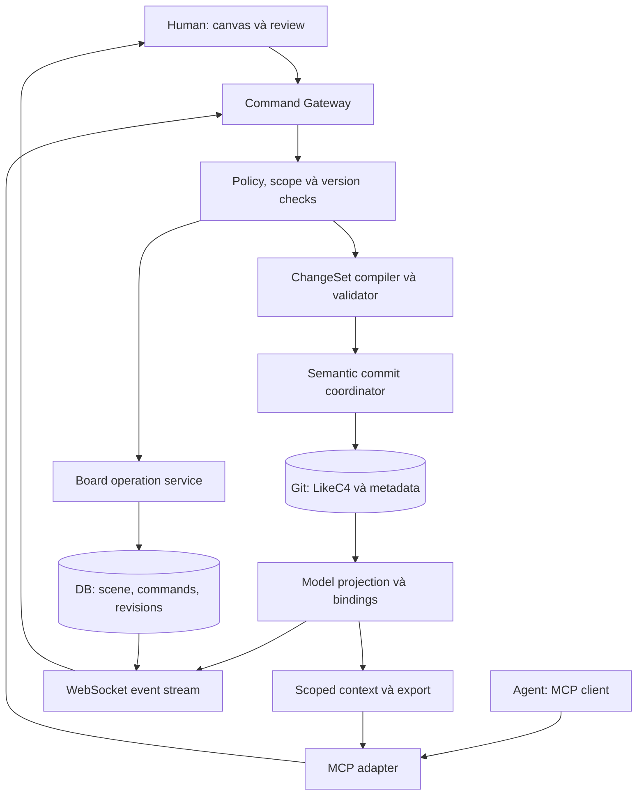
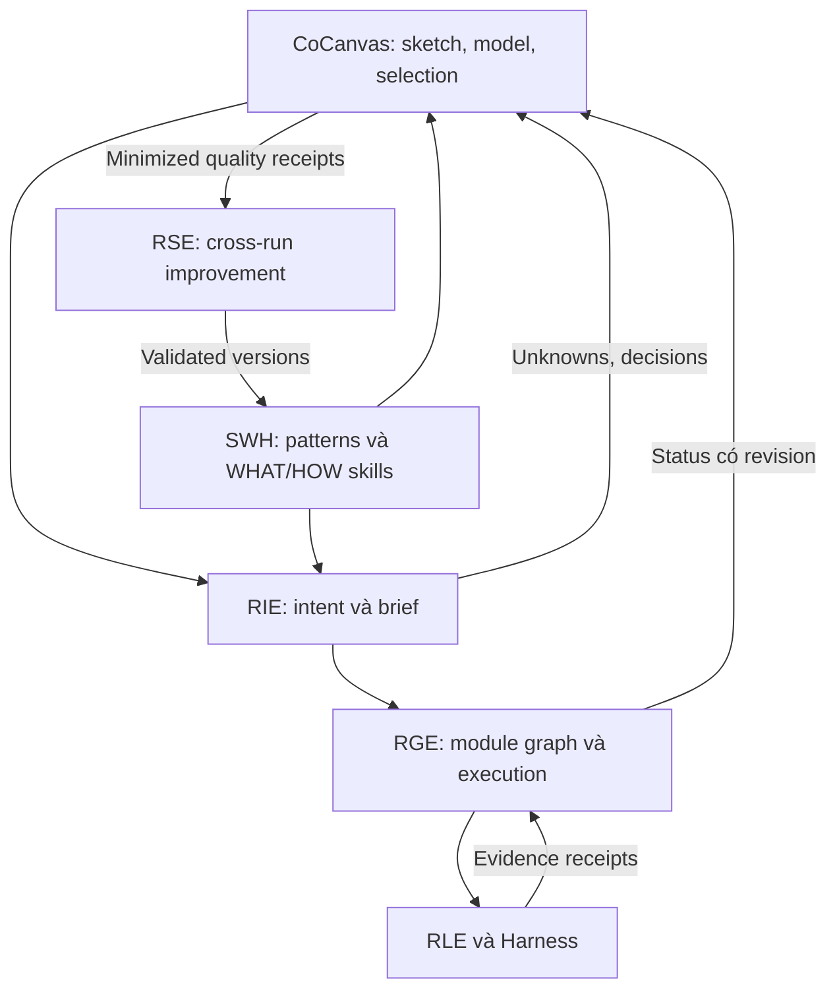
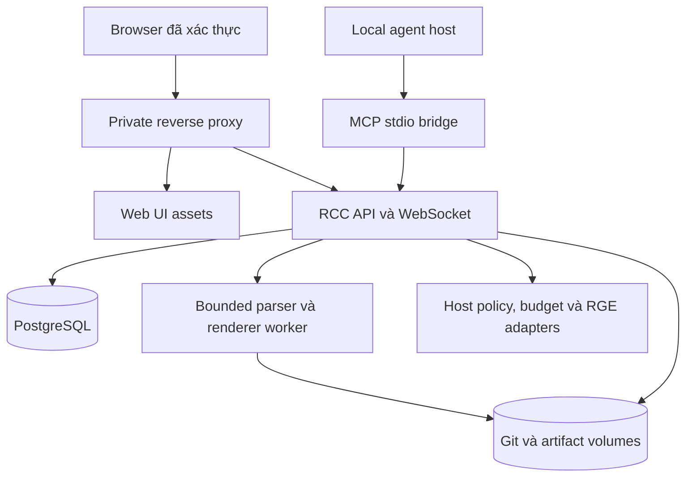
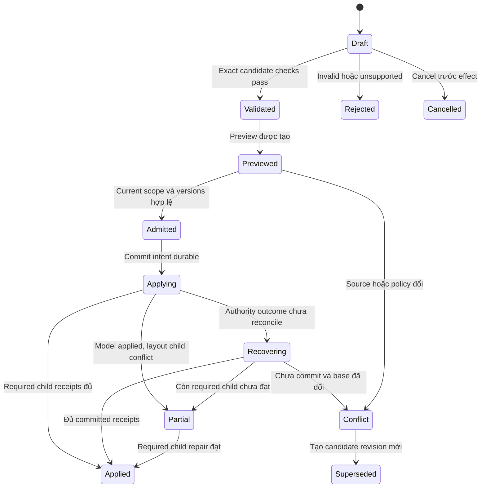
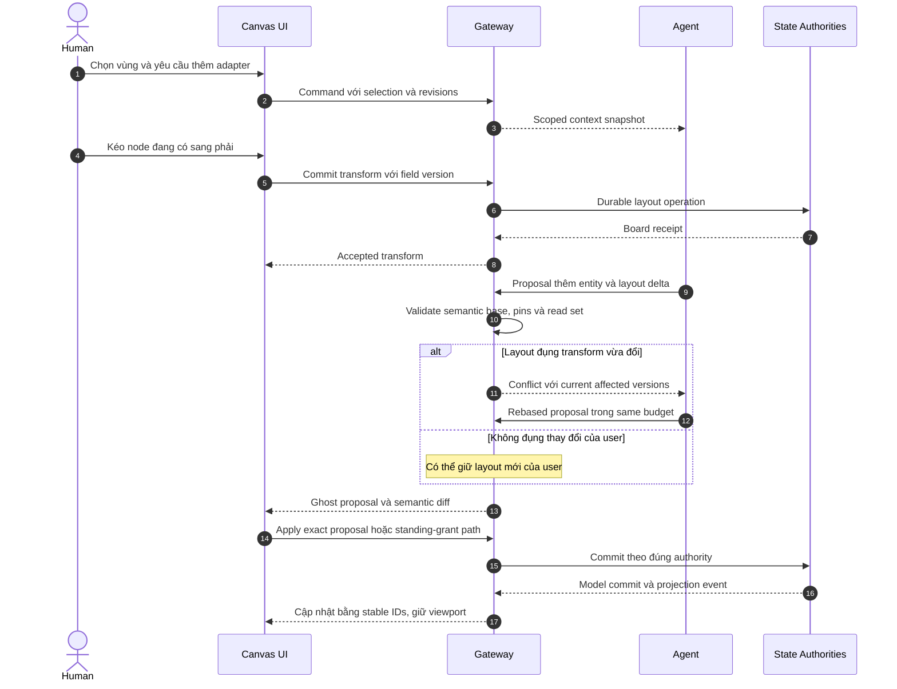
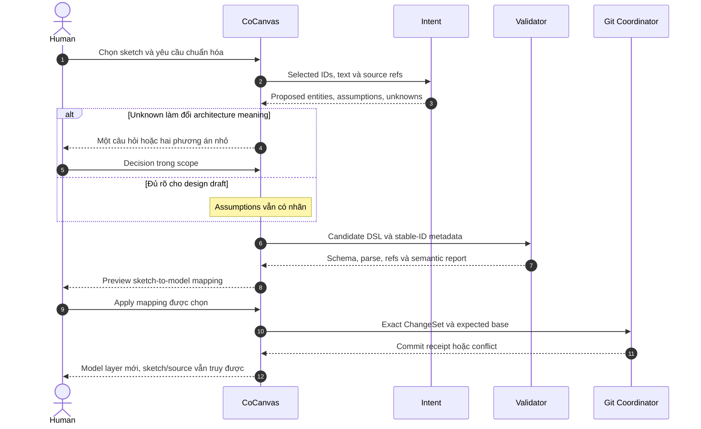
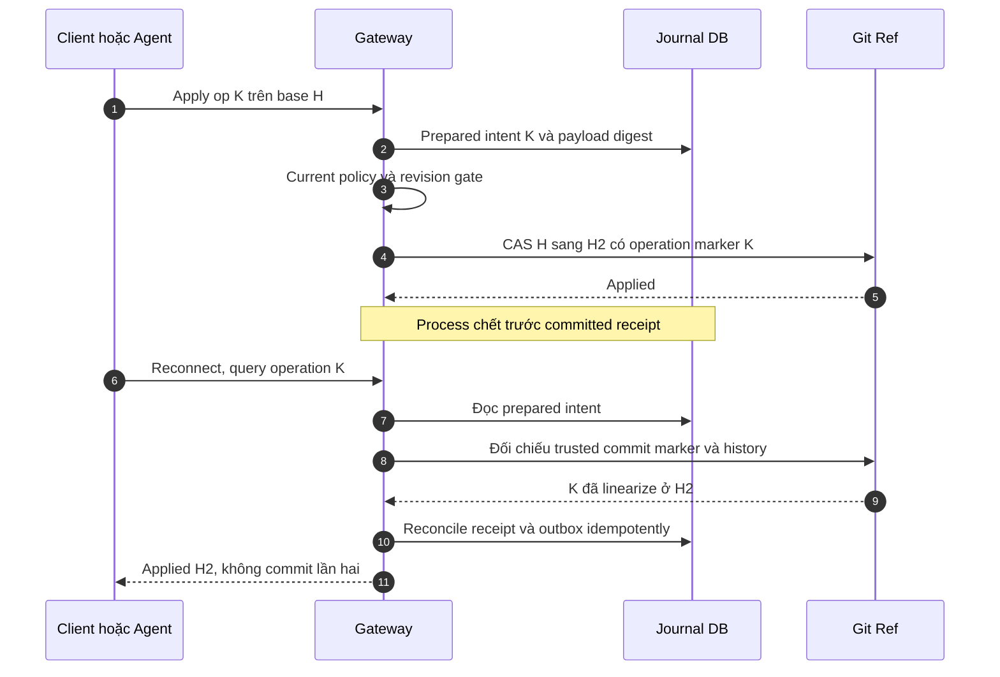
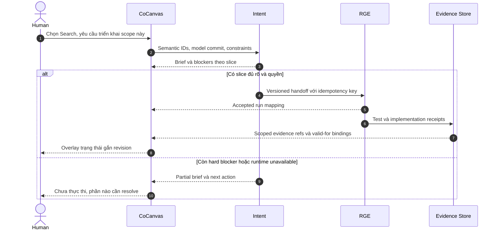

# REPRISE COCANVAS
## PRD v1.0 — Người và agent cùng thiết kế trên canvas, kiến trúc được quản lý bằng code

**Ngày:** 22/09/2026. **Owner đề xuất:** rhein. **Tên ngắn:** RCC. **Đích:** công cụ dùng hằng ngày cho Tech Lead, fresher và coding agent, self-host trong môi trường riêng. **Trạng thái:** đặc tả để triển khai; chưa cài upstream, sửa repo, chạy benchmark hoặc publish service.

**Giải quyết:** agent vẽ một sơ đồ rồi người sửa một bản khác; hình không còn khớp kiến trúc; kéo một box có thể bị agent ghi đè; diagram đẹp nhưng không biết phần nào là giả định, phần nào đã triển khai. Người muốn chỉ tay vào một module và nói “tách phần này ra”, thay vì mô tả lại toàn bộ bằng text.

**Luồng đi:** yêu cầu/selection trên canvas → Intent làm rõ phần cần thiết → agent đọc mô hình và vùng liên quan → đề xuất thay đổi có preview → validate và áp đúng quyền → cập nhật mô hình/scene qua contracts → review baseline → xuất PRD/ADR/Graph brief → Graph thực hiện → evidence quay về thành overlay, giữ rõ thiết kế và thực tế.

**Nội dung ra:** canvas cộng tác trực tiếp, mô hình LikeC4 có Git history, mapping ổn định giữa model và shapes, change proposals, conflict resolution, export bundle, traceability tới yêu cầu/tickets/evidence. PRD có WHAT/HOW, block và sequence diagrams, schemas, thuật toán mẫu, 28 tickets cho fresher, 40 acceptance scenarios và rollout.

> Bạn và agent dùng chung bàn vẽ. Bàn vẽ nhớ điều đã chốt, ai sửa gì và phần nào vẫn chỉ là ý tưởng.

## 1. WHAT — Tên gọi, nguồn gốc và lời hứa sản phẩm

| Mục | Thiết kế |
|---|---|
| Tên gọi | Reprise CoCanvas — collaborative architecture workbench |
| Nguồn gốc | Kết hợp hướng live Excalidraw canvas mà user scout với architecture-as-code và chain Intent/Graph/Loop/Skill/Evolve đã thiết kế |
| Lý do tồn tại | Chuyển hội thoại về kiến trúc thành mô hình cùng sửa được, giữ lịch sử và chuyển xuống công việc có hợp đồng |
| Cơ chế | Canvas ba lớp; LikeC4 làm nguồn chuẩn kiến trúc; commands/changesets qua gateway; stable IDs; Git revisions; scene projections và evidence overlays |
| Trade-off | Thêm mapping, parser adapter và conflict handling; đổi lại không bắt người dùng học DSL trước khi cộng tác và không lấy hình làm execution state |
| Giới hạn | Không suy được đầy đủ architecture từ nét vẽ; không hỗ trợ lossless round-trip mọi DSL/diagram; không thay IDE, runtime Graph hay công cụ thiết kế UI chuyên dụng |
| Vị trí | Giao diện làm rõ và thiết kế ở phía trước execution chain; có thể dùng độc lập cho diagram/design, nối RGE khi host capabilities sẵn sàng |

### 1.1. Sáu thao tác hằng ngày

1. **Chỉ vào vùng và hỏi:** “Module này đang phụ thuộc cái gì? Vì sao phải có queue?”. Agent trả lời theo model/decision refs, phân biệt rationale có nguồn với suy luận.
2. **Cùng sửa:** người kéo/ghi chú, agent thêm phần được giao; agent không giành viewport hay kéo các box đã pin.
3. **Thử phương án:** tách một vùng thành alternative branch, so architecture delta; chưa chọn thì không thay baseline.
4. **Chốt thành model:** sketch được promote thành entities/relationships sau khi giải quyết ambiguity, không auto coi mọi rectangle là service.
5. **Giao việc:** chọn module → tạo scope brief có assumptions, interfaces và AC → RIE/RGE phân rã công việc.
6. **Đối chiếu thực tế:** xem evidence của implementation/test với exact revision; chỗ chưa có evidence hiện unknown, không tô xanh vì agent nói “done”.

### 1.2. Phân biệt các ý nghĩa của graph

| Graph | Node/cạnh mang nghĩa gì? | Có thể có cycle? | Authority |
|---|---|---|---|
| Architecture model | System/module/service/store và quan hệ nghiệp vụ/kỹ thuật | Có; vòng gọi nhau có thể hợp lệ hoặc cần review | LikeC4 source + semantic metadata |
| Containment | Phần nào chứa phần nào | Không cho ancestor cycle | Model validator |
| RGE task dependency | Work milestone nào cần artifact/contract nào trước | Dependency DAG không cycle | RGE |
| Runtime workflow | Plan/execute/verify/repair | Vòng có budget/stop | RGE/RLE |
| Canvas scene | Shape, text, arrow, tọa độ và nhóm hiển thị | Không dùng cycle để suy thứ tự thực thi | Board store/projection |

Một box “Booking” không mặc định là microservice, container Docker hay graph con. Một arrow “HTTP” không trở thành cạnh chạy trước/sau trong task DAG. Loại quan hệ phải được đặt rõ khi tạo handoff.

## 2. Kiểm chứng scout và lựa chọn upstream

Đối chiếu nguồn chính thức ngày 22/09/2026. Star count/issue count không dùng làm tiêu chí độ ổn định. Các facts dưới đây là mô tả upstream; phần thiết kế RCC từ §3 trở đi là đề xuất riêng, không phải capabilities được các repo hứa sẵn.

### 2.1. Kết quả xác minh

| Lựa chọn | Điều xác minh được | Hệ quả cho RCC |
|---|---|---|
| `yctimlin/mcp_excalidraw` | README mô tả CLI/MCP/REST, canvas Excalidraw với WebSocket; core drawing local. README cũng nêu API không có auth tích hợp; Known Issues còn ghi state elements in-memory, restart có thể mất; screenshot cần browser [S1] | Tốt cho spike UX/adapter contract. Không lấy nguyên server làm authoritative production store. Phải test commit được pin, không chọn giữa các lời mô tả mâu thuẫn bằng suy đoán |
| Excalidraw component | Có APIs để host nhận scene changes và điều khiển editor; repository công bố MIT [S2, S3] | Nhúng component vào app riêng; gateway/persistence/sync của RCC phải tự làm |
| tldraw | Có agent starter kit và multiplayer starter kit; mẫu multiplayer dùng Cloudflare Durable Objects/SQLite [S4, S5] | Phương án thay canvas adapter nếu cần custom shape UX sâu; không coi mẫu Cloudflare là Docker-local sẵn có |
| tldraw production | Tài liệu nhà cung cấp yêu cầu license key cho production [S6] | Không giả “self-host” đồng nghĩa không cần license; không chọn làm baseline khi chi phí/điều kiện chưa chốt |
| `jgraph/drawio-mcp` | Repo hiện mô tả cả inline MCP App, tool mở editor và plugins tạo file [S7] | Scout “chỉ xuất file rồi xem” chưa bao quát. Tài liệu đã đọc chưa chứng minh concurrency contract mà RCC cần; chọn export/interchange, không kết luận toàn bộ draw.io không thể live collaborate |
| LikeC4 | Có Agent Skills cho DSL và MCP để truy vấn model; có model API và validation tooling [S8, S9, S10] | Chọn semantic model backend. Không coi MCP query là transactional write API; RCC xây write gateway riêng |
| Structurizr | Docs chính thức có MCP để validate/parse DSL và thao tác workspace [S11] | Có thể thêm adapter sau. Repo `Cubical6/structurizr-mcp` chưa đọc/xác minh được trong lần này, không đưa làm dependency |

“Core drawing không cần API key” không có nghĩa inference miễn phí hoặc mọi dữ liệu nằm local. Agent dùng hosted model vẫn chịu chính sách truyền dữ liệu và chi phí provider. RCC có hai profile manual/local-model và permitted remote-model; không tự đổi provider khi bị chặn.

### 2.2. Quyết định ADR-001: baseline implementation

**Chọn:** app React/TypeScript nhúng Excalidraw, backend TypeScript modular monolith, PostgreSQL cho board/commands/ACL, Git repository nội bộ cho LikeC4 model và metadata, local artifact directory cho snapshots/exports. Dùng stack host tương thích nếu đã có; phiên bản packages phải pin trong ticket discovery, không phát hành với `latest`.

**Tận dụng `mcp_excalidraw`:** chạy sandbox spike để kiểm thao tác agent, scene formats và UX live; tái sử dụng code nhỏ phù hợp sau review license/provenance và conformance. Không có đường production cho upstream server ghi scene bỏ qua gateway. Dùng native Excalidraw JSON import để mang bản vẽ thử sang RCC, không cần giữ hai servers làm đồng bộ chéo.

**Tự xây:** domain mapping, changesets, persistence, multi-client concurrency, access controls, stable semantic IDs, preview/diff/undo, bounded agent context, Git reconciliation và chain adapters. Đây là phần giá trị sản phẩm; MCP chỉ là interface cho agent.

**Không chọn tldraw lúc đầu:** SDK tốt cho custom canvas nhưng thêm dependency licensing và backend integration. Chỉ đổi sau spike so UX requirements và tổng cost; không xây cả hai canvas adapters production trong v1.

**Không chạy LikeC4 + Structurizr làm hai nguồn chuẩn:** chọn một dialect cho mỗi project. Import từ dialect khác cần converter/loss report và migration riêng; C4 là cách mô hình hóa, hai DSL không tự tương thích.

### 2.3. Release scope

| Release | Bao gồm | Chưa hứa |
|---|---|---|
| C0 — usable local design | Một user + một agent; sketch/model layers, persistence, preview, LikeC4 managed subset, local export, restore | Không live production execution; không remote multi-user |
| C1 — product-grade private workspace | Tối đa 3 human sessions + 1 active applying agent/board; auth, sync/reconnect/conflicts, Git review bundle, RIE/RGE bridge có conformance, tests/ops | Không public SaaS, full offline multi-master hoặc mọi DSL round-trip |
| C2 — sau đo nhu cầu | Nhiều agents apply đồng thời, richer custom shapes, full source-edit preservation, optional tldraw/Structurizr adapters, richer offline merge | Có ADR/effort riêng, không nằm trong estimate C1 |

Single owner trên Mac mini/homelab là profile đầu, không đòi Kubernetes. Remote access qua private network/reverse proxy do owner cấu hình; không tự public canvas. V1 một workspace access boundary/board; không promise field-level confidential nodes trên cùng board cho users có quyền khác nhau.

## 3. WHAT — Ba lớp trên một canvas, một authority cho mỗi loại state

### 3.1. Sketch, Model và Evidence

| Lớp | Người/agent làm gì? | Nguồn chuẩn | Điều không được suy |
|---|---|---|---|
| Sketch | Vẽ tự do, notes, rough arrows, đánh dấu câu hỏi | Board scene store có revisions | Hình vẽ đã là requirement/architecture |
| Model | Typed entities/relationships/views được bind stable IDs | `.c4` và semantic metadata trong một Git commit | Node đã deploy/chạy đúng |
| Evidence | Status từ source revision, test receipts, RGE runs | External evidence authority; RCC lưu refs/projection | Badge xanh chỉ vì model có node hay agent nói xong |

Canvas có marker rõ cho proposed/accepted design/unknown implementation. Người có thể hide/show layers. Presentation/layout chỉ thay view, không thay semantics. Không yêu cầu user đọc DSL khi kéo shape; system giữ mapping và tạo command phù hợp.

### 3.2. ADR-002: source of truth và working copies

**Semantic authority:** một Git ref `design/<project>` trong repository do RCC quản lý. Commit chứa LikeC4 files + `semantic-ids.json` + decisions/requirement links cần version cùng model. Parsed IR/index trong DB là projection rebuild được; không chấp nhận API sửa IR rồi không sinh source commit.

**Board authority:** database giữ sketch objects, per-view layout, pinned state, comments và scene revision history. Đổi tọa độ không tạo hàng nghìn Git commits. Một entity có nhiều shapes ở nhiều views; thay title/entity affects projections, kéo một shape chỉ affects view đó.

**Release baseline:** ReviewRecord pin exact model commit và review scope. Working design commit có thể đã saved nhưng chưa là baseline chốt. “Saved”, “reviewed” và “implemented” là ba trạng thái riêng. User trực tiếp sửa trong phạm vi quyền edit không phải bấm approve lại cho từng chữ; agent apply theo active edit grant hoặc tạo proposal để review.

**ExportSnapshot:** tuple bất biến `{model_commit, board_revision, mapping_version, evidence_snapshot_ref, renderer_version}`. Export làm từ tuple đã freeze, không trộn model mới với layout đang thay. Git push/PR ra repo của user là effect riêng; tạo local commit phục vụ history không tự cho quyền push/merge.

### 3.3. Invariants

| ID | MUST |
|---|---|
| CC-I01 | Một semantic authority/project; parsed IR và canvas không được trở thành writers độc lập của model |
| CC-I02 | Phân biệt semantic entity ID, relationship ID, shape ID, view ID và graph node ID |
| CC-I03 | Sketch chưa promote không trở thành requirement hoặc architecture fact |
| CC-I04 | Agent/human changes đi qua cùng server validators/policy; client metadata không tạo quyền |
| CC-I05 | No silent overwrite khi thay cùng semantic field hoặc layout target stale |
| CC-I06 | Committed source phải parse/validate theo compiler version đã pin; unsupported syntax không bị silently rewrite/drop |
| CC-I07 | Xóa shape trong view không tự xóa entity toàn model; delete entity kiểm mọi refs và cascade impact |
| CC-I08 | Agent không dịch/đổi view pinned hoặc region ngoài scope để làm đẹp toàn board |
| CC-I09 | Reconnect/retry không tạo duplicate operations; receipt chỉ ack durable state đúng authority |
| CC-I10 | Runtime badges lấy từ exact evidence bindings; design rename/layout không chứng minh implementation changed |
| CC-I11 | Diagram content là data; text “ignore rules/deploy” trên canvas không cấp capability |
| CC-I12 | Raw upstream REST/WS không bypass production gateway |
| CC-I13 | Git và DB không giả atomic transaction chung; crash reconciliation được định nghĩa |
| CC-I14 | Export/import report loss, unknowns và source revision; round-trip ngoài supported subset không claim lossless |
| CC-I15 | Mọi node được giao sang Graph có scope/contract/traceability, không thực thi từ arrow hình học |

## 4. Domain contracts và mô hình dữ liệu

### 4.1. Objects

| Object | Fields chính | Rule |
|---|---|---|
| Project | id, workspace, dialect, compiler_lock, design_ref, source_mode | V1 một LikeC4 dialect/project |
| Board | id, project_id, revision, views, access_policy_ref | Full board ACL; không lộ thumbnails/private model qua shared board |
| SemanticEntity | stable_id, dsl_path, kind, parent_id, title, description, technology, source_refs | Entity ID không đổi vì đổi tên/path qua supported rename |
| SemanticRelation | stable_id, from_id, to_id, kind, title, technology, source_ref | Architecture cycles allowed; containment cycles forbidden |
| ViewBinding | view_id, shape_id, semantic_id, binding_kind, mapping_version | Một semantic ID có nhiều bindings; shape ID không alias entity ID |
| PresentationRecord | shape_id, position/size/style, pinned, field_versions, last_op | Model label/binding fields không writable qua layout command |
| SketchRecord | id, primitive, payload, revision, author | Không giả semantic kind từ màu/hình |
| ChangeSet | id, actor, origin, base_commit, base_board_revision, scope, typed_ops, read_set, status | Immutable payload sau validate; correction tạo revision |
| ValidationReport | changeset_digest, compiler/policy_versions, checks, errors, valid_for | Parse success khác design correctness |
| OperationReceipt | op_id, payload_digest, actor, authority_commit/revision, outcome | Duplicate same body trả receipt cũ; khác body conflict |
| ReviewRecord | model_commit, scope, reviewer, evidence, verdict | Không dùng review bản cũ cho commit mới |
| ExportManifest | tuple snapshot, checksums, format, loss_report, source_refs | Partial/failure không mark complete |
| TraceLink | semantic_id, requirement_id, brief_ref, graph_ref, source_revision, valid_for | Many-to-many; absence = unknown |

### 4.2. Stable IDs khi source đổi

Managed model dùng opaque UUID do server cấp, map tới DSL identifier/path trong semantic metadata cùng commit. Rename do RCC thực hiện cập nhật tất cả references và sidecar trong candidate tree rồi compile. Display title không dùng làm khóa. Quan hệ giữa hai nodes giống endpoints nhưng khác purpose vẫn có IDs khác.

Import source edit từ ngoài: đối chiếu explicit IDs/metadata trước, rồi source structure. Nếu rename hay delete+create không phân biệt được thì hỏi mapping/đưa proposal, không fuzzy match title rồi gán evidence cũ. Copy/paste shape mặc định tạo thêm view binding tới entity đã có khi thao tác “duplicate view”; “duplicate entity” là command semantic tạo ID mới.

Deleted entity tạo tombstone mapping để lịch sử/trace không gán ID vào entity mới. Recreate cùng label vẫn ID khác trừ restore command có contract. Evidence đã liên kết entity cũ không được tự chuyển.

### 4.3. Source modes và supported subset

| Mode | Khả năng sửa | Contract |
|---|---|---|
| `managed` — default | GUI/agent typed commands cho entities, nesting, relations, metadata, explicit views | Generator sở hữu các files được chỉ định; deterministic regeneration; render/parse semantic equivalence trong subset |
| `external_readonly` | Import/view/query source tùy syntax parser hỗ trợ | Không overwrite source; semantic edits trả proposal patch để review bằng source workflow |
| `external_candidate` | Đưa source patch/diff vào candidate worktree | Parser validate toàn model; structured diff; accept exact commit qua gate, không raw file watcher auto apply |

V1 không round-trip tất cả comments/macros/view predicates bằng GUI. Nếu model import có construct chưa support write, project/scope đó readonly cho semantic edits nhưng layout/sketch vẫn dùng được. Người muốn chuyển managed phải xem conversion/loss report; không lặng lẽ xóa syntax không hiểu.

Đây cũng là giới hạn được tài liệu Model API của LikeC4 nêu: quá trình xuất ngược DSL không bảo toàn comments, source positions và formatting [S9]. RCC không dùng generation API như một lossless source formatter.

Source files/config được coi untrusted: adapter chỉ mở file trong workspace allowlist, cấm path traversal/remote include/exec config không được duyệt. Parser/render sandbox có CPU/memory/timeout/network limits; không chạy arbitrary repository scripts vì “cần compile diagram”.

## 5. Block diagrams — sản phẩm và topology triển khai

### 5.1. Các khối chức năng



Hai authority ở đây sở hữu hai loại dữ liệu khác nhau. Gateway không đồng thời gửi mutation tới RCC và upstream canvas server. Semantic event đủ điều kiện mới render thành accepted model layer; proposal ghost ở overlay khác.

### 5.2. Nối chain của rhein



RCC dùng được trước khi RGE có runtime: design, local files, manual brief export. Integration modes phải khai `available/unavailable`; không tự triển khai scheduler/effect ledger thứ hai để che thiếu capabilities.

### 5.3. Single-host private deployment



UI/API có thể chung image; worker là process isolation cần cho parser/render, không bắt microservice riêng. DB/Git/artifacts có persistent volumes và backup nhất quán. Bind loopback cho local; private remote mode cần auth/TLS/Origin checks, không public upstream port. Browser không nhận provider secrets hay unrestricted filesystem handles.

## 6. UX — cảm giác dùng thật, không biến canvas thành form

### 6.1. Bố cục

Canvas ở giữa; trái là project/views/module navigator; phải là inspector/chat/proposal diff; dưới là task strip gọn với saved/sync/conflict state. Mặc định chỉ mở panel liên quan. Keyboard palette tìm entity theo stable mapping/title; breadcrumb cho subviews. Theme sáng/tối đọc rõ, labels tiếng Việt không cắt dấu; pins/unknown/evidence state có icons + text, không chỉ màu.

**Select → Ask/Edit:** chọn các elements, nhập “giải thích luồng này”, “thêm cache trước adapter” hoặc “tách booking ra”. Request lưu selection IDs và snapshot version, không chỉ tọa độ screenshot. Nếu selection thuộc sketch chưa có semantics thì RIE hỏi/đề xuất mapping tối thiểu.

**Ghost proposal:** agent draws preview khác kiểu viền, label đề xuất và concise rationale. Agent response không log private chain-of-thought. Panel liệt kê node/edge thêm/sửa/xóa, constraints và affected modules. Có apply trong scope được quyền, chỉnh đề xuất hoặc bỏ. Low-impact auto-apply có standing grant, không buộc user approve mọi align/move.

### 6.2. Mapping thao tác canvas

| Thao tác | Hành vi |
|---|---|
| Vẽ rectangle bằng pen/shape tool trong Sketch | Tạo sketch, không tự sinh service |
| Chọn “System/Module/Store” từ Model palette | Typed semantic create, validate rồi accepted render |
| Kéo/resize bound node | Update PresentationRecord; không sửa DSL |
| Sửa title bound node | Inline semantic edit draft; submit title command khi user hoàn tất nhập, gate tự kiểm trong edit scope |
| Kéo vào group/frame | Mặc định layout grouping; reparent semantic cần action rõ với impact preview |
| Vẽ connector Sketch | Free arrow; semantic relation chỉ khi dùng relation tool/promote |
| Delete bound shape | Ẩn binding trong canvas view hiện tại; UI có action riêng “xóa khỏi model” |
| Auto layout selected region | Preview và patch scoped/unpinned shapes; không reset mọi views |
| Undo | Compensating operation dựa trên base/current revisions; không rewind global board |
| Open entity ở view khác | Focus local view; không giật viewport của người khác |

Adapter không gửi nguyên scene cũ làm authoritative replace khi `onChange` chạy. Nó tính diff với last acknowledged scene, tách sketch/layout/semantic proposals, gắn origin/op ID. Server scene update được apply theo revision và không re-emit thành edit mới. Giữa lúc đang gõ có local draft; remote title update tạo conflict rõ, không làm mất chữ người dùng.

**Model view và canvas view khác nhau:** model view predicate/membership nằm trong source; canvas có visibility override cho presentation. “Xóa khỏi view” của canvas tạo suppressed binding/tombstone hiển thị, không sửa predicate DSL; refresh không tự làm shape hiện lại. Inspector cho thấy số entities đang ẩn và có Restore. Muốn đổi model view definition phải dùng semantic command. Export ghi visibility/filter; agent query model vẫn thấy entity được phép đọc dù shape ẩn.

### 6.3. Canvas lớn và nested modules

Overview hiển thị module summaries và cross-module contracts, không render toàn bộ leaves. Drill-down dùng views, không clone entities để giả phân cấp. Expanded view và viewport là state cá nhân; shared layout chỉ đổi khi có command phù hợp.

Context agent bắt đầu từ selected IDs, view subset và relations liên quan; cấp summaries/cross-boundary stubs thay vì hàng nghìn hidden nodes. Nếu không đủ context để sửa dependency, request bounded expansion. Không đếm nodes từ một viewport để trả số toàn project. Hidden do viewport khác access denied: server chỉ query authorized board/project.

### 6.4. User journey: sketch → model → task

1. User viết “wiki → search → answer” bằng ba notes và hai arrows.
2. Agent nhận “chuẩn hóa flow này” cùng exact selection; đề xuất entities/relations và gắn unknown “search lexical/vector/hybrid chưa xác định”.
3. Preview giữ notes gốc, mapping candidate được review hoặc apply trong authorized design scope.
4. User thêm constraint “không lộ tài liệu không có quyền”; RIE ghi requirement, RCC bind vào search boundary.
5. Model được validate, commit local và review baseline theo project policy.
6. Chọn Search → tạo brief với scope, source commit, contracts/AC và unknowns; RGE phân rã nếu available.
7. Khi RGE báo tests đã chạy, overlay chỉ hiển thị trên trace links hợp lệ theo exact revision. Source/code/model lệch → drift/unknown, không tự sửa model để khớp giả.

## 7. HOW — Đồng bộ, concurrency và undo

### 7.1. ADR-003: server-authoritative operations trong C1

C1 không xây CRDT cho toàn DSL. Board server cấp monotonic board event sequence và durable op receipts. Semantic changes serialize theo project design ref; layouts kiểm versions theo object/domain. Presence/cursor là ephemeral, được drop khi nghẽn; semantic/layout commits không được drop.

Human kéo shape: local optimistic animation, send throttled previews nếu cần, commit final transform khi drag end. Remote clients có thể thấy preview khác style; chỉ receipt durable mới đổi “Saved”. Nếu connection đứt trước commit, local dirty draft còn đó và UI nói chưa lưu; không claim mọi pixel move đã durable.

V1 một applying agent/board; nhiều agent proposals có thể tồn tại nhưng apply queue serialize. Agent chỉ sửa selected/explicitly granted scope. Human vẫn edit live; agent không giữ khóa toàn board trong khi gọi model. Model reads snapshot, proposals phải recheck khi quay lại.

### 7.2. Conflict rules

| Trường hợp | Rule |
|---|---|
| Hai users sửa khác shapes | Cho commit độc lập nếu scopes/refs còn đúng |
| User đổi transform, agent đổi style cùng shape | Có thể merge khi command read/write set không phụ thuộc transform và field versions tương thích |
| User kéo shape, agent auto-layout shape đó từ snapshot cũ | Conflict; không last-write-wins âm thầm |
| User pin shape trong lúc agent tính layout | Agent apply phải recheck pin; reject/replan affected patch |
| User rename entity, agent add edge vào stable ID đó | Semantic base commit stale → C1 revalidate/rebase candidate, không tự apply vì endpoints ID còn tồn tại |
| User delete entity, agent add edge tới entity | Reject missing endpoint/tombstone; không resurrect |
| Model source update đồng thời board movement | Semantic update không reset transform; renderer giữ presentation theo stable bindings |
| Whole-scene upload từ client stale | Không dùng replace production board; import vào proposal/new board |
| Text editing đồng thời | Giữ local text và remote candidate; explicit conflict resolution, không character CRDT trong C1 |

Transform domain gồm position/size/angle liên quan, dùng chung version để tránh x,y,width,height bị merge thành geometry vô nghĩa. Style có thể tách domain; relation arrow routing phụ thuộc endpoint transforms phải khai read set. Optimistic patch không đủ read set cho layout calculation → conservative conflict/recompute.

### 7.3. Reconnect và offline

Client lưu last acknowledged sequence. Reconnect: authenticate lại, subscribe board, request events từ cursor. Nếu cursor quá cũ/compacted, lấy snapshot + subsequent events theo watermark. Trong lúc snapshot load, buffer events có sequence lớn hơn watermark; duplicate op ignored qua receipt. Không apply out-of-order snapshot lên scene mới.

Local unacked commands giữ client op IDs và base versions. Gửi lại cùng payload; server trả applied/conflict/rejected receipt. Tối đa một bounded queue theo board, có export local draft khi quá giới hạn. Offline C1 là draft chưa committed; không multi-master merge đảm bảo cho cả team. Reconnect model changed → resolve conflict, không tự replay toàn bộ stale scene.

### 7.4. Undo, redo và delete

Undo là new compensating op tham chiếu original op; chỉ tự áp nếu affected fields/entities còn tương thích với inverse. Nếu người khác đã sửa sau đó, preview conflict thay vì trả state cũ đè cả board. Semantic undo tạo new candidate commit, validate refs; không `reset --hard` active history. Redo cũng có current checks, không dùng old grant.

Delete entity hiển thị incoming/outgoing relations, views và trace links bị ảnh hưởng. Mặc định reject nếu refs còn sống; cascade chỉ trên exact list user/authorized scope đã chọn, apply atomically trong semantic commit. Delete shape suppress binding theo §6.2, giữ khả năng restore; free sketch note delete không làm mất model. Tombstones bảo vệ retries không resurrect IDs.

## 8. HOW — Semantic commit, Git review và crash recovery

### 8.1. W01–W10

| Bước | Thực hiện | Output/gate |
|---|---|---|
| W01 Bind | Resolve project/board/actor/scope + selection snapshot | Authorized request hoặc typed denied/unresolved |
| W02 Read | Read scoped semantic IR, selected view/presentation, relevant decisions | Context manifest với commit/revisions |
| W03 Propose | User command hoặc agent typed ops; source/sketch assumptions tách | ChangeSet draft; không writes trực tiếp |
| W04 Normalize | Schema, IDs, operation limits, exact paths, read/write set | Valid candidate hoặc invalid_input |
| W05 Build | Candidate worktree từ base commit; edit managed source/sidecar hoặc patch external candidate | Candidate tree và semantic diff |
| W06 Validate | Parser, refs, containment, contracts, policy, scope, sources và loss report | Report bound digest/compiler/policy |
| W07 Preview | Render candidate, diff/highlights; check pinned geometry/cut text | Preview artifact; visual pass khác semantic pass |
| W08 Admit | Resolve approval/standing grant cho exact mutation; recheck current base/epoch | Commit intent hoặc stale/conflict/denied |
| W09 Commit | Coordinator CAS semantic ref; receipt; project model event | Durable model commit; board projection eventually catches up |
| W10 Reconcile | Resync bindings/render, outbox/integration receipts; verify postconditions | Applied/needs_repair, không fake đồng bộ hoàn tất |

Một direct human edit trong workspace role phù hợp có thể đi W03→W09 tự động sau inline commit; không modal approval cho mọi thay title. High-impact delete/reparent/Graph handoff có preview theo policy thực tế. Agent được giao align 5 shapes có scope rồi thì không hỏi lại khi đúng scope; nếu đề xuất xóa module thì mở rộng mutation cần xử lý đúng thẩm quyền.

### 8.2. Git/DB commit protocol

Git không tham gia cùng PostgreSQL transaction. Chọn model Git ref làm authority; DB journal/projection có thể hồi phục từ committed operation marker.

1. Gateway persist `CommitIntent(op_id, payload_digest, base_commit, candidate_tree, policy_receipt)` và trạng thái prepared trong DB; unique idempotency key. Candidate files không thành active model.
2. Coordinator lấy project commit mutex, recheck current design ref, actor rights và policy epoch. Revocation/edit-policy commands trong cùng project phải đi barrier/lock tương thích; không chỉ kiểm lúc agent bắt đầu suy nghĩ.
3. Revalidate candidate khi input/policy đổi; không có active grant thì dừng. Freeze tree, tạo commit có trusted operation ID/digest marker do server ghi; server không tin marker từ file import.
4. Compare-and-swap design ref từ expected base sang new commit. CAS là linearization point của semantic mutation. Failure → conflict, candidate chưa active. Success → nguồn chuẩn đã đổi dù DB response sau đó thất bại.
5. Append committed receipt + outbox model event, update parsed projection. Crash trước bước này → recovery đối chiếu design history với journal/op marker, tái tạo receipt/event idempotently.
6. Nếu DB unavailable trước prepared intent, không commit. Nếu Git đã commit mà DB unavailable, UI hiện recovering; chặn semantic writes tiếp cho project cho đến journal/projection reconciliation đủ tin cậy.

Policy revocation sau linearization không làm commit trước đó “chưa từng xảy ra”; chặn việc tiếp theo, xem inverse change nếu cần. Host adapter không cung cấp revoke barrier/current admission semantics thì capability auto-apply tương ứng unavailable; không hứa strong authorization chỉ bằng TTL token.

C1 single coordinator/project trên single host. Không bổ sung replica writers qua shared filesystem mà chưa có leader/fencing semantics. Git backing repo là internal writable ref với refs đã allowlist; UI/agent không có shell arbitrary để đổi refs ngoài protocol.

### 8.3. Source từ IDE và repository của user

Agent có thể tạo patch trong worktree của task được cấp quyền; RCC nhận patch/candidate ref, không để watcher tự đọc sửa file rồi apply live. External branch update phải có expected model base, parse và semantic diff. Conflict dù Git merge text sạch vẫn có thể là semantic conflict (hai module nhận cùng responsibility/interface trái nhau).

Export Git bundle/worktree diff là artifact; tạo remote branch/PR hoặc merge cần capability tương ứng từ session/host. Nếu quyền đã có, thực hiện trong scope qua adapter. Không cần push để canvas lưu được. ReviewRecord ghi local baseline khác remote PR merge receipt; UI không gộp chúng thành “đã merge”.

### 8.4. Recovery matrix

| Điểm chết | State có authority | Recovery |
|---|---|---|
| Trước journal prepared | Chưa accepted | Retry cùng op ID |
| Sau prepared, trước CAS | Old model active | Recheck rồi retry/cancel candidate |
| Sau CAS, trước DB receipt | New model active, projection stale | Reconcile journal/op marker → receipt/outbox; không commit lần hai |
| Sau receipt, mất WS | Commit durable, client stale | Replay/snapshot cursor |
| Export đang viết dở | Temp artifact incomplete | Atomic artifact finalize/checksum; retry từ pinned snapshot |
| Backup restore lệch Git/DB | Không có snapshot pair đáng tin | Maintenance/read-only; reconcile known checkpoint, không auto claim latest |

### 8.5. Một proposal gồm semantic và layout edits

Không hứa atomic commit xuyên Git/DB. API tách `semantic_batch` và `presentation_batch`; mỗi batch atomic trong authority của nó. Tạo entity có placement hint để projection đặt shape mới; hint không có quyền dời existing pinned shapes. Layout sửa shapes có sẵn là child operation với exact read/field versions, được admission lại sau semantic commit.

Nếu semantic commit xong nhưng layout child conflict, receipt là `model_applied_layout_conflict`, hiển thị source đã lưu và layout cần xử lý; không trả full success hay tự revert model. Có thể recompute layout trong scope/budget hoặc đề xuất inverse semantic change nếu outcome yêu cầu cả hai. Root proposal chỉ complete khi các required child results đạt. User thấy từng phần thay đổi, không mất bản vẽ đang sửa.

External side effects như remote PR/handoff cũng có independent receipts. Retry parent phải lookup completed child IDs trước, không chạy lại child đã thành công. Export chỉ lấy tuple consistent hiện có; pending layout không được mô tả như đã đạt requested visual outcome.

### 8.6. ChangeSet state machine



`Previewed` có thể là structured diff đã đủ cho text-only model edit; không bắt render ảnh khi không mang thêm evidence. Rejected/conflict candidates giữ lịch sử, sửa payload tạo candidate revision mới. Cancel sau linearization không chuyển giả sang “chưa apply”; ghi cancel request và reconcile/compensate bằng operation mới. Production transition table phải cho phép cancel từ các pre-effect states tương ứng; hình chỉ hiển thị đường đại diện.

## 9. Agent contract, MCP và bounded context

### 9.1. Tools của RCC — API đề xuất, không phải tools upstream có sẵn

| Tool | Input chính | Output | Side effect |
|---|---|---|---|
| `canvas_read_context` | board/view, selected IDs, revision, expansion budget | Scoped model+scene summary, sources, unknowns, limits | Read |
| `canvas_query_model` | typed query: entity/relations/impact; scope | IDs/results với completeness/commit | Read; không arbitrary SQL |
| `canvas_propose_changes` | base refs, typed ops, rationale, read set | ChangeSet + schema/scope diagnostics | Tạo draft |
| `canvas_validate_changes` | changeset ID/digest | Compiler/contract/policy/visual reports | Bounded job |
| `canvas_preview_changes` | changeset + view | Ghost diff/screenshot artifact | Local artifact; không apply |
| `canvas_apply_changes` | exact digest, expected refs, admission handle | Applied/conflict/denied/recovering receipt | Scoped mutation |
| `canvas_get_operation` | op ID | Authoritative receipt/pending | Read |
| `canvas_export_snapshot` | snapshot tuple, allowed format | Manifest + artifact refs/loss report | Local artifact |
| `canvas_request_handoff` | selection semantic IDs, model commit, brief ref | RIE/RGE proposal/receipt hoặc unavailable | Theo runtime admission |

MCP stdio bridge khởi đầu cho local agents; remote MCP không bật mặc định. Bridge bind workspace và short-lived agent identity qua host config; không nhận secret từ text canvas. Negotiation/capabilities theo SDK/version đã pin ở CC-01/11; không copy protocol claims mới của upstream vào design mà chưa conformance test.

Mutation allowlist là typed commands, không generic shell hoặc full JSON scene replace. Scheme gồm create_entity/update_entity/add_relation/delete_relation/reparent_entity/delete_entity, view add/remove binding, layout/sketch ops. Model không được gửi `mark_implemented`, `grant_permission` hay `merge_pr` như canvas edits.

### 9.2. Context packet

Packet chứa model commit, board/view revisions, selection stable IDs, authorized entities/relations liên quan, pinned/read-only markers, requirement/decision refs và pending conflicts. Có `completeness=complete_for_selection|partial` và `omitted_reason`; query count toàn project phải chạy typed scoped query, không dựa top-k context.

Structured state là input chính. Screenshot thêm khi kiểm overlap/labels/routing hoặc xử lý sketch; không gửi ảnh toàn board nếu task chỉ một vùng. Screenshot phải capture đúng board/viewport/revision qua renderer session, không lấy tab đang focus ngẫu nhiên. Model-only answer không xác nhận label hết tràn; cần geometry/browser visual check tương ứng.

Presence/cursor updates không gọi LLM. Agent wake theo user command, accepted semantic event liên quan hoặc explicit bounded review; không agent-loop mỗi WS message. Summary cache key pin scope/model/layout relevant revision; ACL/provider policy recheck trước gửi remote context.

### 9.3. Budget và stop

Đề xuất mặc định per agent edit episode: max 6 model calls gồm repair; max 2 validate→repair rounds; max 1 screenshot retry; max 50 semantic ops hoặc 100 layout ops/change; context cap 12k tokens hoặc host cap nhỏ hơn; active deadline 5 phút. Parser/render job riêng bounded timeout, retries chỉ transient và idempotent. Tất cả caps là proposed configuration, chưa benchmark.

Paid calls bằng 0 cho đến khi host có allocation hợp lệ. C1 reuse request-family budget của RIE/RGE nếu có; C0 local standalone host chỉ là implementing RuntimePort nhỏ cho design tasks, không tự chạy Graph hoặc publish. Cùng episode không reset budget bằng snapshot/branch/case mới.

Stop khi cancel/revoke, unknown effects cần reconcile, stale scope cần replan, objective đạt, hết budget, repeated validation failure hoặc thiếu capability. Render unavailable vẫn xuất source/native scene nếu contract cho phép, ghi `visual_verification=unavailable`; không fake PNG hoặc visual pass.

## 10. Sequence diagrams — bốn đường quan trọng

### 10.1. Người và agent sửa live, không đè nhau



Standing grant là quyền hợp lệ đã có, không phải UI tự gắn flag. Agent không bị buộc hỏi lại cho thao tác đã được giao; conflict phải được revalidate dù scope permission vẫn còn.

### 10.2. Promote sketch thành architecture model



### 10.3. Git commit thành công nhưng receipt response bị mất



### 10.4. Chọn module rồi giao Graph, evidence quay về



Sửa architecture sau handoff tạo change request qua RIE/RGE, không kéo task graph đang chạy theo tọa độ mới. Xem evidence của code revision cũ vẫn được nhưng phải có nhãn stale/khác baseline.

## 11. Source/model/scene interchange và diagram types

### 11.1. V1 hỗ trợ gì?

| Artifact/view | V1 | Cách quản lý |
|---|---|---|
| Architecture block/C4-style view | Editable managed subset | LikeC4 source + presentation sidecar |
| Free sketch/flowchart | Editable scene | Không semantic hóa tự động |
| Sequence diagram | Structured sequence artifact + generated view/preview | Ordered interactions có participant IDs, không suy từ vị trí arrows |
| RGE execution graph | Read projection; đề xuất edits qua change request | RGE giữ authority |
| Native `.excalidraw` | Import/export scene với metadata RCC khi có | Foreign edits là import candidate, không active overwrite |
| LikeC4 files | Managed source export hoặc external import | Parser/compiler version pin |
| SVG/PNG | Snapshot export bằng local renderer | Artifact tĩnh, không thay source |
| Markdown design packet | Decisions/assumptions/diagram refs/trace links | Generated from snapshot + versioned metadata |
| draw.io | C1 optional export adapter sau core gates | Loss report, không claim editable bidirectional semantics |
| Structurizr DSL | Ngoài C1 write scope | Future migration adapter, không đổi dialect âm thầm |

Sequence diagram là bounded riêng: `participants`, `messages` có order, `alt/loop` groups trong supported schema. Source nằm trong semantic metadata cùng commit; renderer xuất Mermaid/preview. Không ép sequence message order vào LikeC4 relationship order hoặc mutate runtime workflow khi user kéo participant. C1 bắt đầu CRUD participants/messages + một cấp alt; deep nesting/advanced UML trả unsupported. Đây là requirement riêng, có ticket và QA, không mượn khả năng của canvas để claim đủ.

### 11.2. Export manifest và privacy

Manifest ghi exact source commit, board revision, compiler/renderer versions, file checksums, supported schema, warnings/losses. Validate consistent snapshot trước render. Nếu model entity đã bị xóa ở commit selected nhưng shape vẫn orphan trong board revision, export marker orphan hoặc yêu cầu resolve tùy profile; không dựng fake semantic node từ stale shape.

Không export hidden/private notes chỉ vì SVG đang crop nhìn không thấy. Export selection scope được server kiểm; metadata/embedded scene trong SVG/PNG/native files phải theo đúng scope. Default file export không upload public sharing service. Share link tới board riêng và external publish là capability khác nhau; scope và recipients nếu có phải rõ.

### 11.3. Git-friendly không phải pixel-identical

Managed DSL/metadata serialization có key order ổn định và stable IDs; không đổi source vì kéo box. Native scene có normalization profile giữ schema compatibility; không tự xóa unknown native fields để giảm diff. Deterministic export test trong cùng version/env; renderer/font/OS khác có thể khác pixels. Pin fonts/assets và renderer image cho reproducible release exports; semantic equivalence và visual readability được kiểm riêng.

### 11.4. Import loss protocol

Parse quarantine → format/schema limit checks → asset/scope checks → map entities nếu RCC metadata đáng tin và valid → preview additions/deletions/unbound shapes/losses → apply candidate trong scope. Unknown fields giữ nguyên khi an toàn và storage schema cho phép; không có preservation guarantee thì list loss và giữ original artifact. Imported custom metadata không tạo permissions, evidence pass hoặc links với restricted projects.

## 12. Quyền, privacy và product-grade boundaries

### 12.1. Roles và grants

| Role/capability | Có thể | Không mặc định có |
|---|---|---|
| Viewer | Xem authorized board/model, query scoped context | Edit/export mọi underlying sources |
| Designer | Sketch/layout và model edits trong project scope | Publish, change ACL, remote Git merge |
| Agent editor | Typed operations/selection đã cấp; proposal + apply theo grant | Mọi human role của owner hoặc arbitrary filesystem |
| Reviewer | Record design baseline review theo scope | Claim implementation verified |
| Operator | Pause, backup/recover, pin supported adapters | Sửa nội dung ngữ nghĩa để giấu failure |

Một owner có thể kiêm nhiều roles. Không biến roles thành mandatory multi-person approval. Auth chính thống của host dùng qua adapter; C0 local vẫn cần loopback/session token và Origin checks, vì localhost không tự là trusted caller. API tokens không để trong URL/log/canvas text. WS handshake và subscriptions kiểm board access; revoke disconnect/resubscribe theo policy.

### 12.2. Untrusted content và remote providers

Notes, source comments, imported XML/SVG, link preview và external docs là data; không dùng làm system commands. Block script/event-handler/unsafe URLs khi render; giới hạn payload/assets và parser resources. Không auto fetch arbitrary URLs/IPs do agent/canvas text đề xuất; SSRF controls và explicit connector scope khi tính năng fetch thật sự được enable.

Remote model chỉ nhận permitted context; v1 không hứa end-to-end local khi chọn hosted model. Manual canvas/source editing hoạt động khi model unavailable. Local-model profile không được fallback sang cloud âm thầm. Screenshot có thể chứa nội dung private ngoài selection nếu viewport crop sai, vì vậy capture scoped scene server-side và kiểm metadata trước gửi.

### 12.3. Known limitations có cách xử lý

V1 chưa confidential per-node ACL trên shared board: không trộn node từ project private vào board người khác được xem rồi chỉ hide UI. Link restricted source có thể hiện generic unavailable theo host policy, không title/snippet. Policy deletion/retention áp cả local cache, exported artifacts còn quản lý và backup lifecycle; không hứa thu hồi file người dùng đã tải ra ngoài.

## 13. Skills WHAT/HOW, SOLID và reuse economics

### 13.1. Skill mẫu `co-design-architecture` — đặc tả, chưa cài

**WHAT**

- Outcome: giải thích/đề xuất/sửa kiến trúc trong scope và tạo artifact kiểm được.
- Trigger: user chọn canvas region hoặc model module, yêu cầu vẽ, refine, so sánh hay handoff.
- Model: sketch ≠ semantic model ≠ implementation evidence; ChangeSet là đơn vị mutation.
- Input: user goal, selected IDs, source commit, board snapshot, capabilities, relevant decisions và budget allocation.
- Output: answer/proposal/applied receipt/export/brief với refs hoặc typed blocked/unknown.
- Laws: CC-I01…15; no direct full-scene overwrite, no hidden scope expansion, no inferred permissions.

**HOW**

1. W01–W02 đọc context giới hạn, resolve “cái này” bằng selection IDs.
2. Hỏi RIE đúng unknown làm đổi ý nghĩa; reuse decision còn đúng scope.
3. W03–W06 tạo typed proposal, compile và kiểm semantics/refs.
4. W07 render/kiểm geometry nếu mutation ảnh hưởng visual, giữ pins và viewport.
5. W08–W10 apply theo rights có sẵn, reconcile receipt và postconditions.
6. Nếu user muốn giao implement, tạo handoff riêng qua RIE/RGE; không dùng diagram apply làm execution approval.

| Nhánh | Guard | Kết thúc/rejoin |
|---|---|---|
| Pure explanation | Không yêu cầu mutation | Trả concise answer có refs; không tự vẽ thêm |
| Sketch promotion | Selected records chưa bound model | Resolve ambiguity → candidate mapping → W06 |
| Layout-only | Không đổi semantic fields | Presentation validator + field CAS; không model commit |
| External source edit | Mode readonly hoặc unsupported construct | Source patch proposal, không regenerate toàn file |
| Conflict repair | Current refs đổi, còn budget | Bounded rebase rồi validate lại; không retry blind |
| Export | User output scope có file | Freeze tuple → render/package/loss report |

Skill upstream có thể cung cấp tham khảo DSL/layout. Khi đóng gói skill RCC phải bổ sung contract/guards theo SWH, không tự ghi đè package hệ thống hay cài một skill chưa review. Chuẩn WHAT/HOW là về hành vi, không chỉ hai headings.

### 13.2. SOLID

| Nguyên tắc | Ranh giới |
|---|---|
| S | Canvas rendering, semantic compilation, authorization và Graph scheduling có ownership riêng |
| O | Canvas/DSL/export adapters mở qua declared capabilities; unsupported không giả support |
| L | Adapter replacement giữ stable IDs, conflict/error/permission semantics; cùng JSON không đủ |
| I | ModelReadPort, SemanticWritePort, LayoutWritePort, ExportPort và HandoffPort tách |
| D | Domain core phụ thuộc typed ports; không chứa SDK commands/provider paths hoặc arbitrary shell |

### 13.3. Patterns/templates dùng lại

Seed patterns: `selected-region-explanation`, `sketch-to-model`, `bounded-layout-refinement`, `architecture-to-work-scope`. Template module gồm WHAT, domain contracts, known unknowns, model fragment, view seed, validation fixtures và applicability/contraindications. Copy template tạo IDs mới với provenance; không copy access grants, production endpoints/secrets hoặc evidence pass.

Template hierarchy ưu tiên composition + explicit delta, pin version/closure, tối đa 3 levels trước khi xem lại complexity. Khi adaptation lớn hơn viết mới thì cho core path. Pattern thành công một lần chỉ là candidate; Evolve đánh giá trước khi đổi default cho tasks sau. Lỗi cùng kiểu phải lưu negative example, không chỉ templates đẹp.

Theo dõi setup + lookup + adaptation + review + rework + maintenance + inference costs. Ví dụ giả định: mẫu diagram mất 120 phút để chuẩn hóa/kiểm; tiết kiệm ròng 4 phút/lần thì cần 30 lần tương đương để hòa vốn. Chi phí trung bình có thể giảm nhờ phân bổ setup; chi phí biên của lần kế tiếp vẫn có thể tăng nếu domain khác. Không tối ưu token bằng cách bỏ context về pinned regions/permissions/unknowns.

## 14. Implementation contracts, API và code mẫu

### 14.1. Modules đề xuất

| Path/module | Sở hữu |
|---|---|
| `apps/canvas-web` | Excalidraw embed, inspector, proposal diff, presence và accessible UI |
| `apps/canvas-api` | Auth middleware, REST/WS entrypoints và composition root |
| `packages/canvas-domain` | IDs, commands, scope/read sets, conflict policies |
| `packages/model-likec4` | Parse, supported subset, source edits, normalized model/semantic diff |
| `packages/model-commits` | Candidate worktrees, journal/CAS/reconcile |
| `packages/board-sync` | Durable ops, field versions, snapshots/replay, inverse ops |
| `packages/agent-gateway` | MCP tools, bounded context, host adapters |
| `packages/diagram-export` | Native scene, SVG/PNG, sequence and Markdown artifacts |
| `packages/chain-bridge` | Requirement/brief/graph/evidence mappings |
| `packages/design-profiles` | WHAT/HOW skill definitions và reusable fixtures |
| `tests/contracts`, `tests/scenarios` | Conformance, semantic/visual/fault checks |

Nhóm nhỏ có thể gộp packages thành modules trong cùng service; paths là đề xuất implementation, chưa tạo repo. Frontend Excalidraw callbacks là adapter; business rules không nhét vào React effects.

### 14.2. API đề xuất

Base `/api/v1/canvas`. Identity lấy từ session/token; client cung cấp expected refs và idempotency key nhưng không tự ghi grants/approval verdict.

| Route logic | Contract |
|---|---|
| `POST /projects` | Tạo project dialect/managed mode theo access; pin compiler config |
| `GET /boards/{id}/snapshot` | Authorized board snapshot + model commit/projection watermark |
| `POST /boards/{id}/operations` | Layout/sketch typed patch + per-domain versions; atomic patch |
| `POST /projects/{id}/changesets` | Base commit, typed semantic ops/source patch, scope/read set |
| `POST /changesets/{id}/validate` | Bound report/preview job; budget current |
| `POST /changesets/{id}/apply` | Exact digest, expected refs, valid admission; 202 pending hoặc receipt |
| `GET /operations/{id}` | Receipt/recovering/not-found theo scope |
| `POST /boards/{id}/exports` | Pinned tuple, format/scope; async manifest |
| `POST /projects/{id}/handoffs` | Brief/model refs + requested scope; RIE/RGE receipt |
| `GET /boards/{id}/events?after=seq` | Replay/cursor expiry response; WS dùng cùng event semantics |

400 invalid/schema; 401/403 auth; 409 revision/idempotency/semantic conflict; 413 size; 422 unsupported/model invalid; 429 rate/budget; 503 unavailable. Không dùng HTTP200 `{success:true}` khi parser fail hoặc commit đang unknown. Client retries same key/body; body khác dưới same key trả conflict.

### 14.3. ChangeSet fragment minh họa

```json
{
  "schema_version": "rcc.changeset/1",
  "id": "proposal-demo-01",
  "project_id": "project-wiki-demo",
  "base_model_commit": null,
  "binding_status": "unresolved",
  "origin": "agent_proposal",
  "intent_ref": "intent:demo-search",
  "scope": {"entity_ids": ["entity-search-demo"]},
  "operations": [
    {
      "op": "update_entity",
      "entity_id": "entity-search-demo",
      "set": {"description": "Retrieve only documents visible to the current principal"}
    }
  ],
  "status": "draft"
}
```

Fragment parse được nhưng cố ý không admissible: commit/ref/scope chưa resolve. Server cấp IDs, validate protected fields và preconditions; model không tự set status applied. Một description edit cũng không chứng minh runtime có ACL enforcement.

### 14.4. Python mẫu: kiểm concurrency cho presentation patch

Mẫu thuần minh họa domain-level optimistic concurrency. Không phải auth gate hay Excalidraw adapter. Trusted caller đã resolve scope/object/type; production còn kiểm session, read set, bindings, schema, idempotency và current policy.

```python
from collections.abc import Mapping

DOMAINS = {"transform", "style"}

def presentation_preflight(expected, current, touched, *, actor, pinned):
    for versions in (expected, current):
        if not isinstance(versions, Mapping) or set(versions) != DOMAINS:
            raise ValueError("INVALID_VERSION_MAP")
        if any(type(v) is not int or v < 0 for v in versions.values()):
            raise ValueError("INVALID_VERSION_VALUE")
    if not isinstance(touched, frozenset) or not touched or not touched <= DOMAINS:
        raise ValueError("INVALID_TOUCHED_DOMAINS")
    if not isinstance(actor, str) or actor not in {"human", "agent"}:
        raise ValueError("INVALID_ACTOR")
    if type(pinned) is not bool:
        raise ValueError("INVALID_PIN_FACT")
    if actor == "agent" and pinned and "transform" in touched:
        return "PINNED_CONFLICT"
    if any(expected[d] != current[d] for d in touched):
        return "REVISION_CONFLICT"
    return "ELIGIBLE_FOR_SERVER_ADMISSION"

base = {"transform": 3, "style": 2}
assert presentation_preflight(
    base, {"transform": 4, "style": 2}, frozenset({"style"}),
    actor="agent", pinned=False
) == "ELIGIBLE_FOR_SERVER_ADMISSION"
assert presentation_preflight(
    base, {"transform": 4, "style": 2}, frozenset({"transform"}),
    actor="agent", pinned=False
) == "REVISION_CONFLICT"
assert presentation_preflight(
    base, base, frozenset({"transform"}), actor="agent", pinned=True
) == "PINNED_CONFLICT"
```

`ELIGIBLE` không là `APPLIED`. Nếu style calculation đã đọc geometry, geometry phải nằm trong read set và validator ngoài helper kiểm nó; test style-only trên đây dành cho style thật sự độc lập. Human có thể kéo pin theo UX owner policy, nhưng agent không được tự đổi pin trước để né constraint. Future base version khác current cũng conflict, không chỉ expected nhỏ hơn current.

### 14.5. Database constraints

Tables đề xuất: projects, boards, board_objects, presentation_domain_versions, scene_events, scene_snapshots, changesets, validation_reports, commit_intents, operation_receipts, outbox, reviews, export_jobs, trace_links. Unique `(workspace_id, actor_id, idempotency_key)` với payload digest; unique semantic commit operation marker do trusted writer cấp. FK/project scope cho shapes/bindings; tombstones giữ reference integrity.

Semantic entity cache/index có `source_commit` và rebuild cursor; không cập nhật trực tiếp để trở thành model mới. Presence không ghi mỗi frame vào immutable history. Events có compaction/snapshot watermark; history retention và object deletion policy ghi rõ trong deployment configuration.

## 15. Backlog tới cấp ticket cho fresher

### 15.1. Requirement mapping

| Requirement | Cam kết | Ticket | QA chính |
|---|---|---|---|
| CC-R01 | Upstream khả dụng, versions/license/capabilities được xác minh | CC-01 | QC-01 |
| CC-R02 | Contracts phân biệt source/scene/evidence | CC-02 | QC-02 |
| CC-R03 | Durable board, commands và journal | CC-03 | QC-03 |
| CC-R04 | Identity/scope/Origin/ACL và policy admission | CC-04 | QC-04 |
| CC-R05 | Excalidraw embed có controlled adapter | CC-05 | QC-05 |
| CC-R06 | Live sync/reconnect/conflict không mất edits | CC-06 | QC-06 |
| CC-R07 | LikeC4 parsing và readonly compatibility | CC-07 | QC-07 |
| CC-R08 | Stable semantic IDs và view bindings | CC-08 | QC-08 |
| CC-R09 | Managed source edits có validation | CC-09 | QC-09 |
| CC-R10 | Git CAS/journal/recovery đúng authority | CC-10 | QC-10 |
| CC-R11 | MCP typed tools và bounded runtime | CC-11 | QC-11 |
| CC-R12 | Scoped agent context, query completeness | CC-12 | QC-12 |
| CC-R13 | ChangeSet preview/diff/admission | CC-13 | QC-13 |
| CC-R14 | Sketch promotion giữ assumptions/provenance | CC-14 | QC-14 |
| CC-R15 | Layout/refinement giữ pins/viewport | CC-15 | QC-15 |
| CC-R16 | Safe undo/redo/delete | CC-16 | QC-16 |
| CC-R17 | Alternatives, design review và external Git proposals | CC-17 | QC-17 |
| CC-R18 | Consistent exports và manifests | CC-18 | QC-18 |
| CC-R19 | Sequence artifact có semantics riêng | CC-19 | QC-19 |
| CC-R20 | Import quarantine, loss và external source modes | CC-20 | QC-20 |
| CC-R21 | RIE/RGE handoff và changes không đổi authority | CC-21 | QC-21 |
| CC-R22 | Evidence overlays có valid-for/drift | CC-22 | QC-22 |
| CC-R23 | SWH skills/templates và reuse evaluation | CC-23 | QC-23 |
| CC-R24 | UI daily-use/accessibility rõ states | CC-24 | QC-24 |
| CC-R25 | Fault/security/contract integration evidence | CC-25 | QC-25 |
| CC-R26 | Semantic/visual/performance quality | CC-26 | QC-26 |
| CC-R27 | Private deployment/backup/runbook | CC-27 | QC-27 |
| CC-R28 | Pilot/release theo capability đã kiểm | CC-28 | QC-28 |

### 15.2. Cách triển khai

Effort là **ngày công tập trung**, gồm code, ticket-level verification, review fixes; chưa gồm xây RGE/RIE/SWH host còn thiếu hoặc C2. Fresher nên đọc §§3–4 trước code, dùng fake ports để đi vertical slice, rồi thay adapter thật và chạy conformance. Không viết test mirror từng dòng implementation; kiểm bất biến và lỗi gây mất/sai dữ liệu. Không thêm tests cho wording/UI cosmetic không có risk cụ thể.

Mỗi PR ghi requirement, behavior/output, fixture/receipts, giới hạn và migration nếu có. Mọi thay semantic contract cần TL review; TL không cần ngồi approve từng tọa độ. Ticket chưa có integration capability phải ghi blocked hoặc IN0/C0-only, không green nhờ mock.

### CC-01 — Spike upstream và dependency lock

**Effort:** 2 ngày. **Dependencies:** không có. **Requirement:** CC-R01. **Module:** ADR/dependency fixture workspace.

**Steps:** (1) pin exact Excalidraw/LikeC4/SDK và upstream scout commit; (2) chạy live create/move/query/export/restart ở sandbox với `mcp_excalidraw`; (3) kiểm embedded editor callback/update APIs; (4) thử LikeC4 parse/validate minimal model; (5) ghi licenses/notices, missing capabilities và supported environment; (6) không expose port public.

**Output:** capability matrix + lockfile + ADR-001 bằng chứng. **AC:** báo rõ restart persistence thực tế của pinned upstream; screenshot dependency được ghi; no API secret requirement bị lẫn với inference cost; kết luận core adapters làm được hoặc blocker cụ thể. **QA:** QC-01, QC-29.

### CC-02 — Domain types và test fixtures

**Effort:** 2 ngày. **Dependencies:** CC-01. **Requirement:** CC-R02. **Module:** `canvas-domain`.

**Steps:** (1) schemas §4/14; (2) protected semantic fields vs presentation domains; (3) state/error enums; (4) fixtures 3 layers và multiple views; (5) typed read/write sets và scope; (6) fragment unresolved không apply được.

**Output:** contracts package và reference fixtures. **AC:** shape ID không thay semantic ID; unknown ≠ false; model status không nhận implemented flag từ client; invalid op reject trước writes. **QA:** QC-02, QC-30.

### CC-03 — Persistence, migrations và outbox

**Effort:** 3 ngày. **Dependencies:** CC-02. **Requirement:** CC-R03. **Module:** DB adapter.

**Steps:** (1) tables §14.5; (2) unique idempotency digest và per-domain versions; (3) transactional scene commit + event; (4) snapshots/watermark; (5) journal prepared receipts; (6) restore fixtures, không dùng in-memory store cho C1.

**Output:** migrations/store ports. **AC:** restart giữ acknowledged scene; duplicate same key/body trả receipt cũ; different body conflict; write+event atomic trong DB. **QA:** QC-03, QC-31.

### CC-04 — Identity, grants và admission policy

**Effort:** 3 ngày. **Dependencies:** CC-02, CC-03. **Requirement:** CC-R04. **Module:** auth/policy adapters.

**Steps:** (1) host identity/local session adapter; (2) board/project ACL; (3) REST/WS Origin/session checks; (4) agent scope và exact mutation grants; (5) revoke barrier với project coordinator contract; (6) renderer/export same scope.

**Output:** trusted policy facts và negative access fixtures. **AC:** localhost không anonymous remote write; viewer không mutate; revoked token không subscribe mới/dispatch; metadata canvas không tạo quyền. **QA:** QC-04, QC-29/30/32.

### CC-05 — Excalidraw embed và adapter

**Effort:** 3 ngày. **Dependencies:** CC-01, CC-02, CC-03, CC-04. **Requirement:** CC-R05. **Module:** `canvas-web` adapter.

**Steps:** (1) mount editor/local assets; (2) source snapshots → shapes/bound labels; (3) callback diff against acknowledged baseline; (4) separate draft vs committed state; (5) suppress server-update feedback loop; (6) selection IDs và viewport state.

**Output:** usable board shell + adapter conformance. **AC:** remote update không echo infinite writes; move không source edit; typing giữ local draft; agent viewport không tự thay user viewport. **QA:** QC-05, QC-33.

### CC-06 — WS sync và concurrency

**Effort:** 4 ngày. **Dependencies:** CC-03, CC-04, CC-05. **Requirement:** CC-R06. **Module:** `board-sync`.

**Steps:** (1) server sequence/atomic op; (2) field-domain CAS/read-set guards; (3) presence ephemeral; (4) drag previews + durable drag-end; (5) reconnect replay/snapshot watermark; (6) unacked queue/duplicate/out-of-order handling.

**Output:** 2-browser live editing vertical slice. **AC:** two clients converge after acknowledged operations; stale same-domain patch conflict; different-domain merge chỉ khi read set hợp lệ; reconnect không replay full stale scene. **QA:** QC-06, QC-31/33/34.

### CC-07 — LikeC4 parser và model index

**Effort:** 3 ngày. **Dependencies:** CC-01, CC-02, CC-04. **Requirement:** CC-R07. **Module:** `model-likec4` read port.

**Steps:** (1) bind pinned parser/validator APIs xác minh từ spike; (2) sandbox path/resource constraints; (3) normalize entities/relations/views; (4) readonly unsupported-write constructs; (5) map source ranges/diagnostics; (6) index keyed source commit.

**Output:** parsed projection/query contract. **AC:** parse fail không thay active model; architecture cycles không bị DAG validator reject mặc định; dangerous includes/config không chạy; no source data leakage. **QA:** QC-07, QC-30/35.

### CC-08 — Stable IDs và view binding

**Effort:** 3 ngày. **Dependencies:** CC-02, CC-03, CC-05, CC-07. **Requirement:** CC-R08. **Module:** binding mapper.

**Steps:** (1) semantic metadata schema/version; (2) stable ID allocation; (3) entity-many-shapes mapping; (4) rename/deletion/tombstone semantics; (5) copy view vs duplicate entity; (6) unknown import matches → mapping proposal.

**Output:** mapper và multi-view fixtures. **AC:** rename giữ ID/links/layout; delete shape không delete entity; title trùng không gán nhầm evidence; copy entity tạo ID mới. **QA:** QC-08, QC-35/36.

### CC-09 — Managed source compiler và typed mutations

**Effort:** 4 ngày. **Dependencies:** CC-02, CC-07, CC-08. **Requirement:** CC-R09. **Module:** semantic write adapter.

**Steps:** (1) implement supported commands; (2) deterministic source+sidecar generation cho managed files; (3) validate refs/containment/endpoint types; (4) semantic before/after diff; (5) preserve external-readonly files; (6) output candidate tree chưa active.

**Output:** compiler with round-trip semantic fixtures trong subset. **AC:** missing endpoint/containment cycle reject; no silent unsupported drop; same no-op không gây source churn; technology/title changes có exact diff. **QA:** QC-09, QC-35/36.

### CC-10 — Commit coordinator và recovery

**Effort:** 4 ngày. **Dependencies:** CC-03, CC-04, CC-09. **Requirement:** CC-R10. **Module:** `model-commits`.

**Steps:** (1) prepared journal; (2) scoped worktrees/ref allowlist; (3) policy/current base barrier; (4) commit marker + Git ref CAS; (5) receipt/outbox projection; (6) crash recovery theo §8.4; (7) project read-only recovery state.

**Output:** authoritative semantic mutation pipeline. **AC:** crash sau CAS không duplicate commit; stale base conflict; source active nhưng DB lag hiển thị recovering; DB projection không được sửa model truth. **QA:** QC-10, QC-31/32/37.

### CC-11 — MCP gateway và host budget adapter

**Effort:** 3 ngày. **Dependencies:** CC-01, CC-02, CC-04, CC-10. **Requirement:** CC-R11. **Module:** `agent-gateway`.

**Steps:** (1) tools §9.1 có schemas/capability flags; (2) stdio host binding; (3) reserve/settle shared budget; (4) idempotent op polling; (5) protocol conformance với pinned SDK; (6) disable raw upstream writes và arbitrary shell.

**Output:** MCP server dùng domain gateway. **AC:** unknown grant/budget chặn apply; model đề nghị full scene replace rejected; same op retry không duplicate; no cloud fallback khi local-only. **QA:** QC-11, QC-29/30/38.

### CC-12 — Agent scoped context và query semantics

**Effort:** 3 ngày. **Dependencies:** CC-05, CC-07, CC-08, CC-11. **Requirement:** CC-R12. **Module:** context/query builder.

**Steps:** (1) selection snapshot; (2) bounded neighbors/cross-boundary summaries; (3) completeness/omissions; (4) scoped screenshots job contract; (5) cache refs/epochs; (6) deterministic queries cho counts/IDs, không viewport inference.

**Output:** context packet API và fixtures. **AC:** ẩn khỏi viewport không mất semantics; query toàn project trả completeness rõ; denied board không vào screenshot/snippet; no LLM call trên cursor move. **QA:** QC-12, QC-30/33/38.

### CC-13 — Proposals, diff, validation và preview

**Effort:** 3 ngày. **Dependencies:** CC-06, CC-09, CC-10, CC-12. **Requirement:** CC-R13. **Module:** changeset service/UI.

**Steps:** (1) proposal lifecycle; (2) ghost overlay; (3) semantic vs layout diff; (4) bind reports vào exact digest/version; (5) apply exact proposal trong quyền; (6) conflict copy preserves user edits.

**Output:** live propose→validate→apply flow. **AC:** preview không thành committed layer; report của proposal cũ không apply proposal mới; human/agent dùng same gate; expired base không overwrite. **QA:** QC-13, QC-32/34.

### CC-14 — Sketch promotion qua Intent

**Effort:** 3 ngày. **Dependencies:** CC-12, CC-13. **Requirement:** CC-R14. **Module:** promotion/RIE adapter.

**Steps:** (1) selection sketch records; (2) inferred mapping với sources; (3) minimal unknown questions/probe theo RIE nếu available; (4) draft-only local fallback khi adapter thiếu; (5) candidate model + preserved sketch lineage; (6) explicit merge bindings.

**Output:** sketch-to-model workflow. **AC:** rectangle không tự thành service; ambiguous arrow giữ unknown; original notes truy được; user sửa mapping không mất sketch. **QA:** QC-14, QC-30/35.

### CC-15 — Bounded layout và visual refinement

**Effort:** 2 ngày. **Dependencies:** CC-06, CC-13. **Requirement:** CC-R15. **Module:** layout planner/validator.

**Steps:** (1) selection/pin constraints; (2) geometry/routing read sets; (3) font-aware bounds/overlap checks; (4) preview only affected shapes; (5) bounded screenshot-repair; (6) preserve personal viewport.

**Output:** align/distribute/layout selected scope. **AC:** newly pinned shape blocks agent transform; human transform changed while agent thinks → conflict; label clipping failure được báo, không lặp vô hạn. **QA:** QC-15, QC-33/34/38.

### CC-16 — Undo/redo và destructive edits

**Effort:** 2 ngày. **Dependencies:** CC-06, CC-10, CC-13. **Requirement:** CC-R16. **Module:** inverse operations/deletion policy.

**Steps:** (1) record inverse metadata; (2) verify current domains before undo; (3) semantic inverse via new candidate; (4) refs/cascade preview; (5) tombstones và retry checks; (6) distinguish remove view/delete entity.

**Output:** scoped undo/deletion UX. **AC:** undo của A không xóa edit sau của B; cascade chỉ affected list được phép; agent không unpin trước để né restrictions. **QA:** QC-16, QC-34/36.

### CC-17 — Alternatives, review baseline và Git external proposal

**Effort:** 3 ngày. **Dependencies:** CC-10, CC-13. **Requirement:** CC-R17. **Module:** branches/reviews/source adapter.

**Steps:** (1) alternative refs/candidates giữ active baseline; (2) semantic compare; (3) ReviewRecord exact commit; (4) source patch import từ external branch; (5) Git export diff bundle; (6) remote PR/push available chỉ qua host capability, không bắt buộc C0.

**Output:** compare A/B, reviewed baseline và Git handoff contract. **AC:** chọn phương án không tự merge remote; source text merge sạch vẫn semantic validate; review cũ không certify new commit. **QA:** QC-17, QC-32/35/37.

### CC-18 — Native/SVG/PNG/Markdown snapshot export

**Effort:** 3 ngày. **Dependencies:** CC-05, CC-06, CC-09, CC-10, CC-13. **Requirement:** CC-R18. **Module:** `diagram-export`.

**Steps:** (1) freeze tuple; (2) native scene + managed source package; (3) local renderer và fonts; (4) checksums/loss report; (5) temp→final artifact commit; (6) private scope/sanitized metadata; optional draw.io export sau core, unavailable nếu chưa có adapter.

**Output:** reproducible export bundle trong supported env. **AC:** moving live canvas không đổi snapshot đang export; no hidden notes leak; renderer unavailable still truthful native/source output; no auto upload public share. **QA:** QC-18, QC-30/36/37.

### CC-19 — Sequence artifact editor và renderer

**Effort:** 3 ngày. **Dependencies:** CC-09, CC-13, CC-18. **Requirement:** CC-R19. **Module:** sequence schema/editor/export.

**Steps:** (1) participants/messages IDs + explicit order; (2) một cấp alt groups; (3) validate participant refs; (4) structured editor + Mermaid export/preview; (5) binding entity IDs khi có; (6) readonly unsupported deep nesting.

**Output:** editable sequence flow artifact versioned cùng model metadata. **AC:** kéo vị trí participant không đổi message order; delete participant referenced cần resolve; sequence không trở thành task DAG; export có source tuple. **QA:** QC-19, QC-35/36.

### CC-20 — Import quarantine và compatibility modes

**Effort:** 3 ngày. **Dependencies:** CC-08, CC-09, CC-13, CC-18. **Requirement:** CC-R20. **Module:** native/source import.

**Steps:** (1) validate file types/size/assets; (2) sandbox parse; (3) detect RCC mapping metadata nhưng không tin permissions; (4) preview new/unbound/loss; (5) external_readonly/candidate modes; (6) preserve original and safe unknown fields.

**Output:** import report + isolated candidate board/model. **AC:** stale scene không replace active board; unsupported DSL không regen/drop; malicious SVG/script/path không chạy; cross-project evidence links không auto attach. **QA:** QC-20, QC-30/35/36.

### CC-21 — Intent/Graph handoff và change bridge

**Effort:** 3 ngày. **Dependencies:** CC-11, CC-13, CC-17. **Requirement:** CC-R21. **Module:** `chain-bridge`.

**Steps:** (1) map selection entity IDs thành scope/requirements/constraints; (2) brief contract + unresolved assumptions; (3) idempotent RGE admission/query; (4) model change → RIE impact proposal; (5) unavailable capability → manual brief export; (6) no scheduler copy.

**Output:** model-to-work-scope integration. **AC:** một architecture cycle không tạo invalid task dependency tự động; handoff timeout không duplicate root; drawing edit không trực tiếp đổi active Graph. **QA:** QC-21, QC-37/39.

### CC-22 — Evidence overlays và drift

**Effort:** 3 ngày. **Dependencies:** CC-08, CC-21. **Requirement:** CC-R22. **Module:** trace links/evidence adapter.

**Steps:** (1) map entity↔requirement↔graph/artifact refs; (2) evidence source/version/valid-for; (3) badges unknown/verified/stale/failed; (4) source changes invalidate applicable view; (5) no false transfer khi entity ID đổi; (6) scoped receipt lookup.

**Output:** accurate implementation overlay. **AC:** rename title không tự cấp passed evidence; tests revision cũ marked stale; deleted/recreated same-name node không inherit status; unavailable runtime không giả progress. **QA:** QC-22, QC-35/39.

### CC-23 — WHAT/HOW skills và reusable profile seeds

**Effort:** 2 ngày. **Dependencies:** CC-11, CC-12, CC-14, CC-15, CC-17. **Requirement:** CC-R23. **Module:** `design-profiles`.

**Steps:** (1) skill §13 theo SWH; (2) four patterns + applicability/counterexamples; (3) pinned version/dependencies; (4) new IDs on template instantiation; (5) no implicit grant/evidence inheritance; (6) cost/quality receipts for Evolve proposal.

**Output:** reviewable skill/template packages, activation qua existing process. **AC:** mẫu từ project khác không copy secret/endpoints; no auto global promotion từ một success; adapter swap giữ WHAT semantics. **QA:** QC-23, QC-30/38/40.

### CC-24 — Daily-use UI, history và accessibility

**Effort:** 2 ngày. **Dependencies:** CC-14, CC-16, CC-17, CC-18, CC-19, CC-20, CC-22, CC-23. **Requirement:** CC-R24. **Module:** `canvas-web` product shell.

**Steps:** (1) unified panels/navigation; (2) clear saved/recovering/conflict/reviewed states; (3) keyboard/search/mobile-read layout; (4) selection context menus; (5) dark/light labels and Unicode; (6) history/diff with concise decisions.

**Output:** daily workflow end-to-end. **AC:** user luôn phân biệt sketch/model/evidence; no viewport stealing; conflict không mất typed draft; canvas actions có keyboard equivalent khi khả thi và named controls. **QA:** QC-24, QC-33/34.

### CC-25 — Fault, security và integration tests

**Effort:** 4 ngày. **Dependencies:** CC-04, CC-06, CC-10, CC-16, CC-17, CC-20, CC-21, CC-22. **Requirement:** CC-R25. **Module:** contract/scenario suite.

**Steps:** (1) inject commit crash/retry/concurrent writes; (2) two-browser disconnect; (3) revoke and malicious imports; (4) Git/DB projection lag; (5) Graph handoff conflict; (6) assert state/receipts, không chỉ screenshot đẹp.

**Output:** exact-version integration evidence. **AC:** critical invariants giữ hoặc capability explicitly blocked; no duplicate roots/commits; no unauthorized downstream data; recovery không mất acknowledged op trên healthy storage. **QA:** QC-25, QC-29…39.

### CC-26 — Semantic/visual/performance evaluation

**Effort:** 3 ngày. **Dependencies:** CC-14, CC-15, CC-18, CC-19, CC-23, CC-24, CC-25. **Requirement:** CC-R26. **Module:** eval/benchmark fixtures.

**Steps:** (1) freeze scenarios/rubrics §16–17; (2) test source fidelity, view preservation, readability; (3) mixed Vietnamese/English labels; (4) reference load test; (5) human review for ambiguity/architecture quality; (6) record failed/unknown cases and cost.

**Output:** evaluation report với raw measurements/limits. **AC:** parse pass không thay semantic correctness; fewer tokens không thắng nếu scope/pins sai; benchmark report ghi hardware/workload/provider; small pilot không claim universal result. **QA:** QC-26, QC-33/35/38/40.

### CC-27 — Private deployment, backup và operator runbook

**Effort:** 3 ngày. **Dependencies:** CC-03, CC-04, CC-10, CC-11, CC-18, CC-25. **Requirement:** CC-R27. **Module:** deploy/ops.

**Steps:** (1) container images pinned, volumes và private routing; (2) local assets/no unapproved egress; (3) health/readiness split; (4) coordinated Git/DB/artifact backup manifest; (5) restore rehearsal; (6) pause/rollback/migration guide; (7) secrets/log minimization.

**Output:** self-host package/runbook kiểm trên supported environment. **AC:** restart giữ state; restore tuple validated; public sharing off; missing renderer/model degraded truthful; upstream raw endpoints không exposed. **QA:** QC-27, QC-29/31/37.

### CC-28 — Pilot và release dossier

**Effort:** 2 ngày. **Dependencies:** CC-24, CC-25, CC-26, CC-27. **Requirement:** CC-R28. **Module:** release/pilot.

**Steps:** (1) run daily-use pilot owner+fresher; (2) validate boundaries C0/C1; (3) measure user/agent collision and saved-time evidence; (4) close critical issues or limit capability; (5) baseline registry/dependency versions; (6) exact release decision/rollback target.

**Output:** release candidate + operations handoff; deployment khi đã authorized. **AC:** incomplete host bridge không ghi fully integrated; hard invariant failure blocks affected capability; stated limits visible; profile improvements chỉ qua validated release. **QA:** QC-28, QC-39/40.

## 16. Acceptance và test strategy

### 16.1. 40 scenarios cần nghiệm thu

| ID | Setup/action | Kết quả quan sát được |
|---|---|---|
| QC-01 | Spike pinned upstream, restart/screenshot | Capability report có actual results; không assume persistence từ marketing |
| QC-02 | Client nhầm shape ID/entity ID hoặc status implemented | Schema/domain reject trước mutation |
| QC-03 | Commit board rồi restart server | Acknowledged objects/revision/receipts còn nguyên |
| QC-04 | Viewer/agent ngoài scope gọi REST/WS edit | Denied; không có mutation/subscription leak |
| QC-05 | Apply server scene update vào browser | Không echo thành user edit mới |
| QC-06 | Hai browsers edit, disconnect/reconnect | Converge snapshot+events; unacked conflicts giữ được draft |
| QC-07 | Source parse fail hoặc unsupported write construct | Active model giữ nguyên; diagnostics/readonly mode rõ |
| QC-08 | Một entity ở ba views, rename title | Stable ID giữ, labels đổi, mỗi view giữ layout |
| QC-09 | Add dangling relation/containment cycle | Candidate invalid; không Git CAS |
| QC-10 | Crash sau Git CAS trước DB receipt | Reconcile cùng op ID; chỉ một semantic mutation |
| QC-11 | MCP arbitrary shell/full scene overwrite đề xuất | Không có allowed tool/command; typed rejection |
| QC-12 | Agent đếm toàn project từ selected viewport | Tool query authoritative hoặc báo incomplete; không lấy viewport làm total |
| QC-13 | Preview proposal A, apply digest B | Mismatch reject; không mutate bằng report A |
| QC-14 | Promote sketch với arrow meaning mơ hồ | Assumption/unknown hoặc question; không invented accepted relationship |
| QC-15 | Agent auto-layout selection có pin | Pin giữ nguyên; affected patch conflict/skip có reason theo contract |
| QC-16 | Undo A sau B sửa cùng field | Conflict/inverse proposal, không rewind B |
| QC-17 | Alternative branch chưa được chọn | Active design baseline không đổi |
| QC-18 | Export khi live canvas tiếp tục thay đổi | Files cùng pinned tuple/checksums, không mixed snapshot |
| QC-19 | Kéo participant sequence | Message order giữ; missing participant reference invalid |
| QC-20 | Import foreign Excalidraw/unsupported DSL | Quarantine/proposal/loss report; không silent active replace |
| QC-21 | Handoff model module khi RGE offline | Manual brief/pending/unavailable; không claim execution |
| QC-22 | Evidence test thuộc code revision cũ | Stale/unknown badge theo valid-for, không green mới |
| QC-23 | Instantiate template từ project khác | New IDs/provenance; không copy grants/secrets/evidence |
| QC-24 | Keyboard/light-dark/Vietnamese labels | Controls có labels, Unicode đúng, state không chỉ màu |
| QC-25 | Combined concurrency/revoke/crash | Invariants hoặc explicit blocked capability có evidence |
| QC-26 | Diagram parse đúng nhưng missing required module | Semantic rubric fail dù parser pass |
| QC-27 | Restore backup Git/DB/assets | Checkpoint pair hợp lệ; incompatible backup read-only/recovery |
| QC-28 | Pilot hard invariant thất bại | Không mở affected C1 capability; release scope đúng thực tế |
| QC-29 | Localhost cross-origin request/upstream raw port | Session/Origin/network controls ngăn bypass |
| QC-30 | Canvas/import text yêu cầu đọc secrets hoặc public share | Treated as data; scope không đổi; không unexpected egress |
| QC-31 | Same key retry/different body/event out-of-order | Old receipt hoặc conflict; không duplicate/lost op |
| QC-32 | Grant bị revoke hoặc base đổi sau preview | Admission recheck chặn; không dùng stale approval |
| QC-33 | Human drag/type khi agent nghĩ; remote viewport change | Giữ current edit/draft/focus; bounded preview không yank screen |
| QC-34 | Same transform stale, independent style, read-set-dependent style | First conflict; independent merge eligible; dependent style revalidate |
| QC-35 | Architecture cycle, unsupported source, ambiguous rename | Cycle không mặc định invalid DAG; source/mapping không tự đoán |
| QC-36 | Delete shape/entity, cascade và re-create cùng title | Đúng scope; no resurrect IDs/evidence; import/export losses rõ |
| QC-37 | Git/DB/export partial failure và remote PR timeout | Reconcile theo authority; chưa merge không hiện merged |
| QC-38 | Agent hết budget/model unavailable/renderer không có | Stop/degrade; manual edit còn dùng; no unapproved cloud fallback |
| QC-39 | Design change sau Graph handoff, evidence event lặp | Change request qua RIE/RGE; dedup; active graph không bị canvas mutate |
| QC-40 | Pattern dùng nhiều nhưng quality giảm | Không tự promote; report net benefit và evaluation validity |

### 16.2. Bốn lớp verification

1. **Deterministic contracts:** schema/IDs/ACL/idempotency/version/CAS/containment/refs. Chạy mỗi core change liên quan.
2. **Adapter conformance:** Excalidraw callback/render/bound text/arrow IDs; LikeC4 parse/normalized semantics; Git/DB recovery; RIE/RGE mappings. Pin dependency versions, run lại khi upgrade.
3. **Visual fixtures:** label clipping, arrow binding, overlap, pins, fonts, selection crop, dark/light. So cấu trúc/bounds và screenshot review; không exact-pixel everywhere vì font/renderer có biến thiên.
4. **Semantic/user tasks:** fidelity với request, explanation có nguồn, architecture alternatives và user workload. Rubric có counterexamples; human review cho judgement, không majority LLM vote thành truth.

Dataset pilot: 10 task families × 3 variants = 30 design tasks: tiny edit, initial architecture, sketch promotion, module decomposition, alternatives, concurrent layout, source import, sequence flow, Graph handoff, evidence drift. Variants cùng family không chia qua development/holdout. Pilot nhỏ để tìm defects; không claim general accuracy/cost advantage. All failures/abandoned/unknown outcomes giữ denominator.

## 17. NFR, chi phí và quy mô giới hạn

### 17.1. Reference profile và targets chưa đo

Reference: 4 vCPU/8 GiB cho RCC app+DB+bounded worker, không gồm LLM inference; chạy cùng RGE cần tổng resource budget/host cap riêng. C1 target 3 human sessions + 1 applying agent/board, 2 active boards, 1.000 semantic entities/project, 2.000 relations, 300 visible model shapes/view, tổng 2.000 scene objects/board. Vượt cap cần summary/subviews hoặc unavailable explicit; không drop objects.

| Target | Phép đo trước release |
|---|---|
| p95 durable layout ack ≤300 ms trên LAN healthy | Commit transform payload chuẩn, actual disk/DB commit, 3 clients |
| p95 acknowledged remote projection ≤500 ms | Từ server durable commit đến browser apply với sequence watermark |
| Initial view usable ≤3 s | 300 model shapes, sources/assets cache state công bố |
| Semantic validate+commit p95 ≤3 s | Supported managed model 1.000 entities, không gồm LLM/human wait |
| Export PNG/SVG ≤10 s | 300 visible shapes, fonts/assets pinned, local worker healthy |
| No acknowledged-op loss khi process crash | Fault tests trên durable storage; không suy là zero loss khi disk mất |
| New writes stop sau revoke nhận được ≤2 s | Healthy coordinator/barrier; external effects xử lý theo host |

Đây là targets dự kiến, không benchmark hiện có. IN1/RGE concurrency cap vẫn là authority cho jobs tích hợp; không cộng thêm agent workers để vượt host cap. C1 không hứa HA hoặc active-active. Browser low-memory, mobile authoring nhiều node và remote high latency ngoài reference phải ghi limitations.

### 17.2. Metrics hữu ích

- Time to first editable useful diagram, tách agent compute/user wait.
- User edits preserved và silent overwrite count: known silent loss là release blocker.
- Semantic source-to-scene mismatch, unsupported-loss count và stale badge accuracy.
- Conflict rate theo human/agent/domain; high conflict → giảm scope/preview changes, không chuyển sang silent last-write-wins.
- Useful accepted changes/attempts với rejected/abandoned denominator; không dùng accept rate để ép user chấp nhận.
- Total cost/task gồm tokens/render/review/rework/template maintenance; ledger unknown không zero.
- Template reuse net saving giữ quality floor, tách setup amortization khỏi marginal cost.

### 17.3. Resource caps và egress

Giới hạn payload mặc định đề xuất 2 MiB/command, assets 10 MiB/file, export job memory/time cap theo worker, bounded concurrent jobs; exact thresholds sau CC-01/26 có ADR. Không base64 full scene/screenshots vào mỗi model turn. Fonts/assets vendored hoặc approved source; disable external URL unfurl mặc định. Import không giải nén archive tùy ý mà không traversal/decompression limits.

Telemetry metadata/receipts có retention mặc định cấu hình, không raw conversation/screenshot secrets. Export artifacts và source repos có backup policy riêng. Operator xem “tốn bao nhiêu, job nào pending, projection có stale không” mà không cần đọc private nội dung của board khác.

## 18. Milestones, rollout và operations

### 18.1. Milestones

| Mốc | Tickets | Ngày công | Demonstrable outcome |
|---|---|---|---|
| M1 — Board foundation | CC-01…06 | 17 | Board persistent, scoped human live sync; agent gateway ở M2 |
| M2 — Semantic workbench | CC-07…13 | 23 | LikeC4 model, stable IDs, Git commits, MCP context và proposal apply |
| M3 — Design workflows | CC-14…20 | 19 | Promotion/layout/undo/alternatives/export/sequence/import |
| M4 — Chain và daily UX | CC-21…24 | 10 | Handoff/evidence, skills/templates và polished workflow |
| M5 — Release assurance | CC-25…28 | 12 | Fault/eval/private deploy/pilot evidence |

Dependencies ở từng ticket là authoritative; milestones là grouping để quản lý, không global barrier bắt mọi dev chờ cùng lúc. Có thể dùng fake host/fixture để xây UI sớm nhưng integration tickets chỉ complete khi real conformance trong release scope đạt.

**Tổng C1 baseline: 81 ngày công tập trung.** Hai developers đạt tổng 6 ngày công tập trung/tuần tương đương 13,5 tuần thuần; khung lập kế hoạch ban đầu khoảng 16–20 tuần lịch cho dependency/review/pilot, re-estimate sau CC-01 và M2. Đây là xây một sản phẩm cộng tác có source/contracts/recovery, khác khối lượng cài upstream để vẽ thử. CC-01 cho quyết định go/no-go sớm; không phải đợi xong C1 mới thử use case. Chi phí inference, thiết bị, licenses ngoài baseline, host engines chưa có, remote Git integrations đặc thù và C2 chưa nằm trong 81 ngày.

### 18.2. Rollout

**C0 trước:** local owner+agent, critical persistence/concurrency/identity tests vẫn bắt buộc; export source/native scene và design drafts dùng được. Chưa có Graph host thì hiển thị export-only.

**C1 pilot:** một private workspace, supported subset, allowlisted adapters/providers và giới hạn session/boards. Window đề xuất 14 ngày hoặc 30 task episodes, review ở mốc đến trước. Ít dữ liệu → inconclusive; không hạ quality gate để kịp số ngày.

**Expand:** chỉ sau hard invariants đạt, restore rehearsal thành công, license/dependency notices đủ và limitations công bố. Không tự public board/push repo vì đã hoàn thành PRD hoặc local pilot. Existing scope authorization được kế thừa; request quyền mới chỉ khi action thật sự đòi.

### 18.3. Backup và recovery

Backup checkpoint tạm dừng semantic ref writes, drain/mark pending journal, freeze board DB snapshot và record Git refs/artifact checksums cùng manifest. Capture completed commits và outstanding intents; không copy files giữa lúc Git/DB đang đổi rồi gọi consistent backup. Board editing pause ngắn hoặc snapshot isolation theo implementation đã kiểm.

Restore vào instance cách ly, validate manifest/refs/receipts, reconcile projections, kiểm recent exported tuple, rồi switch service khi đã có quyền. Daily backup schedule chỉ là option triển khai, PRD này chưa tạo automation. RPO/RTO do deployment owner chốt và đo trong rehearsal; chưa hứa zero-data-loss khi host storage mất.

Rollback app/adapter version chỉ khi DB schema/source format compatible; giữ prior image/compiler và migration plan. Không rewrite Git history để giấu update lỗi. Broken compiler → freeze semantic edits, manual board viewing/export nếu an toàn; baseline revert tạo new validated commit.

### 18.4. Runbook ngắn

| Sự cố | Hành động |
|---|---|
| Agent cứ đè layout | Pause agent apply; xem op read/write sets và pin/current versions; fix validator trước resume |
| Board khác model | Check projection commit/watermark; rebuild từ Git + presentation; không copy canvas label ngược thành model |
| Git committed, UI pending | Query op journal/history; reconcile; không gửi key mới |
| WS mất mạng | Reconnect cursor/snapshot; giữ local dirty draft; conflicts hiển thị |
| Export thiếu text/fonts | Mark visual fail; native/source vẫn giữ; fix renderer image/assets rồi re-export cùng tuple |
| Source/policy revoke | Stop new reads/writes/remote prompts trong affected scope; withdraw derived previews theo policy |
| Evidence xanh sai revision | Invalidate overlay; inspect TraceLink/valid_for, không sửa tests/architecture cho khớp màu |

## 19. Worked example và hướng dẫn triển khai một vertical slice

### 19.1. “Vẽ rồi tách Search của llmwiki giúp tui”

User chọn ba sketch boxes Query, Wiki, Answer. CoCanvas gửi selection snapshot vào RIE. Agent đề xuất Query Intake, Retrieval, Answer Composer; không tự thêm Kafka, Redis, vector DB hoặc microservice khi chưa có căn cứ. Constraint access filtering gắn thành requirement nếu đã có user/source hợp lệ.

User kéo Answer sang phải, pin Query ở trái. Agent thêm một policy boundary. ChangeSet semantic mới không reset presentation cũ. Layout cho Answer dựa tọa độ trước lúc user kéo → conflict/recompute; agent vẫn có thể propose semantic change độc lập nhưng phải validate layout bundle trước commit chung nếu contract yêu cầu cả hai.

User hỏi “lookup với tổng quan khác nhau chỗ nào?”. Agent query model và docs được phép, nếu model chưa khai strategy thì trả unknown/proposal, không pretend hiện có query router. Alternative A/B được tạo như design candidates với assumptions. Khi chọn, model commit mới có ReviewRecord; không tự đổi retrieval đang chạy.

User chọn Retrieval yêu cầu triển khai. Handoff gồm entity IDs, source commit, outcome, constraints/AC, unknowns và runtime scope. RGE quyết định graph L0/module/slices; container relationships không thành task dependencies máy móc. Evidence từ tests tới exact code revision trả overlay; design còn chưa có implementation vẫn ghi chưa xác minh.

### 19.2. Mini vertical slice cho fresher bắt đầu

Fixture hai entities `Web` và `API`, một relation `calls`, một view, một free sticky note. Không cần LLM để làm vòng đầu.

1. CC-02/03: store immutable source fixture + board records; reload giữ labels/positions.
2. CC-05/06: hai browsers move `Web`; stale same-transform request conflict, không nhảy về old position.
3. CC-07…10: đổi title `API` qua typed command; source commit đổi nhưng stable ID/layout giữ; injected crash sau CAS recover đúng.
4. CC-11…13: fake agent đề xuất thêm `Store`, preview ghost; apply exact validated candidate; sau đó bind model provider được phép.
5. CC-18/25: export pinned tuple, verify source/native/PNG references, restart và restore checkpoint.

Demo này chứng minh core architecture slice; chưa claim đủ 40 QC scenarios hoặc full Graph integration. Khi slice chạy ổn mới thêm promotion, variants, richer templates và UI polish.

### 19.3. Definition of done cấp sản phẩm

RCC dùng hằng ngày được khi người/agent cùng sửa mà không silent overwrite; mọi accepted design edit truy được source/version; board survives restart; unsupported/unknown có nhãn; exports không trộn snapshot/leak scope; runtime evidence không bị giả; owner có recovery path. Số stars upstream, số MCP tools hay một video vẽ đẹp không thay các bằng chứng này.

## 20. Sources, quyết định còn mở và trạng thái bàn giao

### 20.1. Nguồn chính thức đã đọc

- **S1:** [yctimlin/mcp_excalidraw README](https://github.com/yctimlin/mcp_excalidraw) — runtime/interfaces và các hạn chế được upstream ghi. Commit cụ thể phải pin ở CC-01; chưa chạy repo trong nhiệm vụ viết PRD.
- **S2:** [Excalidraw component props](https://docs.excalidraw.com/docs/@excalidraw/excalidraw/api/props/) — editor integration surface.
- **S3:** [Excalidraw LICENSE](https://github.com/excalidraw/excalidraw/blob/master/LICENSE) — publisher license text; dependency notices được inventory ở CC-01.
- **S4:** [tldraw Agent starter kit](https://tldraw.dev/starter-kits/agent) — agent/canvas reference implementation.
- **S5:** [tldraw Multiplayer starter kit](https://tldraw.dev/starter-kits/multiplayer) — sync backend architecture của template.
- **S6:** [tldraw license key](https://tldraw.dev/sdk-features/license-key) và [licensing](https://tldraw.dev/community/license) — production requirements theo nhà cung cấp.
- **S7:** [jgraph/drawio-mcp](https://github.com/jgraph/drawio-mcp) — các integration approaches hiện được mô tả.
- **S8:** [LikeC4 AI tools](https://likec4.dev/tooling/ai-tools/) — skills và query MCP.
- **S9:** [LikeC4 Model API](https://likec4.dev/tooling/model-api/) — adapter reference; không suy có write transaction API.
- **S10:** [LikeC4 validation](https://likec4.dev/guides/validate-your-model/) — validation tooling; production phải pin compiler và fixtures.
- **S11:** [Structurizr MCP chính thức](https://docs.structurizr.com/ai/mcp) — alternative backend reference. Không xác nhận repo Cubical6 trong scout.

Các nguồn là documentation, chưa là bằng chứng interoperability/performance trên deployment của rhein. Không copy nguyên upstream features thành cam kết product-grade. Nguồn mô tả mâu thuẫn hoặc thay đổi → pin/check implementation bằng CC-01 trước chốt capability.

### 20.2. Contracts nội bộ đã đối chiếu

- [Intent Engine PRD](https://chatgpt.com/api/library/files/libfile_c0b38fd67b148191ad64bed022c1c6fd/download): selection/references là input làm rõ ý định; brief/assumptions có version.
- [Graph Engine PRD](https://chatgpt.com/api/library/files/libfile_3a4e71296fb88191b3a0a4ccbacfeabf/download): runtime/graph/effects/budgets giữ authority; CoCanvas chỉ projection/handoff.
- [Skill Design Standard](https://chatgpt.com/api/library/files/libfile_383068fab7b08191ab6826f7e0759cf3/download): WHAT/HOW, SOLID và typed reusable assets, không implicit permission.

Loop và Evolve đi qua ownership đã mô tả trong chain; nhiệm vụ này không sửa các PRD cũ, chưa tích hợp engine thật hoặc tạo skill package.

### 20.3. Open decisions có owner/trigger

| Decision | Default để tiếp tục thiết kế | Owner/điểm cần chốt |
|---|---|---|
| Exact dependency versions/APIs | Pin compatible versions sau spike | TL, CC-01 trước implementation adapters |
| Identity khi self-host từ xa | Existing host auth; local session cho C0 | Owner/host maintainer, trước CC-04/27 remote mode |
| Managed LikeC4 subset chi tiết | Entities/nesting/explicit relations/views; advanced syntax readonly | TL, CC-07/09 conformance fixtures |
| Host RIE/RGE availability | Export-only khi chưa có real capability | Integration owner, CC-21 |
| Remote model/provider scope | Local/manual default; approved provider nếu có | Owner/host policy trước inference |
| Remote Git provider | Local commits/export trước; plugin/adapter sau theo quyền | Repo owner khi cần PR/push thật |
| Backup RPO/RTO | Chưa claim số; đo restore trên host đích | Operator, CC-27 |

Không cần user trả lời tất cả các mục trên để bắt đầu C0. Những quyết định ảnh hưởng một capability được giải ở đúng ticket/gate của nó; không mở rộng scope ngầm để né blocker.

### 20.4. Kiểm tra bản PRD trước bàn giao

- 20 sections; 28 requirements nối 28 tickets; 40 acceptance scenarios.
- Dependency graph của 28 tickets đã kiểm không có cycle hoặc reference thiếu; tổng 81 ngày công khớp milestones.
- 8 Mermaid diagrams: 3 block, 4 sequence, 1 state; sequence tối đa 5 participants. File chứa source Mermaid cho trình xem hỗ trợ render; chưa render/visual-QA diagrams trong engine sản phẩm.
- JSON fragment parse thành công nhưng cố ý unresolved; Python helper đã chạy 3 assertions trong ví dụ và 27 cases thêm cho version/pin/domain/input validation.
- Chưa triển khai app/MCP server, chưa chạy upstream conformance, 40 acceptance scenarios, performance benchmark hoặc pilot. Code mẫu chỉ minh họa một policy nhỏ, không chứng minh concurrency/authorization toàn hệ thống.
