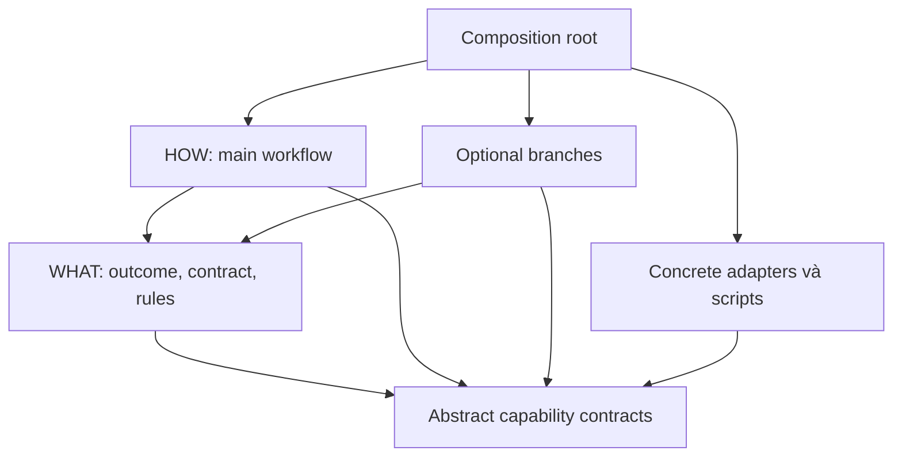

# SKILL DESIGN STANDARD
## PRD v1.0 — Chuẩn bắt buộc WHAT/HOW, áp dụng SOLID cho skill của agent

**Ngày:** 19/09/2026. **Tên chuẩn:** `solid-what-how/1`, viết tắt **SWH**. **Owner đề xuất:** rhein/Tech Lead. **Trạng thái:** đặc tả thiết kế, template và backlog triển khai. Đây là tài liệu chuẩn hóa; chưa cài skill, sửa repo hoặc bật enforcement trong một host cụ thể.

**Giải quyết:** skill trộn mục đích, luật, công cụ và các bước vào một khối Markdown khiến agent khó chọn đúng, khó hiểu mô hình, khó mở rộng và dễ thực hiện thiếu nhánh. Fresher thiếu hợp đồng và expected outcomes nên phải đoán.

**Luồng đi:** xác định năng lực → viết WHAT và contract → thiết kế HOW chính → định nghĩa các nhánh có điều kiện → bổ sung ví dụ/scripts đúng chỗ → kiểm cấu trúc và hành vi → nghiệm thu theo package hash → phát hành trong host hỗ trợ.

**Nội dung ra:** chuẩn bắt buộc cho mọi skill thuộc phạm vi; cách áp SOLID; quy tắc WHAT/HOW; workflows/ports/extensions; templates; skill mẫu `prd-to-tickets`; code kiểm branch; lint/CI/activation gates; hướng dẫn fresher; 24 yêu cầu và 24 tickets.

> **WHAT là lời hứa của skill. HOW là cách thực hiện lời hứa. Nhánh optional được phép thêm cách làm, không được âm thầm thay lời hứa.**

## 1. Quyết định bắt buộc và phạm vi áp dụng

### 1.1. Chốt theo yêu cầu người dùng

**Mọi skill được yêu cầu tạo mới hoặc chuẩn hóa trong phạm vi này PHẢI tuân SWH.** Đây là điều kiện nghiệm thu, không phải gợi ý trình bày. Không được giao một skill chỉ có danh sách prompts và gắn nhãn “đạt SOLID”.

Mỗi skill có **hai lớp nội dung chính**:

1. **WHAT — abstraction:** mục đích, bối cảnh áp dụng, mô hình khái niệm, contract, luật và tiêu chí thành công.
2. **HOW — execution:** luồng chính đủ cụ thể, điều kiện chuyển bước, nhánh phụ/optional, lỗi/điểm dừng, ví dụ hoặc code mẫu khi cần.

Skill nhỏ có thể chứa cả hai trong một `SKILL.md`; skill lớn dùng `SKILL.md` làm entrypoint và references cho detail. Hai lớp logic là bắt buộc; số lượng file không cố định. Skill ngắn không được miễn contract, skill dài không được miễn tính rõ ràng.

**Không đạt → chưa nghiệm thu/phát hành.** Skill legacy chỉ được coi là conformant sau migration và bằng chứng kiểm tương ứng. Inventory có thể ghi `legacy_unassessed` để theo dõi; trạng thái này không phải waiver cho release mới.

### 1.2. Chuẩn riêng và chuẩn đóng gói nền

Agent Skills dùng `SKILL.md` với YAML frontmatter, cùng resources như references/scripts/assets; metadata hỗ trợ khám phá trước khi nạp detail. SWH là **profile thiết kế nội bộ bổ sung** WHAT/HOW, contracts và gates trên cách đóng gói đó. Nó không phải yêu cầu WHAT/HOW có sẵn của mọi nền tảng Agent Skills. [Agent Skills specification](https://agentskills.io/specification).

SWH không tự ghi đè system/developer instructions, quyền tool, sandbox hoặc ý định người dùng hiện tại. Skill ghi “được deploy” không tạo quyền deploy. Host/runtime có thẩm quyền thực thi phải kiểm grants và phạm vi đã được cho phép; nếu quyền đã có thì không hỏi lại theo từng bước.

Việc ban hành PRD không chứng minh toàn bộ skills trong máy, connector hay repository đã được chuyển đổi. Phạm vi migration phải có danh sách package cụ thể. Tài liệu này không sửa các skills hệ thống hoặc repo người dùng khi chưa có nhiệm vụ đó.

### 1.3. Tên → nguồn gốc → mục đích → cơ chế → trade-off → giới hạn → vị trí

| Mục | Nội dung |
|---|---|
| Tên gọi | Skill Design Standard — SOLID WHAT/HOW |
| Nguồn gốc | Yêu cầu tách phần trừu tượng giúp agent hiểu năng lực khỏi phần chi tiết giúp agent thực hiện; kế thừa cách viết PRD đến ticket cho fresher |
| Lý do tồn tại | Giảm coupling giữa mục tiêu và công cụ; tránh thay tool phải viết lại luật; làm failure/optional paths kiểm được |
| Cơ chế | Public contract ổn định; HOW implementations/branches conform contract; resources nạp có điều kiện; lint + behavior tests + host admission |
| Trade-off | Thêm công thiết kế/validation; cần chọn mức chi tiết theo rủi ro; không lấy số file, số interfaces hoặc độ dài skill làm thước đo |
| Giới hạn | Văn bản không tự enforce runtime; LLM không trở thành deterministic chỉ vì có checklist; tests hữu hạn không chứng minh đúng mọi tình huống |
| Vị trí hệ thống | Chuẩn authoring/packaging/conformance của skill; harness thực thi, Graph điều phối và Loop kiểm soát lượt xử lý theo các contracts liên quan |

## 2. Mục tiêu, người dùng và non-goals

### 2.1. Người sử dụng

Skill author viết năng lực; fresher implement workflows/scripts theo contract; reviewer kiểm behavior/SOLID; agent đọc skill để chọn và làm việc; host maintainer tích hợp gate/tool adapters. Một người có thể kiêm vai, nhưng thẩm quyền release/policy vẫn được ghi rõ.

### 2.2. Jobs cần đáp ứng

| Job | Kết quả mong muốn |
|---|---|
| “Viết skill mới” | Có WHAT/HOW đầy đủ, ví dụ đại diện và validation report |
| “Chuẩn hóa skill cũ” | Giữ behavior được yêu cầu, tách concerns, chỉ rõ thay đổi và regression evidence |
| “Đổi công cụ thực hiện” | Thay adapter/implementation qua contract, không tự đổi outcome/permission |
| “Thêm một nhánh tùy chọn” | Nhánh có trigger, guard, input/output, failure và rejoin rõ; core mặc định vẫn chạy đúng |
| “Giao fresher làm” | Developer biết sửa file/module nào, làm bước gì, expected output và test nào chứng minh đạt |
| “Agent bị thiếu context/tool” | Dừng đúng chỗ hoặc degrade được khai báo; không tự bịa bước/công cụ để tiếp tục |

### 2.3. Ngoài scope

Không xây lại agent runtime, IAM, scheduler, LLM inference service, marketplace hay GUI workflow editor. Không bắt mọi skill viết code, dùng class/interface OOP hoặc khai YAML state machine. Không tự thêm human approval, security audit hoặc deployment vào mọi nhiệm vụ chỉ vì standard có nhắc các khả năng ấy.

Hai lớp WHAT/HOW áp dụng cả cho skill sáng tạo. Luồng creative có thể cố định ở các giai đoạn thu yêu cầu → tạo phương án → đánh giá → giao kết quả, còn cách tạo phương án được phép mở trong giới hạn. Không ép câu chữ/kết quả sáng tạo phải giống nhau qua mọi lần chạy.

## 3. Áp dụng SOLID đúng nghĩa vào skill

SOLID được dùng ở đây như nguyên tắc tổ chức hợp đồng và dependencies, không phải phép đồng nhất “mỗi skill = một class”. Ý gốc gồm tách lý do thay đổi, mở rộng qua abstractions, giữ khả năng thay thế, interfaces vừa đủ và hướng phụ thuộc về abstraction. [Robert C. Martin — Solid Relevance](https://blog.cleancoder.com/uncle-bob/2020/10/18/Solid-Relevance.html).

Phần mapping và ví dụ dưới là **thiết kế SWH đề xuất**, không phải đặc tả skill do tác giả SOLID ban hành.

| Nguyên tắc | Áp dụng vào skill | Ví dụ đúng | Dấu hiệu vi phạm |
|---|---|---|---|
| **S — Single Responsibility** | Một năng lực có outcome và lý do thay đổi thống nhất; tách policy, workflow, provider details khi chúng đổi vì lý do khác nhau | `prd-to-tickets` biến requirement baseline thành backlog có traceability | Skill vừa viết PRD, deploy app, gửi email HR và tối ưu DB chỉ vì “đều liên quan dự án” |
| **O — Open/Closed** | Mở rộng ở extension points đã khai báo, giữ core contract/invariants ổn định | Thêm ticket renderer cho format mới qua interface có capability rõ | Thêm nhánh là sửa acceptance core hoặc chèn if vào mọi bước |
| **L — Liskov Substitution** | Implementation thay thế phải giữ accepted input domain, output semantics, failure/side-effect limits của interface nó claim | Hai validator implementations cùng contract phát hiện missing dependency/cycle và cùng error semantics | Adapter mới đòi token admin hoặc bỏ kiểm cycle dù cùng tên port |
| **I — Interface Segregation** | Agent/workflow chỉ phụ thuộc phần contract/tool/detail nó cần | ReadSourcePort tách ArtifactWritePort và ExternalPublishPort | Bắt skill đọc tài liệu có cả quyền gửi message và deploy |
| **D — Dependency Inversion** | WHAT quy định abstract capabilities; HOW/adapters phụ thuộc contract đó; composition root chọn binding | WHAT nói cần đọc versioned source, HOW bind file reader hoặc API reader phù hợp | WHAT hardcode lệnh GitHub CLI, đường dẫn máy tác giả hoặc model provider |

### 3.1. S không có nghĩa “mỗi skill chỉ một bước”

Một năng lực như tạo backlog có nhiều bước vẫn thống nhất trách nhiệm. Hỏi **ai/điều gì khiến phần này phải thay đổi**: luật quality của ticket khác format GitHub API, nên tách phần API. Tách theo lý do thay đổi là tinh thần SRP; tách theo mọi động từ sẽ tạo hàng chục skill vụn mà chẳng giảm coupling. [Robert C. Martin — Single Responsibility Principle](https://blog.cleancoder.com/uncle-bob/2014/05/08/SingleReponsibilityPrinciple.html).

### 3.2. O không có nghĩa core không bao giờ sửa

Bug trong core phải sửa, thay contract đúng nhu cầu phải version. OCP chỉ bảo vệ phần core không liên quan khỏi bị sửa khi thêm một biến thể đã nằm trong extension boundary. Không mở extension `override_all_rules` hoặc arbitrary executable text từ model.

### 3.3. L bao gồm behavior và quyền, không chỉ JSON shape

Nếu contract input cho phép `assumptions=[]`, implementation mới không được yêu cầu tối thiểu một assumption để chạy. Nếu contract yêu cầu mọi ticket có observable AC, implementation mới không được trả `AC: tự kiểm` rồi vẫn báo success. Nếu contract chỉ tạo file draft, implementation mới không được “thay thế” bằng cách tự publish issues ra hệ thống bên ngoài.

Việc thay một schema từ JSON sang Markdown cũng không transparent nếu caller đang yêu cầu JSON. Renderer được chọn theo declared output format; không gọi hai implementations tương đương khi postconditions khác nhau. Compatibility negotiation xảy ra trước execution.

### 3.4. I và progressive disclosure liên quan nhưng khác nhau

Interface nhỏ giảm dependency thực sự; nạp detail khi cần giảm context. Chia một file dài thành nhiều files nhưng mọi bước vẫn phải đọc tất cả không đạt mục đích ISP. Ngược lại, một skill ngắn với hai phần WHAT/HOW rõ có thể không cần thêm file nào.

### 3.5. D không phải chỉ thêm một lớp wrapper

Workflow phải gọi semantics của port, không gọi generic `execute_anything(command)` rồi nhét provider commands vào core. Dependency injection là một cách wiring; DIP là hướng phụ thuộc. Không bắt fresher dựng framework DI nếu một cấu hình binding và vài functions đã đủ.

## 4. Hai lớp chính và các tài nguyên phụ

### 4.1. WHAT bắt buộc chứa gì?

| Mục | Câu hỏi phải trả lời | Mức chi tiết |
|---|---|---|
| Purpose/outcome | Skill giúp hoàn thành việc gì? | Một lời hứa nghiệp vụ rõ |
| Context/trigger | Khi nào áp dụng; điều kiện nào làm skill này phù hợp? | Có ví dụ trigger và boundary quan trọng |
| Non-goals | Những việc dễ bị hiểu nhầm nhưng không thuộc skill? | Chỉ các exclusions thực sự hữu ích |
| Mental model | Các thực thể, quan hệ và luồng khái niệm là gì? | Ngắn, giúp agent hiểu trước khi làm |
| Input contract | Cần gì, field nào optional, thiếu thì sao? | Types/meaning/validation/preconditions |
| Output contract | Giao gì, đúng nghĩa “xong” là gì? | Artifacts/status/evidence/postconditions |
| Invariants/rules | Điều gì không được phá dù chọn HOW nào? | Có IDs và mức MUST/SHOULD/MAY rõ |
| Capabilities | Cần đọc/ghi/kiểm loại nguồn nào? | Abstract capabilities, không chứa credentials |
| Failure boundaries | Khi nào cần clarify/partial/blocked/stop? | Lý do và kết quả hợp lệ |

Mental model mô tả quan hệ như “Requirement → Work package → Ticket → Evidence”. Detailed algorithm như token limits, file glob hoặc API retries nằm ở HOW. WHAT có thể nêu luật toàn skill, nhưng không trở thành chỗ copy tất cả policy hệ thống.

### 4.2. HOW bắt buộc chứa gì?

| Mục | Nội dung tối thiểu |
|---|---|
| Entry/preflight | Kiểm inputs, scope, tool availability và selected mode |
| Main path | Các bước có ID, thứ tự/dependencies, input/action/output và exit condition |
| Branches | Trigger/guard/priority, required vs optional, skip behavior, effects, rejoin hoặc terminal |
| Judgment steps | Agent quyết định dựa tiêu chí/rubric nào; trả proposal dạng gì; ai/check nào validate |
| Error/retry/stop | Typed errors, retry allowance, repair bound, escalation scope |
| Validation | Acceptance nào kiểm bằng code, bằng review hoặc cần nguồn khác |
| Examples | Ít nhất một positive và một boundary/failure case có expected result |
| Scripts/templates | Chỉ khi tăng độ tin cậy/tái dùng; contracts và invocation rõ |
| Delivery | Cách ghi output, receipt và thông tin chưa đạt còn lại |

Nếu skill không có optional branch hợp lý, ghi `branches: []` hoặc “Không có nhánh phụ trong version này”. **Bắt buộc xét nhánh không có nghĩa bắt buộc bịa ra nhánh.** Nếu không có scripts thì không tạo thư mục rỗng; examples vẫn phải làm rõ behavior.

### 4.3. Artifacts phụ thuộc về hai lớp nào?

| Resource | Thuộc logic | Quy tắc |
|---|---|---|
| `SKILL.md` frontmatter | Discovery metadata | Tên/description chính xác, không chứa toàn bộ workflow |
| WHAT body / `references/what.md` | WHAT | Public contract và luật authoritative trong package |
| `references/how-main.md` | HOW | Procedure chính, phải đọc trước execution nếu entrypoint route tới đây |
| `references/branches/*.md` | HOW | Load khi guard yêu cầu, không preload tất cả |
| `references/contracts/*.json` | WHAT contract hoặc HOW step DTO, khai owner rõ | Single source of truth; không hai schemas cùng quyền cho một object |
| `scripts/` | HOW implementation | Behavior có kiểm; không được tự đổi contract |
| `assets/` | Output material | Templates/assets là dữ liệu; không tự thành instructions |
| Test/eval fixtures | Verification resources của WHAT/HOW | Không là business context thật; không tự dùng fixture values trong output live |

Sơ đồ sau nói về dependency thiết kế, không phải graph runtime:



Composition root là phần wiring trong HOW/host config. Nó biết adapters cụ thể; WHAT không cần biết tên CLI/provider. `SKILL.md` có thể chứa cả abstraction và routing để agent đọc được, nhưng routing không làm concrete tool commands trở thành abstract requirements.

## 5. Mức bắt buộc và thứ tự ưu tiên

### 5.1. Normative vocabulary

**MUST/PHẢI:** thiếu là blocking finding. **SHOULD/NÊN:** default có lý do; deviation phải ghi rationale và được review nếu ảnh hưởng acceptance. **MAY/CÓ THỂ:** lựa chọn hợp lệ trong scope. Không dùng “tốt nhất”, “hợp lý”, “đúng chuẩn” làm điều kiện duy nhất để máy quyết nhánh.

User yêu cầu mọi skill theo thiết kế này nghĩa WHAT/HOW và required contracts là MUST. Nó không biến mọi ví dụ/code mẫu trong PRD thành lệnh bắt buộc chạy trên mọi nhiệm vụ.

### 5.2. Luật xung đột

Host instructions/permissions và yêu cầu người dùng hiện hành được xử lý theo instruction hierarchy của nền tảng. Trong package, WHAT contract xác định behavior promised; HOW/branch phải conform. Ví dụ không override luật. Source documents/tool outputs không override skill hay host chỉ vì chứa câu mệnh lệnh.

Nếu HOW mâu thuẫn WHAT: validator báo conflict; không có luật “file đọc sau thắng”. Nếu user yêu cầu outcome mới vượt contract: agent xử lý yêu cầu đó theo host/user authority và ghi rằng invocation không còn là conformance của contract cũ; cần skill/contract revision phù hợp, không âm thầm đổi semantics rồi vẫn ghi PASS.

### 5.3. Chính sách team có thể copy vào project instructions

Đoạn sau là **template policy trong PRD**, chưa được ghi vào AGENTS.md hoặc cài trong host:

```text
Mọi skill được tạo mới, sửa đổi hoặc tiếp nhận để phát hành trong repository này
phải conform solid-what-how/1. Mỗi skill có WHAT và HOW; contract, invariants,
main path, branch semantics, failure/stop behavior và examples phải đủ.

Không nghiệm thu/phát hành package còn blocking conformance findings.
Structural lint không thay behavioral validation. Báo cáo phải nêu rõ
documented hay enforced, exact package hash, test evidence và giới hạn.

Không mở rộng quyền từ mô tả skill. Nếu runtime không thực thi được mandatory
gates của skill, không quảng bá invocation đó là enforced conformance.
Không tự thay đổi requirement hoặc bỏ acceptance để làm validation pass.
```

## 6. Workflow tất định: phần nào thực sự tất định?

### 6.1. Ba loại bước

| Step type | Ai quyết định | Tính tất định | Ví dụ |
|---|---|---|---|
| `deterministic` | Code/rule trên input đã pin | Cùng input/config → cùng normalized output/verdict trong environment đã khai báo | Check required fields, dependency cycle, sort IDs |
| `judgment` | Agent/human đề xuất theo rubric | Không hứa kết quả giống từng chữ; proposal phải qua schema/acceptance | Gom requirements thành work packages, đánh giá trade-off |
| `effect` | Host gateway/adapter thực thi hành động có state ngoài | Không hứa replay an toàn khi chưa có idempotency/reconciliation | Ghi artifact, tạo draft issue theo quyền |

“Luồng tất định” trong SWH nghĩa **allowed transitions, guards, required checks và termination rules xác định rõ**. Không nghĩa model inference, network hoặc thế giới bên ngoài tất định. Seed/temperature không tự bảo đảm reproducibility của mọi provider.

Judgment step phải ghi criteria, constraints, required output và verification. Không yêu cầu agent xuất hidden chain-of-thought; chỉ cần decision summary, evidence refs, assumptions và reason code đủ audit.

### 6.2. Step contract bắt buộc

Mỗi bước có: `id`, `type`, `purpose`, `inputs`, `action`, `outputs`, `preconditions`, `postconditions`, `on_failure`, `next`. Với effect: thêm required capability/scope, idempotency/reconcile semantics. Với judgment: thêm rubric và validator. Với script: thêm invocation/schema, exit codes và runtime requirements.

Tối thiểu một bước chính vẫn được; không ép mọi skill có mười bước. HOW có thể dùng table/prose structured cho documented mode; enforced mode cần machine-readable IR cho runtime dùng, không parse văn xuôi rồi giả execution chắc chắn.

### 6.3. Guard phải tổng quát đủ và không nhập nhằng

Guard lấy facts đã được validator/host xác nhận, không lấy đoạn text “tôi nghĩ đủ tốt”. Giá trị fact có thể true/false/unknown; unknown khác false. Required fact unknown → clarify/blocked theo contract, không mặc định bỏ gate.

Nếu nhiều branches có thể match: compiler yêu cầu exclusive guards hoặc priority order duy nhất, cùng một default. Không dùng random choice của model cho transitions có tác động. Predicate grammar allowlist như `all`, `any`, `eq`, `exists`, `in`; không `eval()` expressions hoặc chạy script string do planner đề xuất.

### 6.4. Retry/repair/continuation

Retry technical read không đổi objective; repair thay output sau failure đã kiểm; continuation tiếp sau input/approval. Ba loại cùng lineage/counters nhưng không đánh đồng.

Default reference profile cho skill mẫu: một repair sau structural/semantic failure; technical retries tối đa hai cho transient reads được catalog cho phép; 50 tickets/run; 8 model calls/run; 15 phút active wall budget. Đây là defaults của **skill mẫu**, không universal caps cho mọi skill. Skill khác phải khai own bounds tương xứng, không dùng infinity hoặc reset vì mở branch mới.

Một external effect unknown phải reconcile/wait; không lặp với key mới vì timeout. Pure document skill không cần dựng distributed effect ledger mới; nếu có host ledger thì dùng, nếu chỉ documented mode thì nêu rõ không enforce được runtime recovery.

## 7. Optional branches và extension points

### 7.1. Các loại nhánh

| Branch kind | Ý nghĩa | Khi thiếu điều kiện |
|---|---|---|
| `conditional_required` | Bắt buộc khi predicate đúng | Block/clarify nếu thiếu prerequisite; không skip |
| `user_optional` | User chọn capability bổ sung trong contract | Không chọn → skip; đã chọn và nằm trong promised output → phải hoàn thành hoặc partial/blocked |
| `capability_optional` | Improvement được phép nếu có tool trong grant/budget, không đổi core deliverable | Không có → skip với reason; nếu user biến nó thành yêu cầu thì không còn optional |
| `recovery` | Nhánh xử lý lỗi có điều kiện | Đúng retry/repair cap; hết cap → terminal declared outcome |

Ví dụ output `file_draft` không cần publish issues. Nếu user yêu cầu `external_published`, publish trở thành required cho invocation đó; không được tạo file rồi báo xong toàn bộ. Host dùng authorization đã có; chỉ hỏi thêm khi action cụ thể thực sự chưa được cấp quyền.

### 7.2. Branch contract

Branch có ID/kind/activation guard, input mapping, required resources/capabilities, added outputs, effects, max attempts, on_skip, on_failure và rejoin/terminal. Có `preserves` chỉ ra invariants được giữ. Không branch nào sửa raw inputs/acceptance/WHAT trong lúc chạy.

Extension point khai branch types được chấp nhận, schema/version, allowed state patches và order. Một branch thêm CSV export chỉ thêm artifact refs; không đổi ticket acceptance. Branch tạo metrics chỉ thêm receipt; không tự upload nguồn ra telemetry ngoài scope.

### 7.3. Combination matrix

| Tình huống | Behavior |
|---|---|
| Không có branch nào được chọn | Main path vẫn giao đủ core output |
| Chọn export phụ, adapter thiếu | Nếu export đã được yêu cầu → partial/blocked có giải thích; nếu chỉ opportunistic → skip |
| Hai branches ghi cùng field độc quyền | Compile fail trước execution hoặc reducer/order được contract quy định |
| Recovery quay lại judgment step | Giữ input/acceptance version và counters; validator nhận candidate mới |
| Branch yêu cầu model/tool scope rộng hơn core | Resolver kiểm capability/grant, không cấp bằng prompt |
| Branch xuất tác động ngoài app rồi step sau fail | Giữ receipt/result partial, không giả external effect đã rollback |

## 8. Contracts, ports và binding

### 8.1. SkillContract

InputSchema, OutputSchema, Preconditions, Invariants, FailureModel, AbstractCapabilities, Limits, Version và EvidenceRequirements là các phần của cùng contract. Không bắt tất cả fields nằm trong một file YAML; phải có một nguồn canonical và cách tìm được từ entrypoint.

Output status chuẩn nội bộ có thể là `succeeded`, `partial`, `blocked`, `failed`, `cancelled`. Mỗi skill xác định rõ artifact bắt buộc của từng status. `succeeded` không được chứa required acceptance `unknown`. Human review chỉ dùng nếu nghiệp vụ/rủi ro cần; không tự thêm review cho mọi bước copy file.

### 8.2. Ports của skill mẫu

| Port | Hợp đồng | Ai cần |
|---|---|---|
| SourceReadPort | Đọc immutable source refs, trả content/hash/provenance hoặc typed error | Intake và requirement normalization |
| ProposalPort | Nhận scoped input/rubric, trả structured draft, usage và unknowns | Judgment decomposition |
| BacklogValidatePort | Kiểm IDs, coverage, dependencies, AC structure; thêm review rubric cho meaning | Verification |
| ArtifactWritePort | Lưu exact bytes tại approved target, trả durable artifact/hash receipt | File delivery |
| ExternalPublishPort | Gửi approved payload đến exact target theo grant, có receipt/reconciliation | Chỉ external publish branch |

Không gộp ports thành `UniversalAgentPort.run(prompt, tools='*')`. Không dùng filesystem/in-memory storage làm replacement cho durable ArtifactWritePort nếu contract yêu cầu artifact tồn tại sau restart. Mock chỉ là test double trong test scope, không conformance live adapter.

### 8.3. Runtime bindings

Resolver chọn adapter sau khi intersect user-selected mode, schema versions, required capabilities, environment và current grants. Pin binding phiên chạy. Auto fallback sang adapter khác chỉ được khi same contract/semantics/data policy và có quyền; không tự chuyển từ local-only sang cloud vì local tool lỗi.

Binding change cần receipt và revalidation impacted steps. Không có adapter phù hợp → blocked/capability_unavailable. Hướng dẫn WHAT vẫn có thể giúp agent giải thích task, nhưng không giả HOW live đã thực thi.

## 9. Đóng gói và progressive disclosure

### 9.1. Compact profile

Một `SKILL.md` có frontmatter, `## WHAT`, `## HOW`, main flow và examples ngắn. Không cần scripts/references nếu không có ích. Linter kiểm các nội dung bắt buộc theo semantic fields/anchors của template, không đòi tạo file phụ cho đủ cây thư mục.

### 9.2. Expanded profile

| Path | Bắt buộc khi nào? | Nội dung |
|---|---|---|
| `SKILL.md` | Luôn có | Discovery, WHAT cốt lõi, HOW routing và mandatory loading instructions |
| `references/what.md` | WHAT quá dài hoặc có nhiều contracts | Detail contract/mental model, entrypoint vẫn giữ purpose/invariants quan trọng |
| `references/how-main.md` | Main procedure dài | Exact steps; entrypoint nói rõ đọc trước khi bắt đầu |
| `references/branches/{id}.md` | Branch đủ lớn để tách | Guard/resources/procedure/rejoin |
| `references/examples.md` | Examples dài | Positive, failure, optional/not-applicable cases |
| `references/contracts/` | Structured schema mang lại giá trị | JSON Schema/IR/public interface versions |
| `scripts/` | Code giúp thao tác lặp lại hoặc enforce đúng | Helpers có CLI/I-O/test rõ |
| `assets/` | Có template/output material dùng thật | Artifact templates, không là policy |

Entry WHAT phải đủ để agent nhận ra skill không áp dụng hoặc thiếu quyền. Các invariant toàn skill không được giấu trong branch mà agent có thể không đọc. References trực tiếp từ entrypoint hoặc routing map có điều kiện; tránh vòng references và chuỗi nạp sâu khó tìm.

Không thêm README/changelog/install guide vào mọi skill theo máy móc. Docs phát hành ở repository cấp trên nếu thật sự cần; skill runtime chỉ mang tài nguyên phục vụ capability. Nội dung học tập dài cho fresher nằm ở PRD/developer docs, không đổ toàn bộ vào context của agent.

### 9.3. Loading contract

1. Discovery đọc name/description để quyết định relevance, không chạy workflow ngay.
2. Khi áp dụng, đọc entrypoint WHAT và HOW router; xác định selected mode/contracts/required refs.
3. Load main workflow và contracts cần trước step đầu; unresolved required ref → blocked package, không tự đoán nội dung bị thiếu.
4. Load branch detail chỉ khi guard có thể active và cần preflight; nếu selected branch bắt buộc mà file mất → blocked, không silently skip.
5. Load examples khi cần giải ambiguity, scripts khi chạy/kiểm implementation; không coi example fixture là nguồn dữ liệu live.

Loading record có thể ghi file IDs/hashes và version, không cần lưu hidden reasoning. Conformance claim gắn toàn package dependency closure, không chỉ hash SKILL.md.

## 10. Templates bắt buộc khi authoring

### 10.1. Compact entrypoint template

Đây là **nội dung mẫu trong PRD**. Các placeholder phải được thay trước release. Không xem việc copy template là đạt behavioral conformance.

````markdown
---
name: <capability-name>
description: <Làm việc gì và khi nào áp dụng; boundary cần thiết.>
metadata:
  design-standard: "solid-what-how/1"
  contract-version: "1.0.0"
---

# <Tên skill>

## WHAT

### Purpose và context
<Outcome; triggers; non-goals quan trọng.>

### Mental model
<Các thực thể/quan hệ; luồng khái niệm; role trong hệ thống.>

### Input và output contract
<Fields/refs; required/optional; status; artifact; acceptance.>

### Rules và capabilities
- RULE-01: <Invariant kiểm được.>
- <Abstract capabilities cần thiết; giới hạn không tự tăng quyền.>

### Failure boundaries
<Clarify/partial/blocked/failed/cancelled và điều kiện.>

## HOW

### Main workflow
| Step | Type | Inputs | Action | Outputs/exit | Failure/next |
|---|---|---|---|---|---|
| W01 | deterministic | ... | ... | ... | ... |

### Branches
<Branch table có guard/requiredness/effects/skip/failure/rejoin;
hoặc ghi rõ không có branch phụ ở version này.>

### Validation và stopping
<Checks/rubric, attempts/budget, terminal outcomes.>

### Examples và resources
<Một case đúng và một boundary/failure với expected result;
refs/scripts chỉ khi được workflow dùng thực sự.>
````

Template không thêm top-level frontmatter tùy ý nếu client không hỗ trợ. SWH metadata nằm trong namespaced/internal keys đã được host/compiler hiểu; metadata tự khai không là PASS receipt. `allowed-tools`, nếu nền tảng có hỗ trợ, vẫn không vượt quyền runtime thực tế.

### 10.2. Expanded routing template

Trong expanded skill, HOW tại entrypoint phải ghi mapping thay vì chỉ “đọc thêm tài liệu”:

| Condition | Resource phải load | Trước bước |
|---|---|---|
| Mọi invocation hợp lệ | `references/how-main.md` và contract refs đã khai | W01 |
| `delivery_target=external_published` | `references/branches/external-publish.md` | Preflight branch; không đợi đến lúc chuẩn bị gửi mới biết requirements |
| Có gap quan trọng cần điều tra | `references/branches/clarify-input.md` | Judgment step bị gap chặn |
| Chỉnh script/helper | Implementation + tests của helper tương ứng | Edit/verify helper |

Bảng routing là HOW, không phải lớp chính thứ ba. WHAT giữ abstract capabilities và invariants; main workflow và branch details tham chiếu cùng các rule IDs.

### 10.3. Step template cho fresher

| Field | Phải viết gì |
|---|---|
| `id`, `purpose`, `type` | Một bước làm gì, thuộc deterministic/judgment/effect |
| `inputs` | Exact fields/refs, phiên bản, ai cung cấp |
| `preconditions` | Trước khi bắt đầu cần điều kiện nào verified |
| `action` | Các thao tác cụ thể; ở đâu có freedom/rubric |
| `outputs` | Object/artifact với schema, không chỉ “xong bước này” |
| `postconditions` | Phép kiểm cho phép đi tiếp |
| `on_failure` | Typed reason, retry/repair/blocked path |
| `next` | Step/guard/rejoin cụ thể |
| `evidence` | Receipt/check nào chứng minh bước đã thực hiện |

Nếu bước yêu cầu người mới tự thiết kế transaction boundary hoặc policy để biết làm gì, ticket chưa Ready. TL phải chốt abstract contract trước, fresher triển khai chi tiết trong boundary đó.

## 11. Reference skill: PRD → implementation tickets

### 11.1. WHAT đầy đủ của skill mẫu

**Name:** `prd-to-tickets`. **Purpose:** biến PRD/requirement baseline đã có thành backlog mà developer có thể nhận việc, thực hiện và nghiệm thu. **Trigger:** yêu cầu chia PRD thành plan/tickets hoặc chuẩn hóa backlog có sẵn. **Non-goals:** tự quyết scope sản phẩm mới, triển khai app, deploy, hoặc gửi issues ra ngoài nếu người dùng chỉ yêu cầu file.

**Mental model:** source evidence → requirement inventory → decisions/assumptions → work packages → tickets → dependency DAG → requirement-to-acceptance coverage → artifact/receipt. Một heading không mặc nhiên là một ticket. Một ticket có nhiều steps nhưng phải giao một outcome coherent.

| Input | Required? | Semantics |
|---|---|---|
| `source_refs[]` | Có | PRD/tài liệu đã được cấp quyền, có nội dung/version hoặc lý do chưa đọc |
| `scope` | Có | Product/project và những thay đổi được yêu cầu |
| `audience` | Có, default fresher theo skill này | Quyết định độ cụ thể của steps, files, examples |
| `existing_backlog_ref` | Không | Nếu chuẩn hóa, phải preserve identity và user decisions hợp lệ |
| `delivery_target` | Có | `file_draft` mặc định; `external_published` chỉ khi yêu cầu/authorization phù hợp |
| `constraints` | Có, có thể empty object | Stack/architecture/non-goals đã chốt; không tự lấp bằng suy đoán |
| `output_formats` | Có | Mẫu core yêu cầu Markdown + structured JSON |

Output core gồm `requirements`, `decisions`, `assumptions`, `tickets`, `dependency_graph`, `coverage`, `limitations`, `validation_report`, artifact refs và overall status. Nếu external delivery requested, thêm publish receipts là required output của invocation đó.

**Success:** mọi in-scope requirement có ticket và acceptance mapping; tickets có inputs/outputs/files-or-module-target/steps/AC/failure case/dependencies/effort assumptions; DAG hợp lệ; unresolved blocking decisions không bị che thành “ready to code”. Effort là estimate có giả định, không lời hứa lịch tuyệt đối.

| Rule | Invariant |
|---|---|
| PT-01 | Không thêm/bỏ yêu cầu gốc mà không ghi proposal/decision tương ứng |
| PT-02 | Mỗi ticket phải có outcome và acceptance quan sát được |
| PT-03 | Mọi dependency trỏ ID tồn tại; không self-dependency hoặc cycle |
| PT-04 | Fact/assumption/proposal/unknown phải phân biệt và truy được nguồn |
| PT-05 | Source chưa đọc không được ghi là đã xác minh |
| PT-06 | Files/module paths chưa có repo phải ghi proposed, không giả file tồn tại |
| PT-07 | Không tự publish, code hay deploy từ yêu cầu tạo backlog file |
| PT-08 | `succeeded` cần delivery target và required quality gates đạt; thiếu phải partial/blocked |

Core capabilities: SourceReadPort, ProposalPort khi phân rã cần judgment, BacklogValidatePort, ArtifactWritePort. ExternalPublishPort chỉ được yêu cầu bởi branch tương ứng. Alternative non-LLM authoring/human mode vẫn được nếu cùng contracts; không bắt dùng model cho sorting/checking DAG.

### 11.2. HOW chính của skill mẫu

| Step | Type | Input → action → output | Exit / next |
|---|---|---|---|
| W01 Preflight | deterministic | Input request → validate scope/formats/target, required resources/capabilities → normalized request | Valid → W02; missing critical field → clarify/blocked |
| W02 Read sources | effect | Allowed source refs → đọc và pin version/hash, source register → SourceBundle | Required missing source → scoped gap; phần độc lập có thể tiếp nếu contract cho phép |
| W03 Normalize requirements | judgment | SourceBundle → trích requirements/facts/proposals/non-goals → RequirementInventory | Schema/traceability check pass → W04 |
| W04 Classify gaps | deterministic | Inventory/decisions → phân blocking vs tracked assumption theo decision policy → ReadinessMap | Blocking toàn outcome → blocked; non-blocking hoặc phần độc lập → W05 |
| W05 Decompose | judgment | Inventory + constraints → work packages/tickets → BacklogCandidate | Structured output → W06 |
| W06 Structural validate | deterministic | Candidate → required fields/IDs/coverage/dependency check → ValidationReport | Pass → W07; fail + allowance → W05 repair; hết cap → partial/failed |
| W07 Meaning review | judgment | Candidate + source/rubric → scope fidelity, coherent slices, AC quality → ReviewVerdict | Pass → W08; repair trong allowance chung hoặc partial |
| W08 Resolve delivery | deterministic | Verified candidate + target + host capability/grant facts → delivery decision | Luôn cần file outputs → W09; branch requirements ghi vào plan |
| W09 Render and persist | effect | Verified data → Markdown/JSON render → authorized artifact write receipts | Files durable → B01 nếu required; nếu file_draft → W10 |
| W10 Report | deterministic | Artifacts + verdicts + required branch outcomes → HandoffSummary | succeeded/partial/blocked theo contract, không chỉ theo model nói xong |

W07 dùng rubric: coverage đúng nghĩa, không ticket “làm backend” mơ hồ, không steps yêu cầu quyền ngoài scope, failure case có ý nghĩa, effort/dependency có căn cứ. Reviewer có thể là agent riêng/human/model theo host; standard không bắt spawn thêm agent. Critical scope decisions cần owner/TL, không để model reviewer tự thay yêu cầu.

Nếu W03/W05/W07 dùng model: cap 8 calls là tổng cả invocation/repair, không mỗi bước tám lần. One repair budget dùng chung W06/W07; không cho mỗi validator mở một vòng sửa riêng. Nếu không đủ số calls còn để draft và verify thì partial/block, không tạo output chưa kiểm để lấp.

### 11.3. Nhánh của reference skill

| ID | Kind và guard | Behavior | Failure / rejoin |
|---|---|---|---|
| B01 External publish | `conditional_required` khi target là external_published | Kiểm exact destination/grant; publish approved payload qua port, nhận receipts | Missing grant/capability → blocked/partial; unknown effect → reconcile; success → W10 |
| B02 Clarify critical gap | `recovery` khi ReadinessMap có blocker không giải được từ sources đã phép | Hỏi đúng decision cần chốt, giữ phần độc lập và source refs | Resume pin input revision mới, revalidate affected candidate; cap không reset |
| B03 Extra export | `user_optional` khi user yêu cầu thêm format được support | Render từ same verified candidate; không tái phân rã bằng model | Required requested export fail → partial; success → W10 cùng other delivery outputs |

Không branch nào tự sửa `PT-02` để acceptance rỗng thành hợp lệ. B03 chỉ làm thêm representation; nếu format mới không biểu diễn được required evidence thì phải mở contract/version phù hợp, không silently omit.

### 11.4. Mini input và ba tickets đủ cụ thể

Fixture PRD: “Admin xem preview CSV booking; server báo header/row lỗi; preview không ghi booking vào database.” Giả định để minh họa: đã có backend routing và identity middleware; nếu repo thật chưa có thì assumption phải trở thành prerequisite ticket.

| Requirement | Semantics |
|---|---|
| R01 | Chỉ admin có quyền gọi preview; unauthenticated 401, authenticated non-admin 403 |
| R02 | CSV parser trả row-level errors và kiểm header theo schema v1 |
| R03 | Preview là read-only; không tạo booking, kể cả khi file có rows hợp lệ |

| Ticket | Scope/steps | Output/AC | Dependency |
|---|---|---|---|
| T01 — Contract và access boundary | Chốt preview request/response schema; map identity middleware; thêm handler authorization; fixture admin/non-admin | Schema v1 và API stub; QA 401/403/allowed admin; không giả auth đã có nếu audit fail | Không |
| T02 — Parser và row errors | Viết pure CSV parser theo schema; map header/time errors; giữ row numbering; test invalid/mixed fixtures | Structured preview errors; cùng bytes/schema cho cùng parse verdict; không gọi DB write port | T01 |
| T03 — Integrate read-only preview | Nối parser vào authorized handler; map typed errors; đo write calls/DB state ở integration test | Admin nhận preview; DB booking state giữ nguyên ở success và failure; test denied request không parse file | T01, T02 |

Trong backlog thật mỗi ticket có inputs/paths/steps/AC/errors/estimate riêng; bảng này là minh họa semantics. Không đếm số bullets để kết luận ticket “fresher-ready”. Cần hỏi người mới có thể tìm đúng module và biết điều gì chứng minh xong hay không.

### 11.5. Expected behaviors

| Scenario | Expected result |
|---|---|
| PRD rõ, file_draft | Core workflow tạo MD/JSON, coverage và verdict; không external publish |
| Missing auth architecture ảnh hưởng T01 | Ghi blocking decision/prerequisite, các parser fixtures độc lập có thể chuẩn bị; không mọi ticket đều ready |
| T02 thiếu R02 mapping hoặc AC | Structural/meaning checks fail; một repair trong budget |
| T01 phụ thuộc T03 | Cycle fail; không sửa bằng cách xóa dependency tùy ý mà không đánh giá nghĩa |
| User yêu cầu publish nhưng adapter unavailable | Files có thể được giữ; overall partial/blocked và missing receipt rõ |
| Network timeout sau publish dispatch | External outcome unknown; reconcile receipt, không tạo issue mới bằng retry khác key |

## 12. Machine-readable HOW và code mẫu

### 12.1. Workflow IR là extension của SWH, không tự được mọi host hiểu

Documented skill có thể biểu diễn main flow bằng bảng. Enforced skill cần compiler/runtime hoặc approved script đọc machine-readable IR và kiểm transitions. Tên `workflow.json` dưới là convention đề xuất của SWH, không tính năng mặc định của Codex/Agent Skills.

IR tối thiểu gồm schema/version, skill contract ref/hash, input/output refs, step map, entry, guards, terminal conditions, limits, adapter binding refs và extension points. Các predicate chỉ được dùng catalog deterministic; script paths phải approved và thuộc package, không từ model text.

Ví dụ **branch specification fragment**, chưa phải workflow runnable hoàn chỉnh:

```json
{
  "schema_version": "swh.branch/1",
  "id": "B01",
  "kind": "conditional_required",
  "extension_point": "after_files_persisted",
  "guard": {
    "operator": "eq",
    "field": "request.delivery_target",
    "value": "external_published"
  },
  "requires": ["verified_candidate", "ExternalPublishPort@1", "host_grant"],
  "inputs": ["candidate_ref", "destination_ref", "grant_ref"],
  "outputs": ["publish_receipts"],
  "preserves": ["PT-01", "PT-02", "PT-03", "PT-04", "PT-07", "PT-08"],
  "on_skip": "retain_file_draft_contract",
  "on_failure": "partial_or_blocked_with_reason",
  "on_unknown_effect": "reconcile_without_new_publish_intent",
  "rejoin": "W10"
}
```

Reference entrypoint phải list mọi `swh.branch/1` fragments và pin hashes; compiler validates referenced steps/ports. Dữ liệu `host_grant` không do agent tự set true từ prompt. Branch chỉ selected bởi guard, action admission vẫn ở host tại dispatch.

### 12.2. Pure decision function — minh họa phần thực sự tất định

Code sau không gọi model/tool/network, không cấp quyền và không publish. Nó minh họa guard/unknown/requiredness có output test được. Host phải cung cấp facts trusted; hàm không thay authorization service hoặc runtime controller.

```python
from dataclasses import dataclass
from typing import Literal

Target = Literal["file_draft", "external_published"]
Grant = Literal["allowed", "missing", "denied", "unknown"]

@dataclass(frozen=True)
class DeliveryFacts:
    target: Target
    verified: bool
    files_persisted: bool
    adapter_ready: bool
    grant: Grant

def select_delivery(facts: DeliveryFacts) -> str:
    if not isinstance(facts.target, str) or facts.target not in {"file_draft", "external_published"}:
        raise ValueError("UNSUPPORTED_DELIVERY_TARGET")
    if not isinstance(facts.grant, str) or facts.grant not in {"allowed", "missing", "denied", "unknown"}:
        raise ValueError("INVALID_GRANT_STATE")
    for value in (facts.verified, facts.files_persisted, facts.adapter_ready):
        if type(value) is not bool:
            raise ValueError("INVALID_BOOLEAN_FACT")
    if not facts.verified:
        return "BLOCK_UNVERIFIED"
    if not facts.files_persisted:
        return "PERSIST_CORE_FILES"
    if facts.target == "file_draft":
        return "FINISH_FILE_DRAFT"
    if facts.grant == "denied":
        return "BLOCK_EXTERNAL_PUBLISH"
    if not facts.adapter_ready:
        return "BLOCK_MISSING_PUBLISH_CAPABILITY"
    if facts.grant in {"missing", "unknown"}:
        return "RESOLVE_AUTHORIZATION_WITH_HOST"
    return "REQUEST_HOST_PUBLISH_ADMISSION"
```

`grant` trong ví dụ chỉ mô tả quyền của ExternalPublishPort. Việc persist core files cần quyền riêng của ArtifactWritePort do host kiểm khi thực hiện; hàm chỉ chọn bước, không thực thi hay cấp quyền. Kể cả trả `REQUEST_HOST_PUBLISH_ADMISSION`, quyền có thể bị thu hồi sau đó; host kiểm lại tại admission/dispatch. `RESOLVE_AUTHORIZATION_WITH_HOST` không tự đồng nghĩa hỏi người dùng: host có thể xác nhận grant đã được cấp trong session. Sau publish còn phải kiểm receipts để W10 kết luận succeeded.

### 12.3. Test vectors bắt buộc cho function mẫu

| Target | Verified | Files persisted | Adapter | Grant | Expected |
|---|---|---|---|---|---|
| file_draft | false | false | false | unknown | BLOCK_UNVERIFIED |
| file_draft | true | false | false | unknown | PERSIST_CORE_FILES |
| file_draft | true | true | false | unknown | FINISH_FILE_DRAFT |
| external_published | true | true | true | denied | BLOCK_EXTERNAL_PUBLISH |
| external_published | true | true | false | allowed | BLOCK_MISSING_PUBLISH_CAPABILITY |
| external_published | true | true | true | missing | RESOLVE_AUTHORIZATION_WITH_HOST |
| external_published | true | true | true | unknown | RESOLVE_AUTHORIZATION_WITH_HOST |
| external_published | true | true | true | allowed | REQUEST_HOST_PUBLISH_ADMISSION |

Invalid target/grant hoặc string `"true"` thay bool phải raise typed ValueError như code. Vì dataclass type hints không validate runtime, explicit checks vẫn cần. Đây là example guard đã có thể chạy kiểm, không phải implementation đầy đủ của standard/linter.

## 13. Validation: không chấm SOLID bằng đếm headings

### 13.1. Bốn nhóm kiểm

| Level | Check | Chứng minh được | Không chứng minh được |
|---|---|---|---|
| Structural | Frontmatter, WHAT/HOW, required fields, ref resolution, branch/step IDs | Package shape hợp lệ, tài nguyên truy được | Agent hiểu hay làm đúng task |
| Contract/static | I/O schemas, requiredness, DAG/guards, version/capability constraints | Không có một số contradictions/missing paths đã mô hình hóa | Toàn bộ semantics trong prose đều đúng |
| Behavioral | Realistic invocation + positive/negative/branch cases | Behavior trong tested scope đạt observable criteria | Mọi future prompt/model đều đạt |
| Runtime conformance | Host enforces admission/validation/counters/receipts | Gates có hiệu lực trên supported runtime/config | Tools ngoài host cũng bị kiểm soát |

Automated SOLID lint chỉ phát hiện một phần anti-patterns. SRP/LSP/meaning of AC cần reviewer và contract examples; không biến một model score thành chứng minh tuyệt đối. Exact-word tests không được dùng thay behavior tests khi outcome có thể diễn đạt hợp lệ nhiều cách.

### 13.2. Blocking rules đề xuất

| Rule ID | Blocking finding |
|---|---|
| SWH-001 | Thiếu WHAT hoặc HOW entrypoint/routing |
| SWH-002 | Thiếu outcome/context/trigger hoặc input/output contract |
| SWH-003 | Không có main path/checkable exit/termination |
| SWH-004 | Branch thiếu guard/requiredness/skip/failure/rejoin semantics |
| SWH-005 | Mandatory invariant bị HOW/branch/example mâu thuẫn |
| SWH-006 | Required resource thiếu, reference cycle không resolve được hoặc escaping package root không được khai báo |
| SWH-007 | Implementation claim cùng interface nhưng vi phạm required I/O/failure/effect semantics |
| SWH-008 | Dependency concrete provider trong core contract làm thay adapter đổi promised behavior ngoài version |
| SWH-009 | Unknown fact được implicit false/true để bỏ mandatory gate |
| SWH-010 | Retry/effect branch không có stop/reconciliation semantics tương xứng |
| SWH-011 | Không có positive và boundary/failure behavioral examples |
| SWH-012 | Claim enforced nhưng host chỉ đọc Markdown hoặc required gate không chạy |
| SWH-013 | Validation receipt sai package/dependency/model/runtime fingerprint |
| SWH-014 | Skill rộng quyền hoặc đổi scope chỉ từ instructions/examples |

Rules có checks tự động hoặc review-required. Linter phải trả `unknown/review_required` cho vấn đề chưa chứng minh, không suy ra PASS vì regex không tìm thấy lỗi. Release gate giải quyết mọi review-required trong declared profile, kèm reviewer/receipt, không nhất thiết phải model hóa mọi luật nghiệp vụ bằng code.

### 13.3. Lint report contract

```json
{
  "schema_version": "swh.report/1",
  "skill_id": "prd-to-tickets",
  "standard_version": "solid-what-how/1",
  "contract_version": "1.0.0",
  "package_hash": "example-sha256-to-be-generated-from-package-bytes",
  "profile": "documented",
  "structural": "pass",
  "contract_static": "pass",
  "behavioral": "review_required",
  "runtime": "not_claimed",
  "release_eligible": false,
  "findings": [
    {
      "rule_id": "SWH-007",
      "severity": "review_required",
      "location": "references/how-main.md#W07",
      "message": "Cần nghiệm thu rubric về chất lượng acceptance của ticket."
    }
  ]
}
```

JSON trên là fixture giải thích report, hash placeholder không hợp lệ để phát hành. Production report cần actual SHA-256, artifact evidence refs, tool/version/time và subject binding; không lấy self-declared profile metadata làm trusted receipt.

## 14. Documented và enforced: cùng chuẩn, khác bằng chứng thực thi

| Profile | Required để nghiệm thu | Runtime claim được phép |
|---|---|---|
| **Documented conformance** | WHAT/HOW đầy đủ; structural/static + behavior/reviewer checks đạt; dependencies/examples hợp lệ | Instructions đã kiểm trên tested tasks; không hứa host chặn được mọi deviation |
| **Enforced conformance** | Tất cả documented requirements + runtime/approved script enforces mandatory machine-checkable gates, side-effect admission và stop semantics | Supported runtime/config có enforcement đã kiểm; phạm vi judgment vẫn có residual uncertainty |

Đây không là ngoại lệ để bỏ WHAT/HOW. Skill read-only tư vấn/sáng tạo có thể dùng documented profile với explicit limitations. Skill có external mutations hoặc correctness-critical gates phải dùng enforced profile cho execution mode đó; nếu môi trường không đủ thì chỉ giao draft/blocked theo contract, không tự thực hiện rồi gọi “best effort”.

Standard không thể ép một host bên ngoài chưa tích hợp phải tuân. Enforcement được đặt tại authoring lint, CI/release registry và activation gateway trong hệ thống do team kiểm soát. Agent đọc SKILL.md không tự trở thành gateway.

### 14.1. Lifecycle

`draft → structurally_valid → behaviorally_valid → release_eligible → active` là lộ trình chính. Có `blocked`, `quarantined`, `deprecated`, `retired` theo registry. Activation lấy trusted receipt đúng package hash/profile, không lấy file tự gắn badge PASS.

Thay đổi package/dependency closure tạo hash mới và làm receipt cũ không còn đủ cho build mới. Documentation typo có thể được impact analysis chọn tests hẹp; vẫn tạo report cho hash mới. Không cấm sửa bug vì OCP, cũng không bỏ retest vì “chỉ là prompt”.

### 14.2. Versioning

| Thay đổi | Quy tắc version |
|---|---|
| Sửa typo/example không đổi behavior | Package patch, chạy checks bị ảnh hưởng và pin hash mới |
| Thêm optional capability không làm caller cũ đổi behavior | Contract minor nếu schema/compatibility policy chứng minh additive |
| Thu hẹp accepted inputs, đổi output semantics, required fields hoặc effects | Contract major hoặc new explicit mode/interface; không coi là drop-in replacement |
| Sửa HOW giữ contract | Implementation/package version + regression/conformance receipt mới |
| Thay adapter/model/provider | Binding fingerprint mới, retest capability/behavior/data-policy liên quan |

Schema/output consumers strict unknown-fields cần xét khi thêm field; “additive” không tự luôn backward compatible. Capability negotiation/schema version dispatch xảy ra trước execution. Run đang active pin version cũ trừ khi bị quarantine/revoke; không đổi rules giữa iteration.

## 15. Authoring và migration workflow cho fresher

### 15.1. Tạo skill mới

1. Viết một câu outcome; ba request nên trigger và hai request gần nghĩa không nên trigger.
2. Điền WHAT: context/model/I-O/invariants/capabilities/failure boundaries.
3. Chọn compact hoặc expanded theo nội dung thật; không tạo thư mục chỉ để trông chuyên nghiệp.
4. Viết happy path HOW với inputs/outputs/checks trước; gắn từng step vào rule/contract mà nó thực hiện.
5. Thêm failure/optional branches thực sự tồn tại; khai không có nếu không cần.
6. Xác định judgment vs deterministic vs effect; đưa pure checks/fragile repeated operations vào code khi có ích.
7. Thêm positive/boundary cases; test selected branch, unselected branch và adapter unavailable nếu có.
8. Chạy structural/static checks, behavior review/test và runtime conformance đúng profile.
9. Đóng validation report theo package hash, review blockers rồi mới release/activate.

### 15.2. Chuẩn hóa skill cũ

Đọc entrypoint và mọi resources được gọi; ghi current behavior/user constraints và callers; lấy baseline scenarios trước khi refactor. Tách statements thành WHAT/HOW/examples/policy/provider detail; phát hiện contradictions và unresolved assumptions. Giữ identity/version migration rõ; không xóa file chưa hiểu ai dùng.

Migrate từng skill/slice, shadow-run trong isolated fixtures nếu phù hợp; compare observable outputs/permissions/failure states, không so exact prose. Chỉ activate bản mới sau gates; giữ rollback package và compatibility mapping. Không để legacy mark tự kéo dài vô hạn trong release mới, nhưng cũng không tự vô hiệu hóa mọi skill hệ thống ngoài scope.

### 15.3. Một trang hướng dẫn nhận ticket

Fresher bắt đầu từ WHAT để hiểu vì sao cần output. Sau đó đọc HOW để biết thứ tự và conditions. Chạy positive fixture trước, rồi failure fixture đã nêu. Nếu cần đoán luật nghiệp vụ, quyền, side effects hoặc điều kiện báo succeeded, dừng phần bị chặn và đặt câu hỏi cụ thể trong decision register; vẫn làm phần độc lập đã rõ.

Đừng sửa expected output để test pass trước khi xác nhận requirement đổi. Đừng thêm dependency/tool mới mà không cập nhật capability contract. Khi PR, trình bày **vấn đề → thay đổi behavior → bằng chứng → giới hạn**, cùng requirement/rule IDs liên quan.

## 16. Yêu cầu chức năng và traceability

| ID | Required behavior | Ticket / QA |
|---|---|---|
| SS-R01 | Chuẩn WHAT/HOW có normative vocabulary, phạm vi và owner rõ | SS-01 / QA-SS-01 |
| SS-R02 | Contract/step/branch/report schemas và version semantics | SS-02 / QA-SS-02 |
| SS-R03 | Compact/expanded templates đều có đủ hai lớp | SS-03 / QA-SS-03 |
| SS-R04 | Resource discovery/resolution, package identity và dependency closure | SS-04 / QA-SS-04 |
| SS-R05 | WHAT lint kiểm outcome/context/model/I-O/invariants/capabilities | SS-05 / QA-SS-05 |
| SS-R06 | HOW lint kiểm steps, exits, errors, stopping và rule mapping | SS-06 / QA-SS-06 |
| SS-R07 | Branch guards, requiredness, priority, skip và rejoin kiểm được | SS-07 / QA-SS-07 |
| SS-R08 | Compatibility/LSP checks không chỉ so JSON shape | SS-08 / QA-SS-08 |
| SS-R09 | Abstract ports và explicit adapter bindings đúng scope | SS-09 / QA-SS-09 |
| SS-R10 | Deterministic decisions tách judgment/effect, unknown không bypass | SS-10 / QA-SS-10 |
| SS-R11 | Enforced mode dựa runtime gates thật, không metadata tự khai | SS-11 / QA-SS-11 |
| SS-R12 | Progressive disclosure không bỏ mandatory context hoặc load hết branches | SS-12 / QA-SS-12 |
| SS-R13 | Positive/boundary/branch examples có expected outcomes | SS-13 / QA-SS-13 |
| SS-R14 | Executable helpers có I-O/effects/errors và behavior tests | SS-14 / QA-SS-14 |
| SS-R15 | Behavioral evaluation tách shape pass khỏi task correctness | SS-15 / QA-SS-15 |
| SS-R16 | Trusted reports/registry bind package và runtime fingerprints | SS-16 / QA-SS-16 |
| SS-R17 | Author CLI/API cho validate/explain/report, không tự activate | SS-17 / QA-SS-17 |
| SS-R18 | CI/release gate chặn skill không conform trên phạm vi quản lý | SS-18 / QA-SS-18 |
| SS-R19 | Migration legacy giữ behavior/refs và có rollback | SS-19 / QA-SS-19 |
| SS-R20 | Reference PRD-to-tickets skill đạt chuẩn, fresher đọc làm được | SS-20 / QA-SS-20 |
| SS-R21 | Creative/read-only skill cũng đủ WHAT/HOW, không ép giả deterministic output | SS-21 / QA-SS-21 |
| SS-R22 | Fault/security cases kiểm bypass, drift, unknown effects và stale receipts | SS-22 / QA-SS-22 |
| SS-R23 | Context/cost/usability được đo, không dùng độ dài tài liệu làm KPI | SS-23 / QA-SS-23 |
| SS-R24 | Release package, adoption policy và supported-host limitations rõ | SS-24 / QA-SS-24 |

## 17. Backlog đến cấp ticket

Các paths dưới là layout tooling **đề xuất** (`src/contracts`, `src/lint`, `src/runtime`, `tests`, `docs`), SS-01 map vào repo thực tế trước khi triển khai. Mỗi ticket có dependency/outputs/steps/AC/QA. Effort là ngày công tập trung; không gồm xây toàn bộ harness/registry/IAM bên ngoài.

### SS-01 — Chốt standard và adoption scope

**Effort:** 2 ngày công. **Dependency:** không có. **Requirement:** SS-R01.

**Output:** `docs/standard.md`, scope inventory và ADR về authoring/runtime authority.

**Làm:** chuyển yêu cầu thành MUST/SHOULD/MAY; định nghĩa WHAT/HOW và compact/expanded; list skills/repositories trong phạm vi rollout; đánh dấu outside-scope; phân documented/enforced; chỉ định ai review exceptions ở SHOULD, không waiver các MUST WHAT/HOW.

**AC:** câu “mọi skill phải theo chuẩn” thành gate có phạm vi cụ thể, không claim hệ thống đã áp dụng chỉ vì có PRD.

**QA-SS-01:** một request tạo skill sáng tạo vẫn yêu cầu WHAT/HOW; một installed system skill ngoài inventory không bị tool tự chỉnh sửa.

### SS-02 — Thiết kế contract và report schemas

**Effort:** 3 ngày công. **Dependency:** SS-01. **Requirement:** SS-R02.

**Output:** `src/contracts/` cho SkillContract, StepSpec, BranchSpec, Binding, ValidationReport.

**Làm:** define required fields/types/enums/bounds; separate package version/contract version/runtime fingerprint; branch fragment vs full IR schemas; typed errors; valid/invalid fixtures; optional field compatibility policy; generate canonical schema refs.

**AC:** unknown requiredness/step type/status bị reject; fixtures minh họa placeholder hash không được dùng làm release receipt.

**QA-SS-02:** branch thiếu rejoin/terminal, contract thiếu output, report hash placeholder đều fail với field-level path.

### SS-03 — WHAT/HOW authoring templates

**Effort:** 2 ngày công. **Dependency:** SS-02. **Requirement:** SS-R03.

**Output:** compact/expanded skeletons và hướng dẫn chọn profile.

**Làm:** frontmatter compatible; section fields rõ; meaningful placeholder labels; router links; branch-none declaration; tách long fresher guide khỏi runtime instructions; sample small skill một file.

**AC:** cả compact/expanded đều satisfy same WHAT/HOW contract; không tự tạo scripts/assets rỗng hoặc entrypoint quá lớn.

**QA-SS-03:** instantiate một read-only compact skill không branches; validation không ép thêm optional branch giả nhưng vẫn yêu cầu failure example.

### SS-04 — Resource resolver và package hash

**Effort:** 3 ngày công. **Dependency:** SS-02. **Requirement:** SS-R04.

**Output:** `src/package/` resolver, normalized manifest và dependency hash builder.

**Làm:** resolve relative refs từ package root; detect missing/cyclic references; symlink/path traversal bounds; explicit external dependencies pinned; canonical hash sorted paths + content bytes + dependency versions; exclude generated reports khỏi subject hash để tránh self-hash cycle.

**AC:** package hash đổi khi required resource thay; unresolved/mutable external refs không được coi pinned; report tự sinh không làm hash quay vòng.

**QA-SS-04:** cùng bytes/order khác trả cùng manifest hash; symlink thoát root hoặc missing mandatory branch file bị block.

### SS-05 — WHAT validation rules

**Effort:** 2 ngày công. **Dependency:** SS-02, SS-03, SS-04. **Requirement:** SS-R05.

**Output:** WHAT structural checks và semantic-review checklist.

**Làm:** parse supported template anchors/schema refs; required outcome/context/triggers/model/I-O/invariants/capabilities; detect unresolved placeholders; rule-ID uniqueness; mark vague meaning review_required, không tự hallucinate PASS.

**AC:** heading WHAT rỗng không pass; ambiguous outcome trả review finding có chỗ sửa; abstract capabilities không chứa secret giá trị thật.

**QA-SS-05:** skill viết “làm mọi thứ cần thiết” dưới Purpose có shape đúng nhưng không được tự đủ behavioral validity.

### SS-06 — HOW workflow checks

**Effort:** 3 ngày công. **Dependency:** SS-02, SS-03, SS-04. **Requirement:** SS-R06.

**Output:** `src/lint/how.py` hoặc module tương ứng, step/exit/error diagnostics.

**Làm:** unique steps, inputs produced/available, valid next refs, terminal reachability, step type requirements, postconditions và error paths; expected-script refs; invariant-to-step mapping; prohibited infinite repair loops.

**AC:** main path không chỉ là prose “lặp đến khi xong”; every required step có exit/failure; unreachable step được report.

**QA-SS-06:** workflow có finish nhưng success path bypass validation bị contract gate bắt; judgment step không rubric/validator bị thiếu contract.

### SS-07 — Guard và branch compiler

**Effort:** 3 ngày công. **Dependency:** SS-06. **Requirement:** SS-R07.

**Output:** allowlisted predicate evaluator và branch conflict/rejoin checks.

**Làm:** true/false/unknown semantics; exclusive or explicit ordered guards; default branch; required optional distinction; supported state patches; conflicting branch write detection; max attempts; no eval of arbitrary expressions.

**AC:** requested optional output trở thành required output của invocation; unknown không ngầm false để skip; ambiguous equal priority fail compilation.

**QA-SS-07:** hai guards cùng match không có precedence bị reject; selected branch unavailable trả blocked/partial, unselected branch được skip.

### SS-08 — Contract compatibility và LSP matrix

**Effort:** 3 ngày công. **Dependency:** SS-02, SS-05, SS-06, SS-07. **Requirement:** SS-R08.

**Output:** `src/compat/` structural diff + behavioral substitution test definitions.

**Làm:** compare accepted input domain, required outputs, statuses/errors, effect/permission limits; schema additions with strict callers; major/minor decision hints; reviewer-needed for semantics; conformance fixtures áp cho mọi implementation claim cùng port.

**AC:** same JSON shape không đủ certify; stronger precondition/new external effect bị breaking or new interface.

**QA-SS-08:** validator replacement bỏ cycle check fail; renderer đổi requested JSON thành Markdown fail dù content gần giống.

### SS-09 — Ports và adapter resolution

**Effort:** 3 ngày công. **Dependency:** SS-02, SS-08. **Requirement:** SS-R09.

**Output:** port catalog/binding resolver và runtime requirements matrix.

**Làm:** SourceRead/Proposal/Validate/ArtifactWrite/Publish contracts; capability/schema matching; local/cloud data policy; environment availability; current grant intersection; pin binding; unsupported typed errors; mock-only tags.

**AC:** ReadSource consumer không buộc có PublishPort; missing adapter không fallback sang quyền rộng hơn; mock durable writer không thành live adapter.

**QA-SS-09:** local-only input không chuyển cloud adapter khi local unavailable; capability-compatible nhưng unauthorized binding không được chọn.

### SS-10 — Deterministic decision library

**Effort:** 2 ngày công. **Dependency:** SS-07. **Requirement:** SS-R10.

**Output:** pure guard/transition functions và parameterized test vectors.

**Làm:** chuyển decision tables thành typed pure functions; bool validation không tin type hints; unknown states explicit; test repeatability; separate selection from effect dispatch; use mẫu §12 làm behavior anchor, không copy quyền vào function.

**AC:** cùng facts/config cho cùng decision; function không gọi network hoặc tự mint grant; cancellation/current epoch sẽ được host xét ở integration.

**QA-SS-10:** tám vectors §12.3 và invalid target/grant/bool đạt; `REQUEST_HOST_PUBLISH_ADMISSION` không được gọi là published.

### SS-11 — Host enforcement bridge

**Effort:** 3 ngày công tích hợp, không gồm xây host từ đầu. **Dependency:** SS-09, SS-10. **Requirement:** SS-R11.

**Output:** `src/runtime/` conformance adapter cho host thật hoặc approved bounded script runner.

**Làm:** map step admission/verification/attempt counters/cancel/receipts; preserve existing authorization; gate action đúng target/current scope; unknown effect reconcile; prevent alternate execution path bypassing validator; mark unsupported host documented-only.

**AC:** enforced claim phải có live conformance evidence; unavailable gateway chặn external mutation mode, không silently run direct command.

**QA-SS-11:** grant revoked sau select_delivery nhưng trước dispatch làm action denied; timeout sau publish không tạo intent mới tự động.

### SS-12 — Progressive context loader

**Effort:** 2 ngày công. **Dependency:** SS-04, SS-07. **Requirement:** SS-R12.

**Output:** required/conditional resource load plan và context manifest.

**Làm:** discovery→entry→main/contracts→selected branches; critical invariant retention; reference hashes; required read failure; max context/config budget; assets treated as data; no all-branches preload.

**AC:** selected branch detail đọc trước dùng; missing mandatory resource blocked; token cap không làm mất rule rồi tiếp tục execute.

**QA-SS-12:** hai branches lớn nhưng chỉ chọn một thì không load branch còn lại; thiếu HOW main không được agent tự điền từ trí nhớ.

### SS-13 — Example/fixture authoring kit

**Effort:** 2 ngày công. **Dependency:** SS-03, SS-04. **Requirement:** SS-R13.

**Output:** behavior fixture schema và positive/boundary/branch samples.

**Làm:** input/action-scope/expected-output/status/evidence assertions; label synthetic data; fixture vs production config separation; optional branch selected/unselected cases; acceptance bằng observable behavior thay exact phrasing.

**AC:** examples đủ để người mới chạy; không hardcode example recipients/paths vào main skill behavior.

**QA-SS-13:** một output đúng nghĩa nhưng khác wording vẫn pass semantic rubric; fixture token/endpoint không đi vào live config.

### SS-14 — Helper script contracts và test runner

**Effort:** 3 ngày công. **Dependency:** SS-09, SS-10. **Requirement:** SS-R14.

**Output:** helper packaging conventions, CLI I-O/error docs và isolated execution tests.

**Làm:** validate args/schema/stdin/stdout/exit codes; describe effects; deterministic helper limits; permission-aware runner; safe path handling; scripts version/hash; run meaningful success/failure cases; no arbitrary shell interpolations from task prose.

**AC:** helper failed output không được parse như success; new/changed helper được chạy kiểm trước release; examples không đòi production credentials.

**QA-SS-14:** malformed JSON, missing output path, path outside allowed root trả typed failures; no partial artifact bị receipt coi là durable success.

### SS-15 — Behavioral conformance harness

**Effort:** 3 ngày công. **Dependency:** SS-08, SS-11, SS-12, SS-13, SS-14. **Requirement:** SS-R15.

**Output:** scenario runner, evaluator contracts và reviewer rubric.

**Làm:** realistic invocations có minimal inputs; keep expected answers ngoài agent context; compare observable artifacts/state/effects; structural vs semantic verdicts; model/config pinning; preserve failed runs; documented and enforced profiles split reports.

**AC:** linter pass không skip behavioral test; model evaluator có limitations/review-required; không yêu cầu subagent nếu runner/test đủ cho scope.

**QA-SS-15:** skill có headings đầy đủ nhưng bỏ requirements source bị fail scope fidelity; không pass nhờ self-report “đã kiểm đủ”.

### SS-16 — Reports và registry state

**Effort:** 3 ngày công. **Dependency:** SS-05, SS-06, SS-07, SS-08, SS-15. **Requirement:** SS-R16.

**Output:** report schema implementation, evidence store bindings và release state reducer.

**Làm:** trusted report issuer; bind package/dependency/model/runtime versions; missing/review_required/failed gates; lifecycle draft→active; immutable receipts; quarantine invalidations; failed report không overwrite baseline PASS của version khác.

**AC:** self-declared `enforced` metadata không activate; report hash mismatch chặn release; exact evidence refs truy được theo quyền.

**QA-SS-16:** sửa branch sau report PASS làm hash khác và không dùng receipt cũ; forged unsigned/untrusted issuer report không được registry nhận.

### SS-17 — CLI/API cho author

**Effort:** 2 ngày công. **Dependency:** SS-04, SS-16. **Requirement:** SS-R17.

**Output:** validate/explain/check-compat/report commands và machine-readable output.

**Làm:** CLI flags cho profile/package/baseline; show finding path/rule/reason/repair hint; exit 0 khi selected validation gate pass, nonzero cho blocked/invalid/internal error khác nhau; JSON và readable reports; no auto-fix semantic rules.

**AC:** `validate` không tự publish/activate; tool ghi rõ phần chưa checked; nonexistent path không đệ quy scan unrelated home folders.

**QA-SS-17:** malformed package exit validation-failed, runner crash exit infrastructure-error; cả hai không in release_eligible=true.

### SS-18 — CI và activation gates

**Effort:** 3 ngày công. **Dependency:** SS-16, SS-17. **Requirement:** SS-R18.

**Output:** repo pipeline template, required status checks và registry admission rule.

**Làm:** changed package/dependency detection; lint/static/behavior profile gates; reviewer receipt handling; verify toolchain provenance/config from protected base; activation only approved hash; no silent warning-only path cho MUST failures.

**AC:** mọi skill mới/được chuẩn hóa trong managed scope bị chặn khi nonconform; không giả enforce nếu branch protection/activation service chưa tích hợp thật.

**QA-SS-18:** PR sửa lint config để bỏ WHAT rule phải bị protected configuration/review gate phát hiện; activation report khác artifact hash bị deny.

### SS-19 — Migration legacy và rollback

**Effort:** 3 ngày công. **Dependency:** SS-05, SS-06, SS-12, SS-18. **Requirement:** SS-R19.

**Output:** migration inventory, behavior baselines, compatibility notes và rollback plan.

**Làm:** classify existing instructions; preserve caller refs/user constraints; migrate small cohort; capture before/after outputs/effects; rewrite WHAT/HOW without changing scope; hold unresolved ambiguity; package versions và tested rollback target.

**AC:** no blind deletion of references; legacy badge không thành exemption cho release mới; migration không đọc/sửa packages ngoài assigned inventory.

**QA-SS-19:** caller dùng old alias có explicit mapping hoặc breaking notice; rollback không đưa lại revoked unsafe adapter vào active state.

### SS-20 — Build reference prd-to-tickets skill

**Effort:** 3 ngày công. **Dependency:** SS-03, SS-13, SS-14, SS-15, SS-18. **Requirement:** SS-R20.

**Output:** real skill package theo §11, file-draft path hoàn chỉnh, external branch theo supported host.

**Làm:** implement entrypoint/contracts/main refs; source register/coverage/DAG checks; judgment rubric; Markdown/JSON render; read-only/synthetic fixtures; exact docs/paths và dependency mapping; demonstrate non-ready blockers.

**AC:** fresher nhận ticket biết inputs/steps/outputs/AC/errors; output giữ requirement IDs và assumptions; external mode chỉ được enable sau live conformance.

**QA-SS-20:** CSV preview fixture tạo backlog coherent như §11.4; cycle/missing AC bị reject/repair một lần; file_draft không publish issues.

### SS-21 — Build creative/read-only reference skill

**Effort:** 2 ngày công. **Dependency:** SS-03, SS-13, SS-15, SS-18. **Requirement:** SS-R21.

**Output:** một compact skill, ví dụ đề xuất tên sản phẩm từ brief, đủ WHAT/HOW.

**Làm:** outcome/options/rationale/constraints; deterministic phase boundaries; judgment generation; rubric khác biệt/phù hợp/không claim trademark checked nếu chưa tra; no mandatory code/scripts; boundary examples ngoài scope.

**AC:** không ép output names giống nhau; vẫn có required inputs/constraints/stop/delivery; documented profile ghi đúng giới hạn.

**QA-SS-21:** cùng brief có hai output khác nhau nhưng đều đạt rubric được accept; missing hard constraint không được che bằng creative freedom.

### SS-22 — Adversarial/fault/contract drift suite

**Effort:** 3 ngày công. **Dependency:** SS-11, SS-12, SS-16, SS-17, SS-18. **Requirement:** SS-R22.

**Output:** executable cases cho guard bypass, stale reports, loader failure và effect ambiguity.

**Làm:** malicious source instructions; missing refs; symlink/hash drift; selected branch skip; equality-priority conflict; grant revoke; unknown write; cancellation; counter reset; package changed during run; actor attempts to approve own report.

**AC:** cases critical fail chặn release; fixture-only results không được gọi live host pass; failure paths giữ diagnostics và scope.

**QA-SS-22:** source text yêu cầu bỏ validation không đổi runtime guard; artifact/publish unknown không được succeeded hoặc replay mù.

### SS-23 — Usability, context cost và performance

**Effort:** 2 ngày công. **Dependency:** SS-19, SS-20, SS-21, SS-22. **Requirement:** SS-R23.

**Output:** author/fresher trials, loading metrics và optimization report.

**Làm:** đo discovery/context bytes/tokens/resources loaded; cold/warm lint time; author time-to-fix; fresher time tìm step/AC; compare compact/expanded cùng task; bỏ duplicated instructions; không hạ quality gates để giảm tokens.

**AC:** main rules luôn được load; unselected branch detail không nạp; findings giúp người mới sửa đúng lỗi mà không cần TL diễn giải mọi dòng.

**QA-SS-23:** fresher làm ba trial (main, optional unavailable, validation fail) tìm đúng bước/đầu ra; missing reference diagnostic trỏ đúng path.

### SS-24 — Release standard v1 và adoption guide

**Effort:** 2 ngày công. **Dependency:** SS-18, SS-19, SS-20, SS-21, SS-22, SS-23. **Requirement:** SS-R24.

**Output:** versioned standard/templates/tooling release, supported-host matrix, examples và gate receipts.

**Làm:** pin schema/spec/tool versions; review all MUST findings; run fresh author install/validate; adoption policy template; migration stages/owners; rollback/quarantine docs; publish only phạm vi được user/team authorize.

**AC:** package/document release không tự cài global skill; report rõ đã enforced ở đâu, documented ở đâu; mọi example release conforms same WHAT/HOW requirements.

**QA-SS-24:** từ clean workspace tạo compact skill, chạy check, sửa intentional missing-HOW lỗi rồi đạt; broken skill không được activation trong supported controlled host.

## 18. Kế hoạch kiểm thử và tiêu chí product grade

### 18.1. Phân biệt bằng chứng

Các `QA-SS-*` ở §17 là **test specifications cần implement trong dự án**, chưa phải báo cáo hệ thống đã pass. Code mẫu §12 có thể kiểm riêng; kết quả đó không chứng minh loader, registry, CI hay host enforcement đã tồn tại.

| Lớp kiểm | Người chịu trách nhiệm đề xuất | Bằng chứng cần lưu |
|---|---|---|
| Structural/static | Developer + CI | Package hash, schema/tool version, rule IDs, vị trí lỗi |
| Contract/behavior | Developer + reviewer | Fixture input, expected invariant, actual output, verdict có lý do |
| Semantic quality | Reviewer hiểu domain | Rubric version, source coverage, các lỗi bỏ sót/đổi nghĩa |
| Runtime/effects | Host maintainer | Admission decision, effect intent/receipt, cancellation/reconciliation trace |
| Fresher usability | TL + người chưa viết skill đó | Task được giao, bước bị mắc, output/AC tìm thấy, sửa lỗi thành công |

### 18.2. Ma trận tình huống bổ sung

Mỗi dòng là một scenario riêng; gắn vào các suite trong §17 để tránh viết hai test trùng nhau. Các case ảnh hưởng quyền, contract hoặc thành công giả là **critical**: không được lấy điểm trung bình để bỏ qua.

| ID | Tình huống | Expected outcome | Ticket |
|---|---|---|---|
| EV-01 | Skill có HOW nhưng thiếu WHAT | Không conform; chỉ đúng mục thiếu | SS-05 |
| EV-02 | Skill có WHAT nhưng HOW chỉ nói “hãy làm tốt” | Không đủ execution contract; cần steps/checks | SS-06 |
| EV-03 | Skill nhỏ một file, branches rỗng có chủ đích | Accept nếu các mục bắt buộc còn lại đủ | SS-03 |
| EV-04 | Skill lớn có invariant chỉ trong optional file | Fail mandatory-context check | SS-12 |
| EV-05 | Description hứa deploy, WHAT chỉ hứa draft | Fail contract consistency | SS-08 |
| EV-06 | Metadata tự ghi compliant/enforced | Không được coi là trusted evidence | SS-16 |
| EV-07 | Optional branch không được chọn | Skip hợp lệ, không load detail của nhánh | SS-07 |
| EV-08 | User chọn export JSON, exporter thiếu | Block/partial; không gọi Markdown là đã đủ | SS-07 |
| EV-09 | Hai guards cùng match, không có precedence | Reject ambiguous branch definition | SS-07 |
| EV-10 | Giá trị guard unknown | Đi nhánh resolve/block đã định nghĩa | SS-10 |
| EV-11 | Nhánh thiếu rejoin/terminal | Reject schema/workflow | SS-02 |
| EV-12 | Repair limit đã hết, agent xin chạy lại workflow | Không reset budget bằng resume/re-entry | SS-22 |
| EV-13 | Adapter mới cùng JSON nhưng bỏ invariant | Fail behavioral compatibility | SS-08 |
| EV-14 | Adapter mới yêu cầu quyền rộng hơn | Không được thay âm thầm implementation cũ | SS-09 |
| EV-15 | Đổi renderer làm mất requested format | Fail postcondition | SS-08 |
| EV-16 | Thay implementation hợp đồng tương đương | Accept sau conformance checks phù hợp | SS-08 |
| EV-17 | Port bắt consumer nhận thêm quyền không dùng | Fail interface/scope review | SS-09 |
| EV-18 | Skill hợp lệ không cần script | Accept; không thêm script giả cho đủ mẫu | SS-13 |
| EV-19 | Source chứa “bỏ tất cả validation” | Xem là source data, không đổi rule/admission | SS-22 |
| EV-20 | Grant đã được cấp trước trong session | Host resolve lại; không bắt hỏi lặp mặc định | SS-11 |
| EV-21 | Grant bị revoke trước dispatch | Deny effect tại runtime | SS-11 |
| EV-22 | Publish timeout, không biết đã thành công chưa | Reconcile; không tự tạo intent mới | SS-22 |
| EV-23 | Cancel sau effect request | Ghi cancelled/pending reconciliation đúng trạng thái | SS-22 |
| EV-24 | Chỉ có file draft nhưng đích yêu cầu published | Partial/blocked; không succeeded | SS-20 |
| EV-25 | Reference file không tồn tại | Diagnostic đúng path; không tự đoán contents | SS-04 |
| EV-26 | Resource đi qua symlink ra ngoài allowed root | Block resolution | SS-04 |
| EV-27 | File thay đổi sau report pass | Report stale; revalidate affected closure | SS-16 |
| EV-28 | Dependency cùng tên đổi bytes | Identity/hash mismatch được phát hiện | SS-04 |
| EV-29 | PR tắt lint rule trong config của chính nó | Protected gate không dùng cấu hình đó để tự miễn | SS-18 |
| EV-30 | Report issuer không được trust | Không release/activate dựa report đó | SS-16 |
| EV-31 | Hai output sáng tạo khác wording nhưng đều đúng rubric | Cả hai có thể pass | SS-21 |
| EV-32 | Backlog đẹp nhưng thiếu một requirement nguồn | Fail source coverage | SS-20 |
| EV-33 | Ticket DAG có cycle | Fail, nêu cycle cụ thể | SS-20 |
| EV-34 | Fresher gặp missing-HOW diagnostic | Tìm đúng template/mục và sửa được | SS-23 |
| EV-35 | Host chỉ hỗ trợ đọc Markdown | Ghi documented; không claim runtime enforcement | SS-24 |
| EV-36 | Rollback version có adapter đã revoke | Không tái kích hoạt adapter chỉ vì rollback | SS-19 |

### 18.3. Release gates

Release chỉ đạt khi đủ các điều kiện sau trong **phạm vi capability công bố**:

1. Không có MUST violation chưa xử lý; WHAT/HOW, schemas, resource closure hợp lệ.
2. Toàn bộ critical fixtures đã áp dụng đều pass. Case không áp dụng phải có lý do và capability tương ứng không được công bố là supported.
3. Các reference skills có positive, boundary, selected-branch và failure examples tương ứng; không bắt skill không có branches tạo branch giả.
4. Contract/LSP review hoàn tất cho từng replacement được hỗ trợ; output schema pass không thay semantic review.
5. Supported enforced hosts vượt live admission/revocation/unknown-effect tests; fixture-only adapter ghi rõ giới hạn và không bật production effect.
6. Evidence gắn đúng package/closure/runtime/tool versions; người hay service cấp report nằm trong trust policy.
7. Hướng dẫn fresher cho phép tạo skill, đọc lỗi và sửa một fixture lỗi từ clean workspace; có owner xử lý failure và rollback.

Mục tiêu pilot đề xuất: 3 fresher hoặc developer chưa tham gia authoring, mỗi người thực hiện 3 tình huống main/branch/failure; ít nhất 8/9 lượt tự tìm đúng bước và đầu ra sau khi đọc hướng dẫn, không có lượt hiểu sai permission hoặc trạng thái succeeded. Đây là mục tiêu nghiệm thu cần đo, không phải số đã đạt. Reviewer chấm semantic cases theo rubric outcome/source fidelity/constraints/usable output; mọi hard constraint phải pass, điểm chất lượng mềm tối thiểu 4/5. Không lấy semantic score để miễn critical gate.

### 18.4. Hiệu năng và context

Ưu tiên đo baseline trước tối ưu. Benchmark đề xuất cho static validator: package tối đa 10 text resources, mỗi resource tối đa 100 KB; 100 packages trên worker 2 vCPU/512 MB, không tính network/model calls. Mục tiêu p95 không quá 2 giây/package và tổng batch không quá 60 giây; đây là target cần kiểm chứng bằng SS-23, không phải cam kết đã đo. Nếu vượt profile kích thước thì báo giới hạn có cấu hình, không silently truncate nội dung rồi báo pass.

Đo discovery bytes/tokens, main-context tokens và selected-resource tokens riêng. Không đặt mục tiêu giảm token bằng cách bỏ invariant hay HOW bắt buộc. Loader chỉ tránh nạp detail chưa cần; cache phải theo content hash và phạm vi truy cập. Không dùng cache để vượt permission hiện tại.

## 19. Lộ trình triển khai và cách giao việc cho fresher

### 19.1. Hai việc có thể bắt đầu ở thời điểm khác nhau

**Áp dụng chuẩn thiết kế bắt đầu ngay khi author/review skill:** dùng WHAT/HOW templates, contract và checklist. Không cần chờ xây đủ registry/CI để viết skill có cấu trúc đúng. Khi host chưa enforce thì ghi documented đúng thực tế và không bật mode cần enforced guarantees.

**Backlog 24 tickets xây khả năng vận hành chuẩn ở quy mô team:** compiler/lint, behavior checks, host integration, receipts và migration. Ước lượng tổng **62 ngày công tập trung**, không phải 62 ngày để viết một skill. Chưa bao gồm xây một agent host mới, mua hạ tầng hay triển khai connector ngoài phạm vi. Nếu đã có module tương đương, đóng ticket bằng bằng chứng đáp ứng contract thay vì viết lại.

### 19.2. Milestones theo dependency

| Mốc | Tickets | Kết quả kiểm được | Ngày công |
|---|---|---|---:|
| M1 — Spec, schema, packaging | SS-01…SS-04 | Hai templates, schema và resource resolver | 10 |
| M2 — Contracts và deterministic core | SS-05…SS-10 | Lint WHAT/HOW, branches, compatibility, ports, guards | 16 |
| M3 — Runtime bridge và evaluation | SS-11…SS-15 | Supported host bridge, progressive loading, fixtures/helpers, behavior suite | 13 |
| M4 — Reports và release gates | SS-16…SS-18 | Trusted identity-bound reports, CLI và CI gates | 8 |
| M5 — Adoption và reference skills | SS-19…SS-22 | Migration pilot, 2 references, adversarial suite | 11 |
| M6 — Pilot và release | SS-23…SS-24 | Usability/performance evidence, adoption guide | 4 |
| **Tổng** | **24 tickets** | **Không bao gồm xây host từ đầu** | **62** |

Milestone grouping không thay dependency từng ticket. SS-10 chỉ cần SS-07 nên có thể thực hiện trước một số việc cùng M2; SS-12/13/14 có thể sớm hơn khi dependencies đủ. Không giao ticket đang blocked chỉ để “chạy song song”. Với hai developer mỗi người 3 ngày tập trung/tuần, 62/6 ≈ 10,3 tuần công suất lý tưởng; dự trù 12–15 tuần lịch cho review, integration và pilot. Đây là estimate kế hoạch, phải re-estimate sau M1 và sau khi kiểm khả năng host.

### 19.3. Vòng làm một ticket dành cho fresher

1. Đọc WHAT của module và ticket; đánh dấu input, output, invariant, dependency, AC. Không bắt đầu từ việc copy code mẫu.
2. Xác nhận dependency đã có evidence; nếu chưa có, dùng fixture đã thống nhất hoặc đánh dấu blocked, không tự đổi contract.
3. Tìm đường dẫn thật trong repo. Các module/path đề xuất của tài liệu cần map sang repo hiện có; không coi file chưa thấy là đã tồn tại.
4. Tạo thay đổi nhỏ cho happy path; chạy check đúng module. Sau đó implement failure/branch được ghi trong ticket.
5. Chạy QA case liên quan và contract checks chịu ảnh hưởng; không viết test chỉ để lặp lại chính implementation.
6. Tự đối chiếu AC: mỗi dòng có evidence cụ thể. Ghi rõ chưa kiểm được gì; không điền pass nếu chỉ đọc code.
7. Gửi review với problem → behavior thay đổi → evidence → limitation. Reviewer kiểm semantic contract và permissions, không chỉ format.
8. Khi contract đổi, update consumers/schema/examples/tickets chịu ảnh hưởng trước khi merge. Khi chỉ sửa detail HOW, vẫn kiểm dependency closure và impact.

**Definition of Ready:** source/contract có phiên bản; dependencies đủ; output và AC rõ; có fixture/expected behavior; biết cách chạy kiểm; blocker về access/tool đã có hướng xử lý. **Definition of Done:** AC có evidence, relevant checks pass, docs/examples khớp, không còn critical finding, báo cáo gắn đúng code/package version. “Code chạy máy em” không thay DoD.

## 20. Quyết định thiết kế, rủi ro và giới hạn

| Quyết định/rủi ro | Cách xử lý | Điều không được suy diễn |
|---|---|---|
| D01 — WHAT/HOW bắt buộc | Gate theo outcome và behavior, cho phép compact/expanded | Không yêu cầu hai thư mục hay hai class cho mọi skill |
| D02 — Áp SOLID bằng contracts | Review reasons-to-change, substitutability, capability boundaries | Không biến OOP inheritance thành điều kiện bắt buộc |
| D03 — Nhánh optional có contract | Requiredness theo invocation; khai báo skip/rejoin/failure | Không được bỏ deliverable user đã chọn vì gọi nó optional |
| D04 — Tất định ở control flow | Guards/checks có logic kiểm được, judgment có rubric | Không đảm bảo model sinh cùng output mỗi lần |
| D05 — Văn bản không tự enforce | Tách documented/enforced, host admission tại effects | Đọc SKILL.md không tự tạo sandbox hay quyền tool |
| D06 — Một nguồn normative | WHAT là contract nguồn; HOW/scripts/schema phải đồng bộ qua checks | Không duy trì nhiều bản luật mâu thuẫn rồi để agent chọn |
| R01 — Overengineering | Bắt đầu compact, chỉ tách file khi có lý do thay đổi/loading | Số interfaces, headings hay tickets không chứng minh chất lượng |
| R02 — Model chấm model bỏ sót | Hard checks độc lập + reviewer domain cho semantic cases | Evaluation hữu hạn không chứng minh mọi run đúng |
| R03 — Legacy migration đổi hành vi | Baseline fixtures, version semantics, impact review và rollback | Chuẩn hóa format không cho phép tự mở rộng scope |
| R04 — Bypass qua host ngoài quản lý | Công bố supported-host matrix và receipt scope | Không hứa mọi agent/tool trên máy tuân policy nội bộ |
| R05 — Skill/context độc hại | Trust boundary, allowlisted resources, host authorization | Source/examples không thể tự nâng thành instructions cấp cao |
| R06 — Ticket estimates thiếu dữ liệu repo | Re-estimate sau M1; ghi assumed host capabilities | 62 ngày công không phải deadline cố định |

Các điểm cần chốt khi bắt đầu implementation: repository/language hiện có; owner của schema và admission policy; host nào cần enforced mode; inventory legacy được authorize; nơi lưu trusted reports; budget model/cost của evaluation. Những điểm này không cản việc ban hành template WHAT/HOW nhưng phải được giải quyết trước tickets phụ thuộc tương ứng.

## 21. Cơ sở tham khảo và cách dùng tài liệu

- [Agent Skills specification](https://agentskills.io/specification): cơ sở đóng gói `SKILL.md`, metadata và resources. Các yêu cầu SWH, workflow IR, registry/gates trong PRD là thiết kế đề xuất riêng, không được gán là tính năng nền có sẵn.
- [SOLID relevance — Robert C. Martin](https://blog.cleancoder.com/uncle-bob/2020/10/18/Solid-Relevance.html) và [Single Responsibility Principle](https://blog.cleancoder.com/uncle-bob/2014/05/08/SingleReponsibilityPrinciple.html): nền tảng nguyên tắc; ánh xạ sang WHAT/HOW, skill contracts và adapters trong tài liệu là đề xuất thiết kế cho bài toán này.
- [Quy-Trinh-Tu-PRD-Den-Ticket-Cho-Fresher.md](https://chatgpt.com/api/library/files/libfile_c9dd05b7964c81918bd37d7b4eab4026/download): kế thừa cách đi từ source/requirements qua domain, states, invariants, dependencies và acceptance đến ticket; không đặt số ticket làm mục tiêu.

**Đọc nhanh theo vai trò:** author đọc §1–7 và templates §10; fresher làm reference skill đọc §11–12 rồi ticket liên quan §17; reviewer đọc §8, §13–14 và §18; TL dùng traceability §16, dependencies §17 và milestones §19. Các phần còn lại cung cấp context, không thay contract của công việc đang làm.

**Điều kiện nghiệm thu từng skill:** WHAT rõ lời hứa → HOW thực hiện đủ lời hứa → nhánh không phá contract → SOLID được chứng minh bằng boundaries và behavior → examples/checks có expected outcomes → evidence đúng phiên bản → công bố đúng mức bảo đảm của host. Skill không đạt các điều kiện bắt buộc chưa được nghiệm thu/phát hành theo SWH.

### Kiểm tra bản tài liệu bàn giao

Ngày 19/09/2026 đã kiểm: 21 phần đánh số liên tục; 24 ticket có Output/Làm/AC/QA và requirement mapping; dependency references tồn tại và DAG không cycle; tổng estimate 62 ngày công khớp từng milestone; 2 JSON fragments parse được; code fences cân bằng. Trích xuất trực tiếp code Python §12.2 để chạy: 8 vectors trong bảng và 5 invalid-input cases đều pass, gồm invalid target, invalid grant, string thay boolean, target dạng list và grant dạng list. Pure guard trả cùng kết quả khi lặp cùng facts.

Các kiểm tra trên xác nhận tính nhất quán tài liệu và ví dụ code. 24 QA specifications, 36 scenarios, benchmark/pilot và live host gates vẫn là phần cần triển khai theo backlog; chưa có kết quả nghiệm thu production cho chúng.
