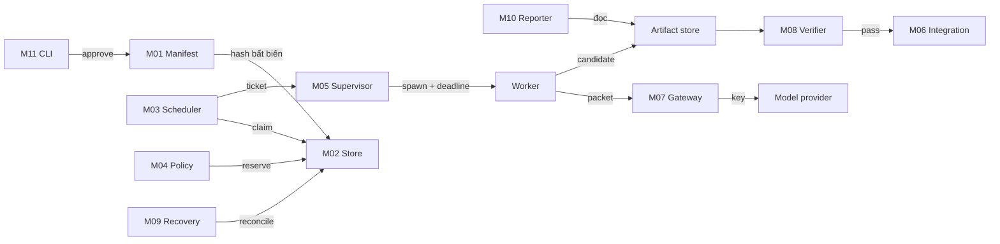
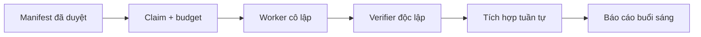
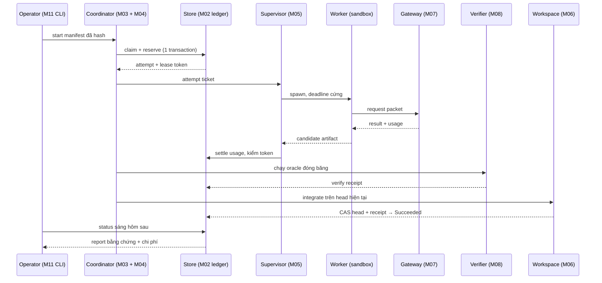
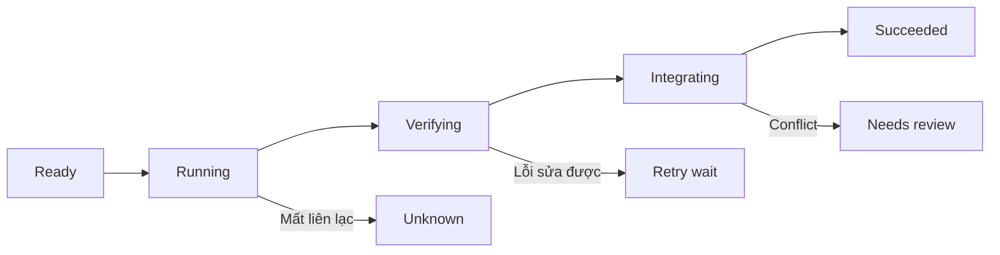
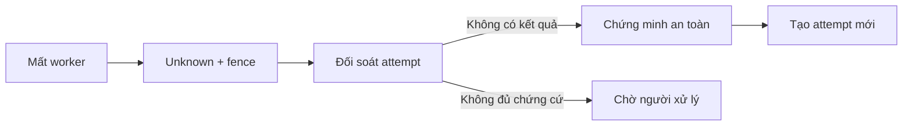

# Overnight loop độc lập

Đánh giá Overstack theo Loop Stack · PRD v1.0 · 23/09/2026

## 01 · Kết luận: mạnh ở Task loop, Product loop mới khép một phần

**Nguồn pattern:** [P01 · Loop Stack và Oversight loop — Laurie Voss](https://www.linkedin.com/pulse/what-hell-loop-anyway-laurie-voss-ldmdc/); [P02 · Các vòng lồng nhau — swyx / Shawn Wang · Latent Space](https://www.latent.space/p/loopcraft); [P03 · Tìm việc → giao → kiểm → ghi nhớ → việc tiếp — Addy Osmani](https://addyosmani.com/blog/loop-engineering/).

Áp dụng là diễn giải cho PRD này; nguồn không bảo chứng implementation. Xem mục 16 để biết phần kế thừa và giới hạn từng nguồn.


**Vị trí hiện tại: Task loop là năng lực rõ nhất; Product loop đã có nền móng.** Overstack không chỉ ở Execution loop: có verify/revise, giới hạn vòng, queue DAG, checkpoint, graph state bền và cơ chế điều phối. Tuy vậy, những mảnh này chưa chứng minh một vòng vận hành qua đêm thống nhất: tự nhận việc đã duyệt → chạy có giới hạn → kiểm độc lập → tích hợp → phục hồi → giao báo cáo.

System loop có công cụ đánh giá và ghi nhận bài học, nhưng chưa đủ bằng chứng về tự cải tiến được đo trên bộ eval độc lập rồi tự promote. Oversight loop là vai trò điều hành của người, đã hiện diện qua các cổng duyệt; không phải huy hiệu cao nhất mà agent tự đạt được khi chạy lâu.

**Đích của PRD:** xây một Product loop có giới hạn cho một batch công việc được duyệt, bọc các Task loop bằng scheduler bền, budget cứng, verifier độc lập và recovery. Một đêm kết thúc được; vòng đời sản phẩm vẫn có thể tiếp tục vào đêm khác. “Product loop không có exit, by design” trong ảnh không có nghĩa một process phải chạy vô hạn.

Phạm vi phiên này: chỉ tài liệu và ví dụ học tập. Không triển khai overnight runner vào framework, không đổi cấu hình, không gọi model trả phí, không sửa repo engine. Code mẫu được chạy trong thư mục tạm. PRD là đề xuất thiết kế, chưa phải tính năng đã có.

### Cách đọc trong 10 phút

1. Đọc mục 02–03 để biết phần đang có và khoảng trống.
2. Đọc mục 04–07 để hiểu sản phẩm, kiến trúc, contracts và state machine.
3. Fresher nhận một ticket ở mục 09; mở code tương ứng trong mục 14.
4. QA lấy kịch bản ở mục 10; người vận hành lấy recovery/rollout ở mục 11–12.

### Quy ước bằng chứng

- **Quan sát code:** đã đọc file/hàm cụ thể tại snapshot bên dưới.
- **Đã chạy kiểm:** lệnh đã chạy trong phiên, có kết quả thật.
- **Chưa chứng minh:** không suy thành “không tồn tại ở mọi nơi”; chỉ chưa có bằng chứng trong phạm vi đã kiểm tra.
- **Đề xuất:** yêu cầu của sản phẩm mới; không được tính vào mức trưởng thành hiện tại.

Nguồn khung phân loại: [Laurie Voss — bài gốc](https://www.linkedin.com/pulse/what-hell-loop-anyway-laurie-voss-ldmdc/), [bản O’Reilly đăng lại có phép](https://www.oreilly.com/radar/what-the-hell-is-a-loop-anyway/) và [Loopcraft của swyx](https://www.latent.space/p/loopcraft).

Snapshot Overstack: `50a0fdac64f73eb038813a63ef541cd19775b283`. Engine ngoài cài tại `~/.orca-graph/repo`, VERSION `3.2.0`, SHA `2aefd05a5f381fddd1de46f6c260c99fb6c76c0d`. Đây là bản trên máy được kiểm tra, không phải khẳng định bản mới nhất trên mạng. Worktree ban đầu đã có thay đổi ở metrics và wiki log; đánh giá không chỉnh các file đó.

## 02 · Đặt framework vào năm lớp của ảnh

**Nguồn pattern:** [P01 · Loop Stack và Oversight loop — Laurie Voss](https://www.linkedin.com/pulse/what-hell-loop-anyway-laurie-voss-ldmdc/); [P02 · Các vòng lồng nhau — swyx / Shawn Wang · Latent Space](https://www.latent.space/p/loopcraft); [P04 · Ralph / lặp task theo spec và feedback — Geoffrey Huntley](https://ghuntley.com/loop/).

Áp dụng là diễn giải cho PRD này; nguồn không bảo chứng implementation. Xem mục 16 để biết phần kế thừa và giới hạn từng nguồn.


| Lớp trong ảnh | Exit trong ảnh | Đánh giá hiện tại | Bằng chứng và giới hạn |
| --- | --- | --- | --- |
| Execution loop | Hết tool calls | Có, phụ thuộc runtime của agent | Harness/skills bao quanh runtime; gọi tool xong không đồng nghĩa đạt yêu cầu. Không tự nhận đã xây engine model riêng. |
| Task loop | Spec đạt, tests pass | Năng lực rõ nhất; có đường chạy cụ thể | `loop-runner.run_loop`, `/br run`, test protection, xác nhận verify lặp lại. Hook revise mặc định null; `/br` có adapter riêng. Chưa có kiểm qua đêm với provider thật trong phiên này. |
| Product loop | Không có exit cố định ở cấp sản phẩm | Một phần | `br-queue` xếp DAG và resume; graph giữ lifecycle, resource claims; chưa chứng minh chu trình chọn backlog, tích hợp artifact và tổng nghiệm thu thống nhất. |
| System loop | Evals/judges chứng minh tốt hơn | Một phần, chủ yếu công cụ hỗ trợ | Trace grader, wikieval, ratchet, flywheel. Flywheel tạo draft, không tự promote; judge trong trace config tắt. Có metric không tự động thành vòng tự cải tiến an toàn. |
| Oversight loop | Người quyết định | Có ở workflow, chưa đủ control plane cho đêm dài | Có gate/approval, graph pause/cancel. Cần một run manifest bất biến, quyền được cấp theo đêm, kill switch và báo cáo độc lập với chat. |

Không quy đổi thành “đạt 3/5” hay phần trăm trưởng thành: năm vòng lồng nhau về phạm vi trách nhiệm; một hệ có thể có oversight tốt nhưng recovery ở task còn yếu. Kết luận chỉ phản ánh khả năng khép vòng quan sát được.

### Tránh ba cách đọc sai

**Daemon sống không đồng nghĩa Product loop sống.** `watch_once()` thu hồi lease, reconcile node unknown và vẽ cockpit. Không thấy nhánh tự chọn mọi node ready rồi spawn worker mới trong hàm này.

**Budget giữa các vòng không phải timeout của từng lệnh.** `loop-runner._run_cmd()` dùng `subprocess.run(..., shell=True)` không truyền timeout. Guard wall-clock ở đầu vòng không ngắt được một verify/revise đang treo trong vòng đó.

**Nhiều test xanh không đủ chứng minh overnight.** Selftest stub xác nhận control logic; không chứng minh model sửa đúng, chi phí thực, kill toàn bộ cây process, hay khả năng hồi phục sau host reboot.

## 03 · Inventory, khoảng trống và phần nên kế thừa

**Nguồn pattern:** [P03 · Tìm việc → giao → kiểm → ghi nhớ → việc tiếp — Addy Osmani](https://addyosmani.com/blog/loop-engineering/); [P05 · Initializer + tiến độ tăng dần + bàn giao bền — Justin Young · Anthropic](https://www.anthropic.com/engineering/effective-harnesses-for-long-running-agents); [P19 · Feedback + episodic memory — Noah Shinn, Federico Cassano, Edward Berman, Ashwin Gopinath, Karthik Narasimhan, Shunyu Yao](https://arxiv.org/abs/2303.11366).

Áp dụng là diễn giải cho PRD này; nguồn không bảo chứng implementation. Xem mục 16 để biết phần kế thừa và giới hạn từng nguồn.


| ID | Thành phần thật | Quan sát cụ thể | Tác động tới overnight |
| --- | --- | --- | --- |
| E01 | `harness/scripts/loop-runner.py` · `_run_cmd`, `run_loop` | Có SUCCESS/MAX_ITER/TIMEOUT/NO_PROGRESS/ESCALATE, hash tiến triển, verify confirm, scope/protect, ratchet tùy chọn. Lệnh con thiếu timeout trực tiếp. | Kế thừa exit reason và verify tất định; thay supervisor có deadline cho mỗi process. |
| E02 | `harness/loop-runner.config.yaml` · `revise` | `revise.cmd: null`, `revise.verified: false`; verified ở cấp ngoài không chứng minh adapter LLM. | Preflight phải kiểm đúng capability adapter, không chỉ một cờ verified chung. |
| E03 | `fdk/tools/br-run.py` · `build_loop_command`, `run` | Worktree, revise đã nối, confirm=2, commit trên nhánh; setup command có thể chạy ngoài vòng kiểm. | Nền tốt cho task. Setup cũng phải có timeout/budget. Tránh tái dùng tên branch/đường dẫn attempt rồi xóa dữ liệu cũ. |
| E04 | `fdk/tools/br-revise.py` · `build_and_maybe_call` | Render prompt + gọi `claude -p`; code ghi rõ actual model call còn boundary chưa xác minh. | Contract provider phải chuẩn hóa usage, cancellation, error; mock riêng với provider thật. |
| E05 | `fdk/tools/br-queue.py` · `load_graph`, `save_queue` | Topo scheduling, blocked downstream, resume bỏ qua done; YAML ghi trực tiếp; bỏ dependency ngoài queue, có fallback cycle. | Giữ ý tưởng DAG; v1 mới phải fail closed khi dependency thiếu/cycle, lưu transaction và ràng buộc input hash. |
| E06 | `harness/scripts/orca-graph.py` | Là shim tìm engine ngoài, không chứa logic graph. | Không đánh giá shim như scheduler; không import engine này vào lõi độc lập. |
| E07 | Engine `orca-graph.py` · `cmd_run`, `watch_once`, `spec_hash` | Lease, generation, resource claims, state/event, QC; watcher reconcile. Vòng chờ child hiện không thấy deadline tổng. | Kế thừa token/generation; xây supervisor và admission bền, tránh chỉ heartbeat theo PID. |
| E08 | Engine `evals/vt-matrix.json` | VT-07/08 ngoài phạm vi: backpressure/outbox; VT-16 ngoài phạm vi frozen oracle; không được nhận vơ là covered. | Đây là các ticket cần làm cho sản phẩm mới, không phải lỗi engine khi nó chủ ý giới hạn phạm vi. |
| E09 | `harness/token-budget.config.yaml` và `session-continue.py` | `mode: warn`, rates minh họa; auto handover hoạt động theo một số ngưỡng context/session. | Handover giúp tiếp nối context, không thay thế ledger ngân sách cấp run. Cần reserve trước dispatch và cap không reset khi đổi phiên. |
| E10 | `harness/scripts/flywheel.py` | Capture → count → draft; thiếu distill model thì tạo stub, không auto-promote. | Học bài học nên tạo đề xuất cho người xem vào sáng hôm sau. Chưa cho hệ tự sửa policy giữa đêm. |
| E11 | `harness/scripts/trace-grader.py`, `harness/trace-grader.config.yaml` | Chấm trace/pass^k; judge disabled; tool blacklist không hiểu đầy đủ nội dung shell. | Dùng làm evidence tùy chọn. Không xem trace grader là sandbox hay bảo đảm không có hành vi ngoài scope. |
| E12 | `fdk/tools/checkpoint.py` | Git checkpoint và tier của effect. Rollback code không undo email/API/DB ngoài. | Phân loại effect trước chạy; lưu evidence mới khi rollback, không rewrite lịch sử. |

### Kiểm đã chạy cho đánh giá

`python3 harness/scripts/loop-runner.py selftest` → ALL PASS; `python3 fdk/tools/br-revise.py selftest` → ALL PASS; `python3 fdk/tools/br-queue.py selftest` → ALL PASS; `python3 fdk/tools/br-run.py selftest` → ALL PASS (worktree + revise stub). Các selftest dùng fixture/stub, không gọi model thật. Kết quả code mẫu và kiểm HTML nằm ở mục 14.

Không dùng tài liệu “Outer Harness” tháng 06 làm sự thật hiện tại: những kết luận cũ như thiếu task ID/lifecycle đã có thay đổi sau khi graph engine xuất hiện. PRD đối chiếu trực tiếp code tháng 09. Chưa chạy toàn bộ regression engine, chưa chạy soak 8 giờ, chưa đo provider thật trong phiên đánh giá.

### Quyết định build/reuse

| Kế thừa nguyên tắc | Thiết kế mới | Chỉ qua adapter tùy chọn |
| --- | --- | --- |
| Verify quyết định pass; generation; immutable evidence; topo; tier của effect | SQLite store, coordinator, outbox, budget reservation, isolated attempt, integration gate, morning report | Import PLAN/frame từ Overstack; export status sang Orca; trace grader/wikieval; provider CLI/API |

“Không phụ thuộc” được hiểu là bỏ Overstack, Orca, wiki và global skill khỏi máy thì lõi vẫn chạy với Git + Python + SQLite và mock provider. Provider thật vẫn là dependency của adapter được chọn. Thiết kế không đòi import code, gọi đường dẫn home cứng, đọc biến global của framework, hoặc daemon graph hiện tại.

## 04 · PRD: mục tiêu, phạm vi và trải nghiệm

**Nguồn pattern:** [P03 · Tìm việc → giao → kiểm → ghi nhớ → việc tiếp — Addy Osmani](https://addyosmani.com/blog/loop-engineering/); [P05 · Initializer + tiến độ tăng dần + bàn giao bền — Justin Young · Anthropic](https://www.anthropic.com/engineering/effective-harnesses-for-long-running-agents).

Áp dụng là diễn giải cho PRD này; nguồn không bảo chứng implementation. Xem mục 16 để biết phần kế thừa và giới hạn từng nguồn.


Tên tạm: **Nightshift**. Đối tượng: một kỹ sư giao batch việc rõ tiêu chí vào buổi tối; sáng hôm sau xem thay đổi, bằng chứng và phần cần quyết định. Chủ sản phẩm duyệt scope; fresher xây module; senior review transaction, sandbox và integration trước chạy thật.

### Kịch bản chuẩn

21:30, người dùng chọn repo và một baseline commit, duyệt tối đa 6 task cùng acceptance commands, đường dẫn được sửa, ngân sách và giờ dừng. Preflight chạy bộ kiểm baseline. 22:00 runner nhận manifest đã duyệt, xử lý task ready trong worktree riêng, verify rồi tích hợp tuần tự vào nhánh review. Task lỗi được retry có giới hạn; phụ thuộc hỏng không chạy. Trước 06:00 mọi worker dừng hoặc bị cưỡng chế dừng; báo cáo ghi rõ completed/partial/blocked cùng diff và test receipt. Người dùng quyết định merge/push vào ban ngày.

### Mục tiêu v1

- Một máy Linux chuyên dụng, local filesystem, một coordinator, mặc định một worker; tối đa hai worker chỉ sau gate parallel. SQLite không đặt trên NFS.
- Một manifest cố định trong một run; batch tối đa 20 task, mỗi task có acceptance rõ. Chọn việc có scope code, không tự phát minh backlog.
- Chạy tối đa 8 giờ theo deadline tuyệt đối; config có thể ngắn hơn. Mọi attempt có max wall time, token/call cap và sandbox riêng.
- Chỉ thay đổi nội dung local trong checkout riêng; tạo nhánh review và artifact. Không tự merge vào nhánh người dùng, không tự deploy hay gửi tin.
- Giữ tiến độ qua crash; mọi task có outcome và reason machine-readable. Không có trạng thái im lặng “mất tích”.

### Ngoài phạm vi v1

Multi-host scheduler, auto-discovery vô hạn, tự sửa framework/policy/oracle, production credentials, tự chi tiền tăng budget, tự quyết business acceptance mơ hồ. Không tối ưu theo số dòng code hoặc số commit. Không đảm bảo mọi task hoàn thành; đảm bảo mỗi kết quả hoặc dừng đều giải thích được.

### Yêu cầu chức năng có truy vết

| FR | Hệ thống phải | Tickets | Acceptance |
| --- | --- | --- | --- |
| FR01 | Đóng băng manifest đã duyệt, reject contract không hợp lệ | N01–02 | AT01–03/28 |
| FR02 | Lưu transaction và outbox bền qua crash | N03–04 | AT04–06/26 |
| FR03 | Chọn task theo dependencies; blocked có lý do | N05 | AT07–08/29 |
| FR04 | Claim đúng một active attempt, fencing mọi publish | N06 | AT09–11 |
| FR05 | Reserve trước dispatch, không reset budget khi resume | N07 | AT12–14 |
| FR06 | Thực thi pause/cancel và quyền đã duyệt | N08 | AT15–16/30 |
| FR07 | Giới hạn process tree, logs, deadline mọi phase | N09–10 | AT17–19 |
| FR08 | Cô lập workspace và bảo toàn checkout gốc | N11–12 | AT20–23 |
| FR09 | Provider thay được qua envelope thống nhất | N13–14 | AT13/24/27 |
| FR10 | Verify độc lập, không tin self-reported success | N15 | AT20/25/27–28 |
| FR11 | Tích hợp tuần tự và kiểm lại head kết hợp | N16 | AT31–32 |
| FR12 | Retry hữu hạn và reconcile effect chưa rõ | N17–18 | AT10/14/22/33 |
| FR13 | Report machine-readable và HTML đủ evidence | N19 | AT29/34 |
| FR14 | Control CLI idempotent và optional importer | N20–21 | AT09/15–16/35–36 |
| FR15 | Chaos suite, canary và rollback trước phát hành | N22–24 | Toàn bộ P0 + G0–G6 |

### User stories

| ID | Người dùng cần | Tiêu chí thành công |
| --- | --- | --- |
| US01 | Giao một batch rồi đi ngủ | `preflight` báo phạm vi và dự toán trần; `start` trả run_id và deadline. |
| US02 | Sáng biết đã làm được gì | Report tách task verified, integrated, blocked; mở được artifact và lệnh test. |
| US03 | Dừng khi thấy chạy sai | `cancel` trả requested ngay; within 10 giây trên host khỏe mọi process thuộc run bị dừng. |
| US04 | Restart mà không tốn gấp đôi | Resume đọc ledger cũ; không reset budget/attempt; unknown phải reconcile. |
| US05 | Thay provider về sau | Chạy cùng contract suite cho mock và provider mới, core không đổi. |
| US06 | Fresher thực hiện từng phần | Ticket có file, contract, test fixture, lệnh chạy và điều kiện merge riêng. |

### Thước đo nghiệm thu sản phẩm

Safety invariant: 0 publish sai generation; 0 completed khi oracle fail; 0 dispatch vượt reservation cap; 0 sửa checkout gốc. Reliability: tất cả crash boundary được test; 3 đêm canary liên tiếp có đủ report và không orphan worker. Chất lượng: đo tỷ lệ task được người chấp nhận trên ít nhất 20 task thực; **mục tiêu đề xuất** ≥80%, không coi là đã đạt. Không đủ mẫu phải ghi n/N. Mốc 8 giờ, 20 task, 80% là giả định thiết kế cần hiệu chỉnh sau pilot.

## 05 · Kiến trúc độc lập và ranh giới tin cậy

**Nguồn pattern:** [P06 · Ports & Adapters — Alistair Cockburn](https://alistair.cockburn.us/hexagonal-architecture); [P15 · Hermetic execution và giới hạn filesystem — Nhóm Bazel](https://bazel.build/docs/sandboxing); [P16 · Least privilege ở runtime container — Nhóm Docker](https://docs.docker.com/engine/security/rootless/).

Áp dụng là diễn giải cho PRD này; nguồn không bảo chứng implementation. Xem mục 16 để biết phần kế thừa và giới hạn từng nguồn.


### Block diagram: ai giữ state, ai chạy code lạ



Hình này trả lời câu hỏi "khối nào nối với khối nào, và ranh giới tin cậy nằm ở đâu". Có bốn vùng: operator giữ quyền local; coordinator là nơi duy nhất ghi state; worker chạy trong sandbox không có mạng; verifier chạy trong một sandbox riêng. Worker chỉ đi ra ngoài qua gateway, và gateway là khối duy nhất giữ credential của model provider. Recovery và Reporter không nằm trên đường chạy chính: Recovery chỉ reconcile ledger, còn Reporter chỉ đọc.

### Luồng một lượt chạy



Sơ đồ trên mô tả một lượt thành công; không bao gồm mọi cạnh retry. Nhãn trong sơ đồ bằng tiếng Việt; control của viewer archify dùng tiếng Anh do engine chưa có locale Việt. Thứ tự nối là đường đi chính, các nhãn cạnh trùng hoàn toàn với tên bước được lược để dễ đọc.

### Sequence: một lượt task theo thời gian



Sequence diagram trả lời câu hỏi "ai gọi ai, theo thứ tự nào". Nó đi hết bốn chặng: admission (claim và reserve trong cùng một transaction, rồi mới cấp lease token), chạy và settle (worker chỉ nói chuyện với gateway; supervisor settle usage có kiểm token, nên kết quả của một attempt cũ không ghi được state), verify và integrate (oracle đóng băng, sau đó CAS lên head hiện tại), và báo cáo sáng hôm sau. Hình chỉ vẽ đường thành công; các nhánh retry, Unknown và Needs review nằm ở sơ đồ recovery (mục 11) và state machine (mục 07).

### Thành phần và ownership

| Module | Trách nhiệm duy nhất | Đọc | Ghi | Quyền tin cậy |
| --- | --- | --- | --- | --- |
| M01 Manifest | Validate, approve, đóng băng contract | Input user, baseline | Manifest + hash | Người/operator |
| M02 Store | Transactions, events, migrations, outbox | SQLite | Run/task/attempt/event | Chỉ coordinator |
| M03 Scheduler | Chọn ready, resource admission, drain | Graph + task state | Claim qua M02 | Không gọi model |
| M04 Policy/budget | Quyền, reserve/settle, deadline | Manifest + usage | Reservation qua M02 | Worker không ghi |
| M05 Supervisor | Spawn, timeout, cancel, reap | Attempt ticket | Process receipt | Host supervisor |
| M06 Workspace | Baseline, attempt clone, diff, integration | Git object + artifact | Nhánh review riêng | Không đụng checkout gốc |
| M07 Provider | Chuẩn hóa request/result/usage | Packet tối thiểu | Candidate + result | Không tin lời “done” |
| M08 Verifier | Chạy oracle đã đóng băng | Candidate + oracle | Verify receipt | Môi trường riêng |
| M09 Recovery | Reconcile, stale result, retry | Ledger + process/artifact | Quyết định có evidence | Không retry effect mơ hồ |
| M10 Reporter | Tổng hợp bằng chứng và chi phí | Snapshot store | HTML/JSON report | Read-only với state |
| M11 CLI/control | Start/status/pause/resume/cancel | Lệnh operator | Control intent | Local permission |
| M12 Test/rollout | Contract suite, chaos, canary | Fixtures/receipts | Test result | Chặn phát hành |

SQLite giữ run, task revision, attempt, reservation, event và outbox trong cùng database. Artifact store chứa blob bất biến đặt tên theo SHA-256. Worker chỉ thấy input packet và checkout được cấp; không mount state.db, oracle gốc, SSH agent socket, home directory hoặc token điều phối. Verifier không chạy trong container có quyền chỉnh test của worker.

### Sandbox có hiệu lực

Worktree cô lập thay đổi Git **không phải sandbox OS**. V1 chạy worker trong container Linux rootless, user không đặc quyền, root filesystem chỉ đọc, dropped capabilities, no-new-privileges, quota CPU/RAM/PID/disk, chỉ mount attempt directory writable. Tắt network cho code worker; nếu cần provider qua mạng, coordinator/gateway giữ credential và chỉ cho endpoint được cấu hình. Không mount Docker socket vào worker.

Các lệnh setup và verify cũng thực thi code của repo, vì vậy phải chạy trong sandbox riêng. Setup lockfile/dependency snapshot được chuẩn bị trước run, không để model tự cài package từ mạng trong đêm. Mọi run provider thật phải qua ticket sandbox; demo mock không chứng minh sandbox.

### Dependency rule cho mã nguồn mới

Core chỉ import standard library và module trong package `nightshift`. Provider, importer, reporter UI nằm ngoài core. Adapter phụ thuộc vào contract, core không import adapter cụ thể; bootstrap/CLI tiêm adapter. Integration tests chạy khi không có `orca`, `claude`, thư mục `llmwiki`, HOME skill hoặc biến Overstack.

## 06 · Contracts đủ để hai người code riêng

**Nguồn pattern:** [P07 · Precondition, postcondition, invariant — Bertrand Meyer / Eiffel Software](https://archive.eiffel.com/doc/manuals/technology/contract/); [P10 · Transactional outbox + idempotent consumer — Chris Richardson](https://microservices.io/patterns/data/transactional-outbox.html); [P12 · Idempotency key, late arrival, intent identity — Malcolm Featonby · Amazon Builders’ Library](https://aws.amazon.com/builders-library/making-retries-safe-with-idempotent-APIs/).

Áp dụng là diễn giải cho PRD này; nguồn không bảo chứng implementation. Xem mục 16 để biết phần kế thừa và giới hạn từng nguồn.


Quy ước chung: JSON UTF-8; schema có `schema_version`; thời gian UTC ISO-8601; deadline lưu epoch trong DB; duration đo monotonic trong cùng process. ID dùng UUID; tiền bằng integer micro-USD; không dùng float cho tiền. Giá provider là input cấu hình được pin, không chép con số minh họa từ framework cũ. Không có usage thật thì ghi `usage_status=unknown`, giữ nguyên reservation và dừng admission nếu không còn trần bảo thủ.

### C01 · ApprovedRunManifest

**Nguồn pattern:** [P07 · Precondition, postcondition, invariant — Bertrand Meyer / Eiffel Software](https://archive.eiffel.com/doc/manuals/technology/contract/).

Áp dụng là diễn giải cho PRD này; nguồn không bảo chứng implementation. Xem mục 16 để biết phần kế thừa và giới hạn từng nguồn.


```json
{
  "schema_version": "nightshift.manifest/1",
  "run_id": "run-demo-001",
  "repo_id": "local-fixture",
  "baseline_sha": "<40-hex từ git rev-parse HEAD>",
  "approved_by": "local-operator",
  "approved_manifest_hash": "<SHA-256 canonical JSON, loại field này>",
  "deadline_utc": "2026-09-24T23:00:00Z",
  "max_workers": 1,
  "budget": {"max_calls": 40, "max_tokens": 200000, "max_cost_microusd": 10000000},
  "policy": {"network": "deny", "external_effects": "deny", "auto_push": false},
  "tasks": [{
    "task_id": "T1", "revision": 1, "goal": "Sửa lỗi fixture đã mô tả",
    "depends_on": [], "allowed_paths": ["src/parser.py"],
    "protected_paths": ["acceptance/**", ".github/**"],
    "input_artifacts": [], "output_contract": "candidate.patch/1",
    "verify_profile": "parser-acceptance-v1", "oracle_hash": "<64-hex>",
    "max_attempts": 3, "attempt_timeout_s": 900,
    "resources": [{"name": "integration", "mode": "exclusive"}],
    "effect_class": "local_reversible"
  }]
}
```

Đây là **contract minh họa v1 production**, không phải file copy chạy ngay: SHA/hash phải được CLI điền từ dữ liệu thật. File `manifest.json` trong bộ mẫu là schema demo nhỏ hơn, chạy trực tiếp được. Thời gian ví dụ trên là 06:00 ngày 25/09 ở Việt Nam; luôn hiển thị cả UTC và Asia/Ho_Chi_Minh.

Validation bắt buộc: reject unknown keys trong object control; ID trùng, missing deps, cycles, empty batch, deadline quá khứ, cap ≤0, không có verify, path absolute/`..`/symlink escape, protected trùng allowed, baseline không tồn tại. Chỉ operator đổi policy. Manifest đổi byte có ý nghĩa → run mới hoặc plan revision qua pause; v1 chọn **run mới** cho đơn giản.

### C02 · AttemptTicket và StateEvent

**Nguồn pattern:** [P11 · Lease và fencing token — Martin Kleppmann](https://martin.kleppmann.com/2016/02/08/how-to-do-distributed-locking.html); [P12 · Idempotency key, late arrival, intent identity — Malcolm Featonby · Amazon Builders’ Library](https://aws.amazon.com/builders-library/making-retries-safe-with-idempotent-APIs/).

Áp dụng là diễn giải cho PRD này; nguồn không bảo chứng implementation. Xem mục 16 để biết phần kế thừa và giới hạn từng nguồn.


```json
{
  "schema_version": "nightshift.attempt/1",
  "run_id": "run-demo-001", "task_id": "T1", "revision": 1,
  "attempt_id": "uuid", "attempt_number": 1, "generation": 7,
  "lease_owner": "worker-1", "lease_until": "2026-09-24T15:02:00Z",
  "input_hash": "sha256", "manifest_hash": "sha256",
  "workspace_id": "workspace-uuid", "reservation_id": "reservation-uuid",
  "deadline_utc": "2026-09-24T15:15:00Z"
}
```

`StateEvent={event_id,seq,run_id,task_id,attempt_id,kind,from_state,to_state,generation,payload,created_at}`. Unique `(run_id,event_id)` để duplicate event không tạo effect hai lần; unique `(task_id,revision,attempt_number)`; CAS nhận kết quả kiểm đồng thời revision + generation + active attempt + state được phép. Heartbeat chỉ gia hạn đúng owner/generation còn hiệu lực; không hồi sinh attempt đã fenced.

### C03 · ProviderAdapter

**Nguồn pattern:** [P06 · Ports & Adapters — Alistair Cockburn](https://alistair.cockburn.us/hexagonal-architecture); [P07 · Precondition, postcondition, invariant — Bertrand Meyer / Eiffel Software](https://archive.eiffel.com/doc/manuals/technology/contract/).

Áp dụng là diễn giải cho PRD này; nguồn không bảo chứng implementation. Xem mục 16 để biết phần kế thừa và giới hạn từng nguồn.


```python
from typing import Protocol, Mapping, Any

class ProviderAdapter(Protocol):
    def preflight(self) -> Mapping[str, Any]:
        """Return capabilities: cancel, usage, token_limit, sandbox, protocol_version."""

    def execute(self, request: Mapping[str, Any]) -> Mapping[str, Any]:
        """One bounded call. Output schema ResultEnvelope; never mutate coordinator state."""

    def cancel(self, attempt_id: str) -> None:
        """Idempotent cancellation request. Supervisor separately confirms process exit."""
```

`RequestEnvelope={schema_version,attempt_id,task_id,generation,prompt,input_artifacts,allowed_paths,max_output_tokens,deadline_utc}`. Không gửi secret, hidden oracle, toàn bộ transcript cũ hoặc lệnh user khác. `ResultEnvelope={schema_version,attempt_id,task_id,generation,status,artifact_manifest,usage,error}`. `status=produced|error|cancelled`; **không có status succeeded do model quyết**.

`artifact_manifest=[{name,relative_path,sha256,size_bytes,media_type}]`. `usage={input_tokens,output_tokens,cost_microusd,usage_status}`. Lỗi chuẩn: `RATE_LIMIT`, `AUTH`, `TRANSIENT`, `PROTOCOL`, `TIMEOUT`, `CANCELLED`, `POLICY`, `UNKNOWN_EFFECT`. Parser reject sai schema/ID/extra control field; cap result metadata 1 MiB; cap artifact theo policy. Stdout protocol riêng, stderr log riêng.

### C04 · VerifyReceipt

**Nguồn pattern:** [P07 · Precondition, postcondition, invariant — Bertrand Meyer / Eiffel Software](https://archive.eiffel.com/doc/manuals/technology/contract/); [P15 · Hermetic execution và giới hạn filesystem — Nhóm Bazel](https://bazel.build/docs/sandboxing).

Áp dụng là diễn giải cho PRD này; nguồn không bảo chứng implementation. Xem mục 16 để biết phần kế thừa và giới hạn từng nguồn.


```json
{
  "schema_version": "nightshift.verify/1",
  "attempt_id": "uuid", "generation": 7,
  "manifest_hash": "sha256", "input_hash": "sha256",
  "candidate_hash": "sha256", "oracle_hash": "sha256",
  "environment_digest": "sha256", "verifier_version": "1.0.0",
  "checks": [{"check_id": "AC-parser-01", "exit_code": 0,
              "timed_out": false, "log_hash": "sha256"}],
  "verdict": "pass", "created_at": "2026-09-24T15:03:00Z"
}
```

Pass iff mọi required check rc=0, không timeout, oracle/scope không đổi, input/candidate đúng hash, coverage của acceptance IDs đủ. Model review chỉ bổ sung nhận xét, không ghi đè required check fail. Verifier crash là `inconclusive`, không pass. Baseline verify phải xanh trước run; baseline đỏ → `PREFLIGHT_FAILED`, không cho agent sửa “mọi thứ” để xanh.

### C05 · IntegrationReceipt và outbox

**Nguồn pattern:** [P10 · Transactional outbox + idempotent consumer — Chris Richardson](https://microservices.io/patterns/data/transactional-outbox.html); [P14 · Checkout riêng và compare-and-swap ref — Nhóm phát triển Git](https://git-scm.com/docs/git-worktree).

Áp dụng là diễn giải cho PRD này; nguồn không bảo chứng implementation. Xem mục 16 để biết phần kế thừa và giới hạn từng nguồn.


`IntegrationReceipt={run_id,task_id,attempt_id,expected_head_sha,candidate_hash,new_head_sha,combined_verify_receipt_hash,op_key}`. Nhánh review là tài nguyên exclusive. Nếu current head khác expected head: dựng candidate lại trên head mới rồi verify lại; không dùng receipt cũ.

Hai hệ SQLite/Git không có transaction chung. Dùng durable intent: transaction ghi `integration.pending(op_key,expected_head,candidate_hash)` → tạo commit riêng → CAS update nhánh review → transaction ghi receipt + succeeded + event + settle reservation + outbox. Crash ở giữa: đối soát intent và parent/tree/message marker của commit, xác minh ref trước khi publish. Không tuyên bố exactly-once cho mọi external API.

### C06 · MorningReport

**Nguồn pattern:** [P09 · Lịch sử sự kiện và trạng thái có thể giải thích — Martin Fowler](https://martinfowler.com/eaaDev/EventSourcing.html).

Áp dụng là diễn giải cho PRD này; nguồn không bảo chứng implementation. Xem mục 16 để biết phần kế thừa và giới hạn từng nguồn.


`{schema_version,run_id,status,started_at,deadline,stopped_at,manifest_hash,baseline_sha,review_head_sha,summary,tasks[],budget,evidence[],decisions_needed[]}`. Mỗi task có `state`, `reason_code`, `attempts`, `verified`, `integrated`, `artifact_links`, `next_action`. Số tổng derive từ rows cùng snapshot; không để model tự đếm. Tách “4 task verified” khỏi “3 task integrated”.

### C07 · Control và error contract

**Nguồn pattern:** [P21 · Supervision tree + giới hạn restart — Erlang/OTP team](https://www.erlang.org/doc/system/sup_princ.html); [P12 · Idempotency key, late arrival, intent identity — Malcolm Featonby · Amazon Builders’ Library](https://aws.amazon.com/builders-library/making-retries-safe-with-idempotent-APIs/).

Áp dụng là diễn giải cho PRD này; nguồn không bảo chứng implementation. Xem mục 16 để biết phần kế thừa và giới hạn từng nguồn.


| Command | Điều kiện | Response | Điều không được làm |
| --- | --- | --- | --- |
| Start | Manifest approved + preflight pass | Run ID, RUNNING | Tự bật network hoặc nâng budget |
| Pause | Run active | PAUSE_REQUESTED → PAUSED sau drain | Nhận thêm task mới |
| Resume | Paused; cùng manifest; chưa deadline | RUNNING hoặc NEEDS_REVIEW | Reset attempts, cost hay unknown |
| Cancel | Run chưa terminal | CANCEL_REQUESTED → CANCELLED/NEEDS_REVIEW | Báo cancelled khi child còn sống |
| Status | Run tồn tại | Snapshot JSON, exit 0 | Sửa state để “làm đẹp” report |

CLI production: exit 0 completed; 2 partial/budget/deadline; 3 invalid manifest/preflight; 4 lock conflict; 5 needs review; 6 internal failure. Lệnh control trả 0 nghĩa intent đã ghi, không đồng nghĩa work đã kết thúc. Mã lỗi luôn có `{code,retryable,detail,evidence_ref}`; credential/token bị redact.

## 07 · State machine, tính đúng và budget

**Nguồn pattern:** [P11 · Lease và fencing token — Martin Kleppmann](https://martin.kleppmann.com/2016/02/08/how-to-do-distributed-locking.html); [P12 · Idempotency key, late arrival, intent identity — Malcolm Featonby · Amazon Builders’ Library](https://aws.amazon.com/builders-library/making-retries-safe-with-idempotent-APIs/); [P13 · Bounded retry + jitter / OCC — Marc Brooker](https://aws.amazon.com/blogs/architecture/exponential-backoff-and-jitter/).

Áp dụng là diễn giải cho PRD này; nguồn không bảo chứng implementation. Xem mục 16 để biết phần kế thừa và giới hạn từng nguồn.




### Chuyển trạng thái có điều kiện

| Từ → đến | Guard bắt buộc | Atomic side effects |
| --- | --- | --- |
| Pending → Ready | Mọi dependency succeeded đúng revision; input đủ hash | Event readiness |
| Ready → Running | Control run, còn deadline/quota, resource đủ, lease claim thành công | Attempt + generation + reservation + dispatch outbox |
| Running → Verifying | Worker đã dừng; result đúng attempt; artifact đã bền | Artifact receipt + event |
| Verifying → Integrating | Required checks pass; không scope violation | Integration intent |
| Integrating → Succeeded | Head CAS thành công; combined verify pass; receipt bền | Completion + outbox downstream + settle |
| Running → Unknown | Lease mất, coordinator restart, ambiguous effect | Fence token; giữ reservation |
| Verifying → Retry wait | Lỗi sửa được; còn attempt/budget | Reason + next_eligible_at; backoff |
| Retry wait → Ready | Backoff hết; input vẫn fresh | Event; attempt sau có token mới |
| Any active → Needs review | Policy breach, conflict không an toàn, auth lỗi, effect mơ hồ | Stop admissions liên quan; evidence |
| Pending → Blocked | Dependency failed/cancelled; không có đường tiếp | blocked_by task IDs |

Các mũi tên trở lại Ready nêu trong bảng là một phần contract dù hình chỉ vẽ đường chính để dễ đọc. Task terminal không tự bật lại. Input upstream đổi → revision mới; mọi receipt downstream dựa trên input cũ bị đánh stale và lên lịch kiểm lại có budget mới được cấp.

### Những invariant QA phải kiểm

1. Một task revision có tối đa một active attempt được quyền publish. Generation cũ không được ghi state, ref Git hay artifact canonical.
2. Dispatch và reserve cùng transaction; worker chưa được spawn nếu chưa có durable ticket.
3. `spent + reserved + requested <= cap` trên từng quota bắt buộc. Settlement theo reservation_id là idempotent. Không có usage thì không hoàn lại tiền giả định.
4. Deadline cấp run không reset sau resume. Deadline attempt = min(run deadline, now + attempt limit); setup, agent, verify và integration đều nằm trong thời hạn.
5. Succeeded luôn có receipt kiểm đúng input/commit/oracle. Tests xanh ở worktree cũ không cấp phép publish vào head mới.
6. Worker không có quyền sửa ledger, oracle hoặc supervisor policy. Path validation chỉ là một lớp, sandbox OS mới hạn chế effect.
7. Không xóa workspace/branch chưa có receipt retention. Không sửa checkout gốc và không chạy reset hard lên cây người dùng.
8. Không có ready task ≠ completed: có thể đang blocked, resource wait, retry wait, paused hoặc unknown.

### Budget reservation mẫu production

```sql
BEGIN IMMEDIATE;
UPDATE runs
   SET reserved_micro = reserved_micro + :estimate
 WHERE run_id = :run_id AND control = 'run'
   AND spent_micro + reserved_micro + :estimate <= cap_micro;
-- Coordinator PHẢI kiểm rowcount == 1; nếu 0, ROLLBACK và không spawn.
INSERT INTO reservations(id, run_id, amount_micro, state)
VALUES(:reservation_id, :run_id, :estimate, 'held');
-- Claim task + insert attempt + dispatch outbox trong CÙNG transaction.
COMMIT;
```

Đây là đoạn contract SQL, không phải migration đầy đủ của code demo. Trần tiền chỉ cứng nếu adapter/provider thực thi giới hạn token/call trong reservation. Nếu provider không hỗ trợ bounded usage, chỉ cung cấp trần calls/time chắc chắn và **không cho rollout chế độ dollar-hard-cap**. Subscription “không tính theo token” vẫn phải giới hạn calls, thời gian và số attempt.

Retry đề xuất: tối đa 3 attempt/task; transient/rate limit backoff 10/30/90 giây với jitter có seed; không gọi lại nếu backoff vượt deadline. Hai lần cùng failure fingerprint và cùng candidate/input hash → NO_PROGRESS. Hash đổi nhưng tests không tiến triển không được coi là cải thiện vô hạn; max_attempts vẫn cứng. Auth, policy, schema mismatch không retry tự động.

## 08 · Sections triển khai và bản đồ phụ thuộc

**Nguồn pattern:** [P05 · Initializer + tiến độ tăng dần + bàn giao bền — Justin Young · Anthropic](https://www.anthropic.com/engineering/effective-harnesses-for-long-running-agents); [P06 · Ports & Adapters — Alistair Cockburn](https://alistair.cockburn.us/hexagonal-architecture); [P07 · Precondition, postcondition, invariant — Bertrand Meyer / Eiffel Software](https://archive.eiffel.com/doc/manuals/technology/contract/).

Áp dụng là diễn giải cho PRD này; nguồn không bảo chứng implementation. Xem mục 16 để biết phần kế thừa và giới hạn từng nguồn.


Mỗi section là một milestone review được. Fresher không nhận “xây overnight loop” như một ticket duy nhất. Definition of Ready: contract đã đọc, fixture chạy được, baseline test xanh, file ownership rõ. Definition of Done: code + test acceptance + receipt + ví dụ CLI + reviewer, không chỉ “đã viết hàm”.

| Section | Tickets | Kết quả nhìn thấy được | Phụ thuộc | Cổng |
| --- | --- | --- | --- | --- |
| A · Nền dữ liệu | N01–N04 | Import manifest, durable ledger, migrate/restore | Không | G0 mock/schema |
| B · Điều phối có giới hạn | N05–N08 | Ready set, claims, budget, control | A | G1 deterministic |
| C · Thực thi cô lập | N09–N14 | Kill child, workspace, mock/provider protocol | A+B | G2 sandbox |
| D · Kiểm và tích hợp | N15–N18 | Oracle, receipts, integration, retry/recovery | B+C | G3 daytime |
| E · Vận hành và phát hành | N19–N24 | Report, API/CLI, chaos, canary | A–D | G4/G5 overnight |

Các tuyến có thể phân công song song sau khi contract ổn định: N03/N05/N07; N09/N11/N13; N19/N20. N12 cần N11; N15 cần N12+N14; N16 cần N15; N18 cần N16+N17. Không merge code cùng file khi chưa thống nhất interface. Một fresher chạy tuần tự vẫn theo đúng thứ tự này.

Ước lượng để lập kế hoạch, chưa phải cam kết: mỗi ticket 0,5–2 ngày tập trung; toàn bộ khoảng 30–45 person-days gồm test/hardening, cộng 3–5 đêm canary. Một fresher có senior hỗ trợ thường cần 6–9 tuần; không dùng số module để hứa một cuối tuần hoàn thành.

## 09 · Ticket backlog cho fresher

**Nguồn pattern:** [P06 · Ports & Adapters — Alistair Cockburn](https://alistair.cockburn.us/hexagonal-architecture); [P07 · Precondition, postcondition, invariant — Bertrand Meyer / Eiffel Software](https://archive.eiffel.com/doc/manuals/technology/contract/).

Áp dụng là diễn giải cho PRD này; nguồn không bảo chứng implementation. Xem mục 16 để biết phần kế thừa và giới hạn từng nguồn.


Mỗi ticket bên dưới có thể chuyển nguyên văn vào issue tracker. `src/nightshift/` là repo mới đề xuất, chưa tạo trong framework. “Mẫu” trỏ file trong bộ ZIP học tập ở mục 14; các đoạn production chỉ là điểm bắt đầu, phải đạt AC trước khi coi ticket xong.

### N01 · Khởi tạo package và mock fixture — M01 · 0,5 ngày

**Nguồn pattern:** [P06 · Ports & Adapters — Alistair Cockburn](https://alistair.cockburn.us/hexagonal-architecture).

Áp dụng là diễn giải cho PRD này; nguồn không bảo chứng implementation. Xem mục 16 để biết phần kế thừa và giới hạn từng nguồn.


**Phụ thuộc:** không. **Files:** `pyproject.toml`, `src/nightshift/__init__.py`, `tests/fixtures/repo/`, `README.md`. **Contract:** Python ≥3.11, Linux cho production; demo POSIX cũng chạy macOS. **Làm:** tạo CLI entrypoint, fixture repo có lỗi một dòng và acceptance test cố định; đặt version schema. **Mẫu:** `cli.py`, `manifest.json`. **AC:** máy không có Orca/Overstack vẫn chạy `python3 -m unittest discover -v`; chưa cấu hình provider vẫn chạy mock. **Bẫy:** import từ `~/.claude` hoặc dùng cwd ngầm.

### N02 · Validate và đóng băng manifest — M01 · 1 ngày

**Nguồn pattern:** [P07 · Precondition, postcondition, invariant — Bertrand Meyer / Eiffel Software](https://archive.eiffel.com/doc/manuals/technology/contract/).

Áp dụng là diễn giải cho PRD này; nguồn không bảo chứng implementation. Xem mục 16 để biết phần kế thừa và giới hạn từng nguồn.


**Phụ thuộc:** N01. **Files:** `contracts/manifest.py`, `contracts/manifest.schema.json`, `tests/test_manifest.py`. **Input/output:** JSON user → C01 hợp lệ + canonical hash hoặc error code. **Làm:** validate field/type, deps, cycle, paths, baseline, verify profile, cap; approve tạo snapshot ngoài writable mount. **Mẫu:** `contracts.py`. **AC:** AT01–03, AT28; cùng JSON khác whitespace có cùng hash; đổi acceptance làm khác hash. **Bẫy:** hash bao gồm chính field hash; nhận NaN; boolean bị xem là integer; path symlink thoát root.

### N03 · SQLite schema và transaction helper — M02 · 1,5 ngày

**Nguồn pattern:** [P08 · Atomic transaction và crash consistency — Nhóm SQLite](https://sqlite.org/atomiccommit.html); [P09 · Lịch sử sự kiện và trạng thái có thể giải thích — Martin Fowler](https://martinfowler.com/eaaDev/EventSourcing.html).

Áp dụng là diễn giải cho PRD này; nguồn không bảo chứng implementation. Xem mục 16 để biết phần kế thừa và giới hạn từng nguồn.


**Phụ thuộc:** N02. **Files:** `store/schema.sql`, `store/db.py`, `tests/test_store.py`. **Contracts:** C01/C02/C06. **Làm:** tables runs/tasks/task_deps/attempts/events/reservations/outbox/artifacts; PK/FK/unique/check state; WAL+FULL; transaction helper rollback cả exception/cancel. **Mẫu:** `store.py`. **AC:** AT04/05; injected error giữa claim và reserve không để row nửa chừng; duplicate event không tăng counter. **Bẫy:** ghi event ngoài transaction, dùng JSONL như DB đồng thời nhiều writer.

### N04 · Migration, backup và outbox — M02 · 1,5 ngày

**Nguồn pattern:** [P10 · Transactional outbox + idempotent consumer — Chris Richardson](https://microservices.io/patterns/data/transactional-outbox.html); [P08 · Atomic transaction và crash consistency — Nhóm SQLite](https://sqlite.org/atomiccommit.html).

Áp dụng là diễn giải cho PRD này; nguồn không bảo chứng implementation. Xem mục 16 để biết phần kế thừa và giới hạn từng nguồn.


**Phụ thuộc:** N03. **Files:** `store/migrate.py`, `store/outbox.py`, `tests/test_backup.py`. **Input/output:** schema_version cũ → snapshot nâng cấp; pending intent → delivered acknowledgement. **Làm:** `PRAGMA user_version`, backup API nhất quán, migration additive; unique op_key; consumer idempotent. **Mẫu:** transaction/emit ở `store.py`; mở rộng bảng outbox theo C05. **AC:** AT06/26; crash sau commit trước deliver vẫn drain đúng một logical effect; restore mở được run/report. **Bẫy:** copy chỉ state.db khi WAL còn live; xóa outbox trước ack.

### N05 · Scheduler thuần và propagation — M03 · 1 ngày

**Nguồn pattern:** [P22 · Reconcile desired state / observed state — Kubernetes project](https://kubernetes.io/docs/concepts/architecture/controller/).

Áp dụng là diễn giải cho PRD này; nguồn không bảo chứng implementation. Xem mục 16 để biết phần kế thừa và giới hạn từng nguồn.


**Phụ thuộc:** N02–N03. **Files:** `scheduler/ready.py`, `tests/test_scheduler.py`. **Input/output:** snapshot tasks + deps → ready/waiting/blocked với lý do. **Làm:** topo reject cycle; scheduler không sửa graph; stable priority + age; downstream fail chặn, task độc lập vẫn tiếp tục. **Mẫu:** `admission.select_ready`. **AC:** AT07/08/29; input order thay đổi không phá deps; missing dep không được bỏ qua. **Bẫy:** ready rỗng thì kết luận hoàn thành.

### N06 · Claim, lease, fencing, resource lock — M03 · 2 ngày

**Nguồn pattern:** [P11 · Lease và fencing token — Martin Kleppmann](https://martin.kleppmann.com/2016/02/08/how-to-do-distributed-locking.html).

Áp dụng là diễn giải cho PRD này; nguồn không bảo chứng implementation. Xem mục 16 để biết phần kế thừa và giới hạn từng nguồn.


**Phụ thuộc:** N03+N05. **Files:** `scheduler/admission.py`, `store/claims.py`, `tests/test_claims.py`. **Contract:** C02; ready → running. **Làm:** lấy đủ resources hoặc không lấy gì trong transaction; generation tăng; heartbeat có CAS; unique active attempt. **Mẫu:** `admission.claim/finish`; production thêm lease và resource rows. **AC:** AT09/10/11; hai coordinator tranh cùng task chỉ một winner; late completion không thay head/state. **Bẫy:** kiểm quota rồi update ở hai transaction; PID reuse bị hiểu là worker cũ còn sống.

### N07 · Budget ledger và reservation — M04 · 2 ngày

**Nguồn pattern:** [P08 · Atomic transaction và crash consistency — Nhóm SQLite](https://sqlite.org/atomiccommit.html); [P12 · Idempotency key, late arrival, intent identity — Malcolm Featonby · Amazon Builders’ Library](https://aws.amazon.com/builders-library/making-retries-safe-with-idempotent-APIs/).

Áp dụng là diễn giải cho PRD này; nguồn không bảo chứng implementation. Xem mục 16 để biết phần kế thừa và giới hạn từng nguồn.


**Phụ thuộc:** N03. **Files:** `policy/budget.py`, `tests/test_budget.py`. **Contracts:** C01 budget, C03 usage. **Làm:** reserve trước spawn, cap cho calls/tokens/cost; settle idempotent; unknown usage giữ held; global cap qua nhiều session; backoff vẫn tính wall time. **Mẫu:** `admission.py` cho call cap + SQL mục 07 cho tiền. **AC:** AT12/13/14; đồng thời request cuối budget chỉ một được nhận; restart không reset ledger. **Bẫy:** refund khi model timeout nhưng provider có thể đã tính tiền; float gây sai số.

### N08 · Policy gate và control intent — M04/M11 · 1 ngày

**Nguồn pattern:** [P01 · Loop Stack và Oversight loop — Laurie Voss](https://www.linkedin.com/pulse/what-hell-loop-anyway-laurie-voss-ldmdc/); [P20 · Circuit breaker — Martin Fowler; bài ghi nhận Michael Nygard / Release It!](https://martinfowler.com/bliki/CircuitBreaker.html).

Áp dụng là diễn giải cho PRD này; nguồn không bảo chứng implementation. Xem mục 16 để biết phần kế thừa và giới hạn từng nguồn.


**Phụ thuộc:** N02+N06+N07. **Files:** `policy/authorize.py`, `control.py`, `tests/test_control.py`. **Contracts:** C07. **Làm:** pause ngừng admission, drain; cancel stop worker; effect v1 local-only; deny tăng quyền từ provider result. **Mẫu:** `cli.py` control + `claim` check. **AC:** AT15/16/30; cancelled không resume; pause lúc admission tranh chấp có ordering rõ theo transaction. **Bẫy:** “cancel requested” hiển thị như “cancelled” trước khi có receipt kill.

### N09 · Process supervisor và watchdog — M05 · 2 ngày

**Nguồn pattern:** [P21 · Supervision tree + giới hạn restart — Erlang/OTP team](https://www.erlang.org/doc/system/sup_princ.html).

Áp dụng là diễn giải cho PRD này; nguồn không bảo chứng implementation. Xem mục 16 để biết phần kế thừa và giới hạn từng nguồn.


**Phụ thuộc:** N06+N08. **Files:** `execution/supervisor.py`, `tests/test_process_tree.py`. **Input/output:** argv trusted + attempt → process receipt {pid identity,exit,reason,started,ended}. **Làm:** argv không shell interpolation; process group/cgroup; timeout setup/model/verify; TERM grace rồi KILL; reap; cap logs. **Mẫu:** `process.py`. **AC:** AT17/18; lệnh ngủ, spawn grandchild, không stdout, log flood đều dừng trong giới hạn. **Bẫy:** `subprocess.run(timeout=...)` chỉ xử lý leader, bỏ con; chỉ kiểm deadline ở đầu vòng.

### N10 · Container sandbox và secret boundary — M05 · 2 ngày + senior review

**Nguồn pattern:** [P15 · Hermetic execution và giới hạn filesystem — Nhóm Bazel](https://bazel.build/docs/sandboxing); [P16 · Least privilege ở runtime container — Nhóm Docker](https://docs.docker.com/engine/security/rootless/).

Áp dụng là diễn giải cho PRD này; nguồn không bảo chứng implementation. Xem mục 16 để biết phần kế thừa và giới hạn từng nguồn.


**Phụ thuộc:** N09. **Files:** `execution/sandbox.py`, `deploy/worker-profile.json`, `tests/test_sandbox.py`. **Input/output:** allowed mounts/resources → sandbox handle; production adapter chỉ chạy khi capability pass. **Làm:** rootless, read-only root, no network, caps/PID limits; credentials chỉ gateway; verifier mount oracle readonly. **Mẫu:** supervisor là nền quản process, **chưa là sandbox**. Lệnh contract: `sandbox.spawn(argv, mounts, limits, network='deny')`. **AC:** AT19/20; worker thử đọc home/token/store và ghi outside đều bị OS từ chối. **Bẫy:** worktree hoặc allowlist prompt bị nhận là sandbox; mount socket điều khiển host.

### N11 · Workspace và artifact store — M06 · 1,5 ngày

**Nguồn pattern:** [P14 · Checkout riêng và compare-and-swap ref — Nhóm phát triển Git](https://git-scm.com/docs/git-worktree); [P08 · Atomic transaction và crash consistency — Nhóm SQLite](https://sqlite.org/atomiccommit.html).

Áp dụng là diễn giải cho PRD này; nguồn không bảo chứng implementation. Xem mục 16 để biết phần kế thừa và giới hạn từng nguồn.


**Phụ thuộc:** N02+N09. **Files:** `workspace/create.py`, `artifacts/store.py`, `tests/test_artifacts.py`. **Input/output:** baseline SHA + attempt UUID → checkout độc lập; bytes → content-addressed artifact. **Làm:** tên attempt unique, exclusive create; path resolve/symlink validation; write temp/fsync/rename + fsync directory; immutable hash check. **Mẫu:** `workspace.py`, `worker.py` atomic output. **AC:** AT21/22; rerun không xóa attempt cũ; crash trước rename không publish partial. **Bẫy:** basename dùng task_id lặp rồi force remove worktree cũ.

### N12 · Git candidate và scope guard — M06 · 1,5 ngày

**Nguồn pattern:** [P14 · Checkout riêng và compare-and-swap ref — Nhóm phát triển Git](https://git-scm.com/docs/git-worktree); [P15 · Hermetic execution và giới hạn filesystem — Nhóm Bazel](https://bazel.build/docs/sandboxing).

Áp dụng là diễn giải cho PRD này; nguồn không bảo chứng implementation. Xem mục 16 để biết phần kế thừa và giới hạn từng nguồn.


**Phụ thuộc:** N10+N11. **Files:** `workspace/git_candidate.py`, `tests/test_scope.py`. **Input/output:** candidate tree → patch+changed paths+scope verdict. **Làm:** so toàn bộ tree so baseline; xử lý tracked/untracked/delete/rename/symlink/submodule/mode; reject protected files; không tự sửa test. **Mẫu:** nguyên tắc prepare attempt ở `workspace.py`; dùng Git NUL-delimited paths, parse rename hai đường. **AC:** AT20/23; sửa/xóa/rename oracle đều fail; checkout người dùng dirty không đổi byte. **Bẫy:** chỉ kiểm file mới xuất hiện trong `git status`, bỏ file đã dirty từ trước.

### N13 · Provider protocol + mock — M07 · 1 ngày

**Nguồn pattern:** [P06 · Ports & Adapters — Alistair Cockburn](https://alistair.cockburn.us/hexagonal-architecture); [P07 · Precondition, postcondition, invariant — Bertrand Meyer / Eiffel Software](https://archive.eiffel.com/doc/manuals/technology/contract/).

Áp dụng là diễn giải cho PRD này; nguồn không bảo chứng implementation. Xem mục 16 để biết phần kế thừa và giới hạn từng nguồn.


**Phụ thuộc:** N02+N09. **Files:** `providers/base.py`, `providers/mock.py`, `tests/test_provider_contract.py`. **Contract:** C03. **Làm:** strict parser, output cap, ID/generation check, mock ok/fail_first/timeout/crash/malformed/late. **Mẫu:** `worker.py`, `verifier.py` schema validation. **AC:** AT24; mock không network; null JSON/missing usage không chuyển task xanh. **Bẫy:** lấy dòng “SUCCESS” cuối stdout làm outcome; gửi full transcript vào verifier.

### N14 · Một adapter model thật — M07 · 2 ngày + senior review

**Nguồn pattern:** [P06 · Ports & Adapters — Alistair Cockburn](https://alistair.cockburn.us/hexagonal-architecture); [P12 · Idempotency key, late arrival, intent identity — Malcolm Featonby · Amazon Builders’ Library](https://aws.amazon.com/builders-library/making-retries-safe-with-idempotent-APIs/).

Áp dụng là diễn giải cho PRD này; nguồn không bảo chứng implementation. Xem mục 16 để biết phần kế thừa và giới hạn từng nguồn.


**Phụ thuộc:** N07+N10+N13. **Files:** `providers/chosen_provider.py`, `tests/test_real_provider_contract.py`. **Input/output:** C03 request/result. **Làm:** operator chọn provider/phiên bản CLI/API; preflight capabilities; credential gateway; limit token/calls; cancel; usage reconciliation. **Mẫu:** Protocol mục 06; không có câu lệnh provider giả đoán flag. **AC:** chạy contract suite mock và live trên một fixture trong daytime budget; AT13/24/27. **Bẫy:** adapter import SDK vào core; hứa dollar cap khi provider không chặn max usage. **Review gate:** senior chốt SDK/API theo tài liệu provider ở thời điểm triển khai.

### N15 · Verifier độc lập và frozen oracle — M08 · 2 ngày

**Nguồn pattern:** [P03 · Tìm việc → giao → kiểm → ghi nhớ → việc tiếp — Addy Osmani](https://addyosmani.com/blog/loop-engineering/); [P05 · Initializer + tiến độ tăng dần + bàn giao bền — Justin Young · Anthropic](https://www.anthropic.com/engineering/effective-harnesses-for-long-running-agents); [P15 · Hermetic execution và giới hạn filesystem — Nhóm Bazel](https://bazel.build/docs/sandboxing).

Áp dụng là diễn giải cho PRD này; nguồn không bảo chứng implementation. Xem mục 16 để biết phần kế thừa và giới hạn từng nguồn.


**Phụ thuộc:** N10+N12+N13. **Files:** `verification/runner.py`, `verification/receipt.py`, `tests/test_verification.py`. **Contract:** C04. **Làm:** snapshot oracle trước run; candidate chạy môi trường riêng; hash input/environment/oracle; required checks; log artifact; pass lặp hai lần với test nền có rủi ro flaky. **Mẫu:** `verifier.py`. **AC:** AT20/25/27; model nói pass nhưng test fail → fail; verifier crash → inconclusive; xanh lần đầu đỏ lần sau không done. **Bẫy:** chạy test bên trong checkout worker đã sửa mà không so oracle.

### N16 · Integration coordinator — M06/M08 · 2 ngày + senior review

**Nguồn pattern:** [P14 · Checkout riêng và compare-and-swap ref — Nhóm phát triển Git](https://git-scm.com/docs/git-worktree); [P10 · Transactional outbox + idempotent consumer — Chris Richardson](https://microservices.io/patterns/data/transactional-outbox.html).

Áp dụng là diễn giải cho PRD này; nguồn không bảo chứng implementation. Xem mục 16 để biết phần kế thừa và giới hạn từng nguồn.


**Phụ thuộc:** N04+N12+N15. **Files:** `integration/coordinator.py`, `tests/test_integration.py`. **Contract:** C05. **Làm:** exclusive review branch lock; intent durable; apply candidate trên head hiện tại; combined tests; Git ref CAS; receipt; không auto-push. **Mẫu:** `integration_recipe.py` trong phần code bổ sung. **AC:** AT31/32; task riêng xanh nhưng kết hợp đỏ → không publish; head đổi thì rebuild/reverify. **Bẫy:** merge conflict tự giải bằng model rồi dùng receipt cũ; DB done trước ref update.

### N17 · Retry và no-progress classifier — M09 · 1 ngày

**Nguồn pattern:** [P13 · Bounded retry + jitter / OCC — Marc Brooker](https://aws.amazon.com/blogs/architecture/exponential-backoff-and-jitter/); [P20 · Circuit breaker — Martin Fowler; bài ghi nhận Michael Nygard / Release It!](https://martinfowler.com/bliki/CircuitBreaker.html).

Áp dụng là diễn giải cho PRD này; nguồn không bảo chứng implementation. Xem mục 16 để biết phần kế thừa và giới hạn từng nguồn.


**Phụ thuộc:** N07+N13+N15. **Files:** `recovery/retry.py`, `tests/test_retry.py`. **Input/output:** error class + attempts + hashes + time → retry_at / needs_review. **Làm:** transient retry hữu hạn; backoff seed; auth/policy nonretryable; repeated failure fingerprint; budget giữ cùng run. **Mẫu:** retry bounded ở `engine.py`, classifier mục 07. **AC:** AT08/14/27; transient có retry, AUTH không; không ngủ qua deadline rồi spawn. **Bẫy:** hash thay do timestamp/log bị xem là tiến triển.

### N18 · Crash recovery và reconciliation — M09 · 2 ngày + senior review

**Nguồn pattern:** [P11 · Lease và fencing token — Martin Kleppmann](https://martin.kleppmann.com/2016/02/08/how-to-do-distributed-locking.html); [P12 · Idempotency key, late arrival, intent identity — Malcolm Featonby · Amazon Builders’ Library](https://aws.amazon.com/builders-library/making-retries-safe-with-idempotent-APIs/); [P22 · Reconcile desired state / observed state — Kubernetes project](https://kubernetes.io/docs/concepts/architecture/controller/).

Áp dụng là diễn giải cho PRD này; nguồn không bảo chứng implementation. Xem mục 16 để biết phần kế thừa và giới hạn từng nguồn.


**Phụ thuộc:** N04+N06+N16+N17. **Files:** `recovery/reconcile.py`, `tests/test_crash_matrix.py`. **Contracts:** C02/C04/C05. **Làm:** fence, inspect cgroup/PID identity/artifact/outbox/ref; unknown không retry mù; accept durable result bằng verify lại; operator resolution có event. **Mẫu:** `engine.py` chỉ chuyển unknown; nâng cấp theo bảng mục 11. **AC:** AT06/10/11/22/33; kill ở từng boundary không duplicate publish hoặc mất task. **Bẫy:** thấy process chết là coi không có effect.

### N19 · Report sáng hôm sau — M10 · 1 ngày

**Nguồn pattern:** [P09 · Lịch sử sự kiện và trạng thái có thể giải thích — Martin Fowler](https://martinfowler.com/eaaDev/EventSourcing.html); [P05 · Initializer + tiến độ tăng dần + bàn giao bền — Justin Young · Anthropic](https://www.anthropic.com/engineering/effective-harnesses-for-long-running-agents).

Áp dụng là diễn giải cho PRD này; nguồn không bảo chứng implementation. Xem mục 16 để biết phần kế thừa và giới hạn từng nguồn.


**Phụ thuộc:** N03+N15. **Files:** `reporting/report.py`, `reporting/report.html`, `tests/test_report.py`. **Contract:** C06. **Làm:** read snapshot DB; generated HTML+JSON; evidence relative links; redact secrets; highlight quyết định cần người. **Mẫu:** `report.py`. **AC:** AT34; tổng task đúng số manifest, unknown không nằm trong completed; thiếu receipt báo broken evidence. **Bẫy:** text model tự kể số task hoặc thiếu phần budget held.

### N20 · CLI/control và run locking — M11 · 1 ngày

**Nguồn pattern:** [P06 · Ports & Adapters — Alistair Cockburn](https://alistair.cockburn.us/hexagonal-architecture); [P21 · Supervision tree + giới hạn restart — Erlang/OTP team](https://www.erlang.org/doc/system/sup_princ.html).

Áp dụng là diễn giải cho PRD này; nguồn không bảo chứng implementation. Xem mục 16 để biết phần kế thừa và giới hạn từng nguồn.


**Phụ thuộc:** N08+N09+N19. **Files:** `cli.py`, `tests/test_cli.py`. **Làm:** validate/preflight/start/status/pause/resume/cancel/reconcile/report; JSON output; exit codes C07; lock scope run; lệnh nhiều lần idempotent. **Mẫu:** `cli.py`, `engine.py` fcntl. **AC:** AT09/15/16/35; hai start cùng run chỉ một coordinator; stale lock sau crash không chặn vĩnh viễn; đọc status không tạo run trống. **Bẫy:** delete file lock bằng tay khi process cũ còn chạy.

### N21 · Import/export adapter Overstack tùy chọn — M11 · 1 ngày

**Nguồn pattern:** [P06 · Ports & Adapters — Alistair Cockburn](https://alistair.cockburn.us/hexagonal-architecture).

Áp dụng là diễn giải cho PRD này; nguồn không bảo chứng implementation. Xem mục 16 để biết phần kế thừa và giới hạn từng nguồn.


**Phụ thuộc:** N02+N20. **Files:** `adapters/overstack_import.py`, `tests/test_optional_import.py`. **Input/output:** PLAN/frame explicit path → C01 draft cần duyệt; state snapshot → JSON export. **Làm:** map FR/SC, verify, scope, deps; reject dữ liệu thiếu; không tự cấp quyền từ skill text. **Mẫu:** `contracts.py` là validation cuối. **AC:** AT36; bỏ toàn bộ adapter package thì core test vẫn xanh. **Bẫy:** import event cũ rồi nhận luôn completed dù hash input/receipt không khớp.

### N22 · Chaos và contract test suite — M12 · 2 ngày

**Nguồn pattern:** [P18 · Fault injection dựa trên giả thuyết và blast radius — Ali Basiri, Niosha Behnam, Ruud de Rooij, Lorin Hochstein, Luke Kosewski, Justin Reynolds, Casey Rosenthal](https://arxiv.org/abs/1702.05843).

Áp dụng là diễn giải cho PRD này; nguồn không bảo chứng implementation. Xem mục 16 để biết phần kế thừa và giới hạn từng nguồn.


**Phụ thuộc:** N18+N20. **Files:** `tests/chaos/`, `tests/contracts/`, `scripts/run-chaos.sh`. **Làm:** fault injection tại commit/spawn/rename/verify/ref CAS/report; recorded seed; mock clock; không chỉ test happy path. **Mẫu:** `test_core.py` (10 tests đã chạy); mở rộng lên AT01–36. **AC:** tất cả P0 pass; mỗi invariant có negative case chứng minh gate cắn. **Bẫy:** assert implementation tự trả “true”; mock hết Git/process/SQLite rồi nhận recovery production pass.

### N23 · Packaging, service và canary — M12 · 1,5 ngày

**Nguồn pattern:** [P17 · Canary theo phạm vi/thời gian + đánh giá trước mở rộng — Alec Warner & Štěpán Davidovič; cùng Alex Hidalgo, Betsy Beyer, Kyle Smith, Matt Duftler](https://sre.google/workbook/canarying-releases/); [P21 · Supervision tree + giới hạn restart — Erlang/OTP team](https://www.erlang.org/doc/system/sup_princ.html).

Áp dụng là diễn giải cho PRD này; nguồn không bảo chứng implementation. Xem mục 16 để biết phần kế thừa và giới hạn từng nguồn.


**Phụ thuộc:** N10+N14+N22. **Files:** `deploy/nightshift.service`, `deploy/README.md`, `scripts/canary.sh`. **Làm:** pinned package/image digests; dedicated user; service restart có backoff; host cgroup cleanup; no unlimited restart; startup reconcile trước admission. **Mẫu:** rollout checklist mục 12; adapter phải preflight thật. **AC:** G0→G5, AT17/18/33; reboot không tự spawn trước reconcile; service stop không orphan. **Bẫy:** dùng cron mỗi phút để đẻ coordinator mới; auto restart reset deadline.

### N24 · UAT và bàn giao vận hành — M12 · 1 ngày + canary nights

**Nguồn pattern:** [P17 · Canary theo phạm vi/thời gian + đánh giá trước mở rộng — Alec Warner & Štěpán Davidovič; cùng Alex Hidalgo, Betsy Beyer, Kyle Smith, Matt Duftler](https://sre.google/workbook/canarying-releases/); [P07 · Precondition, postcondition, invariant — Bertrand Meyer / Eiffel Software](https://archive.eiffel.com/doc/manuals/technology/contract/).

Áp dụng là diễn giải cho PRD này; nguồn không bảo chứng implementation. Xem mục 16 để biết phần kế thừa và giới hạn từng nguồn.


**Phụ thuộc:** N19+N21+N23. **Files:** `docs/operator-runbook.md`, `docs/uat.md`, `release-receipt.json`. **Làm:** operator chạy 3 tình huống success/partial/recovery, kiểm report, restore snapshot; ghi owner xử lý mỗi reason. **Mẫu:** mục 10–13. **AC:** có đủ evidence 3 đêm canary, ký nhận scope, kill SLO và rollback rehearsal. **Bẫy:** coi 8 giờ process không chết là tiêu chí duy nhất.

## 10 · Kịch bản nghiệm thu và ma trận truy vết

**Nguồn pattern:** [P07 · Precondition, postcondition, invariant — Bertrand Meyer / Eiffel Software](https://archive.eiffel.com/doc/manuals/technology/contract/); [P18 · Fault injection dựa trên giả thuyết và blast radius — Ali Basiri, Niosha Behnam, Ruud de Rooij, Lorin Hochstein, Luke Kosewski, Justin Reynolds, Casey Rosenthal](https://arxiv.org/abs/1702.05843).

Áp dụng là diễn giải cho PRD này; nguồn không bảo chứng implementation. Xem mục 16 để biết phần kế thừa và giới hạn từng nguồn.


Mọi case phải lưu run_id, seed, manifest hash, actual outcome, log/receipt hash và tester. P0 đỏ chặn rollout. “Có test” không đồng nghĩa case pass; sau đây là **kịch bản cần triển khai**, trừ 10 tests demo đã ghi rõ ở mục 14.

| ID / mức | Given → When | Then / oracle | Ticket |
| --- | --- | --- | --- |
| AT01 P0 | Manifest có T1 trùng ID → validate | Reject DUPLICATE_TASK; DB chưa tạo | N02 |
| AT02 P0 | A→B→A hoặc dependency absent → start | Reject cycle/missing dep; 0 provider call | N02/N05 |
| AT03 P0 | Allowed path `../secret`/absolute/symlink escape | Reject trước spawn; file ngoài root không đổi | N02/N11 |
| AT04 P0 | Inject exception giữa reserve và claim | Transaction rollback toàn bộ; calls/reserved không tăng | N03/N07 |
| AT05 P0 | Cùng completion/event gửi 2 lần | Chỉ 1 logical transition và settlement; duplicate có receipt | N03/N06 |
| AT06 P0 | Crash sau DB commit trước dispatch/outbox ack | Startup drain theo op_key; không mất intent/không double publish | N04/N18 |
| AT07 P0 | T2 deps T1, T3 độc lập; T1 chưa xanh | T2 không chạy; T3 được chạy trong quota | N05 |
| AT08 P0 | T1 hết retry; T2 phụ thuộc; T3 độc lập | T1 failed, T2 blocked_by T1, T3 tiếp tục | N05/N17 |
| AT09 P0 | Hai coordinator cùng claim một task | Một attempt active, một reservation, worker count không vượt | N06/N20 |
| AT10 P0 | Lease hết; generation mới rồi kết quả cũ về | Reject stale result; canonical artifact/ref không đổi | N06/N18 |
| AT11 P0 | PID cũ bị hệ điều hành tái sử dụng | Identity/cgroup mismatch; không gia hạn lease nhầm | N06/N18 |
| AT12 P0 | Cap còn đúng 1 reservation; 2 dispatch tranh nhau | Một được cấp; spent+held không vượt cap | N07 |
| AT13 P0 | Provider timeout, usage chưa rõ | Giữ held; ghi unknown; không refund rồi dispatch vượt trần | N07/N14 |
| AT14 P0 | Restart/continue session sau 2 attempts | attempts/calls/deadline không reset; backoff không vượt deadline | N07/N17 |
| AT15 P0 | Pause lúc task chạy | Không nhận task mới; drain hoặc timeout; báo PAUSED sau xác nhận | N08/N20 |
| AT16 P0 | Cancel khi child chạy và lại cancel lần 2 | Intent idempotent; receipt stop; cancelled không resume | N08/N20 |
| AT17 P0 | Agent spawn grandchild rồi treo | Deadline → group/cgroup sạch trong 10s trên host khỏe | N09/N23 |
| AT18 P0 | Setup/verify treo hoặc log flood | Cũng bị limit; log bounded; reason đúng; không success | N09 |
| AT19 P0 | Worker thử network/home/store/socket | OS deny; secret không nằm log; policy receipt fail | N10 |
| AT20 P0 | Candidate sửa/xóa/rename oracle | Reject scope/oracle hash; tests tự làm xanh vẫn không pass | N10/N12/N15 |
| AT21 P0 | Checkout gốc có dirty/untracked file | Start clone từ SHA duyệt; bytes cây gốc giữ nguyên | N11/N12 |
| AT22 P0 | Crash lúc ghi artifact trước rename | Blob partial không publish; startup thấy incomplete, không done | N11/N18 |
| AT23 P0 | Diff có filename khoảng trắng/rename/symlink/submodule | Parser NUL đầy đủ; scope violation không lọt | N12 |
| AT24 P0 | Result null/sai task ID/sai generation/quá size | PROTOCOL error; không parse thành success | N13/N14 |
| AT25 P0 | Model nói done nhưng required test fail | Verifier fail thắng prose; report không completed | N15 |
| AT26 P0 | Backup khi WAL active; restore trên thư mục mới | SQLite integrity_check ok; task/event/reservation nhất quán | N04 |
| AT27 P0 | Test xanh lần 1, đỏ lần 2 / provider AUTH | Flaky→inconclusive; AUTH→needs_review, không retry mù | N14/N15/N17 |
| AT28 P0 | Manifest/oracle đổi trong lúc run | Hash mismatch; reject publish; yêu cầu run mới | N02/N15 |
| AT29 P0 | Ready set rỗng nhưng có unknown/retry/blocked | Report trạng thái tương ứng; không COMPLETED | N05/N19 |
| AT30 P0 | Model đề nghị tăng budget/bật network | Request bị bỏ/reject; approved policy không đổi | N08 |
| AT31 P0 | A và B riêng xanh, ghép chung fail | Head review giữ bản xanh trước; B needs_review | N16 |
| AT32 P0 | Head review đổi sau khi verify | CAS fail; rebuild+verify trên head mới trước publish | N16 |
| AT33 P0 | Host reboot sau Git CAS trước DB succeeded | Reconcile intent/ref/hash; ghi completion một lần hoặc review | N18/N23 |
| AT34 P1 | Run có verified 4, integrated 3, unknown 1 | Report phân biệt đúng, budget held/spent rõ, link mở được | N19 |
| AT35 P1 | Status trên run absent, start cùng run hai lần | Not found không tạo DB; duplicate start báo run hiện hữu | N20 |
| AT36 P0 | Không có Overstack/Orca/wiki/adapter optional | Core mock + contract suite vẫn chạy đầy đủ | N21 |

### UAT dành cho người giao việc

UAT-A: giao 3 task fixture, một task cố ý lỗi lần đầu. Sáng report chỉ completed nếu cả batch qua integration gate; mở từng test receipt và diff. UAT-B: cấp budget không đủ; report partial/BUDGET cùng việc chưa chạy, không tự tăng cap. UAT-C: ngắt service giữa một task; resume phải hiện unknown/reconcile và không sửa cây gốc. Người nghiệm thu ghi “mong đợi/thực tế/evidence/đạt/chưa đạt”, không chỉ tick đã mở trang.

## 11 · Recovery runbook và crash matrix

**Nguồn pattern:** [P11 · Lease và fencing token — Martin Kleppmann](https://martin.kleppmann.com/2016/02/08/how-to-do-distributed-locking.html); [P12 · Idempotency key, late arrival, intent identity — Malcolm Featonby · Amazon Builders’ Library](https://aws.amazon.com/builders-library/making-retries-safe-with-idempotent-APIs/); [P22 · Reconcile desired state / observed state — Kubernetes project](https://kubernetes.io/docs/concepts/architecture/controller/).

Áp dụng là diễn giải cho PRD này; nguồn không bảo chứng implementation. Xem mục 16 để biết phần kế thừa và giới hạn từng nguồn.




Nguyên tắc: **không biết kết quả ≠ thất bại an toàn để chạy lại**. Thứ tự recovery là khóa admission → fence worker cũ → đối soát → quyết định → ghi event → mở lại task đủ điều kiện. Trong v1 mọi effect bên ngoài bị cấm, nhưng vẫn phải đối soát local artifact và ref Git.

| Điểm crash / lỗi | Dữ liệu còn | Hành động tự động | Khi nào cần người |
| --- | --- | --- | --- |
| Trước claim transaction commit | Không durable attempt | Chọn task lại, không charge | Không |
| Sau claim commit, trước spawn | Attempt + reservation + dispatch intent | Xác minh chưa spawn; dispatch theo op_key hoặc fence rồi attempt mới | Process identity mơ hồ |
| Worker chạy, coordinator chết | Lease + attempt; child có thể sống | Supervisor/cgroup kill; attempt unknown; reservation giữ | Không chứng minh child đã chết |
| Worker xong, result.tmp chưa rename | Partial artifact | Không publish; tạo attempt mới khi retry được duyệt | Hết budget/attempt |
| Artifact đã rename, trước verify receipt | Blob hash có thể đọc | Verify lại đúng input/oracle trong môi trường sạch | Hash hoặc input thiếu |
| Verify pass, trước integration intent | Receipt có, task chưa integrated | Tiếp integration trên head hiện tại, verify lại khi head đổi | Head conflict |
| Git commit tạo, trước update-ref | Intent + orphan candidate commit | Verify commit/hash; CAS head hoặc rebuild | Candidate không xác định được |
| Ref đổi, trước DB succeeded | Intent + review ref | Match parent/tree/op_key; ghi completion idempotent | Ref đã tiến không khớp chain |
| DB succeeded, trước report | Durable receipt + outbox | Tạo lại report từ snapshot | Link artifact mất |
| SQLite full/corrupt | Có thể không ghi thêm được | Stop admission, kill/drain worker, giữ folder, báo stderr | Operator restore last good backup; không auto reinit DB |
| Provider 429/5xx | Known transient | Bounded backoff có budget/deadline | Vượt retry |
| Provider AUTH/usage unknown | Không đủ quyền hoặc không biết chi phí | Stop adapter admission, giữ held | Operator sửa credential/đối soát usage |
| Host sleep/reboot | Deadline UTC cũ | Startup kiểm deadline, reconcile trước mọi spawn | Không xác định effects/process |
| Disk log quota | Log cap receipt | Ngắt attempt, không xóa evidence khác để tiếp | Hết dung lượng toàn host |

### Lệnh operator theo thiết kế production

```text
nightshift status RUN_ID --json
nightshift pause RUN_ID
nightshift reconcile RUN_ID --dry-run
nightshift reconcile RUN_ID --attempt ATTEMPT_ID --decision accept --receipt RECEIPT_HASH
nightshift reconcile RUN_ID --attempt ATTEMPT_ID --decision retry --reason "No effect confirmed"
nightshift report RUN_ID --output report.html
```

Đây là CLI **cần triển khai ở N20**, không phải lệnh đang được cài trên máy. Dry-run in kế hoạch đối soát; accept cần verifier receipt hiện hành; retry không reset budget và tạo attempt ID mới. Không có `--force-success`. Demo hiện chưa có reconcile command; unknown giữ nguyên để người học thấy rõ boundary.

### Khôi phục dữ liệu

Pause/cancel → xác nhận mọi writer/worker đã dừng → backup nguyên run qua SQLite backup API và artifact manifest → kiểm integrity/checksums → restore sang đường dẫn mới → chạy reconcile dry-run → verify evidence → mới cho resume. Giữ bản cũ đọc được. Không sửa/xóa event cho khớp kết quả mong muốn. Retention mặc định đề xuất: 14 ngày attempt logs, 30 ngày receipts/report; garbage collection chỉ khi không còn reference và operator bật.

## 12 · Rollout theo cổng, có rollback rõ

**Nguồn pattern:** [P17 · Canary theo phạm vi/thời gian + đánh giá trước mở rộng — Alec Warner & Štěpán Davidovič; cùng Alex Hidalgo, Betsy Beyer, Kyle Smith, Matt Duftler](https://sre.google/workbook/canarying-releases/); [P18 · Fault injection dựa trên giả thuyết và blast radius — Ali Basiri, Niosha Behnam, Ruud de Rooij, Lorin Hochstein, Luke Kosewski, Justin Reynolds, Casey Rosenthal](https://arxiv.org/abs/1702.05843).

Áp dụng là diễn giải cho PRD này; nguồn không bảo chứng implementation. Xem mục 16 để biết phần kế thừa và giới hạn từng nguồn.


| Gate | Môi trường / giới hạn | Bằng chứng để qua | Điều kiện dừng |
| --- | --- | --- | --- |
| G0 · Demo deterministic | Mock, temp directory, không network | 10 test demo xanh + AT01–08/12/24 nền | False completed hoặc mất state |
| G1 · Core hardening | Fixture repo, 1 worker, ≤10 phút | Toàn bộ P0 core, 20 lần chaos seed khác nhau; SQLite restore | Duplicate publish, budget reset |
| G2 · Sandbox | Dedicated Linux host/container, mock adversarial | AT17–23; không đọc/ghi host ngoài mount; tree process sạch | Mount/credential/network escape |
| G3 · Daytime provider | Một repo fixture, 1 worker, ≤30 phút; cap do operator cấp | Provider contract live + usage ledger + cancel + verify independent | Usage không đo được dưới dollar-hard-cap; AUTH; policy breach |
| G4 · Short night | Repo ít rủi ro, 1–3 task, ≤2 giờ, 1 worker | Report đủ, 0 P0, reviewed diff; người kiểm vào sáng hôm sau | Evidence mất, stale head, ngoài scope |
| G5 · Overnight canary | ≤8 giờ, ≤6 task, 1 worker, 3 đêm liên tiếp | 3 report đầy đủ; no orphan; no false green; stop SLO; restore rehearsal | Bất kỳ safety invariant vi phạm |
| G6 · Parallel optional | Tối đa 2 worker; integration luôn serial | Race suite/resource/budget + combined regression; canary lại | Deadlock, oversubscription, conflict tăng |

Không mở G5 chỉ vì G0 xanh. Chưa có provider được chốt thì hoàn tất N01–N13 và mock/chaos, giữ G3 pending. Không cần hỏi lại thiết kế lõi; lựa chọn provider là cấu hình rollout thật sau này.

### Rollback phiên bản runtime

1. Operator gửi pause/cancel; watchdog xác nhận workers kết thúc. Snapshot DB, manifest, artifacts, image/package version hiện tại.
2. Pin về bản runtime đã biết tốt. Migration v1 chỉ additive; bản cũ không hiểu schema mới thì **không mở write**, dùng read-only report hoặc restore backup sang run directory mới.
3. Chạy smoke + reconcile dry-run. Review branch vẫn giữ nguyên evidence; không force-reset checkout người dùng.
4. Candidate chưa publish giữ để xem; publish sai trên review branch được xử lý bằng commit đảo ngược có tests, không rewrite ledger.
5. Chỉ mở admission sau khi root cause và gate liên quan đã pass. Rollback code không đảo được external effects; đó là lý do chúng bị cấm ở v1.

### Điều kiện release

Manifest/schema version pin; toàn bộ P0 pass; 3 canary receipts; người phụ trách vận hành được chỉ định; kill/restore rehearsal; bộ giới hạn được duyệt; không có unknown silently accepted. Không cần một dashboard lớn mới dùng được: CLI + report HTML là giao diện v1.

## 13 · Quyết định thiết kế, rủi ro và phần cần chốt sau

**Nguồn pattern:** [P06 · Ports & Adapters — Alistair Cockburn](https://alistair.cockburn.us/hexagonal-architecture); [P19 · Feedback + episodic memory — Noah Shinn, Federico Cassano, Edward Berman, Ashwin Gopinath, Karthik Narasimhan, Shunyu Yao](https://arxiv.org/abs/2303.11366); [P20 · Circuit breaker — Martin Fowler; bài ghi nhận Michael Nygard / Release It!](https://martinfowler.com/bliki/CircuitBreaker.html).

Áp dụng là diễn giải cho PRD này; nguồn không bảo chứng implementation. Xem mục 16 để biết phần kế thừa và giới hạn từng nguồn.


| ID | Quyết định đề xuất | Vì sao | Khi nào xem lại |
| --- | --- | --- | --- |
| D01 | Core mới, không import Overstack | Đạt yêu cầu độc lập, kiểm được trong môi trường trống | Nếu user chọn sản phẩm chỉ dùng nội bộ Overstack |
| D02 | Python + SQLite local, 1 coordinator | Fresher dễ debug; transactions thật; ít hạ tầng | Multi-host hoặc backlog hàng nghìn task |
| D03 | Batch approved cố định | Exit rõ, tránh scope creep qua đêm | Có product discovery policy được đo riêng |
| D04 | Default 1 worker | Giảm race, cost, integration conflict | G6 pass và có dữ liệu throughput |
| D05 | Test oracle ngoài writable worker | Chặn làm yếu test để tự pass | Không bỏ; chỉ nâng verifier |
| D06 | Integration gate riêng | Task xanh không bảo đảm sản phẩm ghép xanh | Không bỏ; tối ưu incremental có bằng chứng |
| D07 | No external effects v1 | Recovery local có thể chứng minh | Có idempotency/reconciliation contract với từng dịch vụ |
| D08 | System improvement chỉ tạo proposal | Giữ policy/benchmark bất biến trong run | Có holdout eval và rollout riêng cho thay đổi hệ thống |

Rủi ro còn lại: agent tạo code đúng test nhưng sai intent; oracle thiếu coverage; provider bill chưa đủ telemetry; host hết dung lượng/reboot; credential lộ qua command/log; dependency supply chain; context compaction làm mất yêu cầu; quá nhiều retry vô ích. Cách xử lý lần lượt: task nhỏ + human acceptance, independent oracle + holdout, conservative reserve, disk quota/backup, gateway/redaction, locked setup image, immutable packet, fingerprint/caps.

Chưa chốt trước triển khai thật: provider/CLI/API cụ thể, target repo đầu tiên, ngân sách tiền thật, giờ chạy, môi trường Linux, acceptance profiles, owner trực sáng. Những unknown này không chặn core/mock. Không điền giá model hoặc capability CLI bằng phỏng đoán; N14 phải kiểm phiên bản provider lúc làm.

### Từ overnight tới System loop về sau

Sau mỗi run: capture failure → phân loại → proposal thay prompt/skill → benchmark cố định + holdout → reviewer → canary riêng → promote khi chất lượng tăng mà không tăng lỗi/chi phí quá trần. Đó mới là vòng System loop khép kín. Không đặt auto-modify-framework vào scope overnight v1 và không để agent sửa bộ benchmark dùng chấm chính nó.

## 14 · Code mẫu chạy được và giới hạn của mẫu

**Nguồn pattern:** [P06 · Ports & Adapters — Alistair Cockburn](https://alistair.cockburn.us/hexagonal-architecture); [P07 · Precondition, postcondition, invariant — Bertrand Meyer / Eiffel Software](https://archive.eiffel.com/doc/manuals/technology/contract/).

Áp dụng là diễn giải cho PRD này; nguồn không bảo chứng implementation. Xem mục 16 để biết phần kế thừa và giới hạn từng nguồn.


**Bộ mẫu là một vertical slice deterministic để fresher học và test contracts; không phải runner production.** Có các module Python, CLI, manifest, test file và một recipe Git riêng (danh sách đầy đủ ngay dưới). Mẫu dùng stdlib, không cần pip, không gọi model, không phụ thuộc framework. Đã chạy `python3 -m unittest -v`: 10 tests PASS trong thư mục tạm.

Chạy sau khi tải ZIP và giải nén vào thư mục mới:

```bash
python3 -m unittest -v
python3 cli.py run --manifest manifest.json --dir ./demo-run
python3 cli.py status --dir ./demo-run
```

Output mong đợi: `outcome=COMPLETED`, `calls_reserved=4` cho 3 task do T1 fail một lần rồi retry. Chạy lại cùng manifest và run directory không gọi worker thêm. Đổi manifest rồi dùng cùng directory phải bị từ chối. Dùng `--dir ./another-run` khi cần run mới; không xóa run cũ để giả resume.

### Mẫu chứng minh gì, chưa chứng minh gì

| Có trong mẫu và đã test | Production phải bổ sung trước G3 |
| --- | --- |
| Manifest/deps/cycle; SQLite atomic claim+call reserve; completion token; bounded retries; immutable spec hash | Full C01–C07 schema, lease heartbeat/resource lock, outbox, migrations/backup |
| POSIX process group timeout; trusted fake worker; artifact verify; crash chuyển unknown; report | Container/cgroup host watchdog, secrets boundary, provider thật/usage, log/disk quota cứng |
| Không rerun task succeeded; giữ cap qua resume; dependent không chạy khi upstream chưa xanh | Git workspace/candidate/integration/combined tests, input invalidation, reconciliation tự động |
| Pause/cancel intent và call cap minh họa | Pause drain production, cost/token reservations, cancellation SLO/host reboot proof |

Khác biệt cố ý: demo `succeeded` = deterministic artifact verified; production `succeeded` còn đòi integration receipt. Demo pause có thể ngắt mock đang chạy và đưa unknown; production pause phải drain như C07. Demo giữ toàn bộ reservation calls kể cả gọi lỗi; production phân biệt calls, tokens, money. Demo sau crash không tự kill orphan/reconcile; vì chỉ chạy worker mock tin cậy và ngắn hạn. **Không thay `worker.py` bằng agent thật rồi chạy qua đêm** trước N10/N14/N16/N18.

Code từng file có nút sao chép; ZIP gồm đúng các file mẫu, không gồm dependency/framework. Snippet production trong contracts được ghi rõ khác với mã mẫu executable.

### Mẫu · README.md

**Nguồn pattern:** [P06 · Ports & Adapters — Alistair Cockburn](https://alistair.cockburn.us/hexagonal-architecture).

Mã được viết cho tài liệu này, không sao chép code của tác giả nguồn.

```text
# Nightshift: learning sample, not a production runner

Python 3.11+ on macOS/Linux. Standard library only. No model calls or network.

    python3 -m unittest -v
    python3 cli.py run --manifest manifest.json --dir ./demo-run
    python3 cli.py status --dir ./demo-run

Expected: COMPLETED, calls_reserved=4 for three tasks (T1 retries once).
Run the same manifest and directory again: still four calls, no work repeated.
Use a fresh run directory for another manifest. Do not erase an old run to resume.

This example implements a small trusted fake worker, SQLite state, bounded calls,
dependency gating, a POSIX process group timeout, simple verification and reporting.
It DOES NOT implement a container sandbox, provider credentials, dollar accounting,
Git integration, durable outbox, production heartbeat, or automatic reconciliation.
After coordinator crash, an active attempt becomes unknown and needs review.
Do not replace worker.py with an autonomous agent before completing PRD gates.

integration_recipe.py illustrates one Git ref CAS operation only. It is not used
by the executable demo. The PRD explains its required preconditions and recovery.
```

### Mẫu · admission.py

**Nguồn pattern:** [P11 · Lease và fencing token — Martin Kleppmann](https://martin.kleppmann.com/2016/02/08/how-to-do-distributed-locking.html); [P12 · Idempotency key, late arrival, intent identity — Malcolm Featonby · Amazon Builders’ Library](https://aws.amazon.com/builders-library/making-retries-safe-with-idempotent-APIs/).

Mã được viết cho tài liệu này, không sao chép code của tác giả nguồn.

```python
"""M03 + M04: deterministic ready selection and atomic call reservation."""
import time
import uuid
from store import emit, states, transaction


def select_ready(spec, rows):
    for task in spec["tasks"]:
        if rows[task["id"]]["state"] != "pending":
            continue
        if all(rows[d]["state"] == "succeeded" for d in task["deps"]):
            return task
    return None


def claim(db, task, spec):
    with transaction(db):
        run = db.execute("SELECT * FROM run WHERE id=1").fetchone()
        rows = states(db)
        row = rows[task["id"]]
        if (run["control"] != "run" or time.time() >= run["deadline"]
                or run["calls"] >= spec["max_calls"]):
            return None
        if row["state"] != "pending" or row["attempt"] >= spec["max_attempts"]:
            return None
        if not all(rows[d]["state"] == "succeeded" for d in task["deps"]):
            return None
        token = uuid.uuid4().hex
        db.execute("UPDATE run SET calls=calls+1 WHERE id=1")
        db.execute("UPDATE task SET state='running',attempt=attempt+1,token=? WHERE id=?",
                   (token, task["id"]))
        emit(db, task["id"], "attempt.claimed", token=token)
        return token


def finish(db, task_id, token, state, artifact, reason):
    with transaction(db):
        cur = db.execute("""UPDATE task SET state=?,artifact=?,reason=?
              WHERE id=? AND token=? AND state='running'""",
              (state, artifact, reason, task_id, token))
        if cur.rowcount != 1:
            raise ValueError("stale or duplicate completion rejected")
        emit(db, task_id, "attempt.finished", state=state, reason=reason, token=token)
```

### Mẫu · cli.py

**Nguồn pattern:** [P06 · Ports & Adapters — Alistair Cockburn](https://alistair.cockburn.us/hexagonal-architecture).

Mã được viết cho tài liệu này, không sao chép code của tác giả nguồn.

```python
"""M11: local control surface. Run directory is private to this trusted demo."""
import argparse
import json
from pathlib import Path
from contracts import digest, load_manifest
from engine import execute
from report import build_report
from store import connect, emit, initialize, transaction


def main():
    p = argparse.ArgumentParser()
    p.add_argument("command", choices=["run", "status", "pause", "resume", "cancel"])
    p.add_argument("--dir", type=Path, required=True)
    p.add_argument("--manifest", type=Path)
    a = p.parse_args()
    root = a.dir.resolve()
    if a.command == "run":
        if a.manifest is None:
            p.error("run requires --manifest")
        spec = load_manifest(a.manifest)
        root.mkdir(parents=True, exist_ok=True)
        db = connect(root / "state.db")
        initialize(db, spec, digest(spec))
        execute(db, root, spec)
    else:
        if not (root / "state.db").is_file():
            p.error("run not found")
        db = connect(root / "state.db")
        if a.command != "status":
            with transaction(db):
                current = db.execute("SELECT control FROM run WHERE id=1").fetchone()[0]
                if current == "cancel":
                    p.error("cancel is terminal; create a new run")
                control = "run" if a.command == "resume" else a.command
                db.execute("UPDATE run SET control=? WHERE id=1", (control,))
                emit(db, None, "control.changed", control=control)
        if a.command == "resume":
            spec = json.loads(db.execute("SELECT spec FROM run WHERE id=1").fetchone()[0])
            execute(db, root, spec)
    result = build_report(db)
    print(json.dumps(result, indent=2, ensure_ascii=False))
    db.close()
    return 0 if result["outcome"] == "COMPLETED" or a.command != "run" else 2


if __name__ == "__main__":
    raise SystemExit(main())
```

### Mẫu · contracts.py

**Nguồn pattern:** [P07 · Precondition, postcondition, invariant — Bertrand Meyer / Eiffel Software](https://archive.eiffel.com/doc/manuals/technology/contract/).

Mã được viết cho tài liệu này, không sao chép code của tác giả nguồn.

```python
"""M01: validate a closed, immutable manifest before creating a run."""
import hashlib
import json


def load_manifest(path):
    data = json.loads(path.read_text(encoding="utf-8"))
    if data.get("version") != 1 or not isinstance(data.get("tasks"), list):
        raise ValueError("version=1 and tasks[] required")
    if not data["tasks"]:
        raise ValueError("empty batch is not an approved objective")
    ids = [t["id"] for t in data["tasks"]]
    if len(ids) != len(set(ids)):
        raise ValueError("duplicate task id")
    for t in data["tasks"]:
        if not isinstance(t["id"], str) or not t["id"].isalnum():
            raise ValueError("task id must be alphanumeric")
        if not isinstance(t.get("text"), str) or not isinstance(t.get("expected"), str):
            raise ValueError("text and trusted expected result required")
        if not isinstance(t.get("deps"), list) or not set(t["deps"]) <= set(ids):
            raise ValueError("unknown dependency")
        if t.get("mode", "ok") not in {"ok", "fail_first", "timeout", "crash"}:
            raise ValueError("unsupported mock mode")
    remaining = {t["id"]: set(t["deps"]) for t in data["tasks"]}
    while remaining:
        ready = [k for k, v in remaining.items() if not v]
        if not ready:
            raise ValueError("dependency cycle")
        for k in ready:
            remaining.pop(k)
        for v in remaining.values():
            v.difference_update(ready)
    for key in ("max_calls", "max_attempts", "max_seconds", "step_seconds"):
        if type(data.get(key)) is not int or data[key] <= 0:
            raise ValueError(f"positive integer required: {key}")
    return data


def digest(data):
    raw = json.dumps(data, ensure_ascii=False, sort_keys=True, separators=(",", ":"))
    return hashlib.sha256(raw.encode()).hexdigest()
```

### Mẫu · engine.py

**Nguồn pattern:** [P22 · Reconcile desired state / observed state — Kubernetes project](https://kubernetes.io/docs/concepts/architecture/controller/); [P12 · Idempotency key, late arrival, intent identity — Malcolm Featonby · Amazon Builders’ Library](https://aws.amazon.com/builders-library/making-retries-safe-with-idempotent-APIs/).

Mã được viết cho tài liệu này, không sao chép code của tác giả nguồn.

```python
"""M09: bounded batch orchestration; crash becomes unknown, never silent replay."""
import fcntl
from pathlib import Path
import sys
import time
from admission import claim, finish, select_ready
from process import run_process
from store import emit, states, transaction
from verifier import verify
from workspace import prepare


def execute(db, root, spec):
    # File lock disappears on crash; durable state still needs reconciliation.
    with (root / "coordinator.lock").open("a") as lock:
        try:
            fcntl.flock(lock, fcntl.LOCK_EX | fcntl.LOCK_NB)
        except BlockingIOError:
            raise ValueError("another coordinator owns this run")
        with transaction(db):
            lost = db.execute("SELECT id FROM task WHERE state='running'").fetchall()
            for row in lost:
                db.execute("UPDATE task SET state='unknown',reason='RECOVERY_REQUIRED' WHERE id=?",
                           (row["id"],))
                emit(db, row["id"], "attempt.unknown")
        while True:
            rows = states(db)
            task = select_ready(spec, rows)
            if task is None:
                break
            token = claim(db, task, spec)
            if token is None:
                break
            row = states(db)[task["id"]]
            work = prepare(root, task, token, row["attempt"], rows)
            run = db.execute("SELECT * FROM run WHERE id=1").fetchone()
            deadline = min(run["deadline"], time.time() + spec["step_seconds"])
            argv = [sys.executable, str(Path(__file__).with_name("worker.py"))]
            should_stop = lambda: db.execute("SELECT control FROM run WHERE id=1").fetchone()[0] != "run"
            rc, why = run_process(argv, work, work / "worker.log", deadline, should_stop)
            ok, evidence = verify(work, task) if rc == 0 and not why else (False, why or f"EXIT_{rc}")
            if ok:
                state = "succeeded"
            elif why == "CONTROL_STOP":
                state = "unknown"
            elif row["attempt"] >= spec["max_attempts"]:
                state = "failed"
            else:
                state = "pending"
            finish(db, task["id"], token, state, str(work / "result.json") if ok else None, evidence)
```

### Mẫu · integration_recipe.py

**Nguồn pattern:** [P14 · Checkout riêng và compare-and-swap ref — Nhóm phát triển Git](https://git-scm.com/docs/git-worktree); [P10 · Transactional outbox + idempotent consumer — Chris Richardson](https://microservices.io/patterns/data/transactional-outbox.html).

Mã được viết cho tài liệu này, không sao chép code của tác giả nguồn.

```python
"""N16 teaching seam: CAS only; NOT a complete integration coordinator.

Caller must persist intent, verify combined candidate, validate fencing and
hold exclusive integration ownership before this function. No framework import.
"""
import re
import subprocess


def publish_review_ref(repo, run_id, expected_head, verified_candidate):
    if not re.fullmatch(r"[a-zA-Z0-9_-]+", run_id):
        raise ValueError("invalid run id")
    if not all(re.fullmatch(r"[0-9a-f]{40}", v)
               for v in (expected_head, verified_candidate)):
        raise ValueError("expected full SHA-1 object IDs for this v1 recipe")
    ref = f"refs/heads/nightshift/{run_id}"
    r = subprocess.run(["git", "-C", str(repo), "update-ref", ref,
                        verified_candidate, expected_head],
                       capture_output=True, text=True, timeout=10)
    if r.returncode:
        raise RuntimeError("HEAD_CHANGED_OR_GIT_ERROR: rebuild and reverify")
    return {"ref": ref, "old": expected_head, "new": verified_candidate}
```

### Mẫu · manifest.json

**Nguồn pattern:** [P07 · Precondition, postcondition, invariant — Bertrand Meyer / Eiffel Software](https://archive.eiffel.com/doc/manuals/technology/contract/).

Mã được viết cho tài liệu này, không sao chép code của tác giả nguồn.

```json
{
  "version": 1,
  "max_calls": 8,
  "max_attempts": 2,
  "max_seconds": 30,
  "step_seconds": 2,
  "tasks": [
    {"id": "T1", "deps": [], "text": "hello", "expected": "HELLO", "mode": "fail_first"},
    {"id": "T2", "deps": ["T1"], "text": "night", "expected": "NIGHT"},
    {"id": "T3", "deps": [], "text": "done", "expected": "DONE"}
  ]
}
```

### Mẫu · process.py

**Nguồn pattern:** [P21 · Supervision tree + giới hạn restart — Erlang/OTP team](https://www.erlang.org/doc/system/sup_princ.html).

Mã được viết cho tài liệu này, không sao chép code của tác giả nguồn.

```python
"""M05: POSIX child supervision. Group cleanup is NOT an OS sandbox."""
import os
import signal
import subprocess
import time


def run_process(argv, cwd, log_path, deadline, should_stop):
    with log_path.open("wb") as log:
        p = subprocess.Popen(argv, cwd=cwd, stdin=subprocess.DEVNULL,
                             stdout=log, stderr=subprocess.STDOUT,
                             start_new_session=True, close_fds=True)
        reason = None
        try:
            while p.poll() is None:
                if should_stop():
                    reason = "CONTROL_STOP"
                    break
                if time.time() >= deadline:
                    reason = "TIMEOUT"
                    break
                if log_path.stat().st_size > 1_000_000:
                    reason = "LOG_LIMIT"
                    break
                time.sleep(0.02)
        finally:
            # Kill descendants even when the leader already exited.
            try:
                os.killpg(p.pid, signal.SIGTERM)
            except ProcessLookupError:
                pass
            try:
                p.wait(timeout=0.2)
            except subprocess.TimeoutExpired:
                reason = reason or "KILL_REQUIRED"
            try:
                os.killpg(p.pid, signal.SIGKILL)
            except ProcessLookupError:
                pass
            p.wait()
        return p.returncode, reason
```

### Mẫu · report.py

**Nguồn pattern:** [P09 · Lịch sử sự kiện và trạng thái có thể giải thích — Martin Fowler](https://martinfowler.com/eaaDev/EventSourcing.html).

Mã được viết cho tài liệu này, không sao chép code của tác giả nguồn.

```python
"""M10: status is derived from durable facts, not model prose."""
import time
from store import states


def build_report(db):
    run = db.execute("SELECT * FROM run WHERE id=1").fetchone()
    rows = states(db)
    values = [r["state"] for r in rows.values()]
    if all(s == "succeeded" for s in values):
        outcome = "COMPLETED"
    elif run["control"] == "cancel":
        outcome = "CANCELLED"
    elif "running" in values:
        outcome = "RUNNING"
    elif "unknown" in values:
        outcome = "NEEDS_REVIEW"
    elif run["control"] == "pause":
        outcome = "PAUSED"
    elif time.time() >= run["deadline"]:
        outcome = "DEADLINE"
    else:
        import json
        spec = json.loads(run["spec"])
        outcome = "BUDGET" if run["calls"] >= spec["max_calls"] else "BLOCKED"
    return {"outcome": outcome, "calls_reserved": run["calls"],
            "deadline": run["deadline"], "spec_hash": run["spec_hash"],
            "tasks": rows, "events": db.execute("SELECT count(*) FROM event").fetchone()[0]}
```

### Mẫu · store.py

**Nguồn pattern:** [P08 · Atomic transaction và crash consistency — Nhóm SQLite](https://sqlite.org/atomiccommit.html); [P09 · Lịch sử sự kiện và trạng thái có thể giải thích — Martin Fowler](https://martinfowler.com/eaaDev/EventSourcing.html).

Mã được viết cho tài liệu này, không sao chép code của tác giả nguồn.

```python
"""M02: local transactional state; coordinator is the sole writer."""
import json
import sqlite3
import time
from contextlib import contextmanager


def connect(path):
    db = sqlite3.connect(path, isolation_level=None)
    db.row_factory = sqlite3.Row
    db.execute("PRAGMA journal_mode=WAL")
    db.execute("PRAGMA synchronous=FULL")
    db.executescript("""
        CREATE TABLE IF NOT EXISTS run (
          id INTEGER PRIMARY KEY CHECK(id=1), spec TEXT, spec_hash TEXT,
          deadline REAL, calls INTEGER NOT NULL DEFAULT 0,
          control TEXT NOT NULL DEFAULT 'run');
        CREATE TABLE IF NOT EXISTS task (
          id TEXT PRIMARY KEY, state TEXT, attempt INTEGER NOT NULL DEFAULT 0,
          token TEXT, artifact TEXT, reason TEXT);
        CREATE TABLE IF NOT EXISTS event (
          seq INTEGER PRIMARY KEY, ts REAL, task_id TEXT, kind TEXT, payload TEXT);
    """)
    return db


@contextmanager
def transaction(db):
    db.execute("BEGIN IMMEDIATE")
    try:
        yield
        db.execute("COMMIT")
    except BaseException:
        db.execute("ROLLBACK")
        raise


def emit(db, task_id, kind, **payload):
    db.execute("INSERT INTO event(ts,task_id,kind,payload) VALUES(?,?,?,?)",
               (time.time(), task_id, kind, json.dumps(payload, ensure_ascii=False)))


def initialize(db, spec, spec_hash):
    with transaction(db):
        row = db.execute("SELECT * FROM run WHERE id=1").fetchone()
        if row:
            if row["spec_hash"] != spec_hash:
                raise ValueError("manifest changed; create a NEW run directory")
            return
        db.execute("INSERT INTO run(id,spec,spec_hash,deadline) VALUES(1,?,?,?)",
                   (json.dumps(spec), spec_hash, time.time() + spec["max_seconds"]))
        db.executemany("INSERT INTO task(id,state) VALUES(?, 'pending')",
                       [(t["id"],) for t in spec["tasks"]])
        emit(db, None, "run.created", spec_hash=spec_hash)


def states(db):
    return {r["id"]: dict(r) for r in db.execute("SELECT * FROM task ORDER BY id")}
```

### Mẫu · test_core.py

**Nguồn pattern:** [P07 · Precondition, postcondition, invariant — Bertrand Meyer / Eiffel Software](https://archive.eiffel.com/doc/manuals/technology/contract/); [P18 · Fault injection dựa trên giả thuyết và blast radius — Ali Basiri, Niosha Behnam, Ruud de Rooij, Lorin Hochstein, Luke Kosewski, Justin Reynolds, Casey Rosenthal](https://arxiv.org/abs/1702.05843).

Mã được viết cho tài liệu này, không sao chép code của tác giả nguồn.

```python
"""M12: deterministic acceptance tests, no model/API bill."""
import json
from pathlib import Path
import tempfile
import time
import unittest
from admission import claim, finish
from contracts import digest, load_manifest
from engine import execute
from report import build_report
from store import connect, initialize, states
from verifier import verify


class CoreTests(unittest.TestCase):
    def setUp(self):
        self.tmp = tempfile.TemporaryDirectory()
        self.addCleanup(self.tmp.cleanup)
        self.root = Path(self.tmp.name)
        self.spec = load_manifest(Path(__file__).with_name("manifest.json"))
        self.db = connect(self.root / "state.db")
        self.addCleanup(self.db.close)

    def init(self):
        initialize(self.db, self.spec, digest(self.spec))

    def test_batch_retry_resume(self):
        self.init()
        execute(self.db, self.root, self.spec)
        self.assertEqual(build_report(self.db)["outcome"], "COMPLETED")
        self.assertEqual(build_report(self.db)["calls_reserved"], 4)
        execute(self.db, self.root, self.spec)
        self.assertEqual(build_report(self.db)["calls_reserved"], 4)

    def test_call_cap(self):
        self.spec["max_calls"] = 1
        self.init()
        execute(self.db, self.root, self.spec)
        self.assertEqual(build_report(self.db)["outcome"], "BUDGET")
        self.assertEqual(build_report(self.db)["calls_reserved"], 1)

    def test_fencing_and_duplicate(self):
        self.init()
        token = claim(self.db, self.spec["tasks"][0], self.spec)
        with self.assertRaises(ValueError):
            finish(self.db, "T1", "old", "succeeded", "x", "bad")
        finish(self.db, "T1", token, "failed", None, "test")
        with self.assertRaises(ValueError):
            finish(self.db, "T1", token, "failed", None, "duplicate")

    def test_crash_is_unknown(self):
        self.init()
        claim(self.db, self.spec["tasks"][0], self.spec)
        execute(self.db, self.root, self.spec)
        self.assertEqual(states(self.db)["T1"]["state"], "unknown")
        self.assertEqual(states(self.db)["T2"]["state"], "pending")
        self.assertEqual(states(self.db)["T3"]["state"], "succeeded")

    def test_changed_spec_rejected(self):
        self.init()
        self.spec["max_calls"] += 1
        with self.assertRaises(ValueError):
            initialize(self.db, self.spec, digest(self.spec))

    def test_pause_and_deadline(self):
        self.init()
        self.db.execute("UPDATE run SET control='pause'")
        self.assertIsNone(claim(self.db, self.spec["tasks"][0], self.spec))
        self.db.execute("UPDATE run SET control='run',deadline=?", (time.time() - 1,))
        self.assertIsNone(claim(self.db, self.spec["tasks"][0], self.spec))

    def test_dependency_not_admitted(self):
        self.init()
        self.assertIsNone(claim(self.db, self.spec["tasks"][1], self.spec))

    def test_timeout_and_no_false_green(self):
        self.spec["tasks"] = [dict(self.spec["tasks"][0], mode="timeout")]
        self.spec["max_attempts"] = 1
        self.spec["step_seconds"] = 1
        self.init()
        start = time.monotonic()
        execute(self.db, self.root, self.spec)
        self.assertLess(time.monotonic() - start, 4)
        self.assertEqual(states(self.db)["T1"]["state"], "failed")

    def test_missing_or_bad_result(self):
        self.assertEqual(verify(self.root, self.spec["tasks"][0])[0], False)
        (self.root / "result.json").write_text("null", encoding="utf-8")
        self.assertEqual(verify(self.root, self.spec["tasks"][0]), (False, "INVALID_SCHEMA"))

    def test_cycle_and_unknown_dep(self):
        path = self.root / "bad.json"
        for deps in (["T1"], ["absent"]):
            self.spec["tasks"][0]["deps"] = deps
            path.write_text(json.dumps(self.spec), encoding="utf-8")
            with self.assertRaises(ValueError):
                load_manifest(path)


if __name__ == "__main__":
    unittest.main()
```

### Mẫu · verifier.py

**Nguồn pattern:** [P07 · Precondition, postcondition, invariant — Bertrand Meyer / Eiffel Software](https://archive.eiffel.com/doc/manuals/technology/contract/); [P15 · Hermetic execution và giới hạn filesystem — Nhóm Bazel](https://bazel.build/docs/sandboxing).

Mã được viết cho tài liệu này, không sao chép code của tác giả nguồn.

```python
"""M08: trusted acceptance oracle is outside the request given to the worker."""
import hashlib
import json


def verify(work, task):
    path = work / "result.json"
    if path.is_symlink() or not path.is_file():
        return False, "MISSING_ARTIFACT"
    if path.stat().st_size > 64_000:
        return False, "ARTIFACT_TOO_LARGE"
    raw = path.read_bytes()
    try:
        result = json.loads(raw)
    except (ValueError, UnicodeError):
        return False, "MALFORMED_RESULT"
    if not isinstance(result, dict) or set(result) != {"task_id", "text"}:
        return False, "INVALID_SCHEMA"
    if result["task_id"] != task["id"] or result["text"] != task["expected"]:
        return False, "ACCEPTANCE_FAILED"
    return True, hashlib.sha256(raw).hexdigest()
```

### Mẫu · worker.py

**Nguồn pattern:** [P06 · Ports & Adapters — Alistair Cockburn](https://alistair.cockburn.us/hexagonal-architecture).

Mã được viết cho tài liệu này, không sao chép code của tác giả nguồn.

```python
"""M07: deterministic fake provider. No network, secrets, or repository edits."""
import json
import os
from pathlib import Path
import sys
import time


def main():
    request = json.loads(Path("request.json").read_text(encoding="utf-8"))
    mode = request["mode"]
    if mode == "timeout":
        time.sleep(10)
    if mode == "crash":
        return 7
    text = request["text"].upper()
    if mode == "fail_first" and request["attempt"] == 1:
        text = "wrong on first attempt"
    data = {"task_id": request["id"], "text": text}
    with Path("result.tmp").open("w", encoding="utf-8") as f:
        json.dump(data, f)
        f.flush()
        os.fsync(f.fileno())
    os.replace("result.tmp", "result.json")
    return 0


if __name__ == "__main__":
    sys.exit(main())
```

### Mẫu · workspace.py

**Nguồn pattern:** [P14 · Checkout riêng và compare-and-swap ref — Nhóm phát triển Git](https://git-scm.com/docs/git-worktree).

Mã được viết cho tài liệu này, không sao chép code của tác giả nguồn.

```python
"""M06: attempt-owned directories; never reuse or erase an old attempt."""
import json


def prepare(root, task, token, attempt, rows):
    work = root / "attempts" / task["id"] / token
    work.mkdir(parents=True, exist_ok=False)
    # Only verified upstream data enters the next task's packet.
    upstream = {d: rows[d]["artifact"] for d in task["deps"]}
    request = {"id": task["id"], "text": task["text"],
               "mode": task.get("mode", "ok"), "attempt": attempt,
               "upstream": upstream}
    (work / "request.json").write_text(json.dumps(request), encoding="utf-8")
    return work
```


## 15 · Bằng chứng, liên kết và giới hạn đánh giá

**Nguồn pattern:** [P01 · Loop Stack và Oversight loop — Laurie Voss](https://www.linkedin.com/pulse/what-hell-loop-anyway-laurie-voss-ldmdc/).

Áp dụng là diễn giải cho PRD này; nguồn không bảo chứng implementation. Xem mục 16 để biết phần kế thừa và giới hạn từng nguồn.


Các đoạn trích dưới đây được nhúng từ snapshot đã đọc để HTML vẫn giải thích được bằng chứng khi mở offline. Đường dẫn tương đối có thể mở source nếu file HTML còn ở repo gốc; engine ngoài được ghi path/SHA rõ để không nhầm là code trong Overstack. Không cần mở source mới hiểu kết luận.

### E01 · loop-runner.py

Nguồn: [harness/scripts/loop-runner.py](../../harness/scripts/loop-runner.py) · dòng 183 · SHA-256 file `671cdd8b81deddb6c7d7400c8169ee4429c6e176a75fca017684704c6e774cb1`.

```text
183: def _run_cmd(cmd, cwd):
184:     proc = subprocess.run(cmd, shell=True, cwd=str(cwd), capture_output=True, text=True)
185:     tail = ((proc.stdout or "") + (proc.stderr or ""))[-_OUTPUT_TAIL:]
186:     return proc.returncode, tail
187: 
188: 
```

### E02 · loop-runner.config.yaml

Nguồn: [harness/loop-runner.config.yaml](../../harness/loop-runner.config.yaml) · dòng 89 · SHA-256 file `c337e79d8711551b65564fd695c57e17d13619acd53636b016f4870f9ae82d3f`.

```text
89: revise:
90:   cmd: null              # ASSUMPTION (NOT VERIFIED): LLM revise step not wired. null = no-op stub.
91:   verified: false        # ASSUMPTION: the revise step has not been validated end-to-end.
```

### E03 · br-run.py

Nguồn: [fdk/tools/br-run.py](../../fdk/tools/br-run.py) · dòng 88 · SHA-256 file `75d1babd0968fc9472e3f404cc44e41601d422c3c5f5a86fd8af28788e2a58f4`.

```text
88: def build_loop_command(frame_fm, cwd, baseline, revise_cmd, log_path, vout):
89:     fid = frame_fm.get("frame_id", "frame")
90:     atest = frame_fm.get("acceptance_test", "false")
91:     scope_list = frame_fm.get("scope_code") or []
92:     protect_list = frame_fm.get("scope_test") or []
93:     clauses = ",".join(frame_fm.get("clause_ids") or [])
94:     guards = frame_fm.get("guards") or {}
95:     # --state/--scope/--protect are `action="append"` in loop-runner (repeatable, one
96:     # glob per flag) — a frame with >1 scope file (e.g. ["a.py","b.py","c.py"]) must pass
```

### E04 · br-revise.py

Nguồn: [fdk/tools/br-revise.py](../../fdk/tools/br-revise.py) · dòng 111 · SHA-256 file `cca1e9d2b9d122052647ccf7c6c3548c4eec372c4a4cac8d47e76f537f3d780f`.

```text
111:     cmd = ["claude", "-p", "--allowedTools", allowed_tools]
112:     try:
113:         proc = subprocess.run(cmd, input=prompt, text=True, cwd=cwd)
114:         return proc.returncode
115:     except FileNotFoundError:
116:         print("[br-revise] `claude` CLI not found — adapter is verified:false. "
117:               "Use --print to inspect the prompt, or install the CLI to wire revise.",
118:               file=sys.stderr)
119:         return 127
```

### E05 · br-queue.py

Nguồn: [fdk/tools/br-queue.py](../../fdk/tools/br-queue.py) · dòng 82 · SHA-256 file `ba1e89f1988455a68d3c63763e5f2e7fcf8d90f10d529b234f435cc6fed984e4`.

```text
82: def save_queue(path, entries):
83:     body = yaml.safe_dump(entries, allow_unicode=True, sort_keys=False, default_flow_style=False)
84:     Path(path).write_text(_QHEADER + body, encoding="utf-8")
85: 
86: 
```

### E06 · orca-graph.py

Nguồn: [harness/scripts/orca-graph.py](../../harness/scripts/orca-graph.py) · dòng 19 · SHA-256 file `403af5fc4c262ae8c639d26f05985f722def5521f0ef1f212c71773fca879965`.

```text
19: _dirs = ([Path(os.environ["ORCA_GRAPH_ENGINE_DIR"])] if os.environ.get("ORCA_GRAPH_ENGINE_DIR") else []) \
20:     + ([Path(os.environ["ORCA_GRAPH_INSTALL_DIR"]) / "engine"] if os.environ.get("ORCA_GRAPH_INSTALL_DIR") else []) \
21:     + [Path.home() / ".orca-graph" / "repo" / "engine"]
22: _real = next((d / _NAME for d in _dirs if (d / _NAME).is_file()), None)
23: if _real is None:
24:     sys.stderr.write("orca-graph: chưa cài engine (tìm ở: " + ", ".join(str(d) for d in _dirs) + ")\n"
25:                      "  cài: curl -fsSL https://raw.githubusercontent.com/Rheinmir/orca-graph/main/install.sh | bash\n")
26:     raise SystemExit(3)
27: __engine_dir__ = str(_real.parent)
28: exec(compile(_real.read_text(encoding="utf-8"), str(_real), "exec"), globals())
```

### E07 · orca-graph.py

Nguồn: [/Users/giatran/.orca-graph/repo/engine/orca-graph.py](/Users/giatran/.orca-graph/repo/engine/orca-graph.py) · dòng 1281 · SHA-256 file `c5abe2cfd16f936835cdea4d56a0491d45d8329bc13798ef3f2132aa4df75098`.

```text
1281: def watch_once(build_room: bool = True) -> int:
1282:     r = registry_prune(); total = 0; changed = False
1283:     print(f"[watch {time.strftime('%H:%M:%S')}] {len(r['dirs'])} dir đang có node chạy · trần toàn máy {r.get('max_running', 4)}")
1284:     for d in r["dirs"]:
1285:         d = Path(d)
1286:         for p in sorted(d.glob("*.graph.json")):
1287:             gid = p.name[:-len(".graph.json")]; st = Store(d, gid)
1288:             try:
1289:                 g = st.load()
1290:             except SystemExit:
1291:                 continue
1292:             k = reaper(st, g)
1293:             if k:
1294:                 changed = True; g = st.load()
1295:             for n in g["nodes"]:
1296:                 if n["state"] == "unknown" and n.get("verify"):
1297:                     rc = subprocess.call(n["verify"], shell=True, executable=SHELL)
1298:                     emit(st, g, n["id"], "done" if rc == 0 else "ready", by="reconcile", note=f"watch reconcile rc={rc}", op_key=f"reconcile:{n['id']}:{n['gen']}:{rc}")
1299:                     print(f"  reconcile {gid}/{n['id']} → {'done' if rc == 0 else 'ready'}"); changed = True; g = st.load()
1300:                 if n["state"] in ("locked", "dispatched"):
```

### E08 · vt-matrix.json

Nguồn: [/Users/giatran/.orca-graph/repo/evals/vt-matrix.json](/Users/giatran/.orca-graph/repo/evals/vt-matrix.json) · dòng 44 · SHA-256 file `27e4da5bfc69e15ddf79d5dfe07f59d957426da244c3715116a1b5ab9cdf2090`.

```text
44:    "id": "VT-08",
45:    "behavior": "Producer crash sau output commit → recover downstream intent từ ledger/outbox",
46:    "status": "out_of_scope",
47:    "reason": "không có outbox; phần gần nhất là events.jsonl sống qua kill -9 (test_kill9_mid_write_keeps_ledger) — không đủ để nhận là covered"
48:   },
```

### E09 · token-budget.config.yaml

Nguồn: [harness/token-budget.config.yaml](../../harness/token-budget.config.yaml) · dòng 13 · SHA-256 file `fd558e0fecec1c1b26273a64dff072dbcf5de8ec0880ad62539654232240ef3e`.

```text
13: mode: warn                        # ASSUMPTION (not verified) — warn (advise, exit 0) until caps tuned; then 'block' (exit 2 over cap)
14: 
15: budgets:
16:   context_window_tokens: 1000000  # ASSUMPTION (not verified) — cửa sổ context của model đang dùng (Opus 5 1M: phiên 95e2c1ee đạt 619k chưa compact). Model 200k thì hạ xuống 200000
17:   per_session_tokens: 2000000     # ASSUMPTION (not verified) — 2M tokens/session is a guess
18:   per_task_usd: 5.0               # ASSUMPTION (not verified) — $5/task cap is a guess
19:   # Complexity budget (PDF §VIII.B): every run declares max model calls / sub-agents / concurrent
```

### E10 · flywheel.py

Nguồn: [harness/scripts/flywheel.py](../../harness/scripts/flywheel.py) · dòng 18 · SHA-256 file `27aadff2a6f076e54e24250b42366cb181e1c55b20005f70b3eaafd927dfbdbd`.

```text
18: The ONE adapter per kind = harness/<kind>-flywheel.config.yaml (verified:false). Distil model
19: absent → --draft emits a human-TODO stub, never auto-promotes.
20: """
```

### E11 · trace-grader.config.yaml

Nguồn: [harness/trace-grader.config.yaml](../../harness/trace-grader.config.yaml) · dòng 51 · SHA-256 file `940ffc7fb89b8dca5813c10c0f933ba2df1a3de74efe6561edd21be791d18919`.

```text
51: judge:
52:   enabled: false         # ASSUMPTION — off until a judge is chosen AND verified.
53:   model: null            # ASSUMPTION — judge model is ABSENT/unverified. Candidate
54:                          #   (read harness via the claude-api skill before wiring):
55:                          #   an Anthropic Claude model id, to be confirmed.
56:   rubric:                # ASSUMPTION — axes the judge WOULD score (not yet scored):
57:     - task_completion    #   did the trajectory actually accomplish the task?
58:     - tool_rationale     #   was each tool choice justified by the prior observation?
```

### E12 · checkpoint.py

Nguồn: [fdk/tools/checkpoint.py](../../fdk/tools/checkpoint.py) · dòng 167 · SHA-256 file `94dec084cdd2a0e42c3d4caf61fcd7b65ddef8159ff4e8116895bfdafa28a140`.

```text
167: def tier_gate(tier):
168:     if tier not in TIERS:
169:         print(f"[checkpoint] tier không hợp lệ: {tier}", file=sys.stderr)
170:         return 2
171:     if tier == "reversible":
172:         print("[gate] reversible — cho phép materialize (tự roll-back được).")
173:     elif tier == "compensable":
174:         print("[gate] compensable — cần HANDLER BÙ trước khi để side-effect landing.", file=sys.stderr)
175:     else:
176:         print("[gate] irreversible — DỪNG, cần NGƯỜI xác nhận (model call/email/API ngoài).", file=sys.stderr)
177:     return TIER_EXIT[tier]
178: 
```


### Tính đầy đủ của bàn giao

Có assessment 5 loops; inventory 12 nguồn; mục tiêu/non-goals; 12 module; 7 contracts; 24 tickets; 36 acceptance scenarios; 3 diagrams; recovery crash matrix; rollout G0–G6; rollback; mẫu executable + test + download ZIP/Markdown. Các yêu cầu chưa triển khai được gắn nhãn production/pending, không gộp vào kết quả đã kiểm.

Tài liệu HTML được kiểm offline, responsive, theme, sidebar, copy/download và mở sơ đồ. Thước đo run overnight thật vẫn chưa thực hiện trong phiên tài liệu này. Không có thay đổi framework cần merge để đọc hoặc dùng bộ PRD.

## 16 · Nguồn gốc pattern và lời cảm ơn tác giả

Các link bên dưới đã được mở/đối chiếu ngày 23/09/2026. Ưu tiên bài của tác giả và tài liệu chính thức. Bài có paywall chỉ đọc phần công khai; tài liệu này không tái bản bài gốc. Bạn có thể theo dõi newsletter, đọc/mua sách hoặc đăng ký ngay trên trang chính thức của tác giả; không có link affiliate và không có giao dịch được thực hiện.

P01/P02 giải thích chuỗi nguồn của ảnh. E01–E12 là bằng chứng code hiện hữu. P03–P22 là nguồn ý tưởng/kỹ thuật. Không suy ngược rằng code cũ chắc chắn được viết từ mọi nguồn trong danh sách; mapping là căn cứ cho thiết kế PRD mới.

### Bản đồ module → nguồn

| Module | Nguồn nên đọc | Phần tự thiết kế |
| --- | --- | --- |
| M01 Manifest | [P07 · Precondition, postcondition, invariant — Bertrand Meyer / Eiffel Software](https://archive.eiffel.com/doc/manuals/technology/contract/); [P05 · Initializer + tiến độ tăng dần + bàn giao bền — Justin Young · Anthropic](https://www.anthropic.com/engineering/effective-harnesses-for-long-running-agents) | Schema C01 và policy approval |
| M02 Store | [P08 · Atomic transaction và crash consistency — Nhóm SQLite](https://sqlite.org/atomiccommit.html); [P09 · Lịch sử sự kiện và trạng thái có thể giải thích — Martin Fowler](https://martinfowler.com/eaaDev/EventSourcing.html); [P10 · Transactional outbox + idempotent consumer — Chris Richardson](https://microservices.io/patterns/data/transactional-outbox.html) | Các bảng SQLite, không full event sourcing |
| M03 Scheduler | [P11 · Lease và fencing token — Martin Kleppmann](https://martin.kleppmann.com/2016/02/08/how-to-do-distributed-locking.html); [P22 · Reconcile desired state / observed state — Kubernetes project](https://kubernetes.io/docs/concepts/architecture/controller/) | Topo, resources và v1 một máy |
| M04 Policy/budget | [P08 · Atomic transaction và crash consistency — Nhóm SQLite](https://sqlite.org/atomiccommit.html); [P12 · Idempotency key, late arrival, intent identity — Malcolm Featonby · Amazon Builders’ Library](https://aws.amazon.com/builders-library/making-retries-safe-with-idempotent-APIs/); [P20 · Circuit breaker — Martin Fowler; bài ghi nhận Michael Nygard / Release It!](https://martinfowler.com/bliki/CircuitBreaker.html) | Reserve/settle quota là tổng hợp riêng, không sao recipe tài chính |
| M05 Supervisor | [P21 · Supervision tree + giới hạn restart — Erlang/OTP team](https://www.erlang.org/doc/system/sup_princ.html); [P15 · Hermetic execution và giới hạn filesystem — Nhóm Bazel](https://bazel.build/docs/sandboxing); [P16 · Least privilege ở runtime container — Nhóm Docker](https://docs.docker.com/engine/security/rootless/) | POSIX/cgroup profile và kill SLO |
| M06 Workspace | [P14 · Checkout riêng và compare-and-swap ref — Nhóm phát triển Git](https://git-scm.com/docs/git-worktree); [P10 · Transactional outbox + idempotent consumer — Chris Richardson](https://microservices.io/patterns/data/transactional-outbox.html) | Intent SQLite + Git CAS và integration gate |
| M07 Provider | [P06 · Ports & Adapters — Alistair Cockburn](https://alistair.cockburn.us/hexagonal-architecture); [P07 · Precondition, postcondition, invariant — Bertrand Meyer / Eiffel Software](https://archive.eiffel.com/doc/manuals/technology/contract/); [P12 · Idempotency key, late arrival, intent identity — Malcolm Featonby · Amazon Builders’ Library](https://aws.amazon.com/builders-library/making-retries-safe-with-idempotent-APIs/) | Envelope và capability handshake |
| M08 Verifier | [P03 · Tìm việc → giao → kiểm → ghi nhớ → việc tiếp — Addy Osmani](https://addyosmani.com/blog/loop-engineering/); [P05 · Initializer + tiến độ tăng dần + bàn giao bền — Justin Young · Anthropic](https://www.anthropic.com/engineering/effective-harnesses-for-long-running-agents); [P15 · Hermetic execution và giới hạn filesystem — Nhóm Bazel](https://bazel.build/docs/sandboxing) | Frozen oracle và receipt hashes |
| M09 Recovery | [P11 · Lease và fencing token — Martin Kleppmann](https://martin.kleppmann.com/2016/02/08/how-to-do-distributed-locking.html); [P12 · Idempotency key, late arrival, intent identity — Malcolm Featonby · Amazon Builders’ Library](https://aws.amazon.com/builders-library/making-retries-safe-with-idempotent-APIs/); [P13 · Bounded retry + jitter / OCC — Marc Brooker](https://aws.amazon.com/blogs/architecture/exponential-backoff-and-jitter/); [P22 · Reconcile desired state / observed state — Kubernetes project](https://kubernetes.io/docs/concepts/architecture/controller/) | Crash matrix và unknown policy |
| M10 Report | [P09 · Lịch sử sự kiện và trạng thái có thể giải thích — Martin Fowler](https://martinfowler.com/eaaDev/EventSourcing.html); [P05 · Initializer + tiến độ tăng dần + bàn giao bền — Justin Young · Anthropic](https://www.anthropic.com/engineering/effective-harnesses-for-long-running-agents) | JSON/HTML morning report |
| M11 CLI/adapters | [P06 · Ports & Adapters — Alistair Cockburn](https://alistair.cockburn.us/hexagonal-architecture) | CLI commands và import map |
| M12 Test/rollout | [P07 · Precondition, postcondition, invariant — Bertrand Meyer / Eiffel Software](https://archive.eiffel.com/doc/manuals/technology/contract/); [P17 · Canary theo phạm vi/thời gian + đánh giá trước mở rộng — Alec Warner & Štěpán Davidovič; cùng Alex Hidalgo, Betsy Beyer, Kyle Smith, Matt Duftler](https://sre.google/workbook/canarying-releases/); [P18 · Fault injection dựa trên giả thuyết và blast radius — Ali Basiri, Niosha Behnam, Ruud de Rooij, Lorin Hochstein, Luke Kosewski, Justin Reynolds, Casey Rosenthal](https://arxiv.org/abs/1702.05843) | AT01–36, G0–G6 và thresholds |

### Cách đọc nhanh

Bắt đầu với P01 → P03 → P05 để hiểu loops và agent chạy lâu. Tiếp P06/P07 để hiểu cách chia module và contract. Trước khi làm recovery đọc P11/P12/P10; trước phát hành đọc P17/P18. Các con số ngân sách, 8 giờ, 3 đêm, max workers và schema là lựa chọn của PRD, không phải số được trích từ tác giả.

### P01 · Loop Stack và Oversight loop

**Tác giả:** Laurie Voss. **Bài gốc / nguồn chính:** [What the Hell Is a Loop, Anyway?](https://www.linkedin.com/pulse/what-hell-loop-anyway-laurie-voss-ldmdc/).

**Áp dụng:** Đặt tên năm vòng và phân biệt exit signal; đối chiếu với code Overstack.

**Giới hạn:** Đánh giá mức hiện tại là kết luận của PRD, không phải nhận xét của Laurie về repo này.

**Đọc phần nào:** Các mục execution, task, product, system và oversight; O’Reilly ghi rõ đăng lại với sự đồng ý của tác giả.

[Nguồn bổ sung chính thức / bản đăng lại được ghi rõ](https://www.oreilly.com/radar/what-the-hell-is-a-loop-anyway/).

### P02 · Các vòng lồng nhau

**Tác giả:** swyx / Shawn Wang · Latent Space. **Bài gốc / nguồn chính:** [Loopcraft: The Art of Stacking Loops](https://www.latent.space/p/loopcraft).

**Áp dụng:** Nguồn tiền thân của cách nhìn stack; phân biệt phạm vi mà mỗi vòng tối ưu.

**Giới hạn:** Chỉ đọc phần công khai; bài có phần trả phí. Oversight được Laurie đặt tên trong P01; không gán mọi chữ trong ảnh cho swyx.

**Đọc phần nào:** Phần mở đầu và sơ đồ loops; có thể đăng ký trực tiếp trên trang tác giả để đọc phần còn lại.

### P03 · Tìm việc → giao → kiểm → ghi nhớ → việc tiếp

**Tác giả:** Addy Osmani. **Bài gốc / nguồn chính:** [Loop Engineering](https://addyosmani.com/blog/loop-engineering/).

**Áp dụng:** Tách maker/checker; state ngoài context; worktree và orchestration.

**Giới hạn:** Batch cố định, Linux sandbox, SQLite và các trần cụ thể do PRD lựa chọn, không phải recipe được Addy bảo chứng.

**Đọc phần nào:** The five pieces; Sub-agents, keep the maker away from the checker; What the loop still does not do for you.

### P04 · Ralph / lặp task theo spec và feedback

**Tác giả:** Geoffrey Huntley. **Bài gốc / nguồn chính:** [Everything is a Ralph loop](https://ghuntley.com/loop/).

**Áp dụng:** Mỗi attempt mang lại spec và feedback rõ; không dùng lời done làm exit.

**Giới hạn:** Không bê vòng lặp vô hạn; PRD bắt buộc deadline, attempt cap và quyền hữu hạn.

**Đọc phần nào:** Bài trên site Geoffrey; theo các liên kết của chính tác giả để đọc thêm Ralph.

### P05 · Initializer + tiến độ tăng dần + bàn giao bền

**Tác giả:** Justin Young · Anthropic. **Bài gốc / nguồn chính:** [Effective harnesses for long-running agents](https://www.anthropic.com/engineering/effective-harnesses-for-long-running-agents).

**Áp dụng:** Task nhỏ, state ngoài context, feature acceptance và artifact cho phiên kế tiếp.

**Giới hạn:** Frozen oracle ngoài worker, budget transaction và integration CAS là mở rộng của PRD.

**Đọc phần nào:** Environment management, Feature list, Incremental progress, Testing.

### P06 · Ports & Adapters

**Tác giả:** Alistair Cockburn. **Bài gốc / nguồn chính:** [Hexagonal architecture — the original 2005 article](https://alistair.cockburn.us/hexagonal-architecture).

**Áp dụng:** Core không biết Overstack, Orca hay provider; mock và provider thật dùng cùng port.

**Giới hạn:** Không biến mọi hàm thành interface; port chỉ đặt ở ranh giới IO/thay thế công nghệ.

**Đọc phần nào:** Intent, Motivation; chạy ứng dụng và tests độc lập với thiết bị runtime.

### P07 · Precondition, postcondition, invariant

**Tác giả:** Bertrand Meyer / Eiffel Software. **Bài gốc / nguồn chính:** [Building bug-free O-O software: An introduction to Design by Contract](https://archive.eiffel.com/doc/manuals/technology/contract/).

**Áp dụng:** C01–C07 có điều kiện vào, cam kết ra và luật bất biến kiểm được.

**Giới hạn:** JSON envelope không tự tạo formal proof; assertion/test vẫn phải chứng minh các ca sai.

**Đọc phần nào:** Obligations/benefits, preconditions, postconditions, class invariants; nguồn archive chính thức.

[Nguồn bổ sung chính thức / bản đăng lại được ghi rõ](https://www.eiffel.com/values/design-by-contract/).

### P08 · Atomic transaction và crash consistency

**Tác giả:** Nhóm SQLite. **Bài gốc / nguồn chính:** [Atomic Commit In SQLite](https://sqlite.org/atomiccommit.html).

**Áp dụng:** State/claim/reserve/event cùng commit; crash không để một nửa chuyển trạng thái.

**Giới hạn:** Bài giải thích atomic commit; lựa chọn WAL trong PRD phải đọc thêm WAL docs. Không khẳng định bài này mô tả toàn bộ mode WAL.

**Đọc phần nào:** Các bước commit và điều gì xảy ra khi crash; kết hợp tài liệu PRAGMA synchronous/WAL khi triển khai.

### P09 · Lịch sử sự kiện và trạng thái có thể giải thích

**Tác giả:** Martin Fowler. **Bài gốc / nguồn chính:** [Event Sourcing](https://martinfowler.com/eaaDev/EventSourcing.html).

**Áp dụng:** Ghi event mỗi chuyển trạng thái để điều tra và tái dựng diễn biến.

**Giới hạn:** Thiết kế v1 dùng state tables + transactional audit events; KHÔNG gọi là event-sourced hoàn toàn vì chưa xây full replay projection.

**Đọc phần nào:** Capturing changes; rebuilding state; xử lý external systems khi replay.

### P10 · Transactional outbox + idempotent consumer

**Tác giả:** Chris Richardson. **Bài gốc / nguồn chính:** [Pattern: Transactional outbox](https://microservices.io/patterns/data/transactional-outbox.html).

**Áp dụng:** Ghi state và ý định dispatch/publish trong cùng transaction; relay có thể phát lại.

**Giới hạn:** Không tạo transaction nguyên tử xuyên SQLite và Git; cần intent + reconciliation C05.

**Đọc phần nào:** Solution và Result context. Link sách/newsletter của Chris nằm ngay trong bài để bạn ủng hộ đúng tác giả.

### P11 · Lease và fencing token

**Tác giả:** Martin Kleppmann. **Bài gốc / nguồn chính:** [How to do distributed locking](https://martin.kleppmann.com/2016/02/08/how-to-do-distributed-locking.html).

**Áp dụng:** Kết quả từ worker hết lease không được ghi dù worker cũ thức dậy sau đó.

**Giới hạn:** Bài bàn hệ phân tán; PRD mượn invariant cho local workers. Token chỉ có tác dụng nếu mọi nơi publish thực sự kiểm nó.

**Đọc phần nào:** Protecting a resource with a lock và phần fencing tokens; đọc cả ví dụ process pause.

### P12 · Idempotency key, late arrival, intent identity

**Tác giả:** Malcolm Featonby · Amazon Builders’ Library. **Bài gốc / nguồn chính:** [Making retries safe with idempotent APIs](https://aws.amazon.com/builders-library/making-retries-safe-with-idempotent-APIs/).

**Áp dụng:** op_key và attempt ID; duplicate completion không tạo duplicate effect.

**Giới hạn:** Không giả định provider ngoài có idempotency; effect chưa rõ phải cần đối soát.

**Đọc phần nào:** Late arriving requests; Same client request ID, different intent.

### P13 · Bounded retry + jitter / OCC

**Tác giả:** Marc Brooker. **Bài gốc / nguồn chính:** [Exponential Backoff And Jitter](https://aws.amazon.com/blogs/architecture/exponential-backoff-and-jitter/).

**Áp dụng:** Phân tán thời điểm retry khi rate limit; tránh các worker cùng gọi lại.

**Giới hạn:** Dãy 10/30/90 giây, seed và attempt cap là cấu hình của PRD, không phải giá trị bắt buộc từ tác giả.

**Đọc phần nào:** So sánh no jitter, full jitter, equal jitter và decorrelated jitter.

### P14 · Checkout riêng và compare-and-swap ref

**Tác giả:** Nhóm phát triển Git. **Bài gốc / nguồn chính:** [Git worktree và git-update-ref](https://git-scm.com/docs/git-worktree).

**Áp dụng:** Attempt không giẫm checkout gốc; update-ref nhận old value để từ chối head đã đổi.

**Giới hạn:** Worktree không là OS sandbox; docs Git không cung cấp transaction với DB.

**Đọc phần nào:** DESCRIPTION của worktree; cú pháp update-ref new-oid old-oid và transactions.

[Nguồn bổ sung chính thức / bản đăng lại được ghi rõ](https://git-scm.com/docs/git-update-ref).

### P15 · Hermetic execution và giới hạn filesystem

**Tác giả:** Nhóm Bazel. **Bài gốc / nguồn chính:** [Sandboxing](https://bazel.build/docs/sandboxing).

**Áp dụng:** Không cho test phụ thuộc ambient state; worker/verifier chỉ thấy input được cấp.

**Giới hạn:** PRD không dùng Bazel; đây là nguồn nguyên tắc. Container profile phải được test riêng, không suy ra từ bài.

**Đọc phần nào:** Reasons for sandboxing, sandboxing strategies và limitations.

### P16 · Least privilege ở runtime container

**Tác giả:** Nhóm Docker. **Bài gốc / nguồn chính:** [Rootless mode](https://docs.docker.com/engine/security/rootless/).

**Áp dụng:** Chạy worker/container daemon không cần root trên host.

**Giới hạn:** Rootless một mình không đủ; network policy, mounts, capabilities và quota là các kiểm bổ sung của thiết kế.

**Đọc phần nào:** How it works, prerequisites và limitations; đây là tài liệu gốc dự án, không phải bài cá nhân.

### P17 · Canary theo phạm vi/thời gian + đánh giá trước mở rộng

**Tác giả:** Alec Warner & Štěpán Davidovič; cùng Alex Hidalgo, Betsy Beyer, Kyle Smith, Matt Duftler. **Bài gốc / nguồn chính:** [Canarying Releases — Site Reliability Workbook, chapter 16](https://sre.google/workbook/canarying-releases/).

**Áp dụng:** Gate rollout tăng dần; có receipt và điều kiện dừng/rollback.

**Giới hạn:** G0–G6 và 3 đêm là kế hoạch riêng. Pilot theo từng đêm chưa phải controlled A/B canary; nên so baseline runtime trên fixture tương đương.

**Đọc phần nào:** Release Engineering Principles; Canarying; Evaluation. Có thể đọc/mua sách qua đường dẫn chính thức của SRE book.

### P18 · Fault injection dựa trên giả thuyết và blast radius

**Tác giả:** Ali Basiri, Niosha Behnam, Ruud de Rooij, Lorin Hochstein, Luke Kosewski, Justin Reynolds, Casey Rosenthal. **Bài gốc / nguồn chính:** [Chaos Engineering](https://arxiv.org/abs/1702.05843).

**Áp dụng:** Chủ động kill tại crash boundaries và đo invariants/outcomes.

**Giới hạn:** Không chạy thử lỗi trên production người dùng; v1 bắt đầu fixture với effect local.

**Đọc phần nào:** Bài tác giả nộp arXiv, bản IEEE Software 2016; nguyên tắc steady state và giảm blast radius.

[Nguồn bổ sung chính thức / bản đăng lại được ghi rõ](https://principlesofchaos.org/).

### P19 · Feedback + episodic memory

**Tác giả:** Noah Shinn, Federico Cassano, Edward Berman, Ashwin Gopinath, Karthik Narasimhan, Shunyu Yao. **Bài gốc / nguồn chính:** [Reflexion: Language Agents with Verbal Reinforcement Learning](https://arxiv.org/abs/2303.11366).

**Áp dụng:** Nguồn liên quan cho lessons/reflexion; lưu bài học cho các attempt sau.

**Giới hạn:** Bài không chứng minh Overstack tự cải tiến và không thiết kế canary/auto-promote; System loop đề xuất cần eval riêng.

**Đọc phần nào:** Abstract và framework feedback/episodic memory; không lấy benchmark của bài làm benchmark của sản phẩm này.

### P20 · Circuit breaker

**Tác giả:** Martin Fowler; bài ghi nhận Michael Nygard / Release It!. **Bài gốc / nguồn chính:** [Circuit Breaker](https://martinfowler.com/bliki/CircuitBreaker.html).

**Áp dụng:** Ngừng gọi adapter khi lặp lỗi có hệ thống; phân biệt lỗi từng task với lỗi provider chung.

**Giới hạn:** PRD v1 dừng adapter admission và yêu cầu operator; chưa tự nhận đã triển khai đủ closed/open/half-open trong demo.

**Đọc phần nào:** Trạng thái breaker và reset timeout; liên kết sách Nygard ở bài để đọc nguồn sâu hơn.

### P21 · Supervision tree + giới hạn restart

**Tác giả:** Erlang/OTP team. **Bài gốc / nguồn chính:** [Supervisor Behaviour](https://www.erlang.org/doc/system/sup_princ.html).

**Áp dụng:** Tách trách nhiệm worker làm việc khỏi supervisor quản vòng đời và restart budget.

**Giới hạn:** Python subprocess không kế thừa bảo đảm của Erlang; cgroup/watchdog vẫn phải làm và test riêng.

**Đọc phần nào:** Supervision Principles, Maximum Restart Intensity, Child Specification.

### P22 · Reconcile desired state / observed state

**Tác giả:** Kubernetes project. **Bài gốc / nguồn chính:** [Controllers](https://kubernetes.io/docs/concepts/architecture/controller/).

**Áp dụng:** Recovery đối chiếu ledger với process/artifact/ref, không tin trạng thái nhớ trong RAM.

**Giới hạn:** Không cần cài Kubernetes; reconciliation là pattern mượn, không phải dependency.

**Đọc phần nào:** Controller pattern; desired state và current state.

## Origin

- Soạn trong phiên e2543df0 (2026-09-23): đánh giá framework theo ảnh Loop Stack (Execution / Task / Product / System / Oversight loop) rồi viết PRD cho một overnight runner độc lập. Nguồn pattern P01–P22 ở mục 16, bằng chứng E01–E12 trỏ file thật trong repo ở mục 15. Bản HTML: `llmwiki/html/230926-overnight-loop-prd.html`.
- Đã tách thành hai graph orca-graph [[230926-nightshift-core-PLAN]] và [[230926-nightshift-verify-ops-PLAN]]; code nằm ở repo riêng `/Users/giatran/orca/nightshift`.
